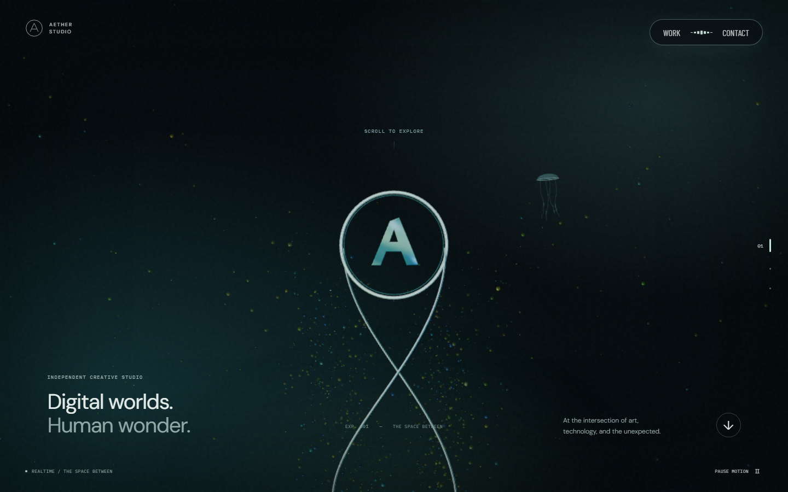

# AETHER STUDIO

[사이트 바로 보기](https://aether-studio-nu.vercel.app/) · [검증 기록](docs/verification.md) · [초기 구현 PR](https://github.com/okorion/aether-studio/pull/1)

[Active Theory](https://activetheory.net/)의 어두운 몰입형 공간, 크롬 링, 입자, 얇은 곡선, 미니멀 내비게이션을 참고한 초기 구현입니다. React + TypeScript + Three.js + Vite로 개발했습니다.

원본의 소스·로고·모델·이미지·음악을 복제하지 않았습니다. AETHER STUDIO 브랜드, 문구, 4개 가상 프로젝트와 시각 요소는 이 프로젝트용으로 작성했습니다. 원본의 전체 연출을 그대로 복제한 완성품은 아니며, 자체 절차적 3D 장면으로 구현한 초기 버전입니다.



## 화면 미리보기

아래 이미지는 2026-09-21 공개 배포 주소에서 직접 캡처했습니다. 데스크톱은 1440×900, 모바일은 390×844입니다. 실시간 3D 장면은 시간과 포인터에 따라 달라집니다.

| 프로젝트 목록 | 프로젝트 상세 |
| --- | --- |
|  |  |

| Contact | 모바일 홈 |
| --- | --- |
|  |  |

## 실행

Node.js 22.13 이상이 필요합니다. CI에서는 Node.js 24를 사용합니다.

```sh
npm ci
npm run dev
```

개발 서버: `http://127.0.0.1:5173`

```sh
npm run lint
npm run typecheck
npm run build
npx playwright install chromium
npm test
npm run preview
```

`npm run build` 결과인 `dist/`를 정적 호스팅에 사용할 수 있습니다.

## 배포

- 운영 주소: **https://aether-studio-nu.vercel.app/**
- 호스팅: Vercel · Vite 정적 사이트 · `npm run build` → `dist/`
- GitHub의 `okorion/aether-studio` 비공개 저장소와 연결되어 있으며, production 브랜치는 `main`입니다.
- 소스 저장소는 비공개이고 배포 사이트는 공개 데모입니다. 별도의 서버·DB·환경변수는 필요하지 않습니다.

저장소 접근 권한과 Vercel 프로젝트 권한이 있는 환경에서 수동 배포하려면:

```sh
npx vercel link --project aether-studio --scope okorions-projects
npx vercel deploy --prod --scope okorions-projects
```

`.vercel/`과 `.env*`는 Git에서 제외합니다. Git 연결에 따른 Vercel 배포와 GitHub Actions 검증은 독립적으로 실행되므로 CI 통과가 배포의 필수 게이트로 설정된 상태는 아닙니다.

## 구현 범위

- 금속 링과 A 심벌, 교차 리본, 입자 군집, 해파리형 오브젝트를 실시간 렌더링
- 포인터 시차와 native scroll에 반응하는 3D 장면
- Work / Contact / 홈 이동, 현재 챕터 표시
- 프로젝트 4개 및 상세 dialog, 다음 프로젝트, Escape 닫기와 초점 복원
- 사용자 조작으로 켜는 3가지 Web Audio 사운드스케이프
- 모바일 레이아웃, 모션 정지, OS reduced-motion 지원
- GPU가 없는 SwiftShader·llvmpipe 환경에서는 자동으로 입자·해상도·반사 계산을 줄이고 프레임 사이 입력 처리 시간을 확보
- WebGL 미지원·컨텍스트 손실·3D 모듈 로딩 실패 시 CSS 배경과 탐색 유지
- 숨긴 탭의 렌더링·소리 정지, GPU 리소스와 이벤트 정리
- 자체 호스팅 글꼴. 런타임 외부 API·분석 도구·원격 미디어 요청 없음

## 콘텐츠 교체

| 대상 | 위치 |
| --- | --- |
| 브랜드·소개·연락처 | `src/App.tsx`, `index.html`, `public/favicon.svg` |
| 프로젝트 내용 | `src/projects.ts` |
| 3D 장면 | `src/Scene.tsx` |
| 프로젝트 비주얼 | `src/ProjectArt.tsx`, `src/styles.css` |
| 합성 사운드 | `src/audio.ts` |

`hello@aether.example`은 예약된 예시 도메인입니다. 현재 배포는 콘셉트 데모이며 실제 문의를 받을 때는 연락처를 교체해야 합니다. 모든 프로젝트는 가상 콘셉트이며 실제 고객 실적을 의미하지 않습니다. Contact 링크는 이메일 앱을 열며, 서버 전송 기능은 없습니다.

## 검증

Playwright 테스트는 데스크톱 1440×900, 모바일 390×844, WebGL 비활성 환경을 사용합니다. 탐색, 상세 보기, 키보드 초점, 사운드, 모션 설정, 가로 넘침 및 3D 파일 로딩 실패를 포함합니다. GitHub Actions에서는 lint·타입·빌드를 확인하고 production preview를 SwiftShader로 실행해 같은 브라우저 테스트를 수행합니다.

시각 증거와 검수 내역은 [검증 기록](docs/verification.md)에 정리했습니다. WebGL 성능은 기기와 브라우저에 따라 달라질 수 있습니다. 실제 Safari/iOS 기기 검증은 수행하지 않았습니다.

## 주요 파일

```text
src/
  App.tsx             페이지·내비게이션·상세 dialog
  Scene.tsx           절차적 Three.js 장면과 수명 관리
  SceneBoundary.tsx   선택적 3D 모듈 실패 격리
  ProjectArt.tsx      독립 프로젝트 아트
  projects.ts         교체 가능한 프로젝트 데이터
  audio.ts            사용자 조작 기반 사운드 합성
  styles.css          반응형 레이아웃·시각 스타일
tests/
  experience.spec.ts  핵심 사용자 흐름 회귀 테스트
```

서드파티 글꼴 라이선스는 [THIRD_PARTY_NOTICES.md](THIRD_PARTY_NOTICES.md)에 안내합니다.
