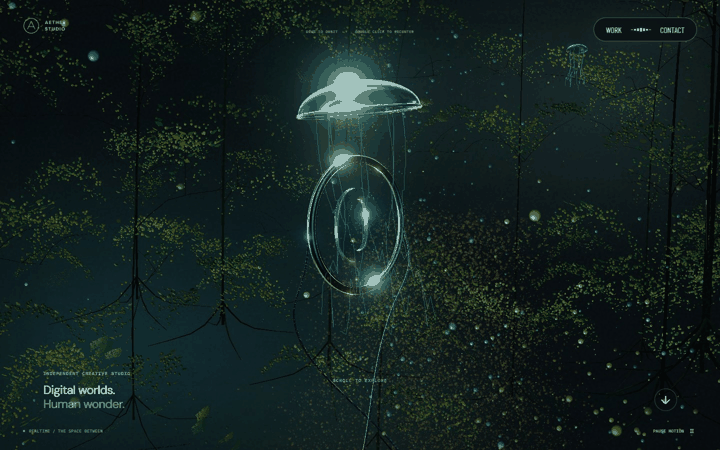
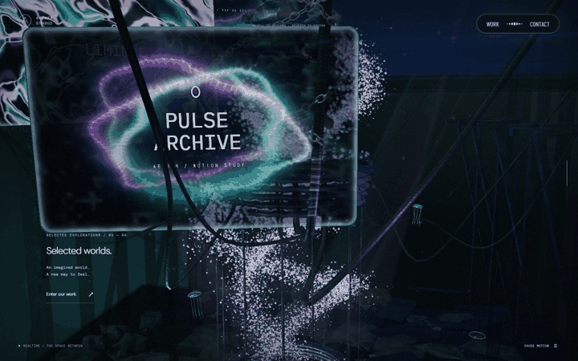
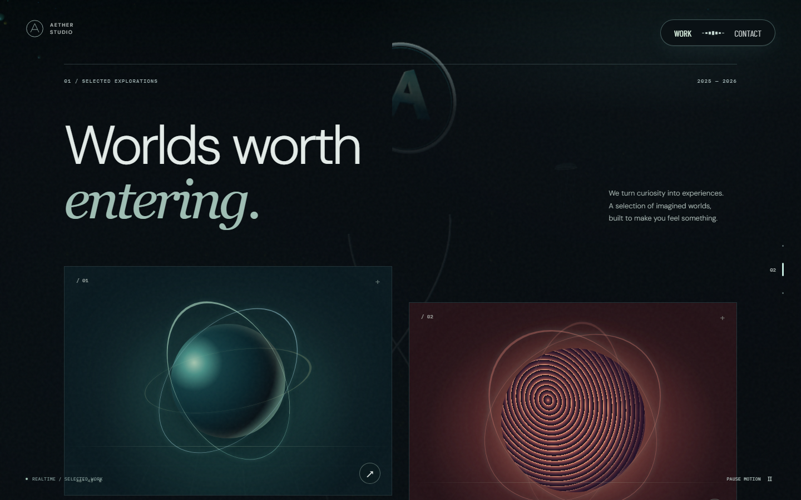
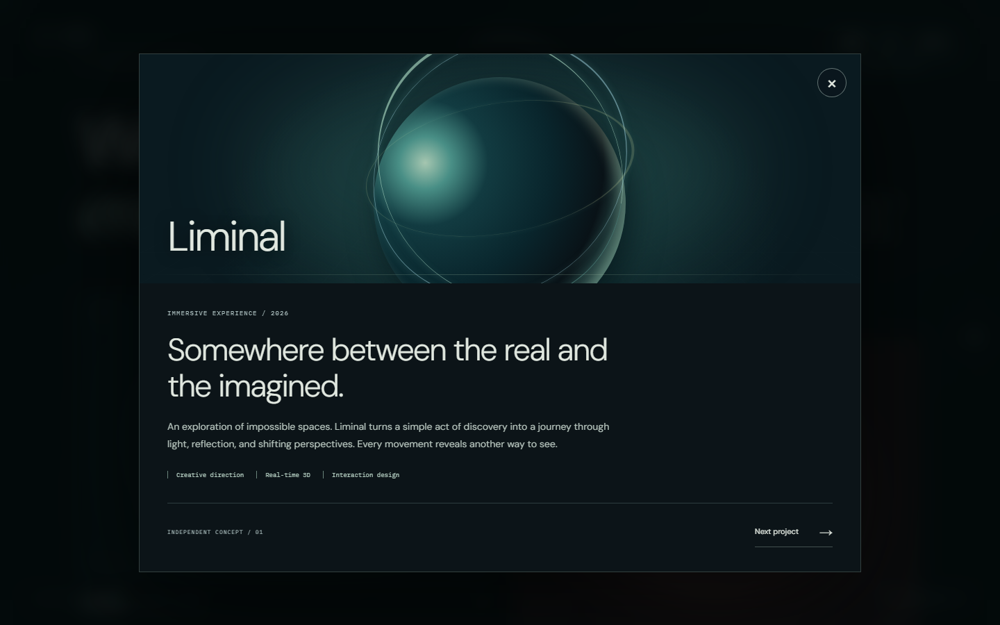
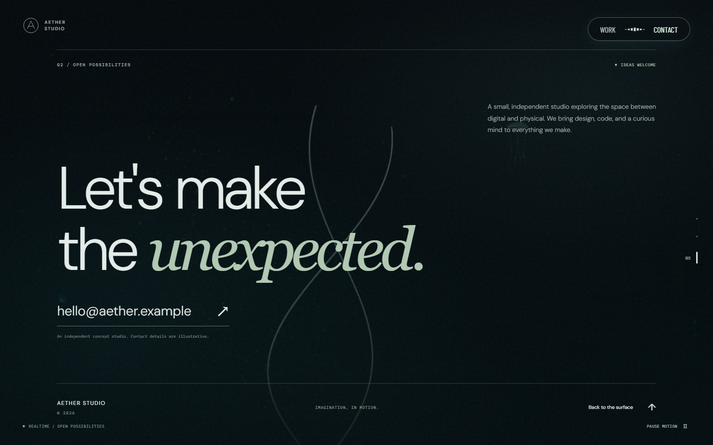
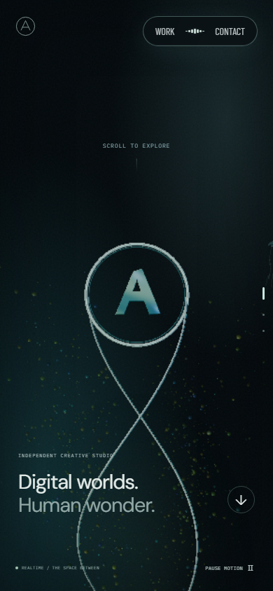

# AETHER STUDIO

[사이트 바로 보기](https://aether-studio-nu.vercel.app/) · [장면 차폐·영상 조명](docs/scene-occlusion-light.md) · [입자 마우스 반응](docs/particle-pointer-flow.md) · [공간 전환·빛](docs/spatial-transitions.md) · [시각 변천: 8개 버전·48장](docs/visual-history.md) · [전환 성능](docs/transition-performance.md) · [메타데이터](docs/metadata.md) · [다음 개선](docs/next-improvements.md)

[Active Theory](https://activetheory.net/)의 중앙 오브젝트, 연속된 공간 이동, 금속 반사와 움직이는 프로젝트 화면을 참고한 자체 3D 경험입니다. React + TypeScript + Three.js + Vite로 개발했습니다.

런타임에는 원본의 소스·로고·모델·영상·음악을 사용하지 않습니다. AETHER STUDIO 브랜드와 가상 프로젝트, 절차적 모델, 수식으로 제작한 모니터 MP4 두 편과 조명용 파생 영상, 대체 영상 셰이더를 직접 작성했습니다. 원본 화면은 비교 문서의 검수 증거에만 사용합니다.


초기 구현부터 PR #11까지 대표 소스 8개를 다시 빌드하고, 같은 뷰포트의 0·20·40·60·80·98% 스크롤 위치에서 촬영했습니다. [시각 변천 기록](docs/visual-history.md)에서 48장의 실제 화면과 기준 커밋·캡처 조건을 함께 비교할 수 있습니다. 이후의 바닥·빛·상부 수관 변경은 [최신 공간 전환 비교](docs/spatial-transitions.md)에 정리했습니다.

## 스크롤로 내려가는 3D 여정

1800svh 홈에 24개의 카메라 키프레임을 배치했습니다. 숲 속 링과 꼬리 → 평면 소개 위의 큰 3D O → 척추와 나선형 영상 모니터 → 지하 장치 → 바닥 아래 금속 비늘 → 하부 숲과 링으로 이어집니다. 중심은 총 61.5 월드 단위를 내려가고 카메라가 이를 따라가며, 주변 공간은 위로 지나갑니다. 숲과 모니터는 사선 경계로 다음 장면을 드러내며, 역스크롤하면 같은 경로를 되짚습니다.

- 마우스 이동: 작은 섬광의 머리가 입력을 멈춘 뒤에도 전진하고, 곡선 궤적이 약 2.35초에 걸쳐 사라집니다. 숲의 미세 입자와 잎은 이동 방향의 흐름을 따라 움직였다가 복귀하며, 소개·비늘 경계에서도 보이는 숲은 계속 반응합니다. 비늘은 굴곡과 반사광으로 반응합니다. 장치 O는 원형 빈 공간을 만들던 밀침을 완화하고 기존 스크롤 위치·형태를 유지합니다. 버튼 위·화면 이탈·모션 축소에서는 입력 효과를 초기화합니다. [입자 반응과 구간별 검증](docs/particle-pointer-flow.md)
- 초반·소개 로고·마지막 링에서 빈 공간 드래그: 중앙 오브젝트를 축으로 회전하고 놓은 뒤 선택한 시점을 유지합니다. 위에서 아래로 끌면 상단이 앞으로, 아래에서 위로 끌면 바닥이 앞으로 오도록 세로 방향을 적용했습니다. 더블클릭하면 기본 시점으로 복귀합니다.
- 척추·모니터·지하 장치·비늘 구간: 드래그 궤도를 잠그고 스크롤로 카메라를 제어합니다. 비늘이 사라지는 전환 끝까지 마우스 이동·드래그·더블클릭이 카메라를 바꾸지 않습니다. [잠금 경계 검증](docs/mechanical-camera.md)
- 척추·사슬: 두 줄의 사슬이 척추 앞뒤를 감으며 스크롤 위치에 따라 움직입니다. 입력이 멎으면 정착 뒤 멈추고, 역스크롤하면 반대 방향으로 돌아갑니다. 입자는 고정 역할과 스크롤 이동 역할로 나뉘며 하나의 흐름이 장치 O로 모입니다. 모니터 영상과 조명은 계속 움직입니다.
- 숲은 고정된 월드 공간의 줄기·가지·잎·미세 입자로 구성됩니다. 상·하부에서 링 중심으로 드래그하면 숲의 원근과 가림도 함께 바뀝니다.
- 장치와 비늘 사이의 22×26 바닥은 위쪽에서 물결과 반사를, 아래쪽에서 천장 빛 무늬를 보여줍니다. 데스크톱은 기존 512×512 반사 하나를 재사용합니다. 비늘 다음에는 전체 잎 예산의 24%를 배치한 고정된 상부 가지·덩굴·고사리가 먼저 드러납니다. [세 경계의 전후 화면](docs/spatial-transitions.md)
- 숲과 장치의 청록·금·보라빛은 월드 위치마다 다른 느린 위상으로 변합니다. 자체 크롬·오로라 영상이 교대하는 218,586바이트 조명 루프를 하나의 디코더로 공유하고, 로딩·디코딩 실패 시 절차적 조명을 유지합니다. 물에는 영상을 직접 사용하지 않습니다. [빛과 재생·정지 동작](docs/spatial-transitions.md#재생과-정지-프로파일)
- 척추는 굵은 비대칭 관절·추궁·돌기와 교차 연결 사슬로 구성했습니다. 얇은 유리 모니터 6장이 아래에서 들어와 전경을 거쳐 위로 지나갑니다. MP4 두 편을 공유해 재생하고, GPU 데스크톱에서는 실제 척추와 입자를 화면 안에 굴절시킵니다.
- 모니터 위 마우스: 해당 판이 조금 들리고 기울며 가장자리 빛과 굴절이 반응합니다. 포인터를 멈춰도 호버를 유지하고, UI 위에서는 해제합니다. 판을 클릭하면 해당 프로젝트 상세가 열립니다. 드래그·스크롤 중에는 상세 열기를 취소합니다.
- 마지막 비늘은 위층에 남고 링이 아래로 내려갑니다. 링 안의 대문자 O는 상하 반전되지 않습니다.
- 모션 정지·재개: 선택한 시점과 애니메이션 위상, 영상 재생 위치를 보존합니다. OS reduced motion도 지원하며 처음부터 모션 축소 상태이면 MP4를 내려받지 않습니다.
- Work / Contact와 dialog, 숨긴 탭에서는 배경 렌더링과 영상을 멈춥니다. 홈의 모니터 구간으로 돌아오면 같은 영상의 재생을 이어갑니다. 모바일은 기본 터치 스크롤을 유지하고 텍스트는 드래그 선택되지 않습니다.

| 숲·소개·척추 전환 | 장치·바닥·비늘·숲 전환 |
| --- | --- |
|  |  |

위 GIF는 PR #9에서 실제 wheel 입력 중 캡처한 화면을 일정 간격으로 재생한 요약입니다. 실시간 프레임률이나 입력 속도 측정 영상은 아닙니다. PR #10의 성능 수정 결과는 [전환 측정](docs/transition-performance.md)을 참고하세요.

| 척추와 움직이는 모니터 · 40% | 지하 장치의 단일 O 입자 · 72% |
| --- | --- |
|  |  |

| 장치 바닥 아래 금속 비늘 · 80% | 하부 링 · 98% |
| --- | --- |
|  |  |

위 정지 화면은 PR #10 당시 `da14095`의 production 빌드에서 촬영한 1440×900 GPU 캡처로 보존합니다. 최신 바닥·빛·상부 수관과의 전후 비교는 [공간 전환 문서](docs/spatial-transitions.md)를 참고하세요. [모니터 문서](docs/monitor-cinema.md)에 원본 입력 관찰, 실제 MP4와 굴절의 합성, 호버·클릭과 재생 수명을 정리했습니다. 모바일은 공유 배경 캡처를 생략하고 영상과 유리 표면을 표시합니다. 시각적 유사도를 백분율로 측정하거나 인증하지 않습니다. [월드 공간 숲·척추·장치](docs/living-worlds.md), [척추 개선](docs/spine-monitors.md), [이전 5개 지점 비교](docs/visual-comparison.md), [24단계 비교](docs/continuous-journey.md)는 각 단계의 기록입니다.


## 콘텐츠 화면 · 초기 배포 기록

아래 이미지는 초기 배포에서 캡처한 콘텐츠 화면입니다. 모바일 홈의 최신 스크롤 구성은 위 24단계 여정이며 아래 홈 이미지는 초기 버전입니다. 데스크톱은 1440×900, 모바일은 390×844입니다.

| 프로젝트 목록 | 프로젝트 상세 |
| --- | --- |
|  |  |

| Contact | 모바일 홈 |
| --- | --- |
|  |  |

## 실행

Node.js 22.13 이상이 필요합니다. CI에서는 Node.js 24를 사용합니다.

```sh
npm ci
npm run dev
```

개발 서버: `http://127.0.0.1:5173`

```sh
npm run lint
npm run typecheck
npm run build
npx playwright install chromium
npm test
npm run preview
```

`npm run build` 결과인 `dist/`를 정적 호스팅에 사용할 수 있습니다.

## 배포

- 운영 주소: **https://aether-studio-nu.vercel.app/**
- 호스팅: Vercel · Vite 정적 사이트 · `npm run build` → `dist/`
- GitHub의 `okorion/aether-studio` 비공개 저장소와 연결되어 있으며, production 브랜치는 `main`입니다.
- 소스 저장소는 비공개이고 배포 사이트는 공개 데모입니다. 별도의 서버·DB·환경변수는 필요하지 않습니다.

저장소 접근 권한과 Vercel 프로젝트 권한이 있는 환경에서 수동 배포하려면:

```sh
npx vercel link --project aether-studio --scope okorions-projects
npx vercel deploy --prod --scope okorions-projects
```

`.vercel/`과 `.env*`는 Git에서 제외합니다. Git 연결에 따른 Vercel 배포와 GitHub Actions 검증은 독립적으로 실행되므로 CI 통과가 배포의 필수 게이트로 설정된 상태는 아닙니다.

## 구현 범위

- 금속 링과 대문자 O 심벌, 척추·사슬·지하 장치·금속 비늘, 입자 군집을 실시간 렌더링
- 하강하는 중심을 따라가는 카메라와 24개 기준점의 연속 native scroll
- GPU 유동 입자 최대 42,000개, 구간별 숲 최대 60,000개, 인스턴싱 금속 구조
- 유리 모니터 6장이 공유하는 MP4 두 편·VideoTexture 두 개, 영상 지연 로드와 재생 실패 시 절차적 대체 표현
- 데스크톱 HDR bloom·512px 평면 반사, 프레임 시간 기반 적응형 DPR과 후처리 축소
- 첫 표시 전 두 출력 경로의 셰이더·정적 텍스처·렌더 타깃 준비와 2px 시험 렌더, 모니터 캡처 안의 중복 바닥 반사 제거
- Work / Contact / 홈 이동, 현재 챕터 표시
- 프로젝트 4개 및 상세 dialog, 다음 프로젝트, Escape 닫기와 초점 복원
- 사용자 조작으로 켜는 3가지 Web Audio 사운드스케이프
- 모바일 레이아웃, 모션 정지, OS reduced-motion 지원
- GPU가 없는 SwiftShader·llvmpipe 환경에서는 자동으로 입자·해상도·반사 계산을 줄이고 프레임 사이 입력 처리 시간을 확보
- WebGL 미지원·컨텍스트 손실·3D 모듈 로딩 실패 시 CSS 배경과 탐색 유지
- 숨긴 탭의 렌더링·소리·영상 정지, 콘텐츠 화면의 연속 렌더링 중지, GPU·미디어 리소스와 이벤트 정리
- 자체 호스팅 글꼴. 런타임 외부 API·분석 도구·원격 미디어 요청 없음

## 전환과 포인터 반응

장치와 비늘은 서로 다른 높이에 고정되어 바닥이 두 공간을 구분합니다. 평면 문구도 3D 안에서 합성하므로 링과 숲의 가림 순서를 따릅니다. 장치의 단일 O 입자는 기존 스크롤 위상과 형태를 유지하면서 포인터 주변에서만 변형되고 복귀합니다. 상·하부의 세로 드래그 방향도 사용자가 끄는 쪽의 면이 앞으로 오는 방식으로 통일했습니다.

PR #10에서 첫 전환 때 멈추던 원인은 새 셰이더 변형과 첫 GPU 자원 사용이 몰리는 데 있었습니다. 광원 개수를 고정하고, 선형·직접 출력 경로를 비동기 사전 컴파일한 뒤 2×2 타깃에서 최초 사용을 준비합니다. 정적 텍스처·굴절·반사 타깃도 미리 올리며 모니터 캡처가 바닥 반사를 재실행하는 중복 패스를 제거했습니다. 모니터 영상은 모니터 진입 때, 별도 조명 영상은 홈의 숲·지하 구간에서 지연 로드합니다.

PR #10의 통제된 최초 하강 측정에서 최장 RAF 간격은 **2799.9→66.6ms**, 전환 중 셰이더 링크는 **33→0회**로 줄었고 자동 품질은 1.00을 유지했습니다. 당시 첫 모니터 진입의 66.6ms 한 프레임은 남았습니다. 이 수치는 특정 Chromium·D3D11 장비의 콜백 간격이며 GPU 실행 시간이나 모든 기기의 FPS, 이후 변경의 성능을 뜻하지 않습니다. [원인·수정·전후 수치·측정 한계](docs/transition-performance.md)

[장치 입력·카메라 전후 비교](docs/transition-input.md)에 동일한 마우스 입력의 실제 화면과 회귀 검증을 정리했습니다. [이전 전환 검증](docs/layered-transitions.md)의 전후 캡처와 실제 휠 입력 기록도 보존합니다.

## 아이콘과 공유·검색 정보

O 모티프의 SVG·PNG·ICO 파비콘, Apple·maskable 홈 화면 아이콘, 실제 숲 캡처 기반 1200×630 공유 카드를 포함합니다. canonical·Open Graph·Twitter·WebSite JSON-LD는 운영 URL로 통일했고 robots·sitemap·manifest도 설정했습니다. 확인되지 않은 사업자 정보나 소셜 계정은 넣지 않았습니다. [파일 목록·공유 카드·재생성·검증](docs/metadata.md)

## 실제 영상과 유리 모니터

크롬 유체와 오로라를 수식으로 직접 제작한 10초 루프 영상 두 편을 사용합니다. 각각 640×400·24fps·무음 H.264이며, MP4 합계는 2,101,778바이트(약 2.10MB)입니다. `public/media/`에서 사이트와 함께 Vercel CDN으로 제공하므로 별도 영상 클라우드나 API 키가 필요하지 않습니다. [영상 출처·재생성·검증](docs/media-sources.md)

최초로 홈 모니터 구간에 들어올 때만 영상 소스를 연결합니다. 로딩 전, 다운로드 실패, 자동 재생 차단 시에는 기존 절차적 영상 셰이더를 표시하며 프레임마다 재시도하지 않습니다. 모션 정지와 화면 전환은 이미 받은 영상과 재생 위치를 보존합니다.


실제 화면 캡처를 이어 붙인 요약이며 실시간 FPS나 24fps 재생 성능을 증명하는 자료는 아닙니다. [전후·호버·프로젝트 열기 비교](docs/monitor-cinema.md)

## 콘텐츠 교체

| 대상 | 위치 |
| --- | --- |
| 브랜드·소개·연락처 | `src/App.tsx`, `index.html`, `public/favicon.svg` |
| 공유·검색·아이콘 메타데이터 | `index.html`, `public/site.webmanifest`, `scripts/generate-metadata.mjs`, [설정 문서](docs/metadata.md) |
| 프로젝트 내용 | `src/projects.ts` |
| 3D 장면·적응형 해상도 | `src/Scene.tsx` |
| 셰이더·정적 텍스처·첫 GPU 사용 준비 | `src/ScenePreparation.ts` |
| 24단계 카메라·장면 타임라인 | `src/Journey.ts` |
| HDR bloom | `src/SceneGlow.ts` |
| 구체 입자·흐름 | `src/Atmosphere.ts` |
| 은빛 곡선 흔적·구간별 카메라 입력 | `src/SceneInteraction.ts` |
| 지하 장치·독립 비늘 층·반사 바닥·국소 변위 | `src/SceneWorlds.ts` |
| 얕은 물과 기존 평면 반사 합성 | `src/SceneWater.ts` |
| 전경·중경·상부 숲 geometry와 포인터 조명 | `src/ForestGeometry.ts`, `src/SceneForest.ts` |
| 월드 좌표 조명과 공유 조명 영상 수명 | `src/SceneLighting.ts`, `src/SceneLightVideo.ts`, [공간 전환 문서](docs/spatial-transitions.md) |
| 평면 문구·사선 전환 경계 | `src/SceneLayers.ts` |
| 척추·관절·교차 연결 사슬 | `src/SceneSpine.ts` |
| 유리 모니터·공유 굴절·호버·영상 합성 | `src/SceneMonitors.ts` |
| 영상 지연 로드·재생·정지·실패·해제 | `src/SceneVideo.ts` |
| 자체 MP4·포스터와 생성 스크립트 | `public/media/`, `scripts/generate-media.py`, [자산 문서](docs/media-sources.md) |
| 프로젝트 비주얼 | `src/ProjectArt.tsx`, `src/styles.css` |
| 합성 사운드 | `src/audio.ts` |

`hello@aether.example`은 예약된 예시 도메인입니다. 현재 배포는 콘셉트 데모이며 실제 문의를 받을 때는 연락처를 교체해야 합니다. 모든 프로젝트는 가상 콘셉트이며 실제 고객 실적을 의미하지 않습니다. Contact 링크는 이메일 앱을 열며, 서버 전송 기능은 없습니다.

## 검증

입자 마우스 반응 변경은 총 62개 검사 항목과 lint·타입·build를 확인했습니다. 상·하부 끝과 전환 경계에서 포인터 조명 세기를 0으로 둔 픽셀 검사를 통해 실제 입자 이동·원복을 분리해 확인했으며, 입력 중 5개 지점의 최장 RAF 간격은 이전·수정본 모두 16.8ms였습니다. [최신 입자 반응·비교 조건·검증 한계](docs/particle-pointer-flow.md)

PR #11의 공간 전환·물·조명 변경은 로컬 전체 **55개 테스트**, lint·타입 검사·build를 통과했습니다. 실제 휠 왕복·모바일 6지점·GPU 복구도 확인했습니다. 하부 전환은 최장 16.8ms였으며, 최초 모니터 진입의 한 프레임 83.3ms는 남아 있습니다. [최신 캡처·측정·한계](docs/spatial-transitions.md#실제-검증과-성능)

Playwright는 데스크톱 1440×900, 모바일 390×844, WebGL 비활성 환경을 사용합니다. 실제 wheel의 하강·역방향, 24개 렌더 상태의 높이·링 방향, 척추·사슬·모니터의 정지·왕복, 중간 구간 카메라 잠금, 탐색·상세 보기·초점·사운드·hash/history와 로딩 실패를 검사합니다. DPR 1.5·2의 실제 WebGL 캡처·상태 복구·실패 시 대체 표현, 흔적의 픽셀 발생·잔존·소멸, 포인터 조명 초기화와 실제 비늘 픽셀 반응·원복도 포함합니다. GitHub Actions에서는 lint·타입·빌드를 확인하고 production preview를 SwiftShader로 실행합니다.

영상 재생·수명과 모니터 입력에 더해 실제 사슬 감기·정지·복귀, 입자 역할 분리, 숲의 월드 좌표와 시차, 섬광 머리의 픽셀 전진을 검사합니다. PR #10에서는 장치 입자의 포인터 변형·정확한 복귀, 세로 드래그 방향, 장면 준비·취소·상태 복구, 메타데이터 정합성을 추가했습니다. **PR #10의 2026-09-22 검증에서 로컬 전체 47개 테스트가 재시도 없이 통과했고, lint·타입 검사·production build도 통과했습니다.**

당시 별도 실제 GPU 검수에서는 여정 6개 지점, 상·하부의 양방향 세로 드래그, 장치 포인터 반응과 복귀, MP4 두 편 재생, WebGL 컨텍스트 손실 후 같은 위치 복원을 확인했습니다. 모바일 390×844의 6개 지점도 캡처했으며 기록된 브라우저 오류는 없었습니다. PR #10의 프레임 간격·준비 시간은 [전환 성능 보고서](docs/transition-performance.md), 전체 시각 변화는 [8개 버전·48장 갤러리](docs/visual-history.md)에 정리했습니다.

이전 36개 검사와 당시 성능 측정은 [PR #9 검증 기록](docs/living-worlds.md)에 그대로 남깁니다. 이후에는 잔여 모니터 프레임의 원인 분리, 실제 Safari/iOS·저사양 기기 검증, 겹침 구간 렌더 비용 순으로 개선하는 것을 권합니다. [다음 개선 3가지와 완료 기준](docs/next-improvements.md)

[전환 검증 문서](docs/layered-transitions.md), [이전 동작·성능 기록](docs/dynamic-motion.md), [초기 검증 기록](docs/verification.md)도 보존합니다. WebGL과 영상 디코딩 성능은 기기와 브라우저에 따라 달라질 수 있습니다. 실제 Safari/iOS 기기 검증은 수행하지 않았습니다.

## 주요 파일

```text
src/
  App.tsx             페이지·내비게이션·상세 dialog
  Scene.tsx           절차적 Three.js 장면과 수명 관리
  ScenePreparation.ts 셰이더·텍스처·첫 GPU 사용 사전 준비
  SceneMonitors.ts    유리 모니터·영상 합성·호버와 선택
  SceneVideo.ts       공유 영상 두 편의 재생 수명 관리
  SceneBoundary.tsx   선택적 3D 모듈 실패 격리
  ProjectArt.tsx      독립 프로젝트 아트
  projects.ts         교체 가능한 프로젝트 데이터
  audio.ts            사용자 조작 기반 사운드 합성
  styles.css          반응형 레이아웃·시각 스타일
tests/
  experience.spec.ts  핵심 사용자 흐름 회귀 테스트
  video.spec.ts       실제 영상·모니터 입력·실패 처리 검사
```

서드파티 글꼴 라이선스는 [THIRD_PARTY_NOTICES.md](THIRD_PARTY_NOTICES.md)에 안내합니다.
