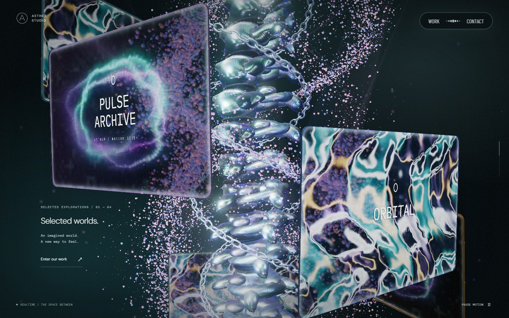
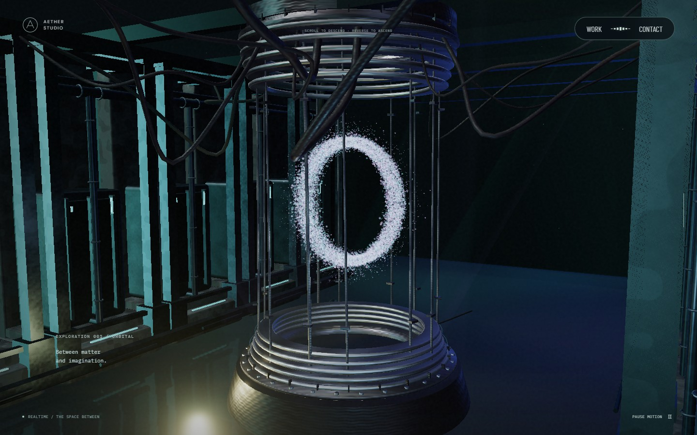
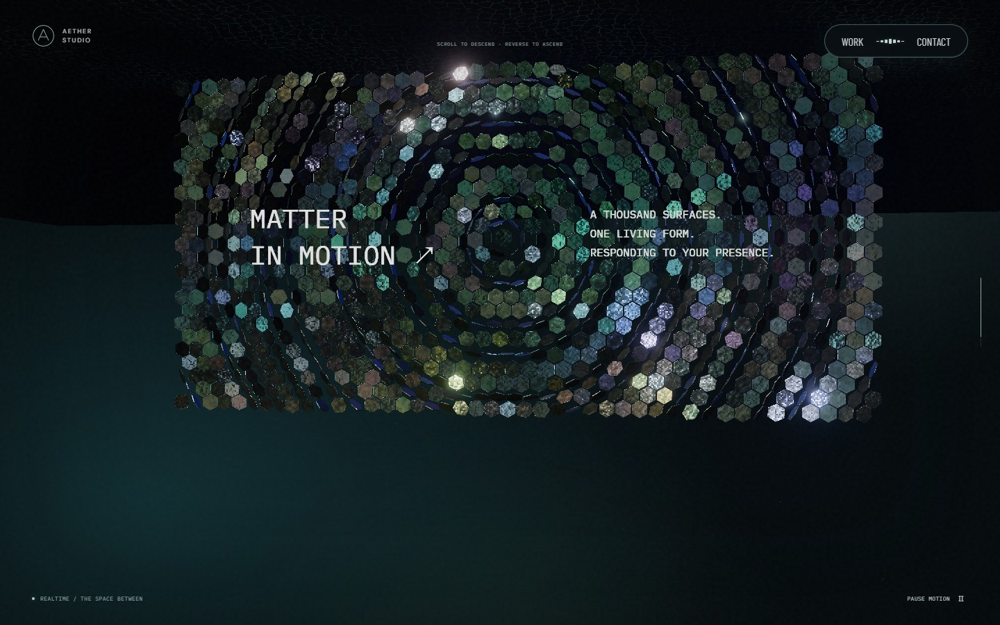

# Aether Studio

Aether Studio는 스크롤과 마우스로 낯선 공간을 둘러보는 인터랙티브 3D 사이드 프로젝트입니다. 상단 포레스트의 링에서 시작해 영상 모니터가 떠 있는 본 컬럼, 어두운 리액터 챔버, 금속 스케일 패널을 지나갑니다.

스크롤에 따라 장면이 이어지고, 마우스 움직임이 입자와 표면에 남는 웹 경험을 실험합니다. React, TypeScript, Three.js, Vite로 만들었으며 장면과 인터랙션을 계속 다듬고 있습니다.

[사이트 열기](https://aether-studio-nu.vercel.app/) · [개발 문서](docs/README.md) · [트러블슈팅](docs/troubleshooting/index.md)



본 컬럼 주변의 모니터와 입자. 이 문서의 이미지는 [장면 수정 기록](docs/scene-reference-detail.md)에 보관된 당시 실행 화면입니다.

## 둘러보기

스크롤을 내리면 상단 포레스트의 링에서 본 컬럼, 리액터 챔버, 스케일 패널, 하단 포레스트로 이어집니다. 위로 스크롤하면 같은 경로를 돌아갑니다.

- **마우스 이동:** 포레스트의 입자와 잎, 리액터 O, 스케일 패널이 반응합니다. 포인터 스트릭과 잔광은 상단·하단 포레스트에만 나타납니다.
- **빈 공간 드래그:** 링과 소개 구간에서 시점을 돌립니다. 놓으면 선택한 시점을 유지하고, 더블클릭하면 기본 시점으로 돌아갑니다. 본 컬럼부터 스케일 패널까지는 스크롤로 시점을 제어합니다.
- **모니터 클릭:** 해당 프로젝트의 상세 화면을 엽니다. Work에서도 프로젝트를 선택할 수 있습니다. Escape로 상세 화면을 닫습니다.
- **모션·사운드:** 화면의 모션 버튼으로 애니메이션을 멈추거나 재개합니다. 사운드는 직접 켰을 때만 재생됩니다. 운영체제의 모션 축소 설정도 따릅니다.

| 리액터 | 스케일 패널 |
| --- | --- |
|  |  |

## 로컬 실행

Node.js 22.13 이상이 필요합니다. CI는 Node.js 24를 사용합니다.

```sh
git clone https://github.com/okorion/aether-studio.git
cd aether-studio
npm ci
npm run dev
```

터미널에 표시된 개발 서버 주소를 엽니다. 기본 주소는 `http://127.0.0.1:5173`입니다. 서버·데이터베이스·API 키는 필요하지 않습니다.

```sh
npm run build
npm run preview
```

빌드 결과는 `dist/`에 생성됩니다. 실행 옵션과 배포 설정은 [개발 안내](docs/development.md)에 있습니다.

## 코드를 살펴보려면

소개와 연락처는 [App.tsx](src/App.tsx), 모니터에 연결된 프로젝트는 [projects.ts](src/projects.ts)에서 바꿀 수 있습니다. 장면별 구현 위치와 입력 흐름은 [구조 문서](docs/architecture.md), 검사 명령과 실행 환경은 [검증 안내](docs/testing.md)에 정리했습니다.

로딩 연출과 씬별 움직임을 다듬을 계획은 [개선 요구사항과 작업 순서](docs/improvement-plan-2026-09-23.md)에 있습니다. 해당 문서의 예정 기능은 아직 구현된 동작과 구분해 기록합니다.

모바일 화면은 Chromium 에뮬레이션으로 확인했습니다. 실제 Safari/iOS와 저사양 기기의 장시간 실행은 아직 검증하지 않았습니다. WebGL을 사용할 수 없으면 CSS 배경과 본문·탐색을 유지합니다.

## 참고와 자산

[Active Theory](https://activetheory.net/)의 공간 구성과 인터랙션을 참고했습니다. 제휴 프로젝트는 아니며, 해당 사이트의 소스·로고·모델·영상을 앱 자산으로 사용하지 않습니다. 이 저장소의 모델과 영상은 코드와 생성 스크립트로 만듭니다. 비교 문서의 원본 캡처는 관찰 근거입니다.

Aether Studio와 프로젝트는 가상 콘셉트입니다. `hello@aether.example`은 예시 주소이며 Contact는 이메일 앱을 엽니다. 실제 문의를 받으려면 연락처를 교체해야 합니다.

구현과 문서 작성에는 AI를 사용했습니다. 코드·리뷰·실행 결과를 바탕으로 정리한 수정 과정은 트러블슈팅 문서에 남겼습니다.

글꼴과 패키지 라이선스 고지는 [THIRD_PARTY_NOTICES.md](THIRD_PARTY_NOTICES.md)에 있습니다.
