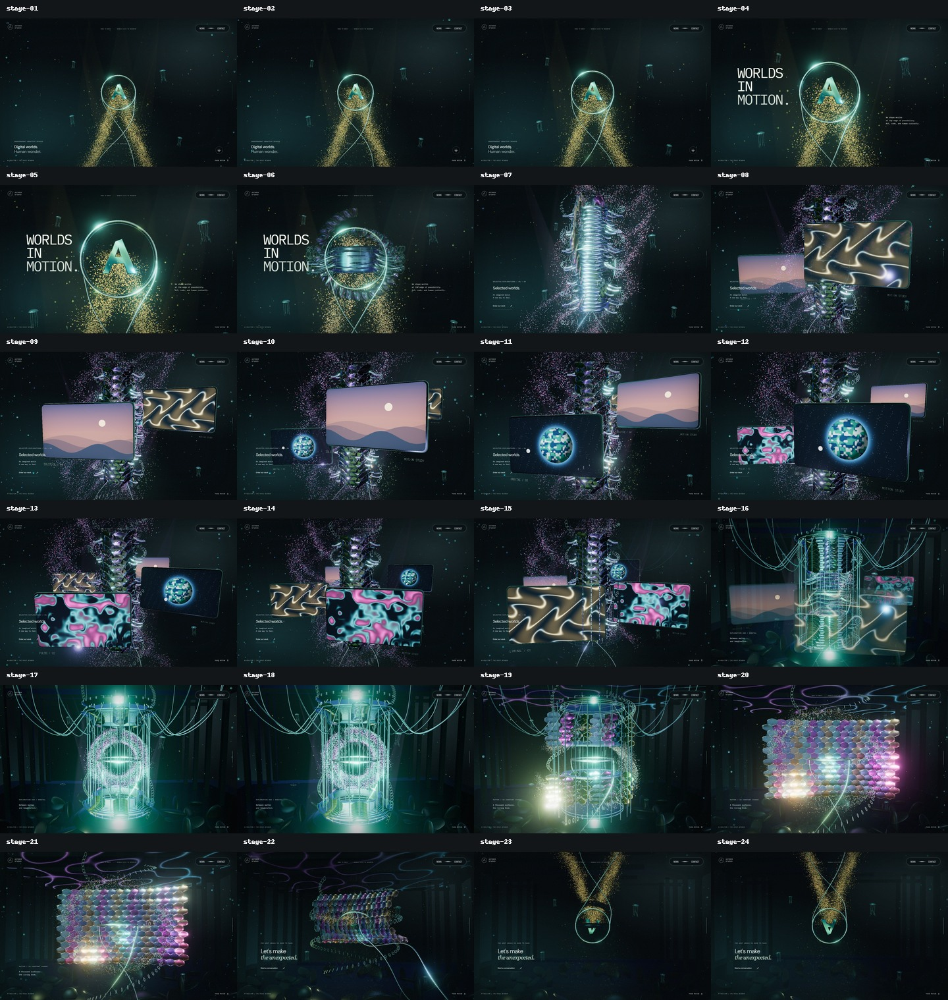

# AETHER STUDIO

[사이트 바로 보기](https://aether-studio-nu.vercel.app/) · [24단계 원본·이전·현재 비교](docs/continuous-journey.md) · [초기 검증 기록](docs/verification.md)

[Active Theory](https://activetheory.net/)의 중앙 오브젝트, 연속된 공간 이동, 금속 반사와 움직이는 프로젝트 화면을 참고한 자체 3D 경험입니다. React + TypeScript + Three.js + Vite로 개발했습니다.

런타임에는 원본의 소스·로고·모델·영상·음악을 사용하지 않습니다. AETHER STUDIO 브랜드와 가상 프로젝트, 절차적 모델·GPU 영상은 직접 작성했습니다. 원본 화면은 비교 문서의 검수 증거에만 사용합니다.



## 24단계의 연속된 3D 여정

1800svh 홈에 24개의 카메라 키프레임을 배치했습니다. 작은 링 → 큰 로고 → 척추와 나선형 영상 모니터 → 지하 장치 → 금속 비늘 → 어두운 하부 링으로 이어집니다. 링을 뒤로 보내 없애던 방식에서, 같은 중심을 유지하는 금속 조각의 연속 변형으로 바꿨습니다.

- 마우스 이동: 1.45초에 걸쳐 사라지는 은빛 흔적.
- 빈 공간 드래그: 중앙 오브젝트를 축으로 회전하며, 놓은 뒤 선택한 시점을 유지합니다. 여러 번 이어서 한 바퀴 이상 회전할 수 있습니다.
- 빈 공간 더블클릭: 기본 시점으로 부드럽게 복귀합니다.
- 모션 정지·재개: 선택한 시점과 애니메이션 위상을 보존합니다. OS reduced motion도 지원합니다.
- Work / Contact, 버튼·dialog는 카메라 입력에서 제외합니다. 모바일은 기본 터치 스크롤을 유지하고 텍스트는 드래그 선택되지 않습니다.

| 척추와 움직이는 모니터 | 지하 장치 |
| --- | --- |
|  |  |

| 금속 비늘 | 하부 링 |
| --- | --- |
|  |  |

실제 production 빌드의 1440×900 GPU 캡처입니다. [24단계 비교 문서](docs/continuous-journey.md)에 원본 입력 조건, 전체 화면과 구현 차이를 기록했습니다. 요청된 80%는 시각적 완성도 목표이며 자동 측정된 유사도 수치는 아닙니다. [이전 5개 지점 비교](docs/visual-comparison.md)는 역사 기록으로 유지합니다.

## 콘텐츠 화면 · 초기 배포 기록

아래 이미지는 초기 배포에서 캡처한 콘텐츠 화면입니다. 모바일 홈의 최신 스크롤 구성은 위 24단계 여정이며 아래 홈 이미지는 초기 버전입니다. 데스크톱은 1440×900, 모바일은 390×844입니다.

| 프로젝트 목록 | 프로젝트 상세 |
| --- | --- |
|  |  |

| Contact | 모바일 홈 |
| --- | --- |
|  |  |

## 실행

Node.js 22.13 이상이 필요합니다. CI에서는 Node.js 24를 사용합니다.

```sh
npm ci
npm run dev
```

개발 서버: `http://127.0.0.1:5173`

```sh
npm run lint
npm run typecheck
npm run build
npx playwright install chromium
npm test
npm run preview
```

`npm run build` 결과인 `dist/`를 정적 호스팅에 사용할 수 있습니다.

## 배포

- 운영 주소: **https://aether-studio-nu.vercel.app/**
- 호스팅: Vercel · Vite 정적 사이트 · `npm run build` → `dist/`
- GitHub의 `okorion/aether-studio` 비공개 저장소와 연결되어 있으며, production 브랜치는 `main`입니다.
- 소스 저장소는 비공개이고 배포 사이트는 공개 데모입니다. 별도의 서버·DB·환경변수는 필요하지 않습니다.

저장소 접근 권한과 Vercel 프로젝트 권한이 있는 환경에서 수동 배포하려면:

```sh
npx vercel link --project aether-studio --scope okorions-projects
npx vercel deploy --prod --scope okorions-projects
```

`.vercel/`과 `.env*`는 Git에서 제외합니다. Git 연결에 따른 Vercel 배포와 GitHub Actions 검증은 독립적으로 실행되므로 CI 통과가 배포의 필수 게이트로 설정된 상태는 아닙니다.

## 구현 범위

- 금속 링과 A 심벌, 교차 리본, 입자 군집, 해파리형 오브젝트를 실시간 렌더링
- 중앙 중심의 누적 궤도 카메라와 24단계 native scroll
- GPU 유동 입자 최대 42,000개, 인스턴싱 금속 구조, 4종 자체 GPU 영상
- 데스크톱 HDR bloom·512px 평면 반사, 프레임 시간 기반 적응형 DPR과 후처리 축소
- Work / Contact / 홈 이동, 현재 챕터 표시
- 프로젝트 4개 및 상세 dialog, 다음 프로젝트, Escape 닫기와 초점 복원
- 사용자 조작으로 켜는 3가지 Web Audio 사운드스케이프
- 모바일 레이아웃, 모션 정지, OS reduced-motion 지원
- GPU가 없는 SwiftShader·llvmpipe 환경에서는 자동으로 입자·해상도·반사 계산을 줄이고 프레임 사이 입력 처리 시간을 확보
- WebGL 미지원·컨텍스트 손실·3D 모듈 로딩 실패 시 CSS 배경과 탐색 유지
- 숨긴 탭의 렌더링·소리 정지, GPU 리소스와 이벤트 정리
- 자체 호스팅 글꼴. 런타임 외부 API·분석 도구·원격 미디어 요청 없음

## 콘텐츠 교체

| 대상 | 위치 |
| --- | --- |
| 브랜드·소개·연락처 | `src/App.tsx`, `index.html`, `public/favicon.svg` |
| 프로젝트 내용 | `src/projects.ts` |
| 3D 장면·적응형 해상도 | `src/Scene.tsx` |
| 24단계 카메라·장면 타임라인 | `src/Journey.ts` |
| HDR bloom | `src/SceneGlow.ts` |
| 구체 입자·흐름 | `src/Atmosphere.ts` |
| 리본 흔적·카메라 입력 | `src/SceneInteraction.ts` |
| 연속 금속 변형·영상 모니터·반사 바닥 | `src/SceneWorlds.ts` |
| 프로젝트 비주얼 | `src/ProjectArt.tsx`, `src/styles.css` |
| 합성 사운드 | `src/audio.ts` |

`hello@aether.example`은 예약된 예시 도메인입니다. 현재 배포는 콘셉트 데모이며 실제 문의를 받을 때는 연락처를 교체해야 합니다. 모든 프로젝트는 가상 콘셉트이며 실제 고객 실적을 의미하지 않습니다. Contact 링크는 이메일 앱을 열며, 서버 전송 기능은 없습니다.

## 검증

Playwright 테스트 22개는 데스크톱 1440×900, 모바일 390×844, WebGL 비활성 환경을 사용합니다. 탐색, 상세 보기, 초점, 사운드, 모션, 24개 스크롤 지점, hash/history, 로딩 실패와 카메라 입력을 포함합니다. 격리된 실제 shader 캔버스에서 흔적의 픽셀 발생·소멸도 확인합니다. GitHub Actions에서는 lint·타입·빌드를 확인하고 production preview를 SwiftShader로 실행합니다.

시각 증거와 검수 내역은 [검증 기록](docs/verification.md)에 정리했습니다. WebGL 성능은 기기와 브라우저에 따라 달라질 수 있습니다. 실제 Safari/iOS 기기 검증은 수행하지 않았습니다.

## 주요 파일

```text
src/
  App.tsx             페이지·내비게이션·상세 dialog
  Scene.tsx           절차적 Three.js 장면과 수명 관리
  SceneBoundary.tsx   선택적 3D 모듈 실패 격리
  ProjectArt.tsx      독립 프로젝트 아트
  projects.ts         교체 가능한 프로젝트 데이터
  audio.ts            사용자 조작 기반 사운드 합성
  styles.css          반응형 레이아웃·시각 스타일
tests/
  experience.spec.ts  핵심 사용자 흐름 회귀 테스트
```

서드파티 글꼴 라이선스는 [THIRD_PARTY_NOTICES.md](THIRD_PARTY_NOTICES.md)에 안내합니다.
