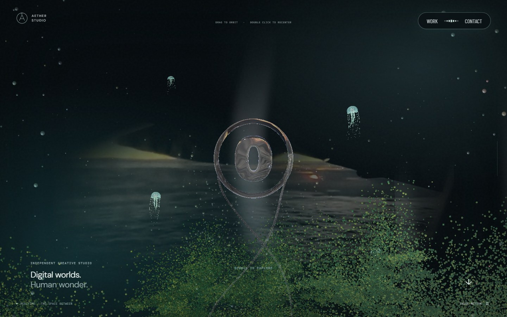
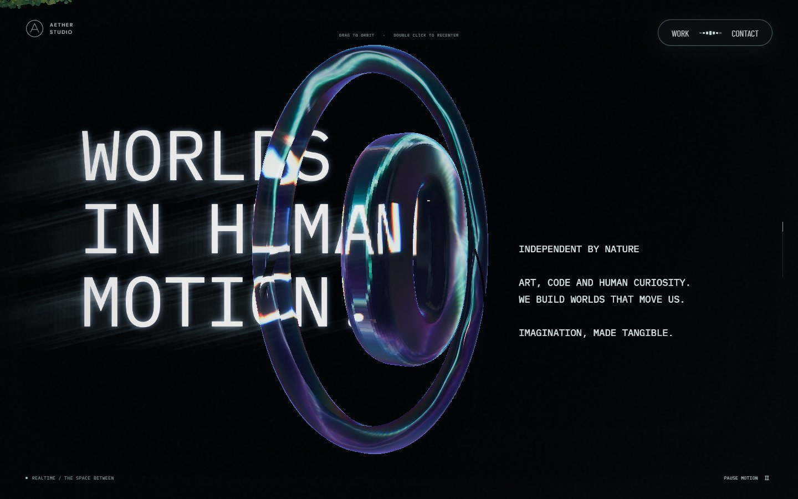
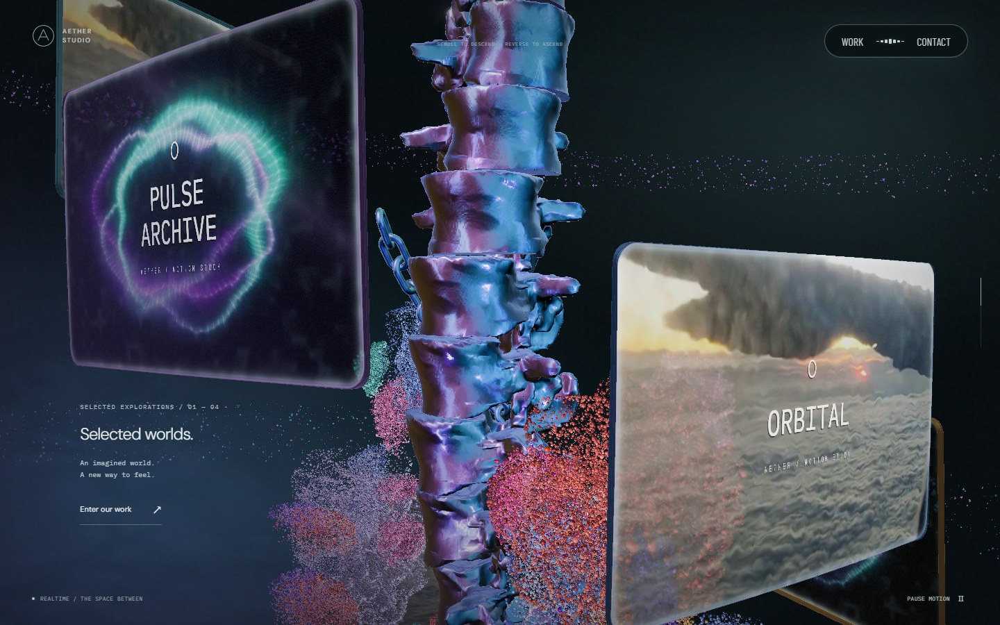
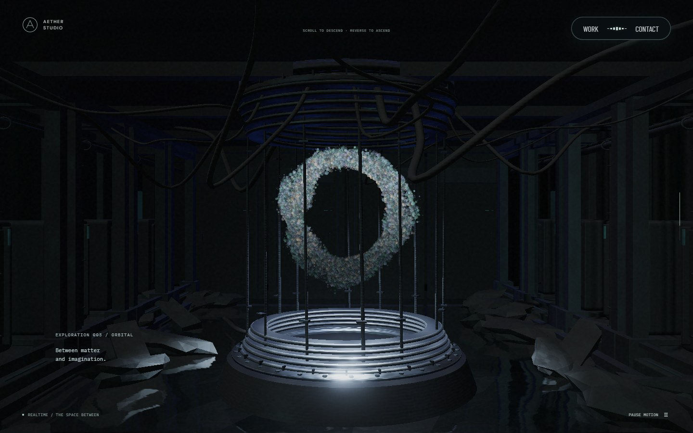
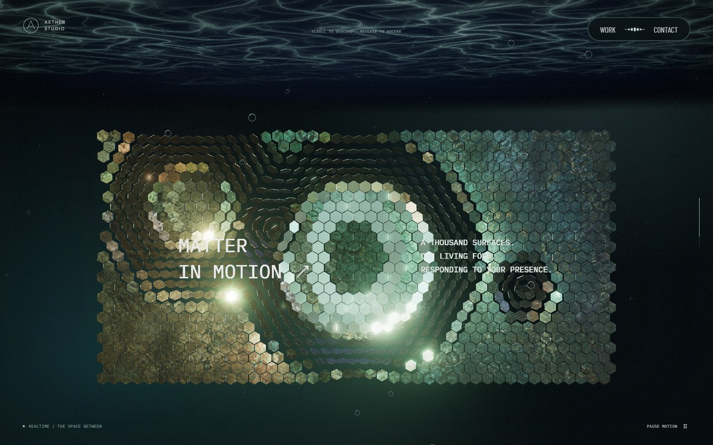
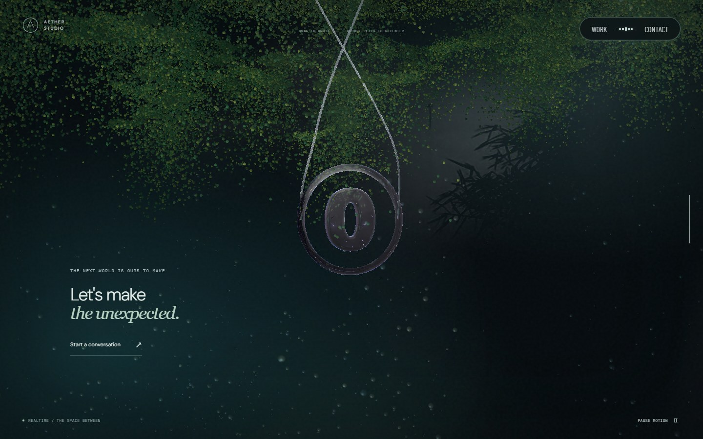
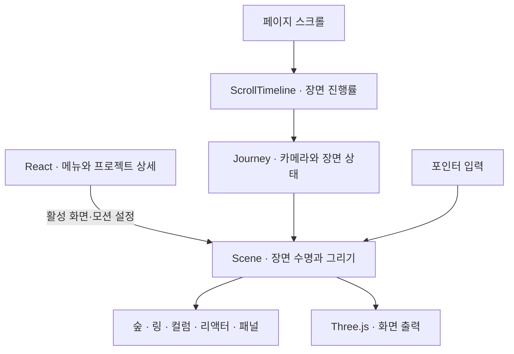

# Aether Studio

**스크롤로 내려가고, 포인터로 반응을 발견하는 인터랙티브 3D 웹사이트.**

영상이 비치는 숲에서 시작해 본 컬럼과 모니터, 어두운 리액터, 접히는 금속 표면을 지나 다시 숲으로 이어집니다. Active Theory의 공간 구성과 디테일을 참고하고, Aether의 장면·입력 구조에 맞춰 구현한 사이드 프로젝트입니다.

**[사이트 둘러보기 ↗](https://aether-studio-nu.vercel.app/)** · [로컬 실행](#로컬-실행) · [개발 문서](docs/README.md) · [트러블슈팅](docs/troubleshooting/current-guide.md)



<sub>아래 장면 이미지는 2026-09-27, 구현 커밋 `96ac71f`를 실행한 실제 화면입니다. [촬영 조건](docs/images/explore-2026-09-27/README.md)</sub>

## 🧭 장면 따라 둘러보기

**상단 포레스트 → 문구와 유리 링 → 본 컬럼·모니터 → 리액터 챔버 → 스케일 패널 → 하단 포레스트**

처음에는 천천히 내려가며 장면의 깊이와 빛을 보고, 돌아올 때는 포인터를 움직여 보세요. 위로 스크롤하면 같은 공간을 거슬러 올라갑니다.

### 01 · 빛이 스며드는 포레스트

숲의 영상은 공간 안에 놓인 곡면 스크린입니다. 그 영상의 색이 주변 입자와 유리 링에도 비칩니다. 앞쪽의 가지·잎, 떠다니는 벨 크리처, 링에 연결된 리본 트레일이 서로 다른 깊이를 만듭니다.

**발견할 디테일:** 빈 공간을 드래그하면 전경이 회전하고 뒤의 영상은 제자리에 남습니다. 포인터를 움직이면 잎·입자가 반응하고 빛의 잔광이 뒤를 따릅니다.

### 02 · 유리 뒤로 흐르는 문구



숲이 걷히면 큰 문구와 검은 판이 드러납니다. 유리 링은 뒤쪽 화면을 굴절시키고, 포인터가 지나는 문구 판에는 물결 같은 흔적이 남았다가 가라앉습니다. 링의 윤곽과 문구의 물결은 별도로 그립니다.

### 03 · 본 컬럼을 따라 내려오는 모니터



관절 모양의 본 컬럼 주위를 꽃 입자와 유리 모니터가 감쌉니다. 스크롤을 내리면 컬럼·꽃·모니터가 함께 회전하고, 체인은 자체 경로를 따라 내려옵니다. 멀리 있는 입자 띠는 천천히 계속 움직입니다.

**직접 해보기:** 모니터에 포인터를 올리면 화면이 바깥으로 조금 나오고, 클릭하면 프로젝트 상세가 열립니다. 좌하단 안개는 포인터가 지나간 자리를 잠시 드러냅니다. 모니터 선택은 상단 **Work**에서도 가능합니다.

### 04 · 리액터 챔버의 깊이



금속 장치 안으로 O 입자가 모이고, 주변에는 수면과 잔해, 빛이 놓입니다. 포인터 주변의 O 입자는 흐트러졌다가 돌아옵니다. 챔버의 어두운 벽과 영상 조명, 수면 반사가 한 공간의 깊이를 만듭니다.

### 05 · 접히는 금속, 다시 나타나는 숲

| 스케일 패널 | 하단 포레스트 |
| --- | --- |
|  |  |

스케일 패널의 O는 타일의 높이·기울기·반사 차이로 나타납니다. 주기적인 파동과 포인터 반응이 금속 표면을 접었다 펼칩니다. 더 내려가면 사선 경계를 따라 하단 포레스트가 들어오고, 다시 드래그로 공간을 둘러볼 수 있습니다.

<details>
<summary><strong>조작법과 작은 화면 안내</strong></summary>

| 조작 | 반응 |
| --- | --- |
| 스크롤·터치 스크롤 | 장면 탐색. 역방향으로도 돌아갈 수 있습니다. |
| 포인터 이동 | 잎·입자·물결·안개·금속 표면이 구간에 맞게 반응합니다. |
| 빈 공간 드래그 | 포레스트·소개 구간의 시점 조작. 놓은 각도를 유지하고 더블클릭하면 복귀합니다. 중간 기계 장면에서는 회전을 잠급니다. |
| 모니터 클릭 / Work 선택 | 프로젝트 상세. 닫기 버튼 또는 Escape로 복귀합니다. |
| 모션·사운드 버튼 | 모션 일시정지·재개. 사운드는 직접 켜야 재생됩니다. 운영체제 모션 축소 설정도 따릅니다. |

작은 화면과 소프트웨어 렌더러에는 별도 품질 예산을 적용합니다. 모바일 화면 검사는 Chromium 에뮬레이션이며 Safari/iOS 실기기와 저사양 기기의 장시간 실행 검증은 남아 있습니다. WebGL을 사용할 수 없으면 CSS 배경과 본문·탐색을 유지합니다.

</details>

## 로컬 실행

**Node.js 22.13 이상 + npm**이 필요합니다. CI는 Node.js 24를 사용하며 서버·DB·API 키는 필요하지 않습니다.

```sh
git clone --depth=1 https://github.com/okorion/aether-studio.git
cd aether-studio
npm ci
npm run dev
```

터미널에 표시된 주소를 엽니다. 기본 주소는 `http://127.0.0.1:5173`입니다. 배포용 결과를 보려면 `npm run build` 다음 `npm run preview`를 실행합니다.

> [!NOTE]
> 첫 화면 전에 GPU 자원을 준비하므로 기기에 따라 진입에 시간이 걸립니다. 로딩 숫자는 준비 단계의 진행 표시이며 다운로드한 바이트의 비율이 아닙니다.

## 🛠 코드의 큰 그림

React는 메뉴·프로젝트 상세 같은 **웹 화면**을, Three.js는 **3D 장면**을 담당합니다. React Three Fiber를 사용하지 않으며 `Scene.tsx`에서 Three.js를 직접 연결합니다.


```mermaid
flowchart TD
  UI[React · 메뉴와 프로젝트 상세] -->|활성 화면·모션 설정| Scene[Scene · 장면 수명과 그리기]
  Scroll[페이지 스크롤] --> Timeline[ScrollTimeline · 장면 진행률]
  Timeline --> Journey[Journey · 카메라와 장면 상태]
  Journey --> Scene
  Pointer[포인터 입력] --> Scene
  Scene --> Objects[숲 · 링 · 컬럼 · 리액터 · 패널]
  Scene --> Output[Three.js · 화면 출력]
```

<sub>개념도 — 세부 함수 호출을 줄인 책임 흐름입니다.</sub>

스크롤은 **어디에 있는지**, 시간은 **무엇이 계속 움직이는지**, 포인터는 **어디가 반응하는지**를 결정합니다. 따라서 같은 곳으로 돌아오면 구조의 배치는 복원되지만 영상까지 되감기지는 않습니다.

| 바꾸고 싶은 것 | 먼저 볼 파일 |
| --- | --- |
| 프로젝트 제목·설명 | [projects.ts](src/projects.ts) |
| 모니터의 형태·영상·연결 대상 | [MonitorCatalog.ts](src/MonitorCatalog.ts) |
| 메뉴·소개·상세 화면 | [App.tsx](src/App.tsx), [styles.css](src/styles.css) |
| 스크롤 속도와 카메라 경로 | [ScrollTimeline.ts](src/ScrollTimeline.ts), [Journey.ts](src/Journey.ts) |
| 각 장면의 구현·자원 수명 | [구조 문서](docs/architecture.md) |

모니터 수정 예와 확인할 동작은 [개발 안내](docs/development.md), 화면이 어긋날 때의 확인 순서는 [현재 트러블슈팅](docs/troubleshooting/current-guide.md)에 있습니다.

## 참고와 자산

[Active Theory](https://activetheory.net/)는 시각 구성과 인터랙션의 참고 사이트이며 제휴 관계는 없습니다. 해당 사이트의 코드·로고·모델·영상은 앱 자산으로 포함하지 않습니다.

Aether는 절차적으로 만든 형상·영상과 출처가 있는 외부 자산을 함께 사용합니다. **본 컬럼 메시의 CC BY 4.0 고지**, **포레스트 편집 영상의 CC0 원본**, 자체 호스팅 글꼴의 라이선스는 [서드파티 자료](THIRD_PARTY_NOTICES.md)에 정리했습니다. 자산별 이용 조건을 프로젝트 전체의 라이선스로 해석하지 않습니다.

Aether Studio와 프로젝트는 가상 콘셉트이며 `hello@aether.example`은 예시 주소입니다. 구현과 문서 작성에는 AI를 사용했습니다. 당시 코드·검증 자료를 연결한 [수정 기록](docs/troubleshooting/index.md)도 함께 보관합니다.
