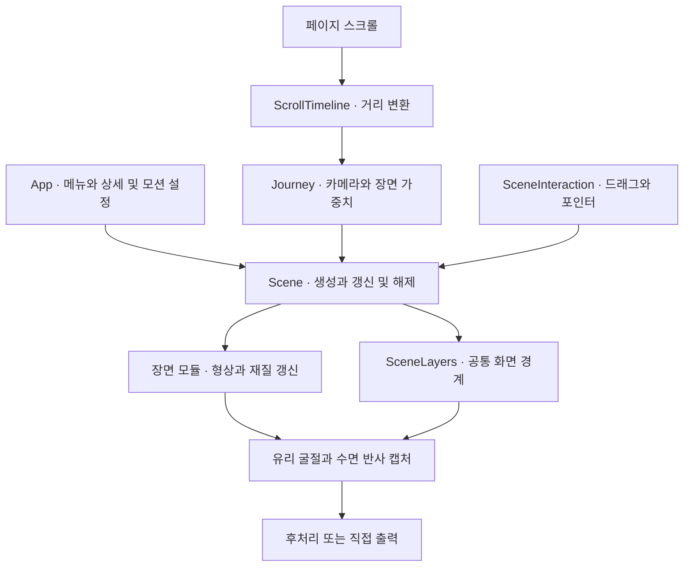
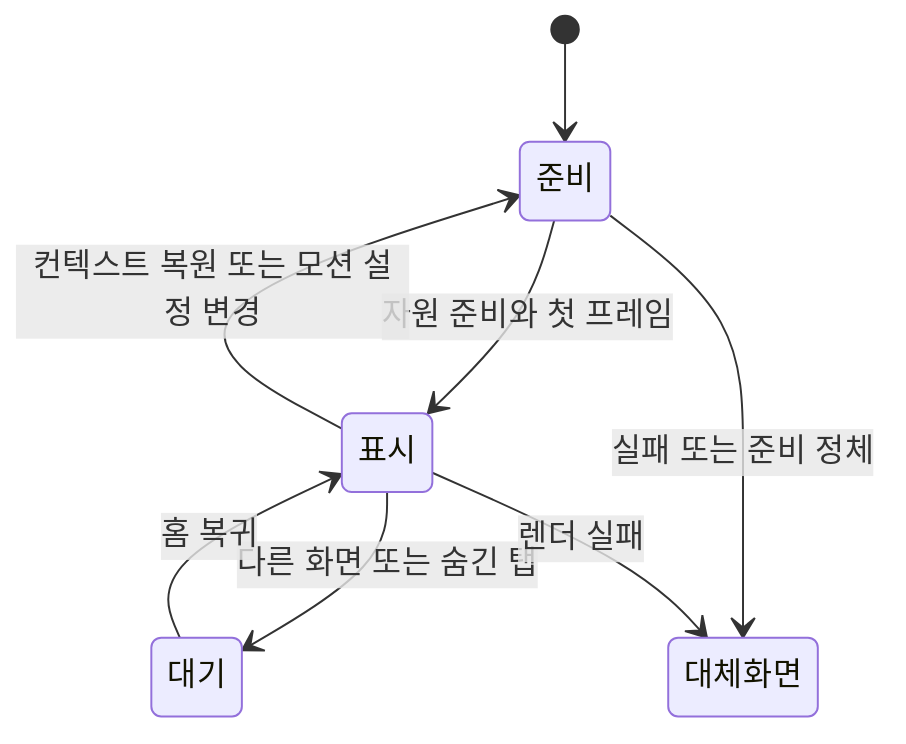

# 장면과 입력 구조

[문서 홈](README.md) · [수정 예제](development.md) · [증상별 진단](troubleshooting/current-guide.md)

React는 웹 화면과 설정을 맡고, Three.js는 한 장면 안의 오브젝트와 렌더링을 맡는다. `Scene.tsx`가 둘을 연결한다. 아래 설명은 2026-09-27의 구현 `96ac71f` 기준이다.

## 먼저 알아둘 네 가지

| 용어 | 이 프로젝트에서의 의미 |
| --- | --- |
| 메시(mesh) | 모양을 담은 geometry와 표면을 정하는 material의 조합 |
| 셰이더(shader) | GPU에서 정점의 위치나 픽셀 색을 계산하는 코드 |
| 렌더 타깃(render target) | 화면에 바로 표시하지 않고 다른 재질에서 읽으려고 그려 둔 이미지 |
| 진행률(progress) | 전체 장면 경로의 위치. 페이지 스크롤 비율과는 변환을 거쳐 연결 |

개념도 — 한 프레임을 그릴 때의 모듈 연결. 반사·굴절을 위한 추가 렌더링은 최종 출력 전에 수행한다.

## 스크롤·시간·입력의 구분

스크롤 위치는 카메라와 장면의 배치를 결정하고, 시간은 영상·조명·원경 입자 띠의 자동 회전·미세 움직임에 사용한다. 같은 스크롤 위치로 돌아오면 본 컬럼·모니터·꽃 군집의 배치는 복원된다. 영상 프레임과 원경 입자 띠의 시간 위상은 되감기지 않는다.

본 컬럼 묶음에는 `ColumnFollow`의 짧은 추종 지연이 있다. 빠르게 스크롤한 직후에는 목표 위치를 따라가는 중이므로, 가역성을 검사할 때는 정착을 기다린다. 포인터 흔적과 영상까지 포함한 전체 스크린샷이 항상 같아야 하는 것은 아니다.

| 입력 | 주로 결정하는 것 | 되돌아왔을 때 |
| --- | --- | --- |
| 스크롤 진행률 | 카메라·컬럼·꽃·모니터의 배치 | 정착 후 같은 배치 |
| 경과 시간 | 영상·빛·원경 회전·파동 | 재생 정책에 따라 이어짐 |
| 포인터와 저장된 드래그 | 물결·안개·국소 변형·시점 | 잔상은 감쇠, 선택 시점은 별도 보존 |

## 화면과 장면 수명

[App.tsx](../src/App.tsx)는 홈·Work·Contact, 프로젝트 상세와 모션 설정을 관리한다. [Scene.tsx](../src/Scene.tsx)는 Three.js 장면을 만들고 입력·카메라·재질·영상 상태를 프레임마다 연결한다. 3D 모듈이 실패하면 [SceneBoundary.tsx](../src/SceneBoundary.tsx)가 오류를 받아 본문과 탐색을 유지한다.

셰이더와 정적 GPU 자원은 [ScenePreparation.ts](../src/ScenePreparation.ts)에서 첫 표시 전에 준비한다. Work·Contact·상세 화면과 숨긴 탭에서는 연속 렌더링과 영상 재생을 멈춘다. 복귀하면 기존 스크롤 위치와 재생 상태를 이어간다. 자원을 해제하거나 컨텍스트를 다시 만들 때는 오래된 비동기 준비가 새 장면을 활성화하지 않도록 취소 상태를 확인한다.

개념도 — 대기는 자원 전체를 버리는 상태가 아니다. 모션 정지는 필요한 입력 프레임을 남기며 연속 애니메이션을 멈춘다.

로딩 표시는 `loading.ts`의 단계 이벤트를 읽는다. `App.tsx`는 숫자를 24ms마다 1씩 올리고, 실제 첫 프레임과 표시 숫자 100을 모두 확인한 뒤 준비 완료로 보여 준다. 따라서 숫자의 이동 시간과 실제 GPU 준비 시간을 구분해야 한다. 상세 진단은 [로딩 안내](troubleshooting/current-guide.md#첫-화면이-늦게-열릴-때)에 있다.

## 스크롤과 카메라

[Journey.ts](../src/Journey.ts)는 스크롤 위치에서 카메라 높이·각도·장면 가중치를 계산한다. 드래그 회전의 입력은 [SceneInteraction.ts](../src/SceneInteraction.ts)에서 받고, 실제 카메라에 적용할 범위는 `orbitWeight`로 정한다. 본 컬럼·리액터·스케일 패널에서는 카메라 회전을 잠그되 표면의 포인터 반응은 유지한다.

화면에 함께 보이는 장면은 [SceneLayers.ts](../src/SceneLayers.ts)의 경계를 공유한다. [SceneCurtains.ts](../src/SceneCurtains.ts)는 이를 재질에 연결한다. [SceneVisibility.ts](../src/SceneVisibility.ts)는 경계와 카메라 투영 범위를 보고 굴절·반사 캡처가 필요한지 판단한다. 경계값을 바꿀 때는 메시 표시뿐 아니라 캡처·클릭 판정도 함께 확인한다.

## 장면별 동작

| 대상 | 현재 동작 | 구현 |
| --- | --- | --- |
| 링·O·리본 트레일 | `glass`는 두께가 있는 유리 띠와 둥근 O에 배경 굴절·영상 반사를 합성한다. 포인터는 형상을 변형하지 않는다. `silver`는 기존 형상·재질을 선택하며 유리용 배경 캡처를 만들지 않는다. | [SceneEmblem](../src/SceneEmblem.ts) |
| 상단·하단 포레스트 | 공간에 배치한 가지·잎·입자와 카메라 이동이 시차를 만든다. 높이에 따른 입자 보강과 전경 회전이 있으며, 포인터 방향이 잎과 입자에 잠시 남는다. | [형상](../src/ForestGeometry.ts) · [숲](../src/SceneForest.ts) |
| 본 컬럼·체인 | 마디 방향이 높이에 따라 달라진다. 컬럼은 CC BY 4.0 파생 메시의 반복 배치이며, 체인은 별도 경로와 진행량으로 내려온다. | [SceneSpine](../src/SceneSpine.ts), [SceneChain](../src/SceneChain.ts), [메시 출처](../src/assets/README.md) |
| 본 컬럼 입자 | 꽃 군집은 스크롤에만 따라 회전한다. 카메라 바깥의 큰 나선 띠는 천천히 자동 회전하며 스크롤 회전량의 일부를 받는다. 컬럼에 붙는 하강 입자·보케·선형 필라멘트는 이 구간에서 숨긴다. | [Atmosphere](../src/Atmosphere.ts), [원경 입자 검증](column-background-particles.md) |
| 모니터 | 본 컬럼 앞뒤의 사선 나선을 따라 위치·높이·방향이 함께 바뀐다. 호버는 나선 바깥쪽으로 조금 이동시키며 클릭은 프로젝트 상세를 연다. | [SceneMonitors](../src/SceneMonitors.ts) |
| 리액터 | 고정된 높이의 금속 장치 안으로 O 입자가 모인다. 포인터 주변의 입자는 변형됐다가 돌아온다. | [SceneWorlds](../src/SceneWorlds.ts), [Atmosphere](../src/Atmosphere.ts) |
| 스케일 패널 | 7초 주기로 파동이 발생해 3초 동안 바깥으로 퍼진다. 중앙 타일의 높이·기울기·반사 차이가 O 로고를 만들며 파동에 함께 접힌다. 마우스가 브라우저 밖으로 나가도 남은 변형은 자연스럽게 감쇠한다. | [SceneScaleSurface](../src/SceneScaleSurface.ts) |
| 벨 크리처 | 몸통·테두리·촉수가 상단·하단 포레스트의 경계를 공유한다. 중간 장면에는 배치하지 않는다. | [SceneJellyfish](../src/SceneJellyfish.ts) |
| 표면 흐름·안개막 | 포인터의 속도·밀도 필드로 큰 2D 문구가 놓인 검은 판만 굴절시킨다. 본 컬럼에서는 좌하단 안개를 걷어내며 원래 화면 좌표·색을 드러낸다. | [필드](../src/PointerFlow.ts) · [물결](../src/SceneSurfaceFlow.ts) · [판](../src/SceneLayers.ts) · [안개](../src/SceneHaze.ts) · [합성](../src/SceneGlow.ts) |

명칭과 사용자 별칭은 [용어집](scene-glossary.md)에서 찾을 수 있다. 초기 나선·입자 변경은 [PR #20 기록](scene-reference-detail.md), 최근 회전·배치·천장 변경은 [변경 색인](README.md#변경과-측정-기록)에 연결했다.

## 포인터와 미디어

포인터 스트릭과 점 잔광은 포레스트에서만 생성·표시한다. 포레스트를 벗어나면 이전 입자의 수명을 비워 빠르게 돌아와도 오래된 궤적이 다시 나타나지 않는다. 표면 변형에 사용하는 흐름은 별도이므로 리액터·스케일 패널의 입력을 끄지 않는다.

물막 변위는 `SceneLayers`의 문구 판 재질에서 실수 높이값의 기울기를 샘플링해 처리한다. 앞에 놓인 유리 링의 윤곽, 상단·하단 포레스트와 모니터 픽셀은 화면 합성 단계에서 변위시키지 않는다. `SceneLightShafts`의 포레스트 영상은 월드 좌표에 고정한 곡면이다. 드래그는 앞쪽 포레스트·링·리본 트레일·벨 크리처를 회전시키며 영상은 따라 돌지 않는다. 영상 출처는 [광학 표현](optical-scenes.md), 현재 배치와 후속 교정은 [포레스트 영상 배치와 장면 수정](scene-spatial-followup.md)에 정리했다.

`ScrollTimeline`은 페이지 스크롤과 장면 진행률을 양방향으로 변환한다. 현재 별도 100svh를 배정한 구간은 `.785~.855`다. `ScaleStage`는 패널·천장 높이와 카메라 높이로 전환 경계를 계산한다. 천장은 진입부터 완료 각도 `0.24rad`를 유지한다. `App`의 본문 상태와 `Scene`의 카메라는 같은 거리 변환을 사용한다. [최신 천장 기록](verification/ceiling-entry-2026-09-27.md), [스크롤 변환 코드](../src/ScrollTimeline.ts)

안개는 `PointerFlow`의 별도 `haze` 필드를 사용한다. UI를 지날 때 새 입력의 연결만 끊고 잔상은 감쇠시키며, 문구 판의 물막 수명과 분리한다. 리액터의 넓은 조명, 꽃 전용 추가 입자와 원경 나선의 감김 간격은 [안개·리액터·꽃 교정](haze-reactor-flower-correction.md)에 정리했다.

[SceneVideo.ts](../src/SceneVideo.ts)는 모니터가 공유하는 영상을 지연 로드한다. `optimizedSrc`가 있는 소스는 VP8 지원 여부에 따라 WebM 또는 기본 MP4를 고른다. 현재 포레스트 영상은 MP4를 사용하며, 선택한 영상이 실패하면 절차적 셰이더를 표시한다.

[SceneLightVideo.ts](../src/SceneLightVideo.ts)는 `source`·`role`별로 별도 owner를 만든다. `Scene.tsx`는 포레스트의 `forest-memory.mp4`와 리액터의 `light-projection.mp4`를 각각 보관한다. 홈이 활성 상태인 동안 조명 영상이 함께 재생될 수 있으며, 모니터 영상처럼 화면 경계만으로 모두 중지되는 구조는 아니다. 각 owner가 재생·텍스처·실패 상태를 소유하며, 모션 설정으로 장면을 다시 만들 때도 같은 참조와 재생 위치를 유지한다. 정지·복귀·실패·해제는 영상별로 처리한다.

작은 화면과 소프트웨어 렌더러는 입자·조각 수와 반사 계산을 줄인다. 적응형 DPR과 후처리 설정은 `Scene.tsx`에 있다. 비용을 바꿀 때는 평균 프레임 시간만 보지 말고 첫 진입과 장면이 겹치는 구간을 따로 확인한다.

## 변경 후 확인할 동작

| 변경 | 관련 동작 | 대표 검사 |
| --- | --- | --- |
| 스크롤·카메라 | App과 Scene의 같은 변환, 왕복 시 위치 복원 | `scroll-timeline`, `scene-framing` |
| 컬럼 회전 | 컬럼·꽃·모니터가 같은 추종 진행률 사용 | `column-follow`, `particle-rotation` |
| 경계·천장 | 색·깊이·클릭·반사에서 같은 가시성 | `scene-boundary-placement`, `water-reflection` |
| 포인터 표현 | UI 위 입력 차단, 장면 이탈 후 잔상 처리 | `pointer-streak-scope`, `haze-lifecycle`, `surface-flow` |
| 영상·캡처 | 한 자원의 소유자, 정지·실패·해제 | `video`, `light-video`, `preparation` |

검사 이름은 `tests/`의 같은 이름 `.spec.ts` 파일이다. 생성한 geometry·material·texture·render target과 등록한 이벤트는 해당 모듈의 `dispose()`에서 해제한다. 캡처가 renderer의 타깃·viewport·객체 가시성을 임시로 바꾸면 예외가 나도 복원해야 한다.

## 현재 모듈화의 범위

오브젝트별 factory와 `update()`·`dispose()`가 이미 존재하지만 모든 모듈의 호출 규약이 같지는 않다. `Scene.tsx`는 생성 순서·미디어·입력·카메라·캡처를, `SceneWorlds.ts`는 여러 기계 장면을 함께 조정한다. 따라서 임의의 새 씬을 설정만으로 교체하는 플러그인 구조는 아직 아니다.

모니터의 형태·영상·배치는 `MonitorCatalog`로 일부 분리되어 있다. 다만 상세 영상의 선택과 2D 문구·스타일은 별도 코드에 남아 있다. 실제 수정 범위는 [개발 안내](development.md)의 작업별 수정 파일부터 확인한다.
