# 영상 방향·입자 나선·얕은 물막 교정

이 기록의 두 갈래 나선과 꽃 자동 회전은 이후 [본 컬럼 원경 입자 교정](column-background-particles.md)에서 변경했다. 아래 수치와 캡처는 당시 결과로 보존한다.

좌하단 안개의 범위와 포인터 반응은 [본 컬럼 화면 안개](column-screen-haze.md)에서 변경했다.

포레스트의 영상은 숲을 회전해도 정면을 유지하고, 스크롤에 따른 높이만 바뀐다. 상단 영상은 바닥 가까이 내리고 하단 영상은 천장 가까이 올렸다. 본 컬럼 뒤의 입자 띠, 문구 판의 물막, 유리 링의 영상 반사, 스케일 패널 로고와 리액터 빛도 함께 조정했다.

기준은 `870e8ad`(PR #44 병합본)다. 2026-09-24 [Active Theory](https://activetheory.net/)에서 정지·스크롤·포인터 이동을 직접 비교했다. 참고 사이트의 영상·셰이더·모델은 배포 파일에 복사하지 않았다. 기존 Aether 영상과 자산 출처는 [광학 표현 기록](optical-scenes.md)에 있다.

## 변경점

| 대상 | 변경 내용 |
| --- | --- |
| 포레스트 영상 | 원통에 감긴 영상을 카메라 정면을 향하는 평면으로 교체했다. 카메라 yaw·pitch·거리와 별개로 스크롤 높이만 투영 위치에 반영한다. 상단 중심 높이는 -6.5, 하단은 -52.8이며 영상 가장자리는 안개처럼 사라진다. |
| 본 컬럼 입자 | 고정 입자의 78%를 컬럼 뒤의 넓고 얕은 두 갈래 나선에 배치했다. 반지름은 약 9.2~11.2, 깊이 중심은 -8.5다. 자동 회전은 초당 0.025rad, 스크롤 회전은 컬럼 회전량의 0.32배다. 가까운 꽃 입자와 스크롤 하강 입자는 별도로 유지한다. |
| 문구 판 물막 | 속도에 따라 글자를 넓게 끌던 변위를 밀도 기울기에 따른 굴절로 바꿨다. 변위 상한은 판 UV의 0.0027이며, 작은 표면 주름과 얇은 색 분산을 더했다. 링 윤곽·포레스트·모니터의 화면 픽셀은 이 변위에 포함하지 않는다. |
| 유리 링·O | 영상의 넓은 영역을 곡면에 투영하고 RGB 샘플 위치를 분리했다. 밝은 영상 부분은 강하게 반사되고 어두운 부분에는 배경 굴절이 남는다. 분산 색은 기존 장면 시계로 움직인다. `variant: 'silver'`로 선택하는 원래 실버 모듈은 유지한다. |
| 스케일 패널 | 문구 판의 평면 O 그림을 없앴다. 중앙 타일의 높이·기울기·색·거칠기 차이가 O와 테두리를 만든다. 로고 타일도 자동 파동과 포인터 반응에 함께 접힌다. |
| 리액터 챔버 | 개구부의 투영 빛, 원뿔 안개, 스포트라이트와 받침의 반사 기여를 높였다. 새 조명·영상·렌더 타깃을 추가하지 않는다. |

## 실제 전후 화면

PC 1440×900, 장면 시간 10초, 영상 시간 6초, 품질 배율 1.0을 고정했다. 모바일은 390×844, DPR 2의 iPhone 사용자 에이전트를 사용한 Chromium 에뮬레이션이다. 실제 iPhone 캡처는 아니다. 물막은 같은 포인터 경로를 입력했다. 스케일 패널 정지는 표면 시계 5초, 포레스트 방향 비교는 영상 12초다.

| 대상 | 변경 전 | 변경 후 | 판단 포인트 |
| --- | --- | --- | --- |
| 본 컬럼 뒤 나선 | 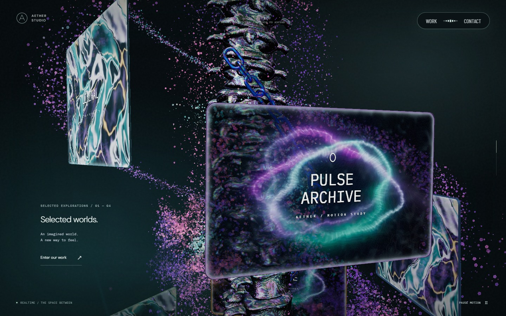 | 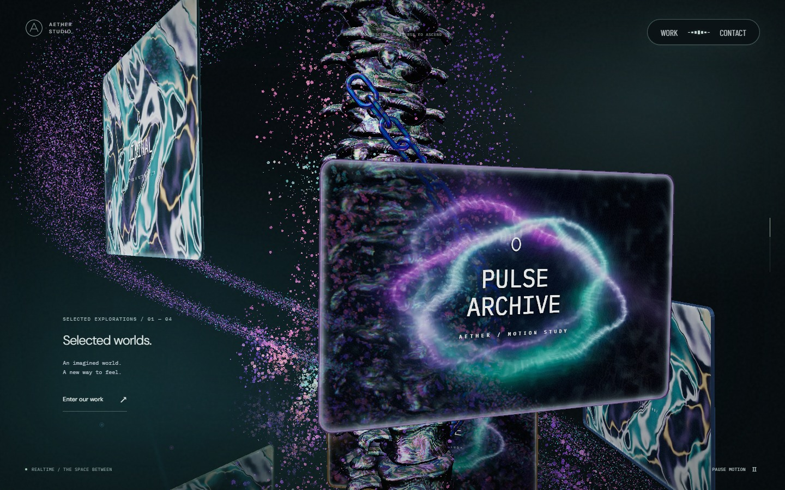 | 컬럼 뒤의 넓고 얇은 두 갈래 띠 |
| 문구 판 물막 | 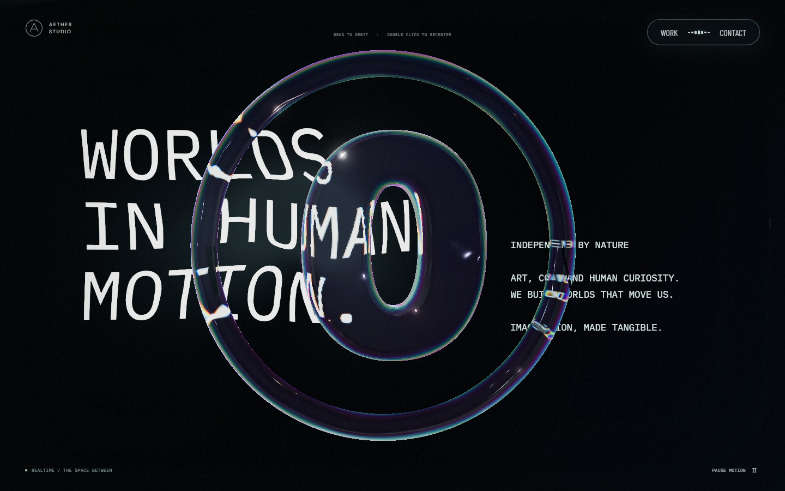 | 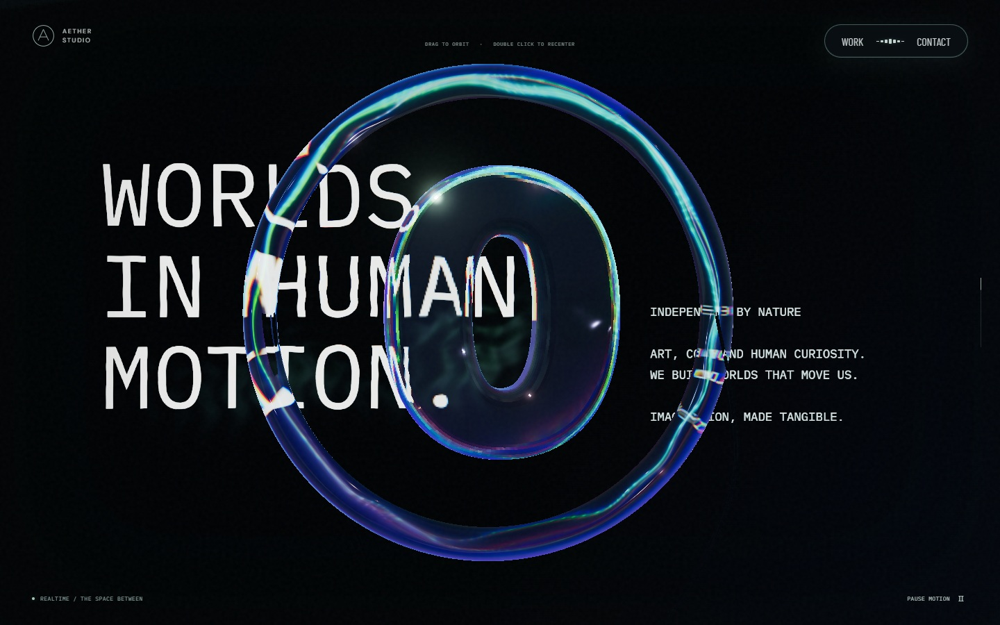 | 글자의 큰 늘어짐을 줄인 작은 굴절 |
| 모바일 유리 링 | 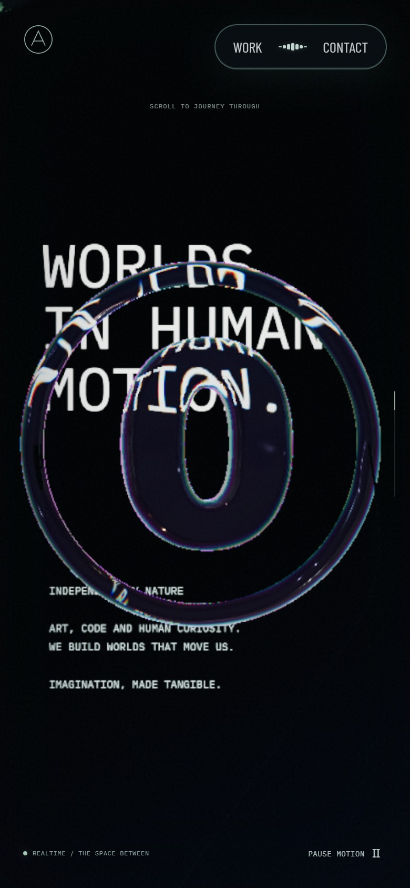 | 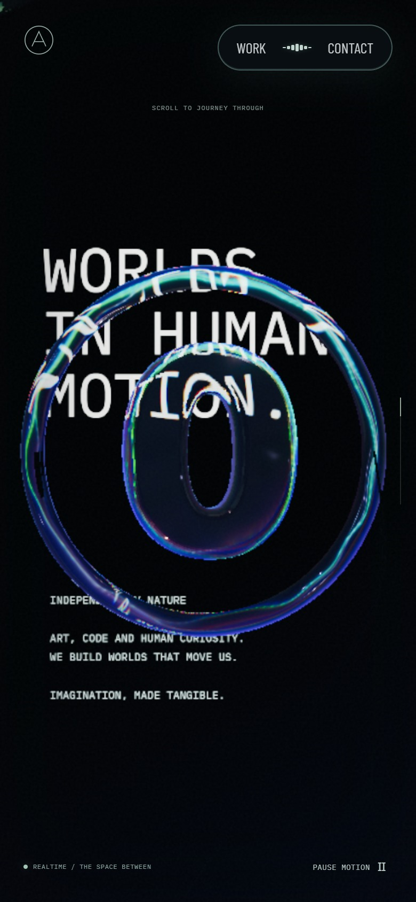 | 곡면 전체의 영상 빛·색 분산 |
| 스케일 패널 | 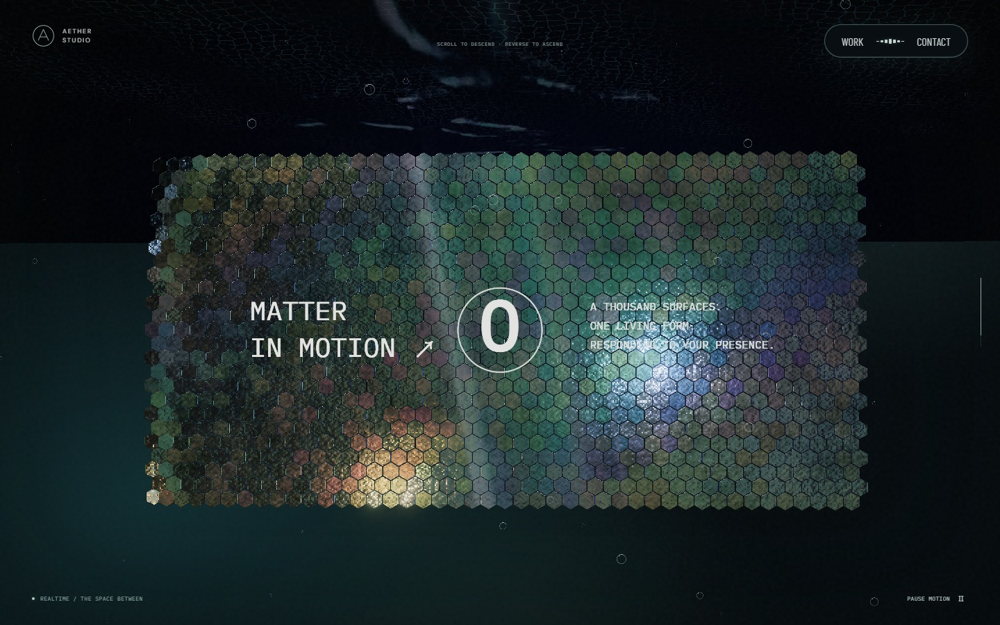 | 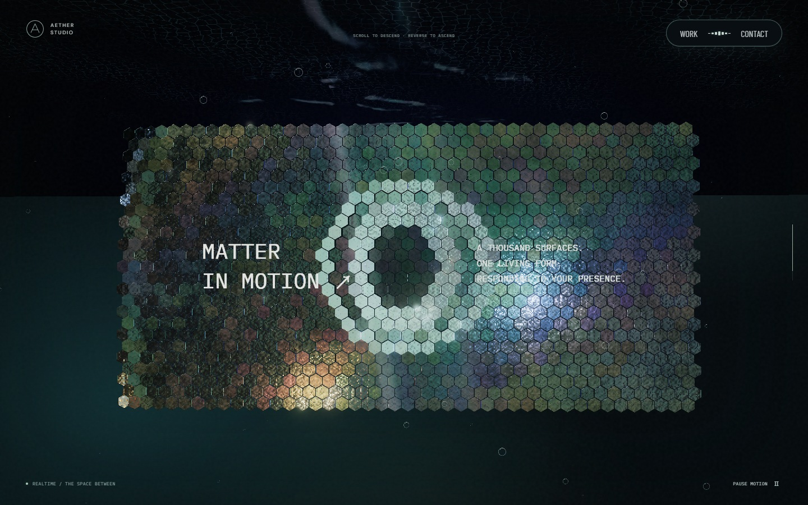 | 타일 자체가 형성하는 로고 |
| 리액터 챔버 | 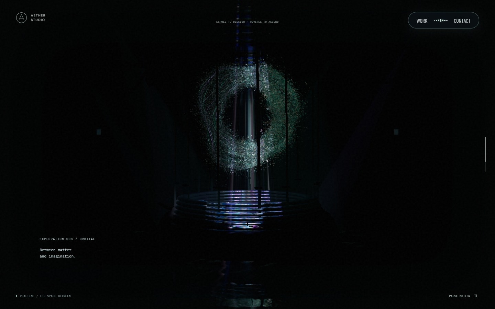 | 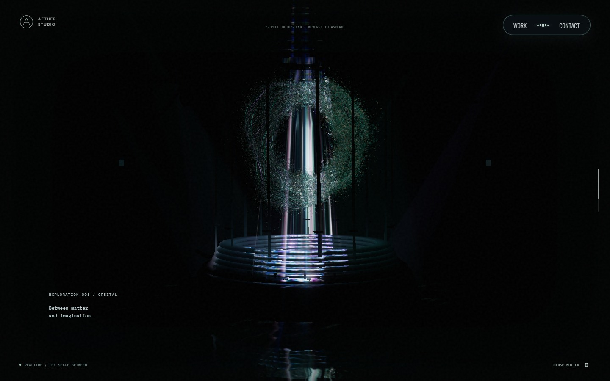 | 개구부에서 내려오는 빛과 받침 반사 |
| 상단 영상 | 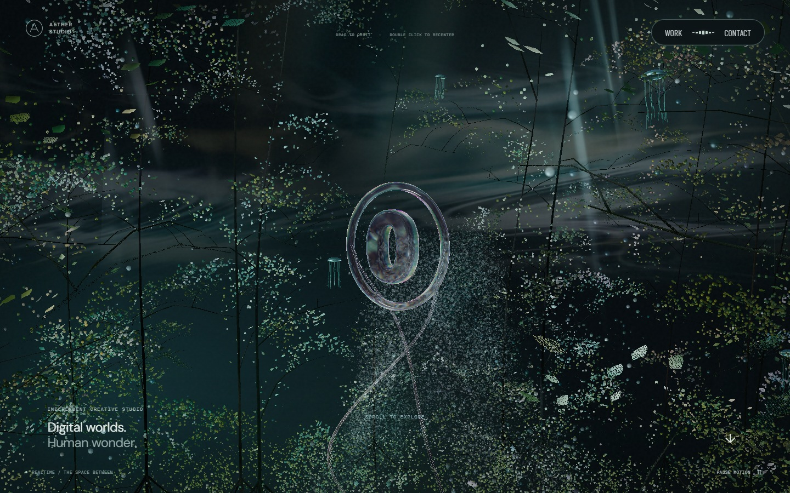 | 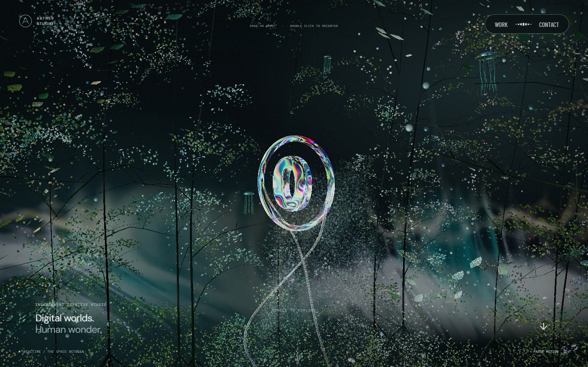 | 바닥 쪽의 영상과 안개 |
| 하단 영상 | 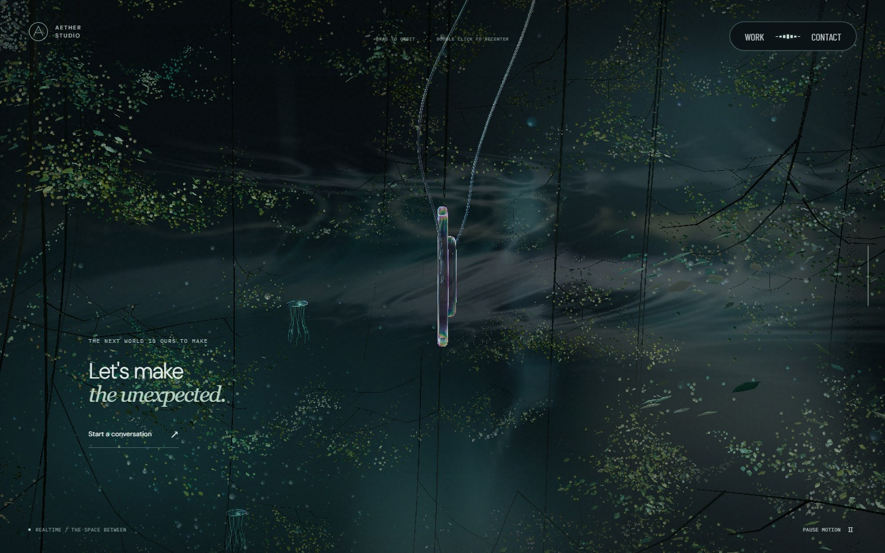 | 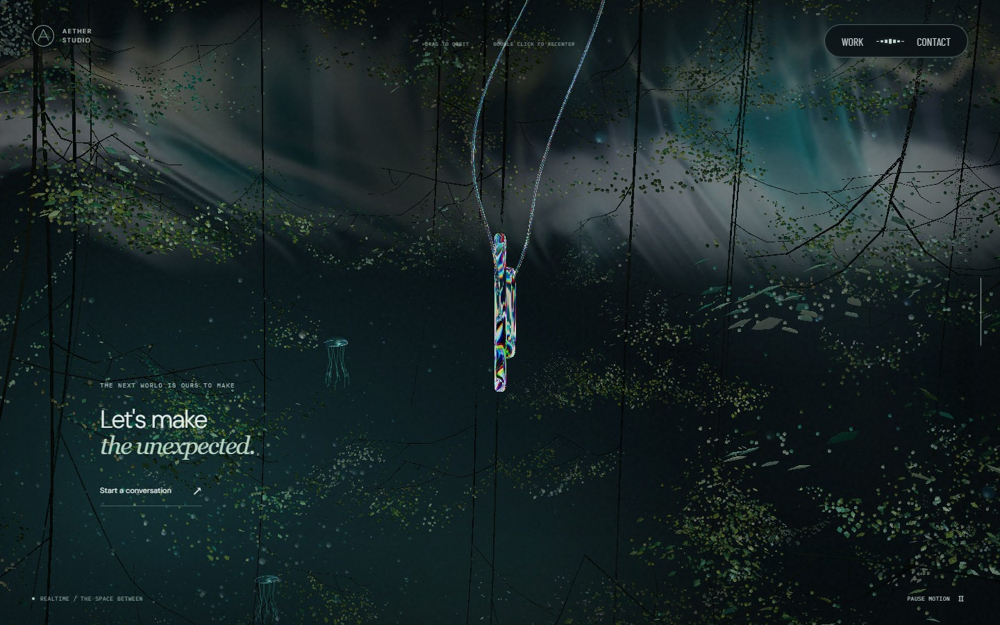 | 천장 쪽의 영상과 안개 |

아래는 같은 스크롤·영상 시각에서 숲만 회전한 화면이다. 가지·링의 방향이 달라져도 배경 영상의 방향과 화면 높이는 유지된다.

| 회전 전 | 회전 후 |
| --- | --- |
|  | 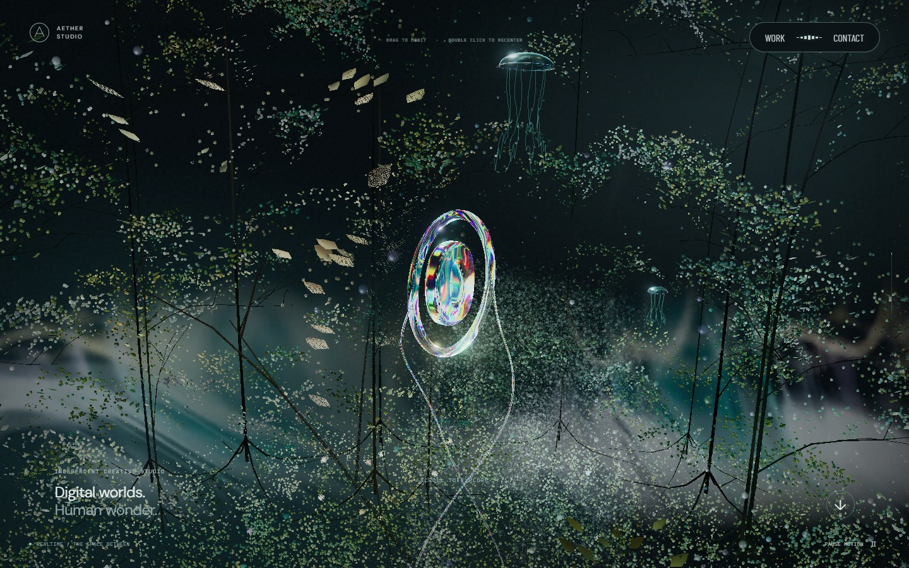 |

같은 링 위치에서도 영상 프레임에 따라 반사 색과 밝은 영역이 달라진다. 아래는 장면 시계를 고정하고 영상만 바꾼 화면이다.

| 영상 12초 | 영상 18초 |
| --- | --- |
| 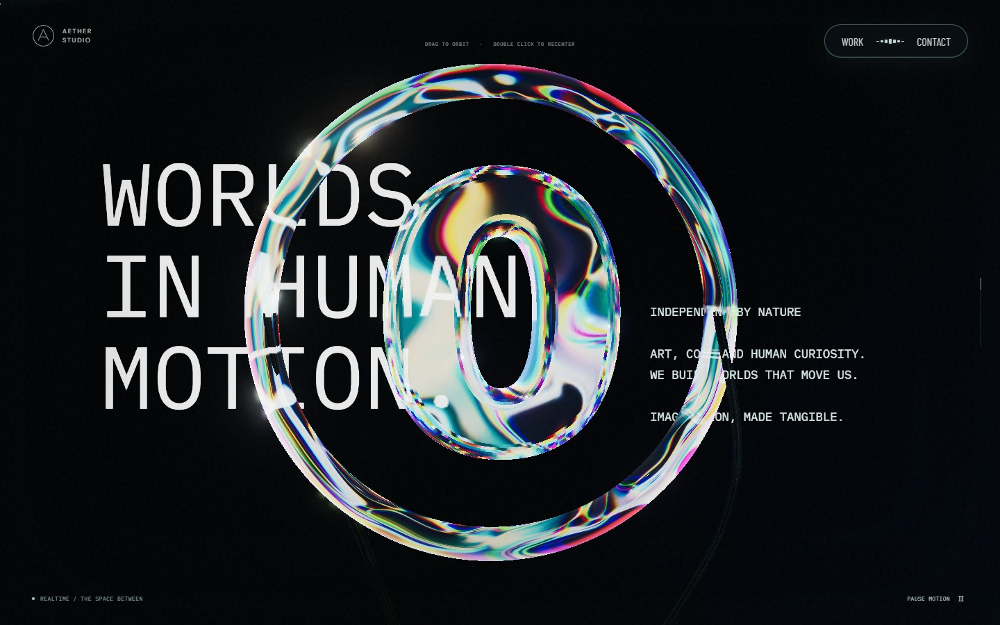 | 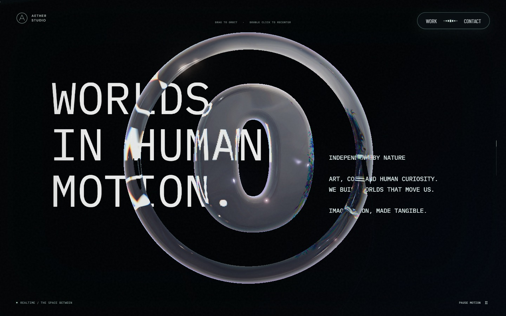 |

## 검증

- `lint`, `typecheck`, production build 통과.
- D3D11 GPU에서 광학·물막·챔버·입자·상호작용 검사 27개 통과. 기존 스케일 포인터 검사는 초기 실행에서 10픽셀로 실패했다(기대값 `>10`). 타일의 국소 입력 반응을 조정한 뒤 기존 임계값 그대로 통과했다. 중앙 타일의 암부가 자동 파동을 가리는 문제도 같은 검사로 발견해 교정했다.
- Windows Playwright WebKit에서 유리·실버 재질, 영상 빛, 영상 방향, 입자 회전, 물막 검사 6개 통과. Safari 실기기 검증으로 확대하지 않는다.
- 실제 생산 셰이더의 입자 좌표를 GPU에서 읽어 자동 회전, 일정한 높이·타원 반지름, 뒤쪽 깊이와 역스크롤 복원을 확인한다. 하강 입자는 시간만 흘러도 내려가지 않는다.
- 포레스트 영상의 투영 모서리는 서로 다른 yaw·pitch에서 같은 화면 좌표를 유지한다. 스크롤을 내리면 영상은 위로 이동하고, 되돌리면 복원된다.
- 물막 검사에서는 검은 판 픽셀만 변하고 앞쪽 링 윤곽은 유지된다. 흐름을 지우면 원래 판으로 돌아오며 포레스트 양 끝의 전체 화면 변위는 0이다.
- RTX 2060 SUPER에서 PC·모바일 뷰포트의 다섯 구간을 전후 비교했다. 각 2.4초 표본의 앱 평활 프레임 시간 중앙값·95백분위는 16.7ms, 품질 배율은 1.0이었다. 정지·재개를 포함해 실행 오류는 없었다. 원시 프레임 시간이나 휴대전화의 실제 성능을 뜻하지 않는다.

캡처 조건·SHA-256·실행 오류와 프레임 표본은 [검증 자료](evidence/atmosphere-detail-correction.json)에 보관한다. 원본 영상이 다르므로 AT와 프레임별 색·형상까지 같다고 주장하지 않는다. 이번 비교는 배치, 회전과 입력의 관계, 재질의 빛 반응을 기준으로 했다.
