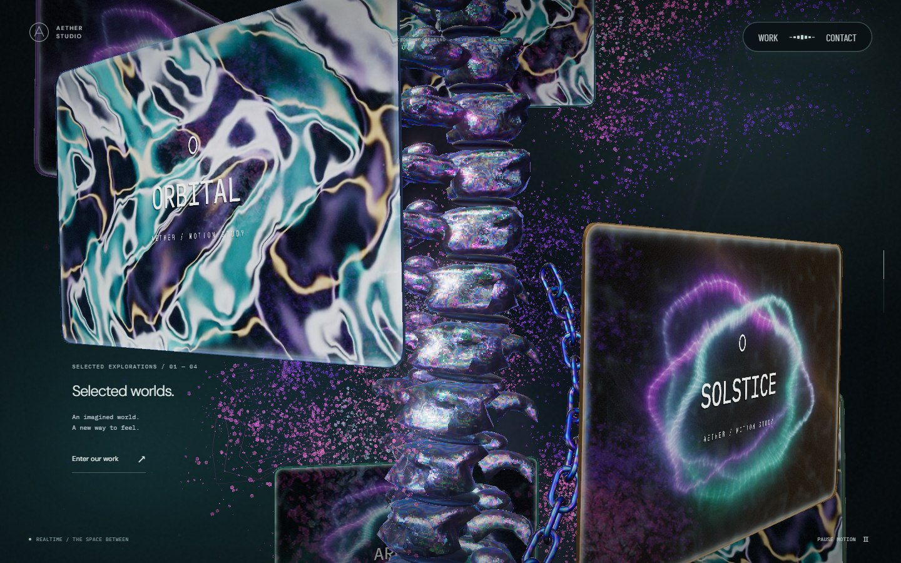
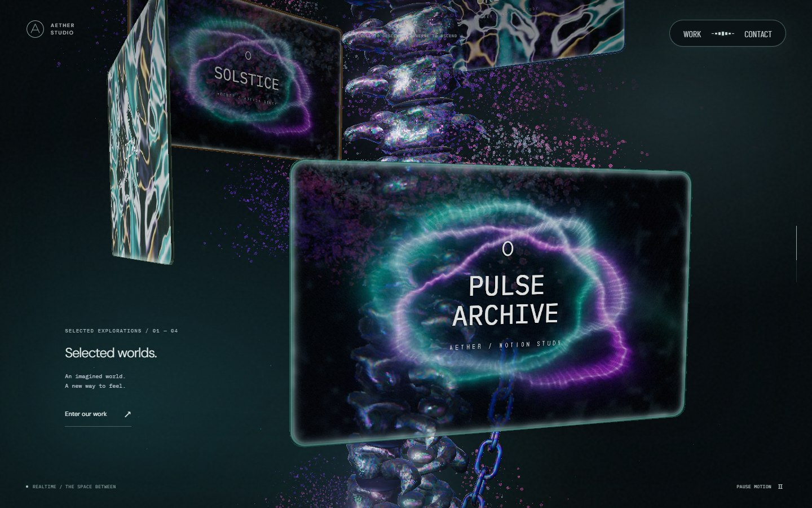
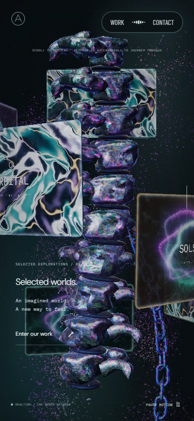
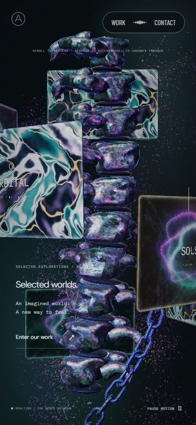

# 체인 사선 이동 · 2026-09-24

이 문서는 PR #40 당시 기록이다. 하단 끝 노출, 공동 회전과 사선 이동의 상쇄, 속도 곡선에 대한 후속 수정은 [체인 스크롤 이동](chain-scroll-feed.md)에 기록한다.

기존 체인도 나선 경로를 따랐지만 높이 변화에 비해 컬럼 둘레 이동량이 작아 수직으로 내려가는 인상이 강했다. 본 컬럼과 함께 도는 회전은 유지하고, 체인이 사선으로 감기며 내려가는 이동량을 늘렸다.

높이 1만큼 내려갈 때 둘레 방향 이동은 0.518에서 0.777로 50% 늘었다. 경로 경사는 수평 기준 약 63°에서 52°로 바뀐다. 각 링크가 경로의 접선 방향으로 이동하며, 뒤따르는 링크는 앞 링크가 지나간 위치와 방향을 그대로 통과한다. 카메라를 향해 체인을 돌리거나 컬럼에서 옆으로 떼어내는 보정은 없다.

PC의 하강 시간 곡선과 총 높이 이동 6.25는 유지한다. 링크 간격과 크기도 같다. 경사가 달라진 뒤에도 초입에 전체가 들어오도록 링크를 PC 23개, 모바일 31개로 맞췄다. 모바일 높이 배율은 1.38이다. 위쪽 고리의 구멍이 주요 단계에서 읽히도록 링크 축의 고정 각도를 -90°로 조정했다. 이는 스크롤 회전 효과와 별개인 고정 배치다.

| 전체 페이지 스크롤 | PC 1440×900 투영 범위 | 모바일 390×844 투영 범위 |
| --- | ---: | ---: |
| 초입 · 31% | 약 93%, 두 끝 모두 화면 안 | 약 92%, 두 끝 모두 화면 안 |
| 중간 · 46% | 약 54% | 약 53% |
| 마지막 경계 직전 · 61% | 약 32% | 약 32% |

투영 범위는 다른 물체의 가림을 제외한 화면 높이 비율이다. 모니터·본 컬럼 뒤로 들어가는 부분은 기존 깊이 판정대로 가려진다.

## 시각적 변경

변경 전 기준은 `15ca3c2`다. 같은 뷰포트·스크롤·카메라·포인터·애니메이션 시각에서 실제 실행 화면을 캡처했다.

| 대상 | 변경 전 | 변경 후 | 판단 포인트 |
| --- | --- | --- | --- |
| PC 초입 |  |  | 사선 경사와 전체 길이 |
| PC 중간 |  |  | 컬럼 둘레를 따라 이동한 위쪽 끝 |
| PC 마지막 |  |  | 하단에 남는 사선 체인 |
| 모바일 중간 |  |  | 좁은 화면의 사선 이동과 가림 |

[실제 정방향·역방향 스크롤 영상](screenshots/chain-diagonal/scroll.webm)에서 공동 회전과 체인의 경로 이동을 함께 확인할 수 있다. 원본 뷰포트는 1440×900이고 영상은 960×600이다.

## 검증

30~65% 구간에서 공동 회전을 제외한 개별 링크의 이동 방향과 접선을 비교하고, 하강 대비 둘레 방향 이동량을 검사한다. 고정 경로 통과, 연속 이동, 역스크롤 복원, 링크 간격, 단계별 노출, 위쪽 끝의 화면 범위와 화면 너비 변경도 검사한다.

관련 테스트 10개와 lint, typecheck, build를 통과했다. PC·모바일 브라우저에서 31→46→61→46% 왕복을 확인했고 콘솔·페이지 오류는 없었다. PC 휠 입력 왕복 영상도 기록했다. iOS Safari 실기기는 검사하지 않았다.
