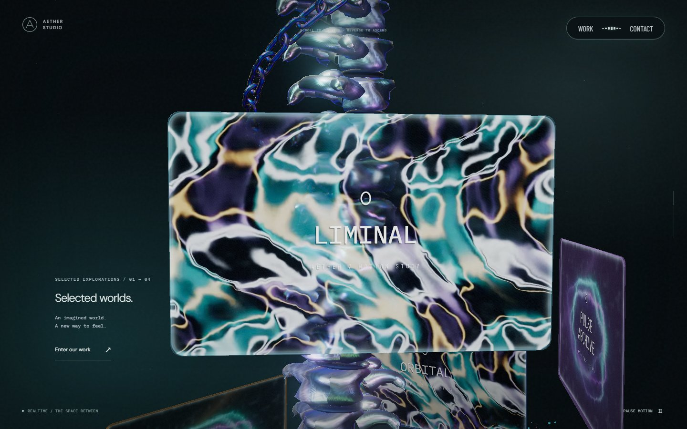
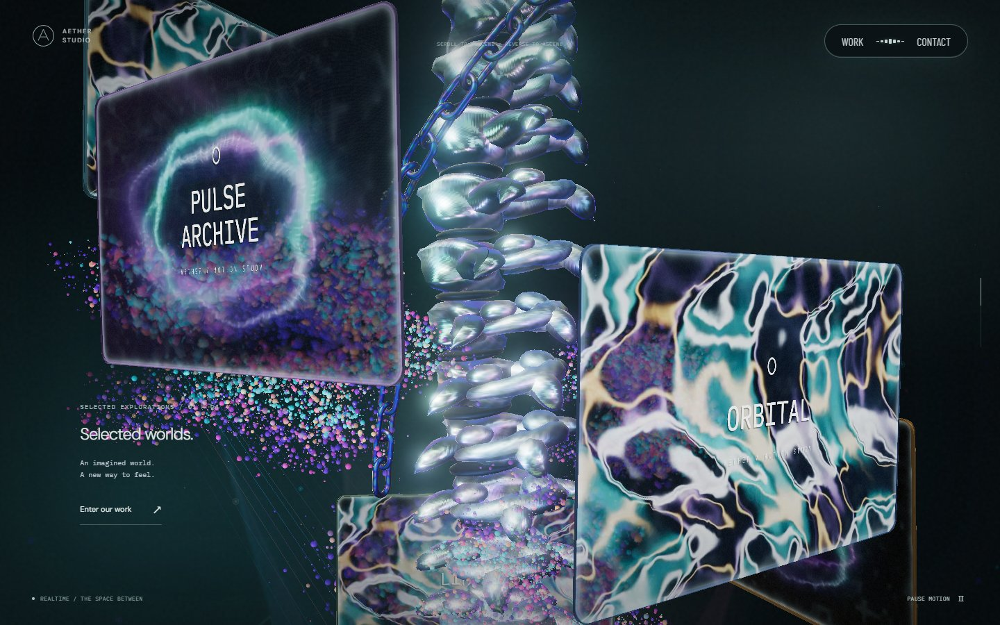
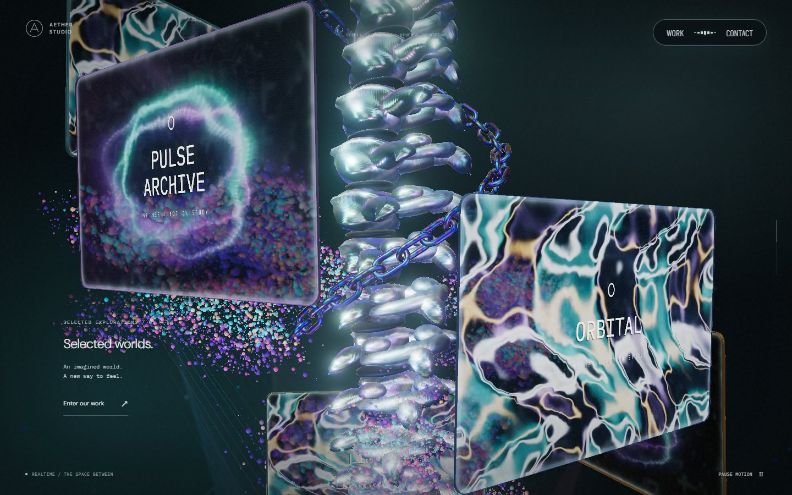
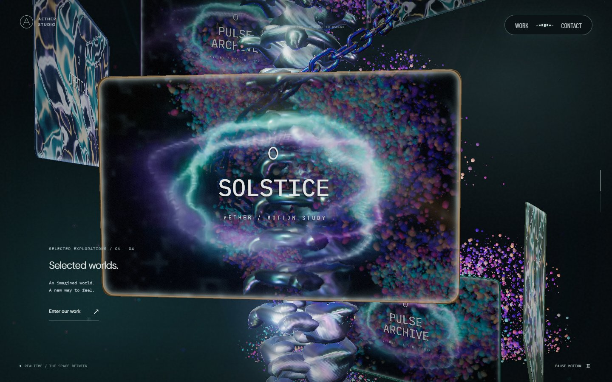
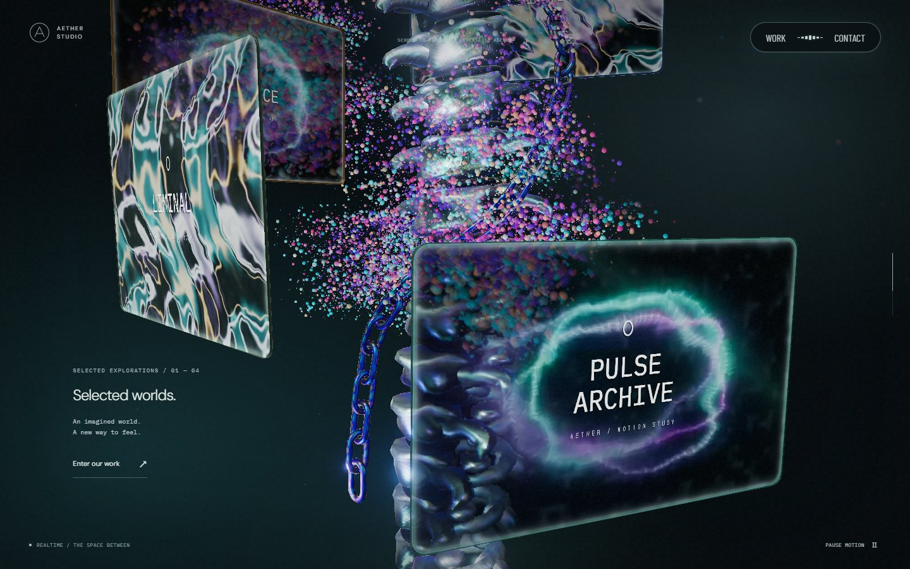
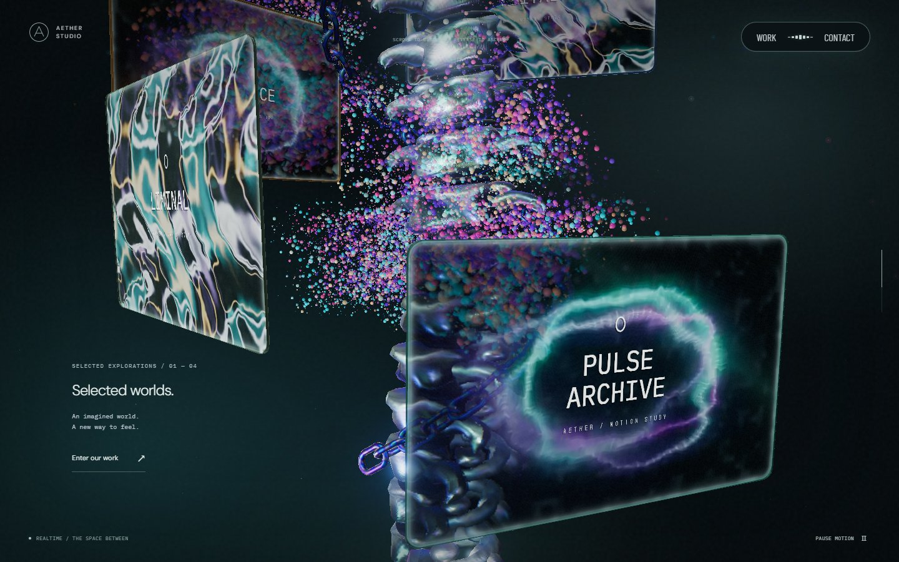

# 본 컬럼을 감으며 이동하는 체인 · 2026-09-24

PR #34는 본 컬럼과 체인을 함께 회전시켰지만, 체인의 로컬 이동은 짧은 수직 이동에 그쳤다. 이번에는 컬럼 둘레의 고정된 나선 경로 위에서 링크가 진행하도록 바꿨다. 스크롤을 내리면 감겨 내려오고, 올리면 같은 경로로 올라간다.

## 경로와 링크

`SceneChain.ts`의 나선은 컬럼 로컬 좌표에 고정된다. 같은 높이에서는 항상 같은 둘레 위치를 지나며, 각 링크의 방향은 그 위치의 접선으로 정한다. 공통 부모가 담당하는 컬럼 회전·월드 하강은 유지한다.

스크롤 27~65%에서 끝 링크의 로컬 높이는 -0.9에서 -2.55로 이동한다. 반지름은 1.85, 높이당 회전각은 0.85rad다. 링크는 나선의 호 길이를 따라 기존 간격 0.43으로 배치한다. 끝이 되감겨 위로 재등장하거나 링크 크기가 줄어드는 처리는 없다. 42개 링크의 모양·재질·교차 배치와 draw call 수는 유지했다.

일정한 반지름과 기울기의 나선이므로 호 길이와 접선을 직접 계산한다. 스크롤마다 표본점을 만들고 곡선 길이를 근사하던 계산은 제거했다. 프레임 속도 개선을 측정한 것은 아니다.

[Active Theory](https://activetheory.net/)의 본 컬럼 구간을 실제 휠 입력으로 전진·정지·역방향 관찰했다. 컬럼 둘레로 이어지는 체인과 앞뒤 가림을 참고했으며 원본 코드·에셋은 복사하지 않았다.

## 검증

실제 인스턴스 행렬을 사용해 뒤 링크가 앞 링크의 이전 위치와 방향을 통과하는지 검사한다. 체인 전체를 수직으로 옮기거나 카메라 쪽으로 보정하는 구현은 이 검사를 통과하지 못한다. 끝의 수직 이동과 둘레 방향 이동, 공통 부모 회전, 링크 간격, 정지·역스크롤 복원도 확인한다.

30~65%의 351개 위치에서 PC·모바일 끝 링크의 bounding box가 화면 안에 들어오는지 확인한다. 화면 안 위치와 다른 물체에 의한 가림은 구분하며, 컬럼·모니터 뒤의 자연스러운 가림은 유지한다.

## 시각적 변경

아래 비교는 공통 기준 `b267a2b`에 체인 변경만 적용했다. PC 1440×900, DPR 1, 카메라 입력 0, 구간별 240회 60Hz 시각 증가, 모니터 영상 2초를 동일하게 사용했다. 별도로 진행되는 장면 재질·카메라 수정과 구분하기 위한 기록이다.

| 구간 | 변경 전 | 변경 후 | 판단 포인트 |
| --- | --- | --- | --- |
| 30% |  |  | 나선 경로를 따라 공급되는 링크와 모니터 뒤 가림 |
| 40% |  |  | 컬럼 앞을 감싸고 왼쪽에서 끝나는 체인 |
| 50% |  |  | 컬럼 둘레의 고정 나선 경로 |
| 60% |  |  | 더 낮은 높이에서 드러나는 끝 링크 |

[실제 정방향·역방향 휠 입력 녹화](screenshots/chain-winding/scroll.webm) · [모바일 40%](screenshots/chain-winding/mobile/scroll-400.jpg) · [모바일 60%](screenshots/chain-winding/mobile/scroll-600.jpg)

녹화는 1440×900 화면을 960×600으로 저장했다. 30%에서 64%까지 내린 뒤 같은 휠 입력량으로 되돌렸으며, 녹화·PC·모바일 캡처에서 브라우저 오류가 없었다. 영상 프레임률을 기기 성능 측정값으로 사용하지 않는다. 실제 iOS Safari·저사양 기기의 장시간 실행은 미검증이다.
