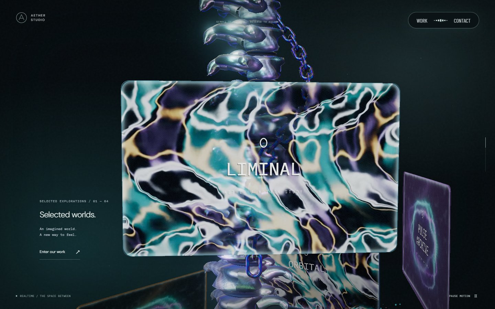
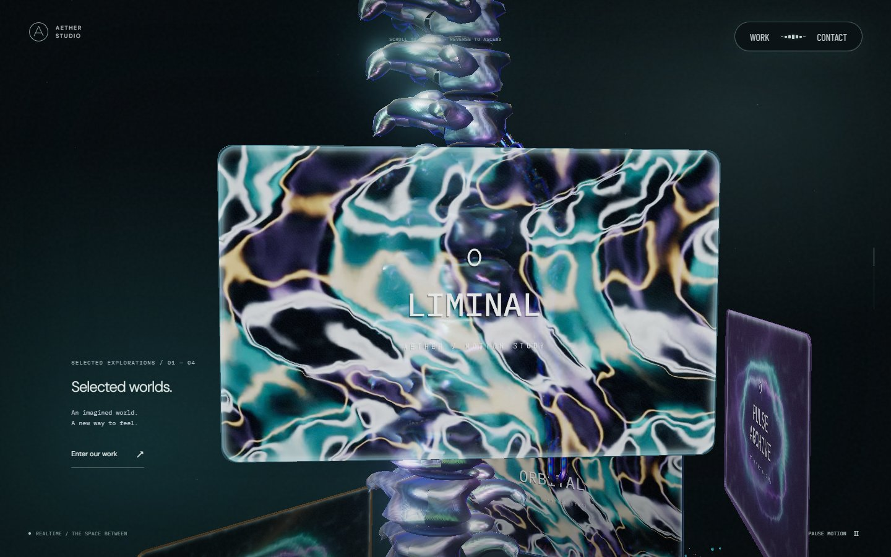
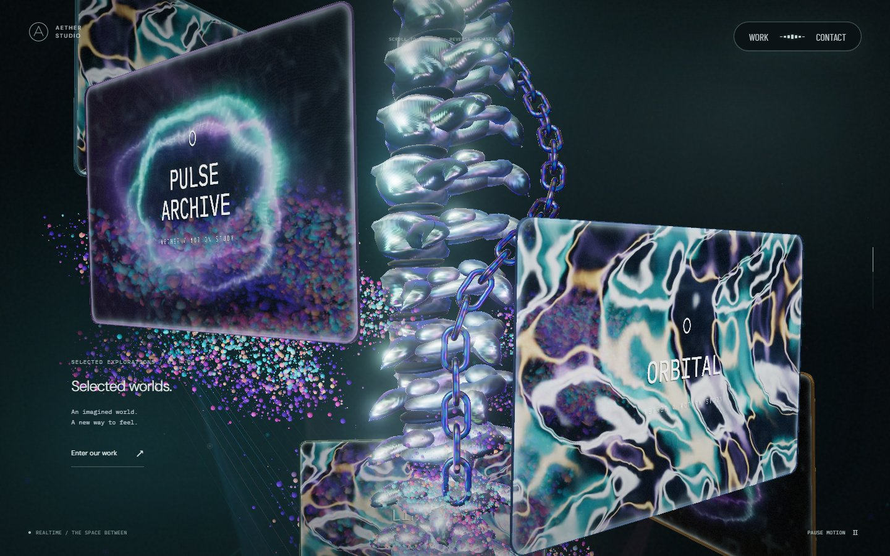
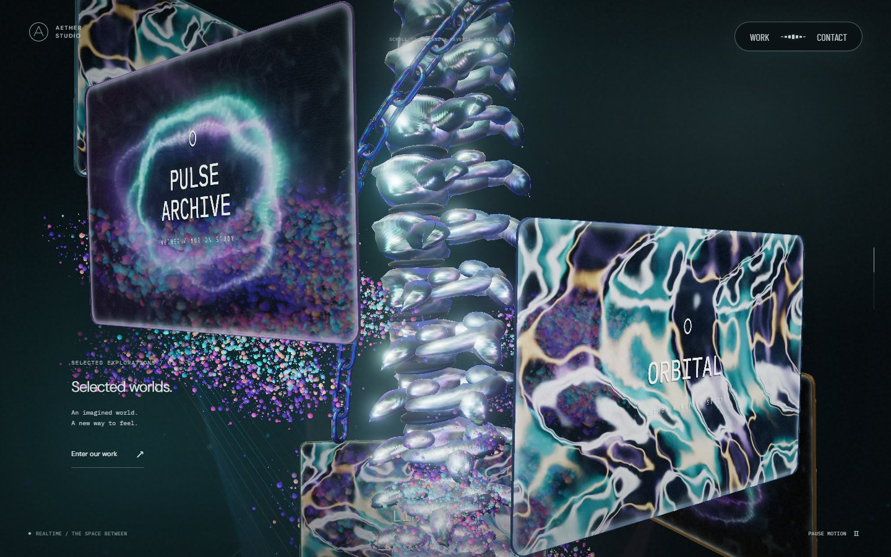
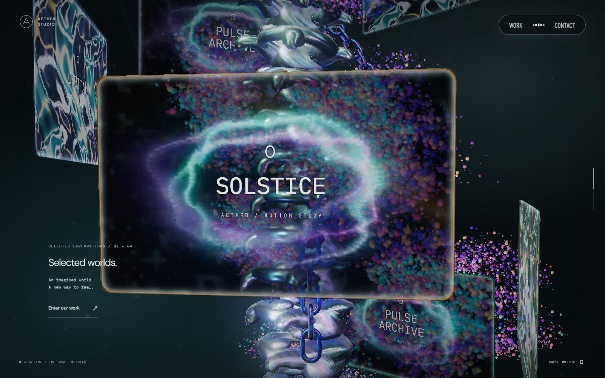
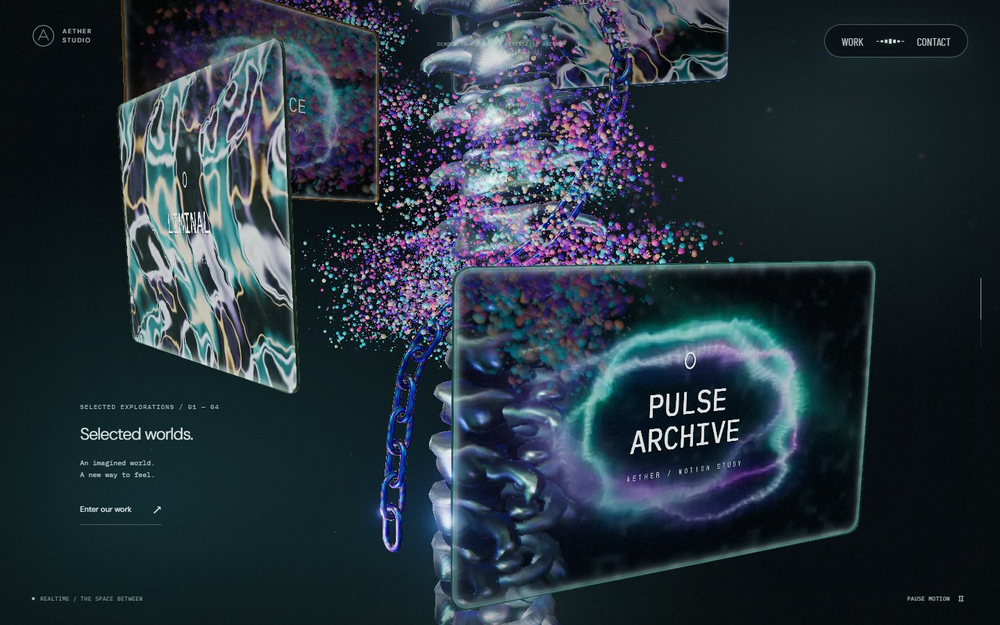

# 본 컬럼과 체인의 공통 회전 · 2026-09-24

PR #33의 체인은 본 컬럼의 회전을 상쇄해 끝부분을 카메라 앞에 유지했다. 이 때문에 컬럼이 돌아도 체인이 같은 방향에 머물렀다. 이번 수정에서는 체인의 로컬 X·Z 좌표와 링크 방향을 유지하고, 본 컬럼과 같은 부모의 회전을 그대로 받게 했다.

## 위치와 이동

`SceneChain.ts`에서 `structureYaw`를 경로 각도에 더하던 보정과 후반의 옆 이동을 제거했다. `SceneSpine.ts`에서도 링크에 역방향 yaw를 곱하던 코드를 제거했다. 42개 링크의 형태·개수·간격·재질은 유지한다.

스크롤을 내리면 공통 부모가 내려가면서 회전하고, 체인은 컬럼의 로컬 Y축을 따라 추가로 0.2만큼 내려온다. 되돌리면 같은 위치로 복원된다. 수직 이동 외에는 로컬 경로와 링크 방향이 변하지 않는다. 끝 링크는 순환하거나 축소되지 않는다.

[Active Theory](https://activetheory.net/)의 본 컬럼 구간을 1440×900 Chromium에서 실제 휠 입력으로 전진·정지·역방향 관찰했다. 컬럼 둘레를 도는 체인의 좌우 위치 변화와 모니터 뒤 가림을 참고했다. 원본 코드·모델·텍스처는 가져오지 않았다.

## 시각적 변경

변경 전은 운영 중인 `bc26605`, 변경 후는 이 PR의 코드다. 모두 1440×900, DPR 1, 카메라 입력 0, 구간별 240회 60Hz 시각 증가, 모니터 영상 2초로 캡처했다.

| 구간 | 변경 전 | 변경 후 | 판단 포인트 |
| --- | --- | --- | --- |
| 30% |  |  | 컬럼 오른쪽으로 함께 돌아가는 끝부분 |
| 40% |  |  | 왼쪽에 드러나는 자유단과 컬럼을 감는 경로 |
| 50% |  |  | 회전에 따라 뒤로 이동하며 모니터에 가려지는 체인 |
| 60% |  |  | 다시 앞으로 돌아 나오는 자유단 |

[모바일 40%](screenshots/single-chain/local-mobile/scroll-400.jpg) · [모바일 60%](screenshots/single-chain/local-mobile/scroll-600.jpg)

## 검증 범위

`tests/chain.spec.ts`는 실제 인스턴스 행렬에서 모든 링크의 로컬 X·Z·방향·크기가 유지되는지, Y 이동이 모든 링크에 동일하게 적용되는지 검사한다. 공통 부모 회전으로 계산한 월드 위치와도 대조한다. 이 검사는 이전의 카메라 방향 보정이 복원되면 실패한다.

30~65%의 351개 위치에서 PC·모바일 끝 링크 bounding box의 여덟 꼭짓점이 화면 안에 들어오는지 검사한다. 링크 간격·연속 하강·정지·역스크롤 복원 검사도 유지한다. 투영 범위 검사는 가림 검사를 대신하지 않는다. 모니터와 컬럼에 가려지는 순간은 실제 깊이에 따라 유지하며, 매 프레임 끝 링크 전체가 보인다고 주장하지 않는다.

PC·모바일 각각 네 구간의 실제 렌더에서 끝부분을 확인했고 캡처 중 브라우저 오류는 없었다. 실제 iOS Safari와 저사양 기기의 장시간 실행은 검사하지 않았다. draw call·삼각형 수·텍스처·렌더 패스는 PR #33과 같다.
