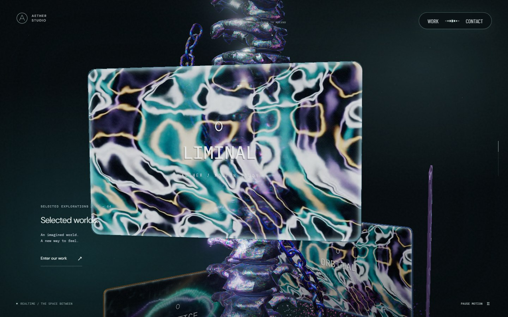
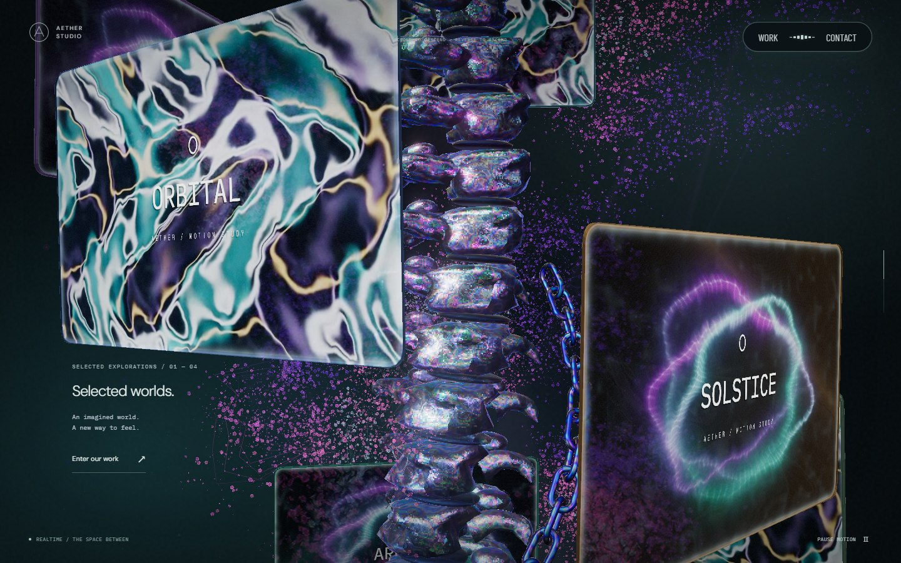
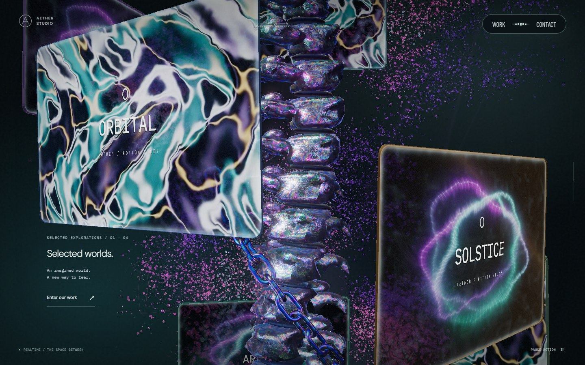
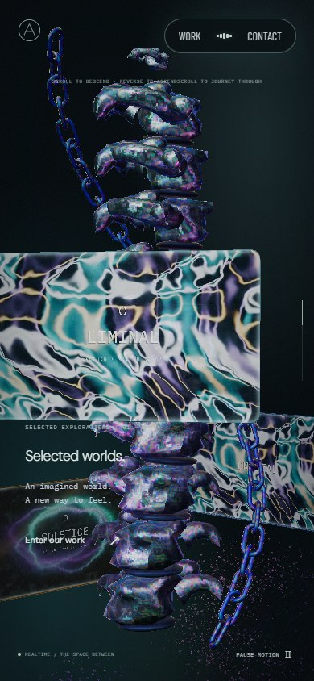
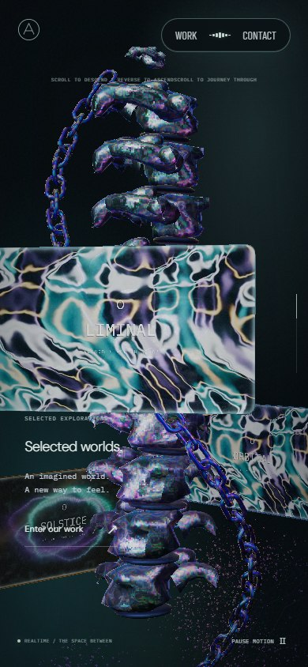
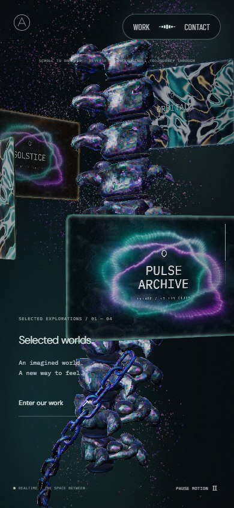
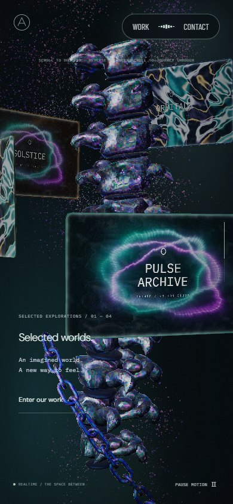
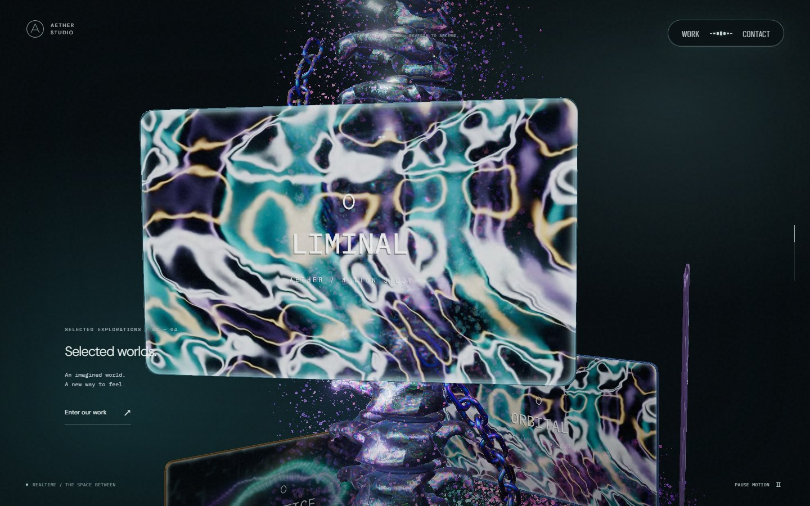
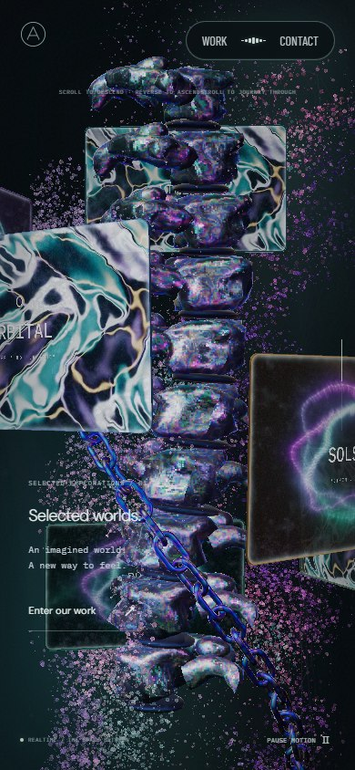

# 체인 스크롤 이동 · 2026-09-24

초입에서 체인 아래쪽 마지막 고리가 화면 안에 보였고, 스크롤 중에는 체인 자체의 사선 이동이 본 컬럼 회전과 일부 상쇄됐다. 체인을 화면 아래로 연장하고 감기는 방향과 하강 속도 곡선을 수정했다.

## 원인과 변경

기존 나선은 내려갈수록 로컬 X/Z 각도가 증가했다. Three.js의 양의 Y축 회전은 같은 각도를 감소시키므로, 공동 회전과 독립 이동이 반대 방향이었다. 예를 들어 페이지 진행률 32%에서 단위 진행률당 각속도는 본 컬럼 -27.81, 체인 자체 +12.18, 합계 -15.63 rad였다. 사선 이동을 늘려도 화면에서 보이는 둘레 이동이 줄어드는 구조였다.

나선의 감기는 방향을 바꿔 두 움직임이 같은 방향으로 더해지게 했다. 본 컬럼과 같은 부모를 사용하며, 본 컬럼의 기존 회전 값과 카메라 경로는 유지한다. 각각의 링크는 본 컬럼 로컬 나선 위를 접선 방향으로 내려가며 앞 링크가 지나간 위치와 방향을 통과한다. 카메라를 향해 체인을 돌리는 보정은 없다.

이전의 겹친 두 이동 곡선은 초반에 빨라졌다가 중간에서 급하게 느려지고 다시 조금 빨라졌다. 하나의 연속 곡선으로 바꿔 초반부터 끝까지 서서히 감속하도록 했다. 29~65% 구간의 PC 로컬 높이는 4.4에서 -1.85로 이동한다. 시작·끝의 기울기도 이어져 경계에서 별도로 멈추지 않는다. 장면에 이미 적용되는 스크롤 보간을 그대로 사용하며 체인에 추가 지연이나 시간 기반 회전을 넣지 않았다. 역스크롤은 같은 경로를 되짚는다.

링크 수는 PC 40개, 모바일 52개다. 위쪽 끝은 계속 보이고 아래쪽 끝은 화면 밖에 남도록 길이를 늘렸다. 링크 크기·간격·재질, 약 52° 경사와 나선 반경은 유지한다. 새 감김 방향에서 끝 고리의 구멍이 주요 단계에 보이도록 고정 배치 각도는 30°로 맞췄다.

| 전체 페이지 스크롤 | PC 1440×900 | 모바일 390×844 |
| --- | ---: | ---: |
| 초입 · 31% | 화면 높이 약 94% | 약 90% |
| 중간 · 46% | 약 55% | 약 54% |
| 마지막 경계 직전 · 61% | 약 35% | 약 34% |

위 수치는 다른 물체의 가림을 제외한 투영 범위다. 모니터·본 컬럼 뒤로 지나가는 부분은 기존 깊이 판정대로 가려진다. 이전의 ‘초입에서 두 끝이 모두 화면 안’ 조건은 이번 하단 끝 숨김 요청에 맞춰 바꿨다.

## AT 관찰

2026-09-24 [Active Theory](https://activetheory.net/)를 Chromium 1440×900에서 열어 본 컬럼 구간에서 휠 +240을 네 번, -240을 네 번 입력했다. 입력 후 180ms와 추가 900ms에 캡처하고 정지 상태도 확인했다. 관찰한 구간에서 체인은 모니터 뒤로 가려지면서 화면 아래로 이어졌고, 역스크롤로 배치가 돌아왔다. 원본의 정확한 easing 계수나 내부 좌표를 측정한 결과는 아니다. 위 상쇄 원인과 수치는 Aether 코드에서 확인한 값이다. 원본 코드·모델·텍스처는 가져오지 않았다.

## 시각적 변경

아래 비교표와 왕복 영상은 **통합 전 기록**이다. 변경 전 `340efa9`, 변경 후 `787eb2e`에서 같은 뷰포트·스크롤·카메라·포인터·애니메이션 시각으로 캡처했다. 체인 변경만 비교한 자료이며, 이후 PR #39에서 바뀐 꽃 입자의 형태·색상은 포함하지 않는다.

| 대상 | 변경 전 | 변경 후 | 판단 포인트 |
| --- | --- | --- | --- |
| PC 초입 |  |  | 아래쪽 마지막 고리가 화면 밖으로 이어짐 |
| PC 중간 |  |  | 공동 회전 중 체인 자체의 사선 이동 |
| 모바일 초입 |  |  | 좁은 화면에서도 하단 끝 숨김 |
| 모바일 마지막 |  |  | 위쪽 끝에서 화면 아래로 이어지는 체인 |

[통합 전 실제 정·역방향 휠 입력 영상](screenshots/chain-feed/scroll.webm)

아래는 **현재 통합본 `aad6ffa`의 실제 화면**이다. main `0107ed3`의 꽃 입자 변경과 체인 수정을 함께 포함한다. PC·모바일 모두 31→46→61→46% 왕복을 다시 확인했다.

| 현재 통합본 | 실제 캡처 | 확인 내용 |
| --- | --- | --- |
| PC 초입 · 31% |  | 바뀐 꽃 입자와 화면 아래로 이어지는 체인 |
| 모바일 중간 · 46% |  | 통합 후에도 유지되는 사선 이동과 자연스러운 가림 |

## 검증

PC·모바일에서 23~65%의 421개 위치를 검사해 마지막 링크 전체가 화면 하단보다 최소 화면 높이 10% 아래에 있는지 확인했다. 등장 중 본 컬럼의 위치·크기 변화와 카메라 이동도 포함한다. 공동 회전과 독립 이동의 방향, 단조로운 감속, 접선 일치, 링크 간격, 연속성, 역스크롤 복원, 위쪽 끝의 화면 범위, 화면 너비 변경을 검사한다.

관련 테스트 12개, lint, typecheck, build를 통과했다. PC·모바일 실제 화면에서 31→46→61→46% 왕복을 확인했고 콘솔·페이지 오류는 없었다. iOS Safari 실기기는 검사하지 않았다.
