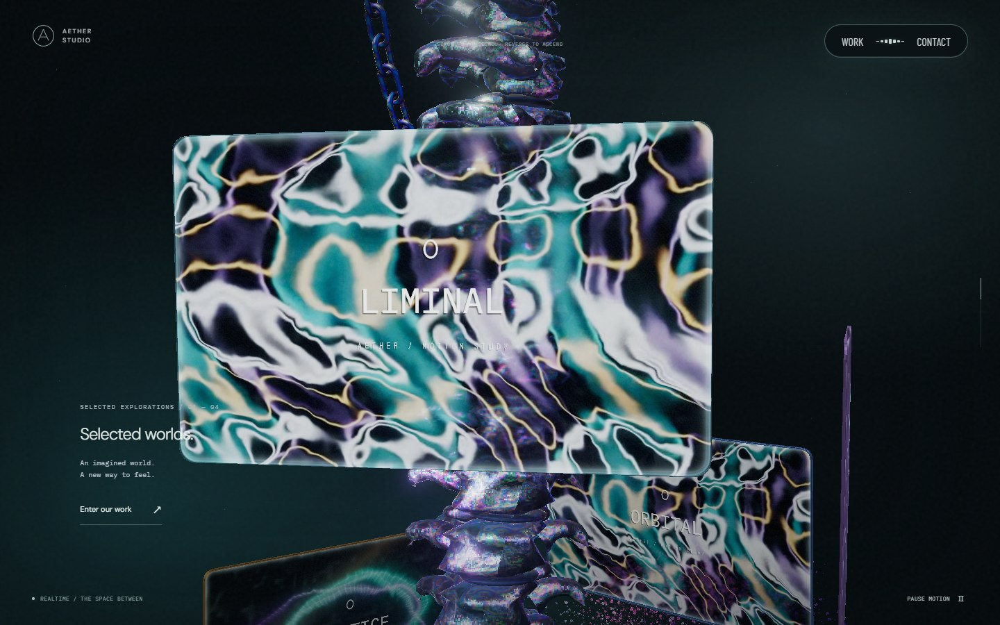
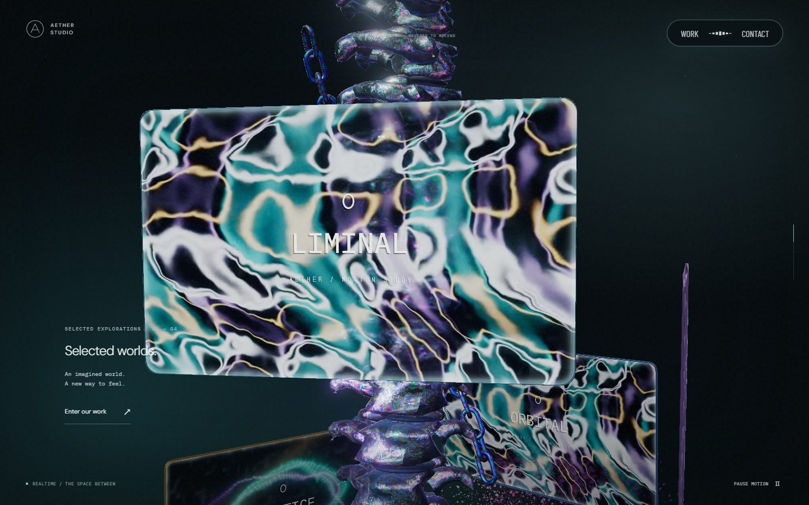
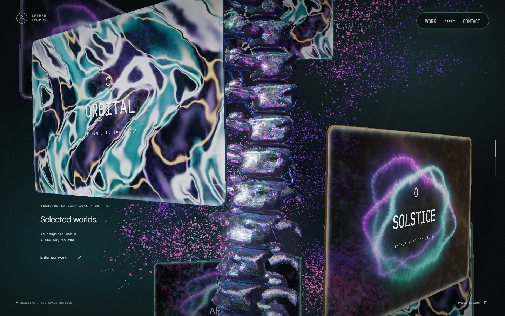
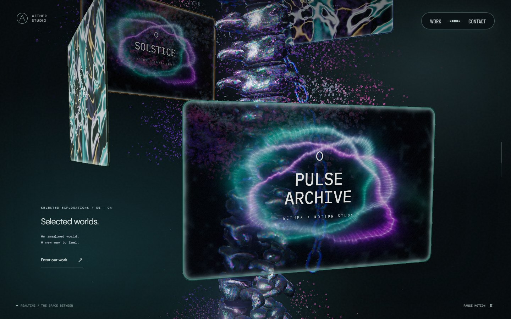
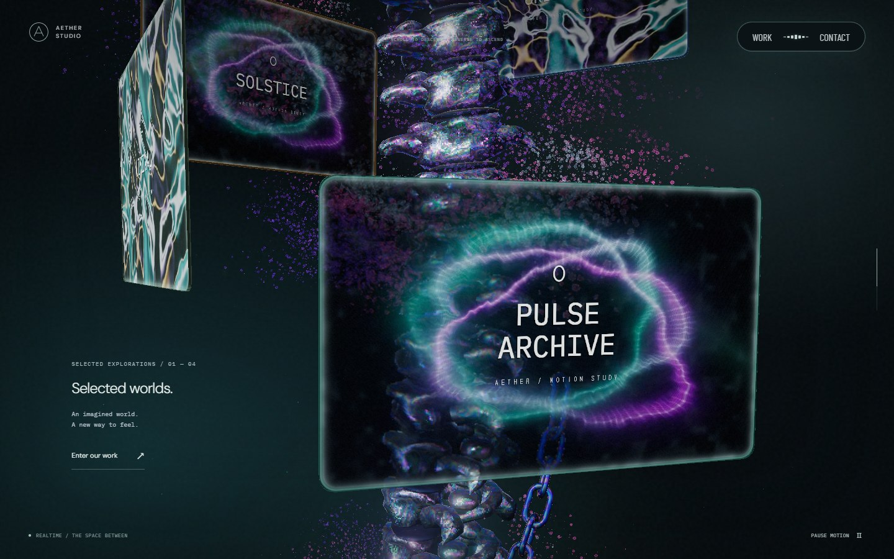

# 체인 단계별 길이 · 2026-09-24

이 문서는 PR #38 당시 기록이다. 이후 사선 이동량과 링크 수 보정은 [체인 사선 이동](chain-diagonal-travel.md)에 기록한다.

이전 체인은 아래쪽 끝에서 위로 이어졌다. 스크롤 속도를 높여도 화면 위에서 시작하는 긴 체인이 남았다. 이번에는 위쪽 끝부터 아래로 이어지는 유한한 체인으로 바꿨다. 스크롤을 내리면 위쪽 끝이 내려와 화면 하단에 남는 길이가 줄고, 올리면 같은 경로로 복원된다.

## 길이와 이동

42개였던 링크를 PC 22개, 모바일 30개로 줄였다. 모바일은 카메라가 더 멀리 있어 같은 화면 비율을 맞추려면 더 긴 체인이 필요하다. 링크 크기·간격·재질과 약 63°의 나선 경사는 유지한다.

위쪽 끝의 고리가 초입·중간에서 옆면으로만 보이지 않도록 링크 축을 기준으로 고정된 45° 회전을 적용했다. 인접 링크의 90° 교차 배치는 유지한다.

PC 위쪽 끝의 로컬 높이는 4.4에서 -1.85로 내려온다. 총 이동량은 6.25이고, 초반에 빠르게 내려온 뒤 마지막 구간에서 완만해진다. 두 이동 곡선을 겹쳐 중간 지점에서 정지하지 않게 했다. 모바일의 높이 이동은 1.4배다. 컬럼 로컬 좌표에 고정된 경로와 공동 회전은 유지하며 카메라 쪽으로 체인을 돌리는 보정은 없다.

화면 높이 대비 체인의 투영 범위를 실제 링크 bounding box로 측정했다. 중간 이후에는 아래쪽 링크가 화면 밖으로 내려간다. 링크를 축소·삭제하거나 재등장시키는 처리는 없다.

| 단계 · 전체 페이지 스크롤 | PC 1440×900 | 모바일 390×844 | 끝 링크 위치 |
| --- | ---: | ---: | --- |
| 등장 완료 · 31% | 약 92% | 약 93% | 위쪽 끝과 아래쪽 끝 모두 화면 안 |
| 중간 · 46% | 약 54% | 약 53% | 위쪽 끝이 화면 중앙 근처 |
| 마지막 경계 직전 · 61% | 약 34% | 약 33% | 위쪽 끝이 화면 하단 1/3 시작점 근처 |

위 수치는 다른 물체의 가림을 제외한 투영 범위다. 본 컬럼·모니터와 겹치는 부분은 기존 깊이 판정대로 가려진다.

## 시각적 변경

기준 `8f3a01f`, PC 1440×900, DPR 1에서 같은 카메라·포인터 위치와 애니메이션 시각을 사용했다. 사용자가 제공한 AT 캡처는 끝의 방향과 단계별 길이를 참고하는 데 사용했으며 저장소에는 본 사이트의 실제 실행 화면만 포함했다.

| 대상 | 변경 전 | 변경 후 | 판단 포인트 |
| --- | --- | --- | --- |
| 초입 · 31% |  |  | 유한한 체인의 두 끝과 전체 높이 |
| 중간 · 46% |  |  | 위쪽 끝에서 아래로 이어지는 체인 |
| 마지막 · 61% |  |  | 하단에 남는 길이와 모니터 뒤 가림 |

[모바일 초입](screenshots/chain-stages/mobile/stage-31.jpg) · [모바일 중간](screenshots/chain-stages/mobile/stage-46.jpg) · [모바일 마지막](screenshots/chain-stages/mobile/stage-61.jpg)

## 검증

초입의 전체 링크가 화면 안에 있는지, 중간에는 하단 절반, 마지막에는 하단 약 1/3이 투영되는지 검사한다. 위쪽 끝이 각 단계에서 체인의 가장 높은 점인지도 확인한다. 30~65%의 351개 위치에서 끝 링크 전체의 화면 범위, 공동 회전, 링크 간격, 연속 이동과 역스크롤 복원을 검사한다.

PC·모바일 실제 브라우저에서 31→46→61→46% 왕복을 캡처했으며 콘솔·페이지 오류는 없었다. iOS Safari 실기기 검증은 포함하지 않는다.

창 너비가 768px 경계를 넘을 때 카메라와 체인에 같은 현재 화면 모드를 전달한다. 최대 링크 공간을 미리 확보하고 활성 링크 수와 경로만 갱신한다. 스크롤이 멈춘 상태의 PC→모바일→PC, 모바일→PC→모바일 전환이 각 모드에서 새로 생성한 체인과 같은 행렬을 만드는지 검사한다.
