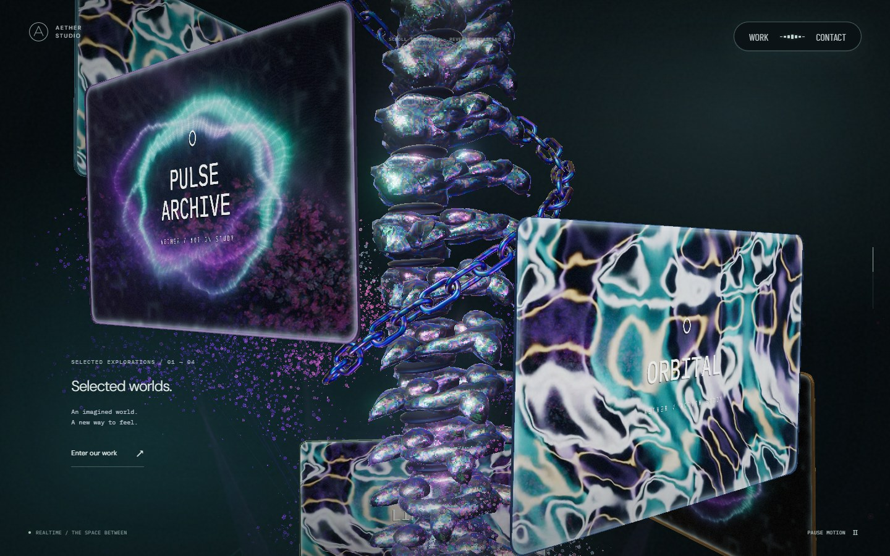
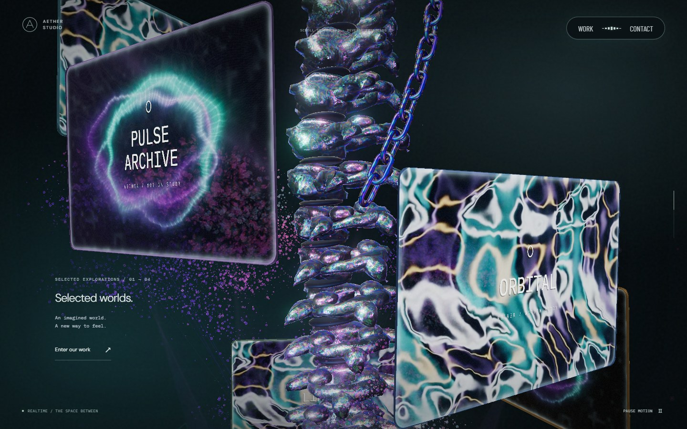
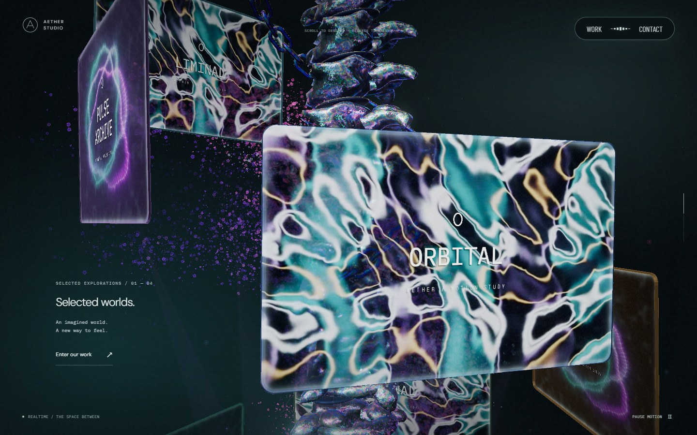
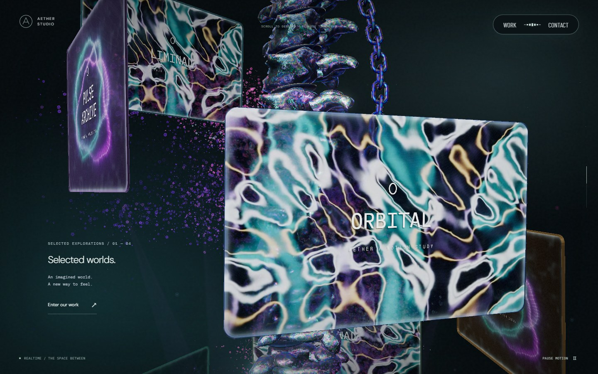
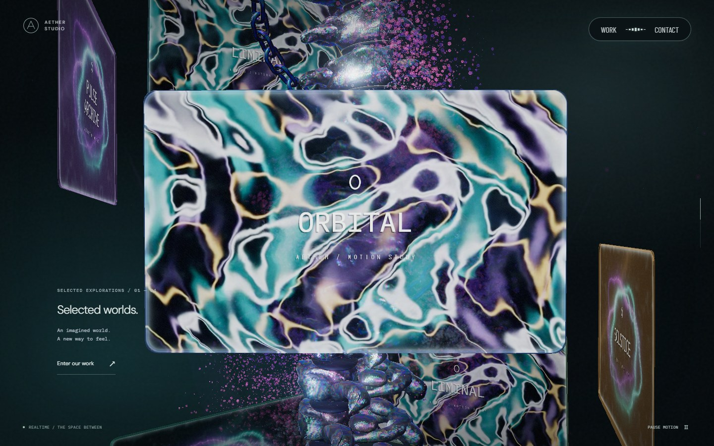
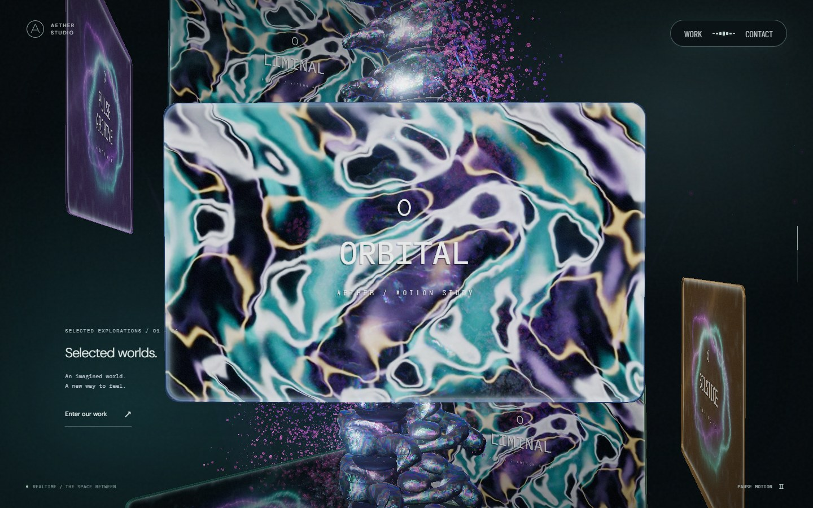

# 체인 경사·속도 조정 · 2026-09-24

이 문서는 PR #37 당시의 기록이다. 이후 위쪽 끝과 단계별 노출 길이는 [체인 단계별 길이](chain-stage-visibility.md)에서 변경했다.

체인이 본 컬럼을 더 가파르게 감으며 내려오도록 경사와 스크롤 이동량을 조정했다. 사용자가 제공한 Active Theory의 연속 캡처를 참고했다. 이 기록의 이미지는 Aether Studio의 실제 실행 화면이다.

## 변경

나선의 높이당 회전각을 0.85rad에서 0.28rad로 줄였다. 반지름 1.85에서 수평면 기준 경사는 약 32.5°에서 62.6°로 바뀐다. 화면에 보이는 각도는 본 컬럼의 회전과 원근에 따라 달라진다.

스크롤 27~65%의 로컬 하강량을 1.65에서 4.4로 늘렸다. 같은 스크롤 변화에 대한 수직 이동량은 약 2.67배다. 끝 링크가 화면 안에서 이동하도록 시작 높이도 -0.9에서 1.65로 올렸다. 마지막 높이는 -2.75다.

링크는 컬럼 로컬 좌표에 고정된 나선을 따라 진행하고 공통 부모가 컬럼과 체인을 함께 회전시킨다. 42개 링크의 모양·재질·간격과 역스크롤 복원은 유지한다. 끝 링크는 재활용하거나 축소하지 않는다.

## 시각적 변경

기준 코드는 `fe77bbb`다. 전후 모두 PC 1440×900, DPR 1, 같은 카메라·포인터 위치에서 캡처했다. 애니메이션 시각을 같은 순서로 진행시켰다. 40%에서 시작해 `deltaY=120px`인 휠 입력을 두 번씩 적용했다. 이는 비교를 위한 브라우저 입력값이며 사용자의 마우스 설정을 측정한 값은 아니다.

| 대상 | 변경 전 | 변경 후 | 판단 포인트 |
| --- | --- | --- | --- |
| 입력 전 · 40% |  |  | 체인의 가파른 경사와 끝 링크 |
| 휠 2회 · 41.57% |  |  | 공동 회전과 모니터 뒤 가림 |
| 휠 4회 · 43.14% |  |  | 연속 진행과 컬럼·모니터에 의한 가림 |

끝 링크의 로컬 높이는 위 세 위치에서 다음과 같다. 화면상의 이동 속도에는 공동 회전과 원근도 영향을 준다.

| 진행률 | 변경 전 | 변경 후 |
| --- | ---: | ---: |
| 40.00% | -1.347 | 0.457 |
| 41.57% | -1.442 | 0.206 |
| 43.14% | -1.540 | -0.057 |

## 검증과 범위

나선 경사, 같은 입력의 하강량, 뒤 링크가 앞 링크의 이전 위치·방향을 통과하는지 검사한다. PC·모바일에서 30~65%의 351개 위치를 검사해 끝 링크 전체가 화면 범위 안에 들어오는지도 확인한다. 네 방향을 감싸는 경로, 링크 간격, 정지와 역스크롤 복원 검사는 유지한다.

[모바일 40%](screenshots/chain-steep/mobile/scroll-40.jpg) · [모바일 60%](screenshots/chain-steep/mobile/scroll-60.jpg)

실제 브라우저의 PC·모바일 정방향·역방향 캡처에서 콘솔·페이지 오류가 없었다. 다른 오브젝트 뒤에서는 깊이 판정에 따라 체인이 가려진다. 화면 범위 검사가 모든 각도에서 끝 링크가 가림 없이 보인다는 뜻은 아니다. 실제 iOS Safari 기기의 검증은 포함하지 않는다.
