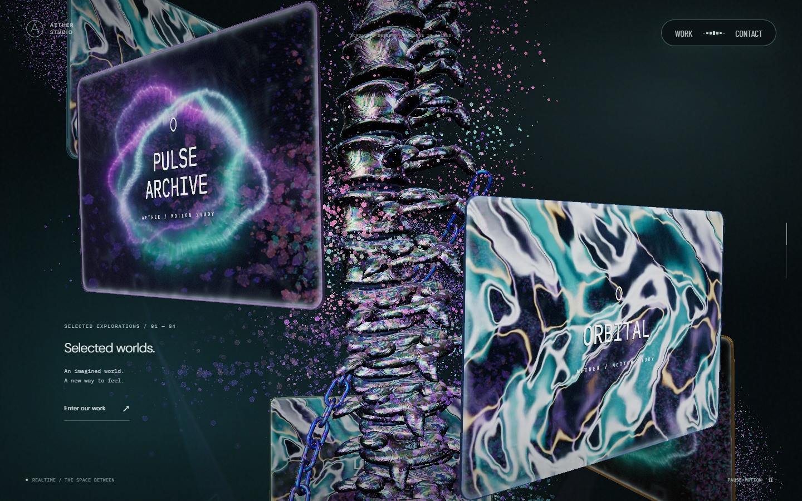
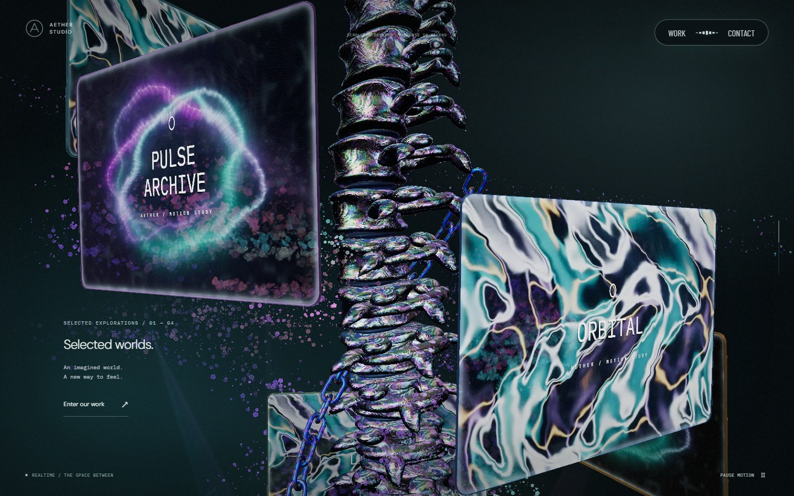
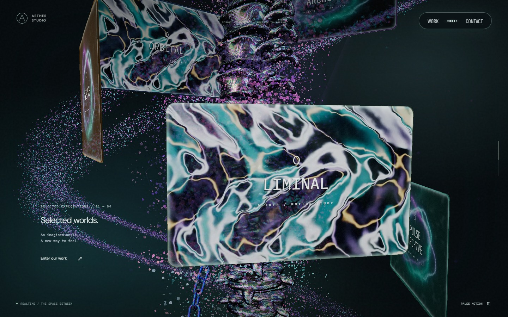
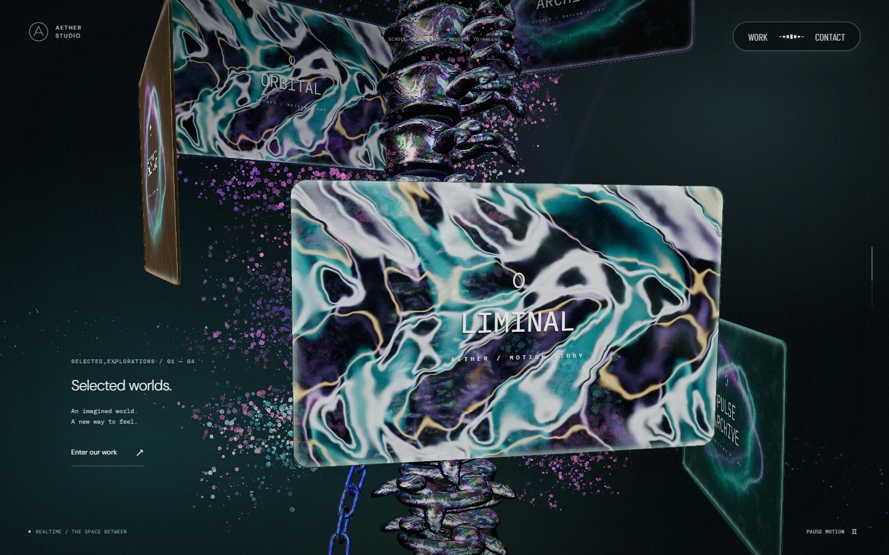
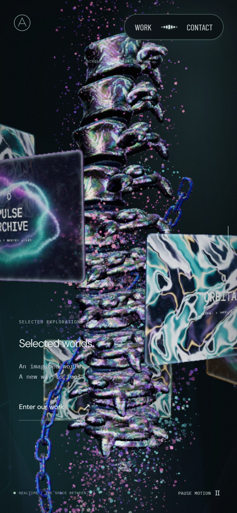

# 본 컬럼 원경 입자와 꽃 회전

꽃 입자 수와 원경 나선의 감김 간격은 이후 [꽃 밀도·원경 띠 교정](haze-reactor-flower-correction.md)에서 조정했다. 아래 수치와 캡처는 당시 결과다.

컬럼에 가까운 두 갈래 띠를 카메라 바깥의 큰 나선으로 옮겼다. 꽃 군집은 기존 입자와 형태를 유지하며, 스크롤을 멈추면 회전도 멈춘다. 컬럼 바로 옆의 하강 입자와 보케, 선형 필라멘트는 본 컬럼 구간에서 숨긴다.

기준은 `411bcf2`(PR #45 병합본)다. 2026-09-25 [Active Theory](https://activetheory.net/)의 본 컬럼 초반·중간·후반을 직접 스크롤하며 확인했다. 중간 구간에서는 5초 동안 정지한 화면도 비교했다. 가까운 꽃 군집과 어두운 배경을 가로지르는 성긴 입자 띠를 구분해 관찰했다. 공개 셰이더는 원경 입자 분리 방식을 읽는 데만 사용했으며, 코드·모델·영상·참고 캡처를 저장소나 배포에 복사하지 않았다.

## 변경점

| 대상 | 현재 동작 |
| --- | --- |
| 원경 나선 | 두 갈래를 하나의 넓은 띠로 바꾸고, 반경을 약 24~27 월드 단위로 키웠다. 컬럼과 카메라 바깥을 감싸며 보이는 뒤쪽 호가 배경을 가로지른다. 모바일에서도 궤도 반경을 줄이지 않는다. |
| 원경 입자 수 | 기존 나선 후보 중 약 8%만 고정된 시드로 표시한다. 시간에 따라 입자를 무작위로 켜고 끄지 않는다. 꽃의 시드·수·접힌 형태는 유지한다. |
| 회전 | 나선은 초당 0.016rad와 컬럼 스크롤 회전량의 0.32배를 받는다. 꽃은 컬럼의 스크롤 회전만 따른다. 빛과 색의 변화는 유지한다. |
| 가까운 비꽃 입자 | 하강 입자·보케·필라멘트의 본 컬럼 가중치만 숨긴다. 같은 버퍼를 쓰는 포레스트·리액터와 리액터로 내려가는 전환은 유지한다. |

## 시각적 변경

실제 실행 화면이다. 전후 모두 PC 1440×900, 모바일 Chromium의 iPhone 13 설정 390×844·DPR 2를 사용했다. 스크롤·카메라·시간 10초·영상 프레임 6초를 맞췄다. 꽃의 시간 회전을 제거했기 때문에 같은 10초에서도 꽃의 방향은 달라진다.

| 대상 | 변경 전 | 변경 후 | 판단 포인트 |
| --- | --- | --- | --- |
| PC · 스크롤 0.40 |  |  | 컬럼 주변의 작은 입자 제거, 오른쪽 배경의 먼 띠 |
| PC · 스크롤 0.55 |  |  | 가까운 꽃은 유지하고 왼쪽 빈 공간에 원경 띠 표시 |
| 모바일 · 스크롤 0.40 |  |  | 좁은 화면에서도 컬럼에 밀착한 나선이 생기지 않음 |

## 검증 방법과 한계

`tests/particle-rotation.spec.ts`는 실제 프로덕션 vertex shader의 좌표와 불투명도를 GPU 픽셀로 읽는다. PC·모바일의 여러 스크롤 위치에서 꽃의 정지·정방향·역방향, 나선의 시간 회전·큰 반경, 가까운 비꽃 입자의 비표시, 포레스트·리액터 입자의 표시를 확인한다. 꽃이 아닌 나선 후보만 밀도 마스크로 제거되는지도 검사한다. 장면 경계 검사는 숨겨진 입자를 흰색으로 되살리지 않도록 실제 표시 마스크를 유지한다.

린트·타입 검사·프로덕션 빌드를 통과했다. Windows Chromium/D3D11에서 입력·장면 경계·입자 회귀 검사 21개, Windows Playwright WebKit의 iPhone 13 설정에서 입자 검사 1개가 통과했다. 빌드의 Scene 번들은 `Scene-Du0d0Gol.js`, SHA-256은 `6cdabd837dd35b38a90942c741e2b068b692b47dd73cb6bac7a19290f442fac2`다.

브라우저 비교는 PC Chromium과 모바일 에뮬레이션 기준이다. 실제 iPhone Safari의 화면·성능을 검증한 결과는 아니다. AT와의 픽셀 단위 동일성이나 재현율 수치를 주장하지 않는다.
