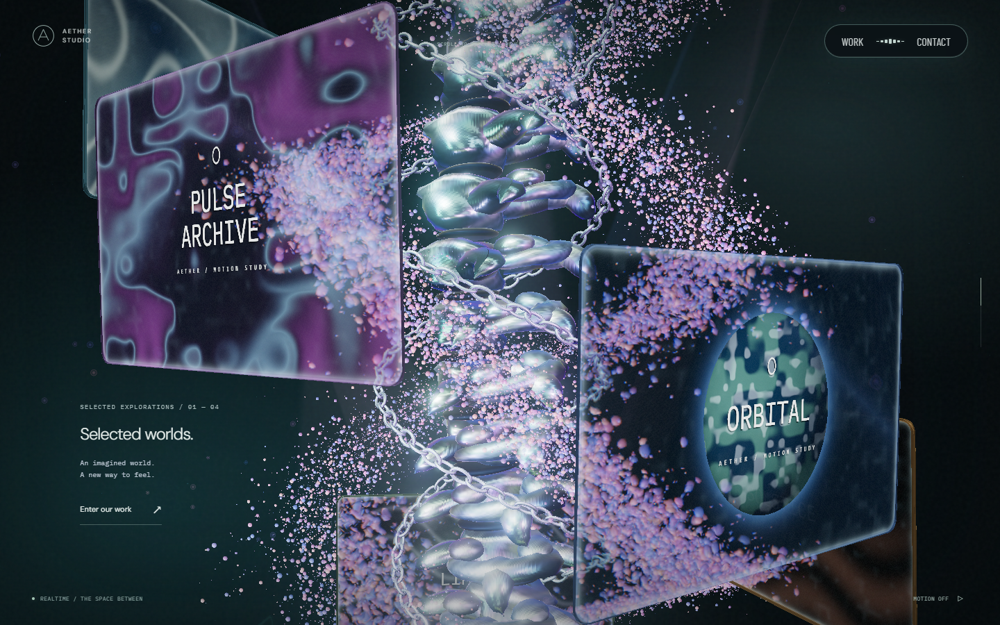
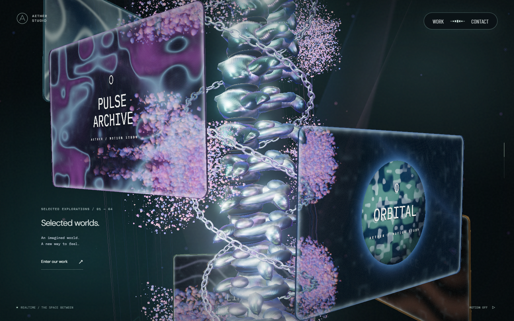
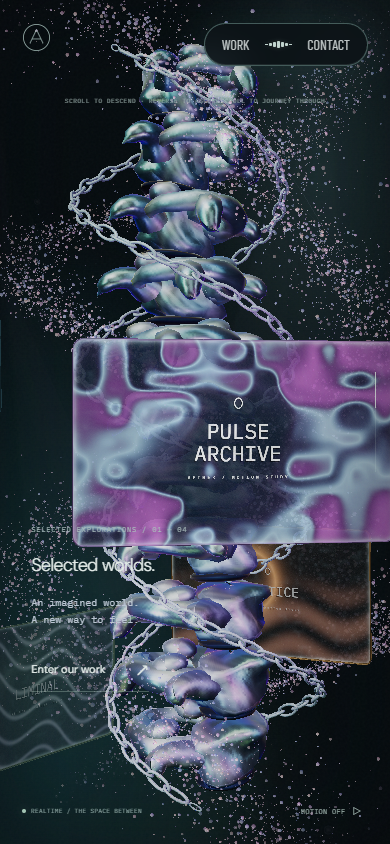
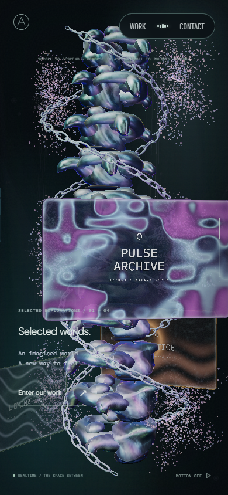
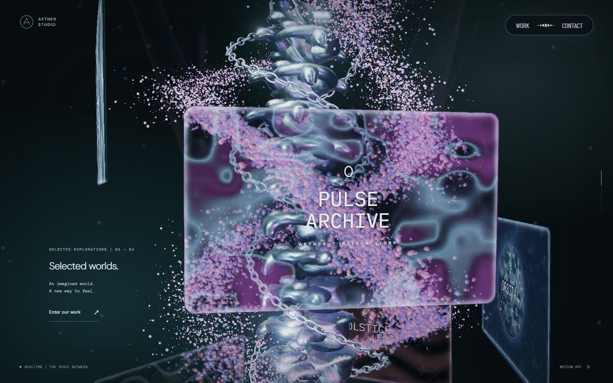
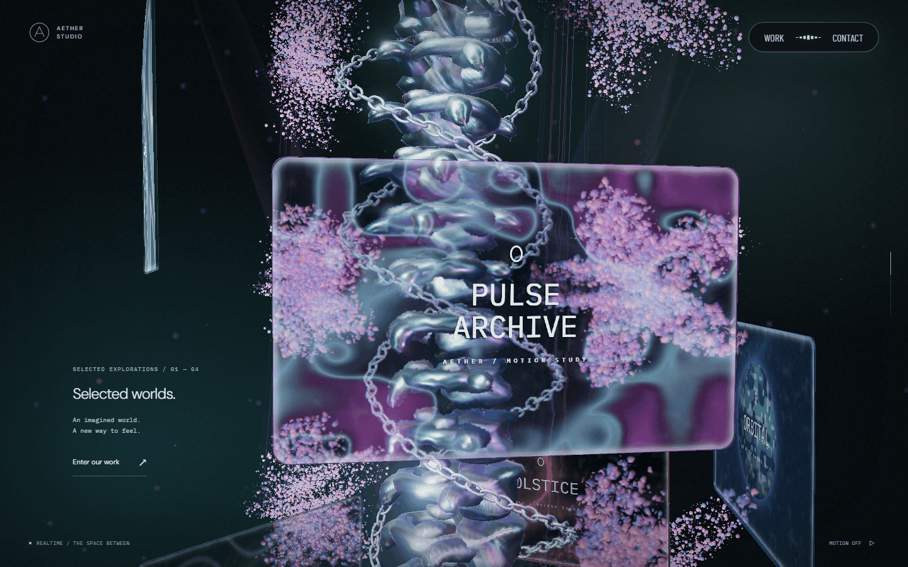
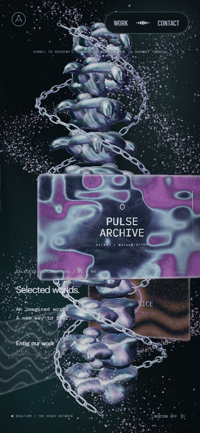
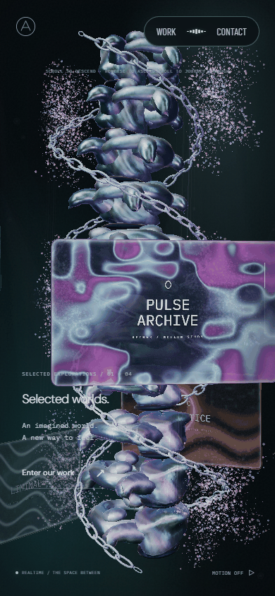

# 본 컬럼 꽃 형상과 회전 · 2026-09-23

본 컬럼 양쪽의 나선형 입자 무리를 꽃잎이 모인 군집으로 바꿨다. 개별 입자는 기존의 둥근 점으로 유지한다. 본 컬럼과 입자에 같은 `Journey.structureYaw`를 전달하고 Three.js Y축 회전식을 사용한다. 이전 입자 회전은 반대 부호의 선형 각도였으므로 방향뿐 아니라 상대 속도도 달랐다.

## 관찰과 선택

[Active Theory](https://activetheory.net/)를 Chromium 1440×900에서 직접 열어 본 컬럼 구간을 관찰했다. 일반 페이지 스크롤은 해당 장면을 이동시키지 않아 휠 입력을 사용했다. 본 컬럼에 도착한 뒤 `+180, +180, -180, -180` 휠 입력과 각 1.6초의 정착 시간을 사용하고, 오른쪽 군집으로 포인터를 옮겼다. 입자는 둥근 알갱이이며 여러 갈래의 조밀한 무리가 양쪽에 배치돼 있다. 모니터 뒤의 무리가 반투명 표면을 통해 보인다. 역스크롤에서 본 컬럼과 모니터의 배치가 돌아오지만 영상과 조명은 계속 변한다. 포인터 주변의 밝기 변화는 보였으나 변위와 조명 효과를 정량적으로 분리하지 못했다.

꽃으로 읽히는 갈래, 밀집도와 깊이를 참고했다. 꽃잎 수·회전 속도·반경을 AT에서 측정한 것은 아니다. 원본 코드·모델·영상·로고·캡처를 앱이나 공개 근거에 복제하지 않았다. AT 관찰 캡처는 로컬 `.qa/at-0.png`부터 `at-4.png`, `at-pointer.png`에만 둔다.

자체 형상은 양쪽에 3개씩 배치한 5갈래 로제트다. 중심 x는 ±3.05, 높이는 -4/0/4이며 꽃잎 반경은 `(0.16 + sqrt(branch) × 1.35) × (0.64 + 0.36 cos(5θ))`다. 깊이와 기울기를 더해 평면 아이콘처럼 보이지 않게 했다. 꽃잎을 덮던 산포 폭은 본 컬럼 구간에서 18%로 줄였다. 모바일의 x/z 폭은 62%로 줄여 양쪽 군집을 화면 안에 더 남긴다. 개별 이동 입자가 군집 경계를 넘을 때는 투명하게 사라졌다 나타난다.

회전은 본 컬럼과 동일한 절대 각도 `4π × smooth(.235, .665, progress)`를 사용한다. 시간이나 속도를 누적하지 않는다. 고정 입자 80%가 형상을 만들고 기존 이동 입자·포인터 반응은 유지한다. 상대 각속도 1:1은 과한 차이를 피하기 위한 선택이며 AT의 측정값이 아니다. 정지·역스크롤에서 같은 형상을 재현한다.

## 실제 전후 화면

기준 커밋은 `bbd7946`이다. 독립 `npm ci`로 설치한 Vite 서버, Chromium, DPR 1, PC 1440×900·모바일 390×844, 모션 축소, 같은 카메라·스크롤·포인터 이탈 상태에서 촬영했다. `document.fonts`의 Barlow Condensed·DM Sans·IBM Plex Mono loaded와 폰트 HTTP 실패 없음도 양쪽에서 확인했다. 모바일은 뷰포트 검증이며 실기기 측정이 아니다.

| 대상 | 변경 전 | 변경 후 | 판단 포인트 |
| --- | --- | --- | --- |
| PC progress .40 |  |  | 꽃잎 군집, 모니터 제목·영상 가독성 |
| 모바일 progress .36 |  |  | 양쪽 배치·화면 경계 |
| PC 정·역스크롤 |  |  | 본 컬럼과 군집의 같은 회전·복원 |
| 모바일 정·역스크롤 |  |  | 좁은 화면의 상대 이동·복원 |

GIF는 `.36 → .38 → .40 → .42 → .40 → .38 → .36`의 실제 정착 화면을 650ms 간격으로 연결했다. 실시간 프레임률이나 속도 측정 영상은 아니다. 본 컬럼 앞쪽 형상이 왼쪽으로 돌아가는 동안 꽃 무리도 같은 방향으로 이동한다. 반시계 방향이라는 요구는 이 기존 본 컬럼의 Y축 회전에 맞췄으며 화면 평면을 중심으로 도는 Z축 회전을 추가하지 않았다. 투명 모니터 가장자리에 일부 입자가 겹치지만 제목과 영상 중심은 읽힌다. 옆면이 보이는 각도에는 꽃 실루엣이 좁아지고, 모든 순간에 여섯 꽃이 모두 드러나는 구성은 아니다.

## 검증과 한계

GPU에서 실제 입자 vertex shader를 실행한 좌표와 실제 `SceneWorlds` 본 컬럼 행렬을 대조한다. PC·모바일 설정의 progress .30/.36/.40/.49/.55/.58에서 +.015 이동, 이동 입자와 고정 입자의 같은 경로, 역스크롤 복원을 검사한다. 허용 오차 .005 월드 단위는 GPU 삼각함수 차이를 허용하며 이전 반대 회전과 속도 차이는 거부한다. 기존처럼 입자끼리의 부호만 비교하지 않는다.

초기 로딩 이벤트·숨은 씬 셰이더 준비·후속 영상 지연 로딩 코드는 수정하지 않았다. 자원과 draw call도 추가하지 않았다. 리액터 입자 동선, 챔버, 모니터 기능, 스케일 파동과 포레스트 개선은 후속 단계다. 실제 Safari/Android 기기, AT 각속도의 정밀 측정과 모든 각도의 무가림은 검증 범위에 포함하지 않는다.

로컬 lint·typecheck·production build를 통과했다. 관련 테스트 42건 중 첫 실행 40건이 통과했고, 2건은 동시 테스트의 trace 폴더 충돌로 실패했다. 두 검사를 단독 재실행해 모두 통과했다. 앱 assertion 실패는 없었다. 최종 CI·자동 리뷰 결과는 PR 기록을 기준으로 한다.

모션을 켜고 같은 .40 위치에서 포인터를 움직였을 때 PC 입력 강도 .5885, 모바일 뷰포트 .8050을 확인했다. 3초 정지 후 각각 .0226/.0271로 감소했고 카메라 잠금과 모니터 가독성을 유지했다. 실제 터치·실기기 검증을 뜻하지 않는다. PNG 전체 bytes는 왕복에서 항상 일치하지 않았으므로 이미지 동일성을 주장하지 않으며, 좌표 복원은 GPU 검사로 확인했다.
