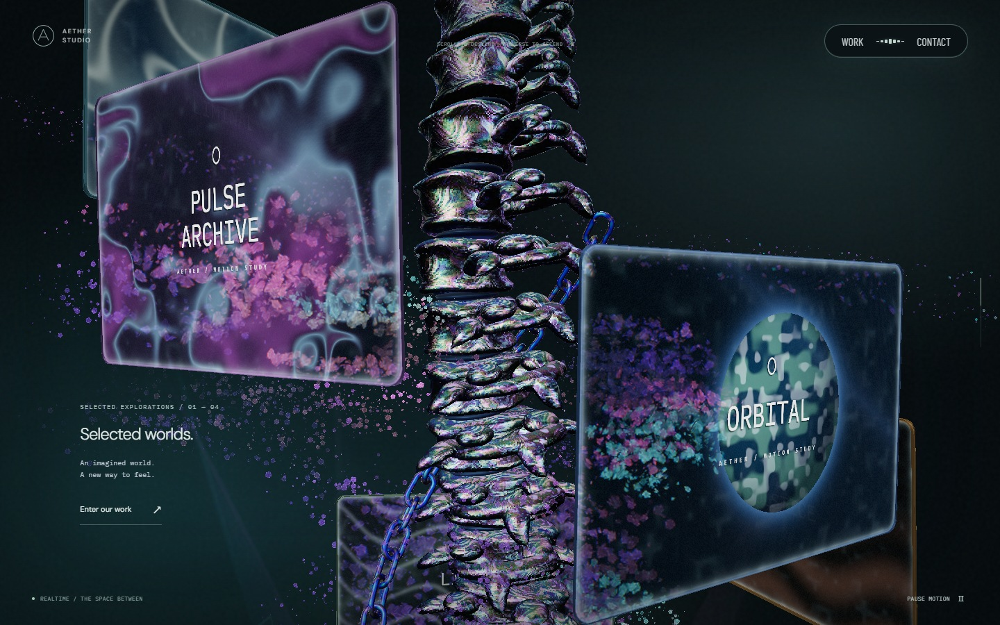
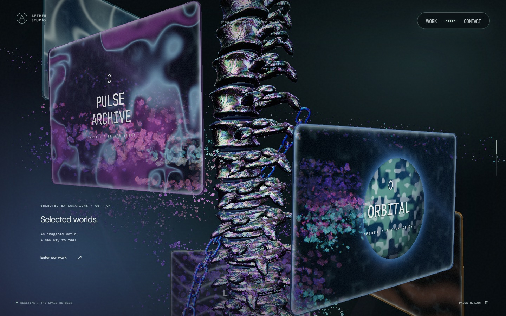
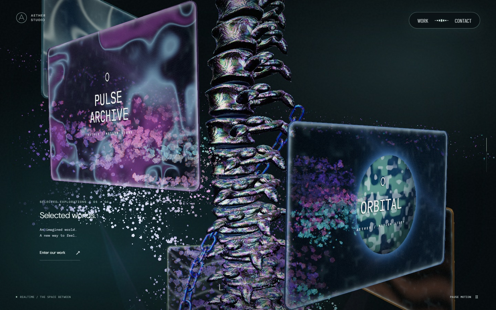
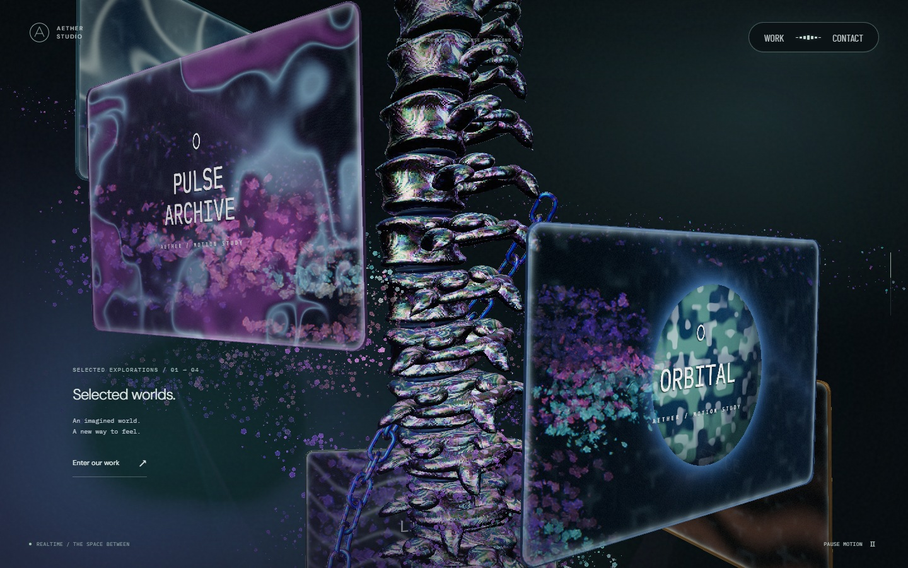
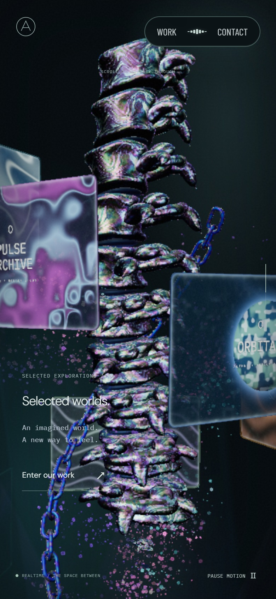
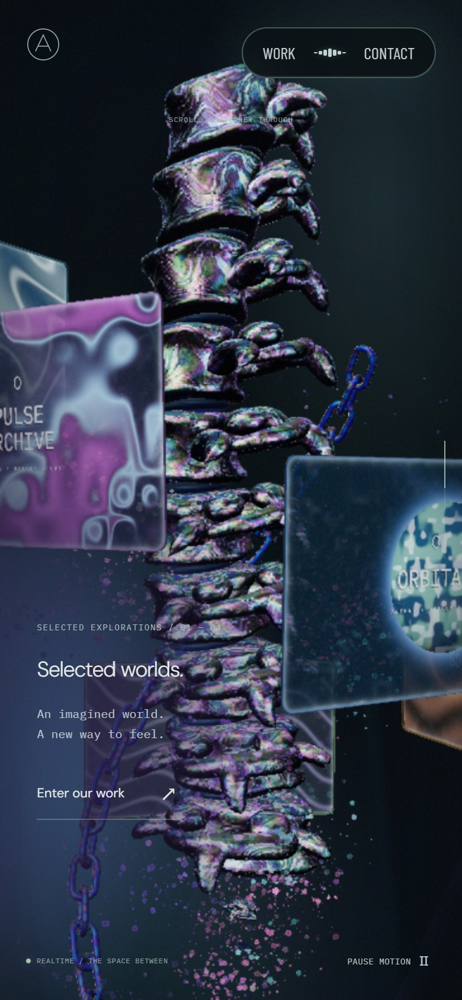
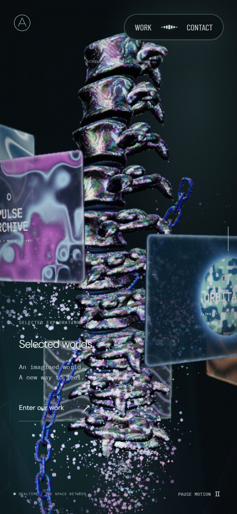
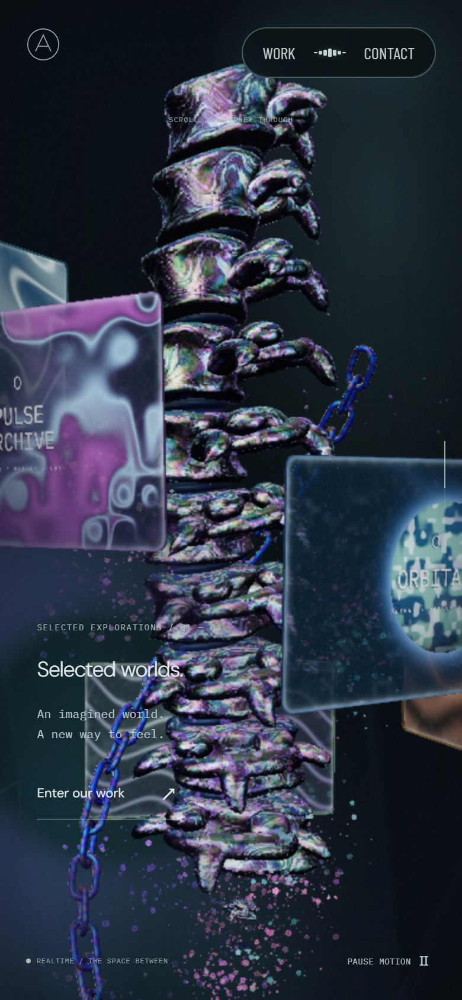

# 본 컬럼 화면 안개

본 컬럼의 왼쪽 UI 뒤에 얕은 보라색 안개가 깔리고, 포인터가 지나간 자리는 안개가 걷히며 원래 배경과 꽃의 색이 드러난다. 입력이 멈추면 흐름이 감쇠하며 안개가 다시 채워진다.

기준은 `0ec0808`(PR #46 병합본)이다. 2026-09-25 [Active Theory](https://activetheory.net/)의 PC·모바일 전체 화면에서 본 컬럼 진입·중간·퇴장과 포인터 반응을 확인했다. 잘린 참고 캡처의 좌표나 높이 비율을 배치 기준으로 쓰지 않았다. 참고 사이트의 공개 합성 경로는 화면 좌표와 유체 마스크의 관계를 분석하는 데 사용했으며, 소스·영상·캡처는 제품이나 저장소에 복사하지 않았다.

## 범위와 입력

안개는 월드 높이 대신 전체 뷰포트의 가로·세로 비율로 계산한다. 가로 화면에서는 좌하단 가장자리에서 부드럽게 퍼지고, 세로 화면에서는 왼쪽 UI 뒤의 더 넓은 세로 범위를 덮는다. 스크롤은 본 컬럼 진입·퇴장의 강도만 바꾸며 안개를 3D 오브젝트와 함께 위아래로 이동시키지 않는다.

기존 속도·밀도 필드로 안개의 경계와 농도를 이동시키고, 지나간 자리는 투명하게 만든다. 배경 샘플 좌표와 DOM 텍스트에는 변위를 넣지 않는다. 다른 모서리의 약한 색감은 별도 마스크로 남기며 포인터가 지나가도 같은 걷힘 구멍을 만들지 않는다.

안개는 블룸·톤 매핑 뒤의 화면에 합성한다. 본 컬럼에서 꽃을 하얗게 밝히던 포인터 가산광도 끄므로 안개가 걷힌 자리에 원래 색이 보인다. 꽃의 형태·배치·스크롤 회전, 포레스트·리액터의 포인터 조명은 유지한다. 새 렌더 패스나 프레임별 텍스처 할당은 추가하지 않았다.

## 시각적 변경

실제 실행 화면이다. PC 1440×900, 모바일 Chromium iPhone 13 설정 390×844·DPR 2에서 전후 스크롤 0.40, 카메라, 시간 10초와 영상 프레임 6초를 맞췄다. 포인터 입력도 같은 경로를 사용했다.

| 대상 | 변경 전 | 변경 후 | 판단 포인트 |
| --- | --- | --- | --- |
| PC 정지 |  |  | 전체 화면 비율로 퍼지는 좌하단 안개 |
| PC 입력 |  |  | 원래 색이 드러나는 경로, 텍스트·3D 윤곽 유지 |
| 모바일 정지 |  |  | 세로 화면에 맞춘 안개의 범위 |
| 모바일 입력 |  |  | 왼쪽 UI 주변 안개 걷힘 |

## 검증과 한계

실제 합성 셰이더를 검은색·회색·격자 배경에 렌더해 같은 위치의 색 혼합만 일어나는지 검사한다. 픽셀 오차는 채널당 2 이내이며, 포인터 뒤의 원본 대비 색 차이가 줄고 입력 종료 후 같은 화면으로 복구된다. 본 컬럼의 두 스크롤 위치에서 안개 위치가 같고, 오른쪽 입력에는 모서리 색감이 변하지 않는지도 확인한다. 별도 입자 렌더에서는 입력 전후 꽃 색의 픽셀 차이가 0이다.

린트·타입 검사·프로덕션 빌드를 통과했다. Windows Chromium/D3D11의 입력·입자·화면 합성 검사 22개와 Windows Playwright WebKit의 모바일 화면 합성 검사 1개가 통과했다. 두 포레스트·문구 판·링의 기존 입력 경계도 검사한다.

브라우저 캡처는 PC와 모바일 에뮬레이션 결과다. 실제 iPhone Safari의 화면·성능, AT와의 픽셀 단위 동일성을 검증한 결과는 아니다.
