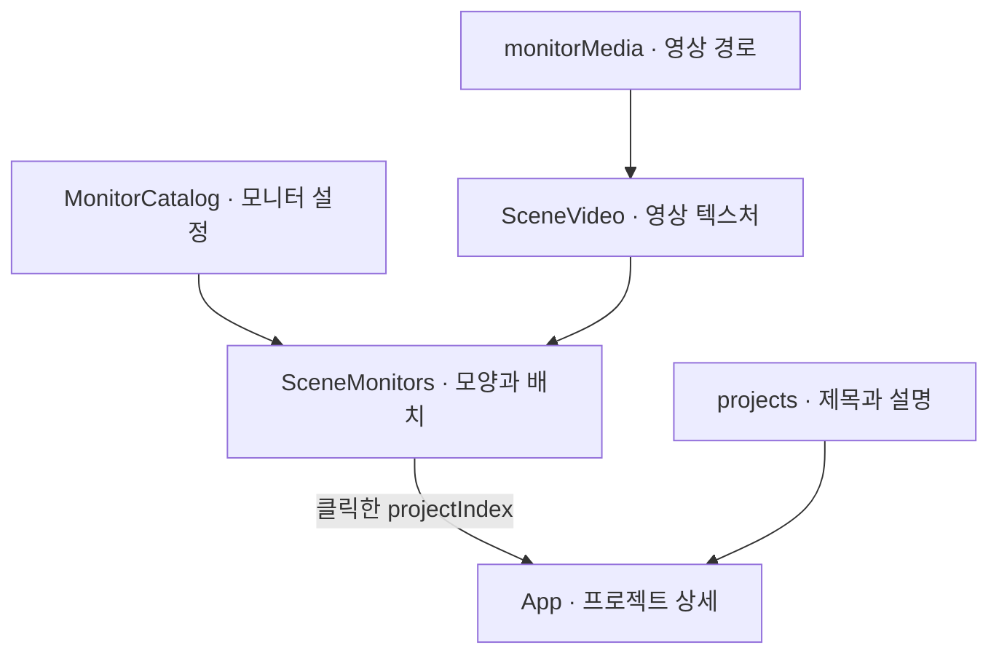

# 개발과 배포

[문서 홈](README.md) · [구조](architecture.md) · [증상별 진단](troubleshooting/current-guide.md)

처음 수정한다면 프로젝트 문구나 모니터 설정부터 바꿔 보자. 장면 배치를 바꾸기 전에 현재 화면을 한 번 왕복하고, 같은 구간으로 돌아오는 동작을 확인한다.

## 실행 환경

저장소 루트에서 실행한다. Node.js 22.13 이상과 npm이 필요하며 CI는 Node.js 24를 사용한다. 서버·DB·환경변수는 필요하지 않다.

```sh
npm ci
npm run dev
```

개발 서버의 기본 주소는 `http://127.0.0.1:5173`이다. 포트가 사용 중이면 터미널에 표시된 실제 주소를 확인한다.

| 명령 | 하는 일 |
| --- | --- |
| `npm run dev` | 소스 변경을 반영하는 개발 서버 |
| `npm run lint` | ESLint 검사 |
| `npm run typecheck` | TypeScript 프로젝트 검사 |
| `npm run build` | TypeScript 검사와 `dist/` 생성 |
| `npm run preview` | 이미 생성된 `dist/` 확인 |
| `npm test` | Playwright 검사. 처음에는 `npx playwright install chromium` 필요 |

preview는 소스 변경을 자동으로 빌드하지 않는다. 성능이나 배포 결과를 확인할 때는 먼저 다시 빌드한다. [서버 재사용과 GPU 검사 조건](testing.md)

## 첫 수정: 모니터 한 장 바꾸기

모니터는 3D 화면, 연결되는 상세는 React 화면이다. [MonitorCatalog.ts](../src/MonitorCatalog.ts)의 항목이 두 화면을 연결한다.



<sub>개념도 — 모니터에서 상세 화면까지의 연결.</sub>

기존 `liminal` 항목을 다음처럼 바꾸면 폭·높이·곡률을 함께 시험할 수 있다. 새 항목을 중복으로 추가하는 예제가 아니다.

```ts
{
  id: 'liminal',
  title: ['LIMINAL'],
  projectIndex: 0,
  mediaId: 'forest',
  tint: 0x80b9ca,
  model: { width: 6.5, height: 4, curvature: 0.12 },
  focus: [0.5, 0.5],
}
```

`projectIndex`는 `projects` 배열의 위치이고 `mediaId`는 `monitorMedia`의 ID다. `focus`는 영상을 화면에 꽉 채울 때 남길 중심점이다. `resolveMonitorModel`이 수치 범위를 제한하지만, 큰 화면이 옆 모니터나 컬럼과 겹치지 않는지까지 대신 확인해 주지는 않는다.

**영상 교체에는 두 군데 확인이 필요하다.** 3D 모니터는 `mediaId`를 읽지만 현재 `ProjectDialog`의 영상은 프로젝트 배열의 짝수·홀수 위치로 선택한다. 모니터 영상만 바꾸면 상세의 영상은 그대로다. 이 연결은 아직 하나의 콘텐츠 설정으로 통합되어 있지 않다.

변경 후 호버 → 클릭 → 상세 → Escape → 원래 위치 복귀를 실행하고, 좁은 화면에서도 닫기 버튼·스크롤·포커스를 확인한다. 관련 검사는 `tests/video.spec.ts`, `tests/project-transition.spec.ts`, `tests/experience.spec.ts`에 있다.

## 변경 위치 지도

| 작업 | 파일 | 함께 확인할 것 |
| --- | --- | --- |
| 프로젝트 내용 | [데이터](../src/projects.ts) | 상세, Work 카드, 모니터 연결 |
| 메뉴·상세 UI | [App](../src/App.tsx) · [CSS](../src/styles.css) | 포커스·작은 높이·모션 축소 |
| 모니터 | [설정](../src/MonitorCatalog.ts) · [형상](../src/MonitorGeometry.ts) | 간격·클릭 판정·영상 크롭 |
| 스크롤 길이 | [거리 변환](../src/ScrollTimeline.ts) | 왕복·본문과 카메라 동기화 |
| 카메라 | [경로](../src/Journey.ts) | 장면 경계·드래그 범위 |
| 문구·물결 | [문구 판](../src/SceneLayers.ts) · [표면 흐름](../src/SceneSurfaceFlow.ts) | Canvas와 접근 가능한 본문 |
| 금속 타일 | [표면](../src/SceneScaleSurface.ts) · [배치](../src/ScaleStage.ts) | 정면 자세·천장·역진입 |
| 링·리본 | [형상·재질](../src/SceneEmblem.ts) | 연결점·굴절·자원 해제 |

그 밖의 장면 모듈은 [구조 문서](architecture.md)에 정리했다. 현재 장면 추가는 설정 한 줄로 끝나지 않는다. 카메라·경계·입력·미디어 수명·해제를 함께 연결해야 한다.

## 자산 관리

| 자산 | 현재 관리 방식 |
| --- | --- |
| 영상·포스터 | `public/media/`의 파일을 그대로 배포. [출처와 재생성](media-sources.md) |
| 조명 영상 | 포레스트와 리액터의 별도 재생 수명. [조명 문서](light-projection-media.md) |
| 본 컬럼 메시 | CC BY 4.0 파생 메시. [원본·변환·고지](../src/assets/README.md) |
| 검색·공유 정보 | `index.html`과 `public/site.webmanifest`. [메타데이터](metadata.md) |
| 아이콘·공유 카드 | 생성 결과를 저장소에 포함. 일반 빌드에서는 재생성하지 않음 |

영상 생성용 Python·ffmpeg, 아이콘 생성용 sharp는 선택 도구다. 일반 앱 실행에는 필요하지 않다. 새 외부 자산을 넣으면 출처·이용 조건과 배포본 고지도 함께 확인한다.

## 수정 확인 순서

1. 변경 전후를 같은 뷰포트·스크롤 위치·입력에서 비교한다. 영상·시간을 고정하지 않았다면 차이가 있을 수 있음을 기록한다.
2. 변경 대상의 검사와 lint·typecheck·build를 실행한다. 공통 경계를 바꾸면 양쪽 장면과 역스크롤까지 확인한다.
3. 정상 흐름 뒤 모션 정지·탭 복귀·영상 실패를 확인한다. [증상별 진단](troubleshooting/current-guide.md)에서 필요한 항목을 고른다.

## 배포

[공개 사이트](https://aether-studio-nu.vercel.app/)는 GitHub와 연결된 Vercel 프로젝트에서 제공한다. production 브랜치는 `main`, 빌드 명령은 `npm run build`, 출력 디렉터리는 `dist`다.

```text
소스 변경 → lint / typecheck / 테스트 → production 빌드
          → PR 검사 확인 → main 반영 → 운영 주소 확인
```

GitHub Actions와 Vercel 배포는 독립 실행이다. Actions 통과가 자동으로 배포를 막거나 허용하는 게이트는 아니다. 배포 후 실제 자산 응답·브라우저 오류·주요 동작을 다시 확인한다.

<details>
<summary>권한이 있는 환경에서의 수동 배포</summary>

```sh
npx vercel link --project aether-studio --scope okorions-projects
npx vercel deploy --prod --scope okorions-projects
```

`.vercel/`, `.env*`, 검수용 `.qa/`는 Git에서 제외한다. 다른 정적 호스팅에서도 `dist/`를 제공할 수 있지만, 도메인을 바꾼다면 canonical·공유 URL·sitemap도 함께 맞춘다.

</details>
