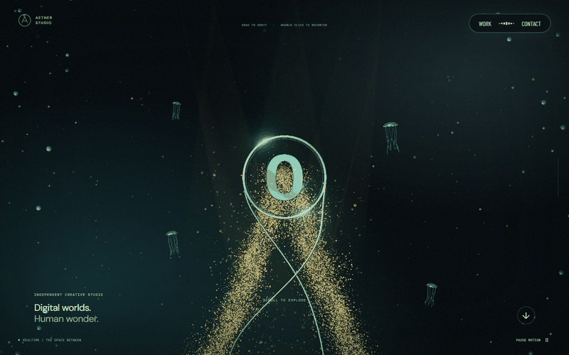
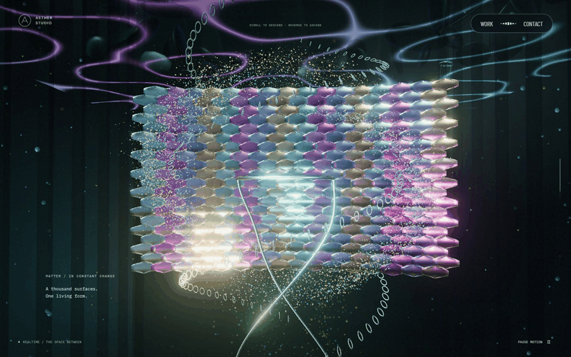
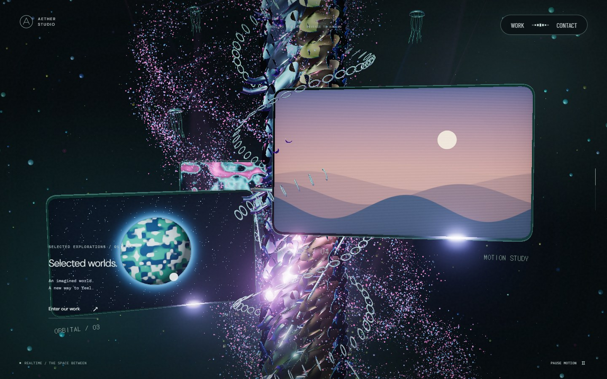
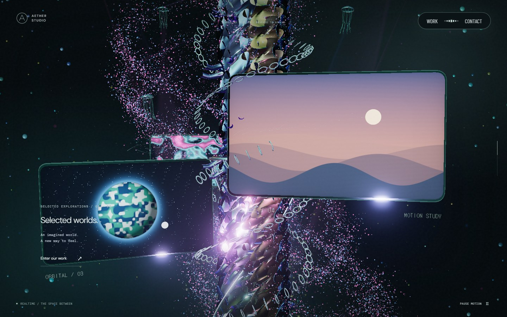
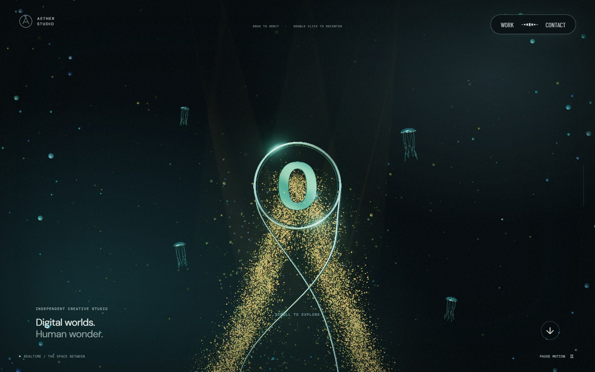
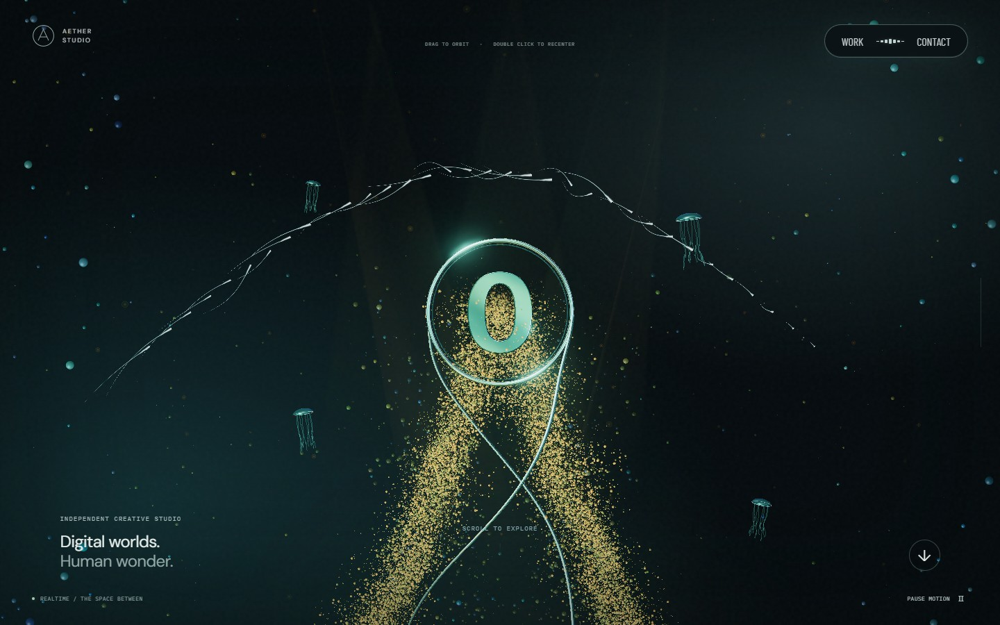
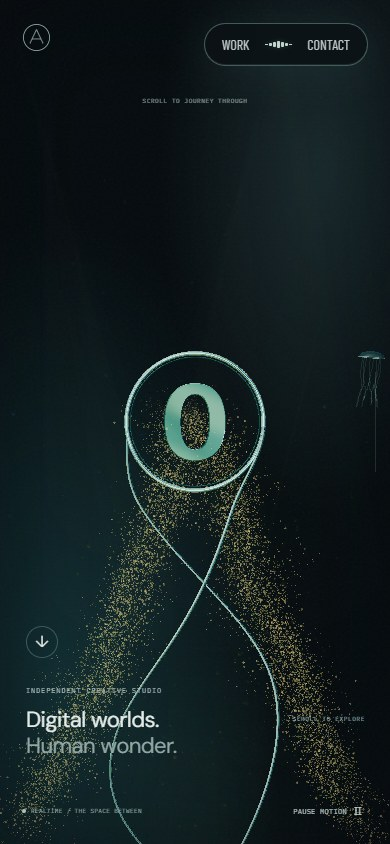
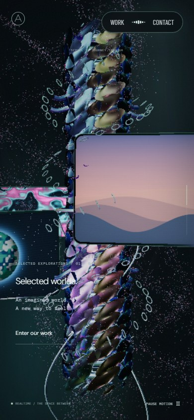
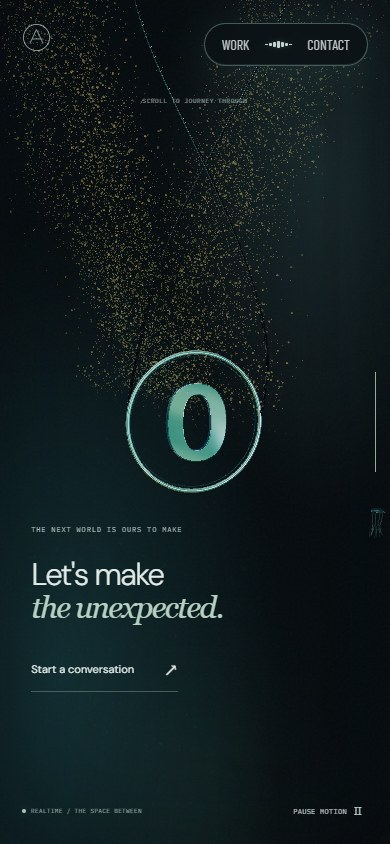

# 실제 스크롤과 마우스 동작 검증 · 2026-09-22

[배포 사이트](https://aether-studio-nu.vercel.app/) · [README](../README.md) · [이전 구현의 24단계 비교](continuous-journey.md)

후속 수정에서 장치·비늘의 퇴장 완료까지 카메라 잠금을 연장했습니다. 최신 입력 경계와 검증은 [지하 구간 카메라 잠금](mechanical-camera.md)을 참고하세요. 아래 성능·22개 테스트 기록은 해당 수정 이전의 스크롤 개선 검증입니다.

척추 모델·사슬·곡면 모니터와 화면 내부 굴절·영상은 이후 개선했습니다. 최신 화면과 검증은 [척추·굴절 모니터](spine-monitors.md)에 있으며, 아래 모니터 화면은 이전 구현 기록입니다.

이번 수정은 정지 화면의 장면 교체보다 실제 스크롤에서 느껴지는 회전·하강·정지·역방향을 기준으로 검수했습니다. 중앙 글리프는 대문자 **O**로 교체했습니다. 모니터 내부 영상은 기존 자체 GPU 영상을 유지하며 추가 고도화는 후속 범위입니다.

## 원본을 어떻게 관찰했나

[Active Theory](https://activetheory.net/)를 Chromium / Windows D3D11, 1440×900에서 실행하고 실제 wheel·마우스 이동·드래그를 입력했습니다. 원본 코드를 분석하거나 모델·텍스처·영상을 복사하지 않았습니다.

원본은 가상 스크롤이므로 누적 wheel 입력은 내부 진행률과 같지 않습니다. 아래는 렌더링을 보고 판단한 동작이며 정확한 내부 구현을 의미하지 않습니다.

| 입력 | 관찰한 동작 | AETHER에 반영한 방식 |
| --- | --- | --- |
| 초반 180px wheel ×18, 이후 역방향 | 링의 정면·옆면·뒷면이 이어지고 주변 해파리·공간이 위로 지나감 | 연속 방위각, 하강하는 카메라·중심, 층별 주변 공간 |
| 척추에서 120px ×8 → 2초 이상 정지 → 역방향 | 척추 돌기·사슬·모니터 모서리는 정착 후 정지. 영상·조명은 계속 변화 | 구조 위상을 스크롤 위치에 연결, 사슬의 시간 기반 이동 제거 |
| 각 구간에서 700px 좌우 드래그 | 초반·큰 로고·끝에서는 회전 유지. 모니터·장치·비늘에서는 큰 궤도 회전이 관찰되지 않음 | 중간 구간 orbit 잠금, 진입·이탈 시 가중치로 연결 |
| 비늘 이후 220px ×18 및 역방향 | 비늘이 화면 위로 이탈하고 링은 아래 공간에 드러남. 로고는 상하 반전되지 않음 | 비늘의 층을 고정하고 그 아래로 카메라 이동, 꼬리 방향과 글리프 회전 분리 |
| 약 1.25초 곡선 마우스 이동 후 정지 | 독립적인 은빛 스트릭의 밝은 머리와 긴 꼬리. 약 2.3초 뒤 대부분 사라짐 | 개별 곡선 스트리머·선두 반사광·2.35초 감쇠 |

## 실제 wheel 연속 화면

아래 GIF는 실제 입력 도중 얻은 연속 JPEG를 일정 간격으로 재생한 요약입니다. 실시간 녹화의 프레임률이나 원본과의 동시 비교 영상은 아닙니다. 로컬 production 빌드, 1440×900, D3D11에서 wheel 100~200px와 약 95ms 간격을 사용했습니다. 전체 흐름 62개 캡처와 오류 없는 완료 결과를 확인했습니다.

| 초반 회전과 큰 O로 접근 | 비늘 위층을 지나 하부 링으로 |
| --- | --- |
|  |  |

비늘을 중앙에서 작게 축소하던 잔여 문제를 검수 중 발견해, 비늘이 위층에 남도록 수정했습니다. 끝부분의 투명한 기둥이 링을 가리던 깊이 기록과 평평한 금색 입자 덩어리도 함께 보정했습니다.

## 정지·역방향·드래그

아래 값은 선언한 키프레임만 읽은 값이 아니라 실제 렌더링의 카메라와 모델 월드 좌표를 진단 속성에서 수집한 결과입니다. 전체 주요 상태는 [motion-evidence.json](screenshots/motion/motion-evidence.json)에 있습니다.

| 실제 입력 상태 | 진행률 | 모델/중심 Y | 카메라 Y | 사슬 위상 | 링 Z 회전 |
| --- | ---: | ---: | ---: | ---: | ---: |
| 진입 | 0 | 0 | 0.3479 | 0 | 0 |
| 척추 도착 | 0.40 | -24.0000 | -23.7941 | 4.0 | 0 |
| 2.2초 더 정지 | 0.40 | -24.0000 | -23.7941 | 4.0 | 0 |
| 척추에서 700px 드래그 | 0.40 | -24.0000 | -23.7941 | 4.0 | 0 |
| 역스크롤 | 0.35 | -21.1250 | -20.8851 | 3.5 | 0 |
| 같은 지점으로 재진입 | 0.40 | -24.0000 | -23.7941 | 4.0 | 0 |
| 지하 장치 | 0.72 | -41.5893 | -40.9086 | 7.2 | 0 |
| 마지막 링 | 1.00 | -61.5000 | -60.3619 | 10.0 | 0 |

카메라와 중심은 아래로 이동하지만 지하 구조의 기준 높이는 -40.4에 남습니다. 실제 사슬 인스턴스 행렬도 같은 스크롤 위치에서 시간만 바꾸면 동일하고, 다른 위치에 갔다 돌아왔을 때 복원되는지 테스트합니다. 조명과 모니터 영상은 계속 재생되므로 정지 이미지 전체의 픽셀 일치를 정지 판정으로 사용하지 않습니다.

| 척추 정착 직후 | 2.2초 뒤 | 좌우 드래그 뒤 |
| --- | --- | --- |
|  |  |  |

## 은빛 흔적과 O

O는 세로획이 두껍고 내부 공간이 열린 입체 글리프입니다. 초반과 끝에서 링·꼬리의 결합을 유지하며 끝의 꼬리만 위쪽으로 이어집니다. 전체 심벌에 180도 Z축 회전을 적용하지 않습니다.

각 마우스 샘플이 서로 다른 길이·굽힘을 가진 스트리머를 만듭니다. 선두의 백금색 반사와 가늘어지는 꼬리를 분리했습니다. 수명과 개수는 제한되고 화면 높이를 기준으로 굵기를 계산하므로 카메라 하강 때문에 흔적이 갑자기 커지지 않습니다.

## 검증과 성능

- `npm run lint`, `npm run typecheck`, `npm run build`.
- Playwright 22개: 실제 wheel의 하강·역방향, 렌더링된 24개 위치의 모델·카메라·링 방향, 척추 행렬의 정지·왕복, 중간 구간 orbit 잠금과 재개, 흔적의 픽셀 발생·잔존·소멸, 탐색·dialog·초점·사운드·reduced motion·WebGL 실패 경로.
- 소프트웨어 WebGL에서는 production preview와 SwiftShader를 사용합니다. 실제 GPU 시각 검수는 별도로 실행합니다.
- 척추 정지 중 인스턴스 행렬 업로드를 생략하고, Work / Contact / dialog에서는 연속 배경 렌더링을 중단합니다. 홈 복귀 후 재생과 스크롤 입력을 다시 검증합니다.
- 기존 적응형 DPR, 작은 화면의 입자 예산, GPU 자원 해제와 탭 숨김 처리를 유지합니다.

최종 소스 `55190b7`의 production 빌드를 Windows D3D11에서 관측했습니다. 각 지점에서 1.6초 정착 후 2초씩 측정했습니다. 모바일은 같은 컴퓨터의 390×844 터치 에뮬레이션이며 실기기 성능이 아닙니다. 수치는 브라우저 RAF 간격이고 GPU 단독 렌더링 시간은 아닙니다.

| 환경 | 6개 지점의 간격 중앙값 | p95 최대 | 품질 배율 | 관측 |
| --- | ---: | ---: | --- | --- |
| 데스크톱 1440×900 | 16.7ms | 16.8ms | 0.85~1.00 | 가로 넘침·페이지 오류 없음 |
| 모바일 에뮬레이션 390×844 | 16.7ms | 16.8ms | 0.85~1.00 | 가로 넘침·페이지 오류 없음 |

장면 최초 컴파일 구간에서 적응형 품질이 내려간 뒤 회복되는 동작이 포함됩니다. Work에서 1.1초 동안 렌더 진단값이 더 이상 갱신되지 않고, 상세 dialog를 열고 닫은 후 Contact → 홈 → 실제 wheel 입력이 다시 렌더링되는 것을 두 뷰포트에서 확인했습니다. [전체 성능 관측값](screenshots/motion/performance.json). 실제 Safari/iOS 기기는 검증하지 않았습니다.

| 모바일 진입 | 모바일 척추 | 모바일 마지막 링 |
| --- | --- | --- |
|  |  |  |

## 구현 경계

원본의 움직임을 직접 관찰해 조정했지만 비율·재질·모델·영상은 자체 구현입니다. 원본과의 유사도를 90% 등의 숫자로 자동 측정하거나 보증하지 않습니다. 이번 검수의 완료 기준은 하강·회전의 연속성, 상하 반전 제거, 척추 정지·역방향, 구간별 드래그 동작과 실제 사용자 흐름입니다. 모니터 영상의 세부 표현은 후속 작업으로 남깁니다.
