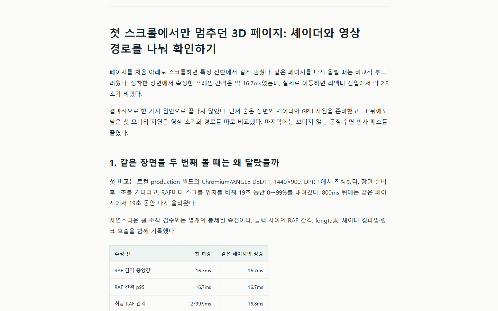
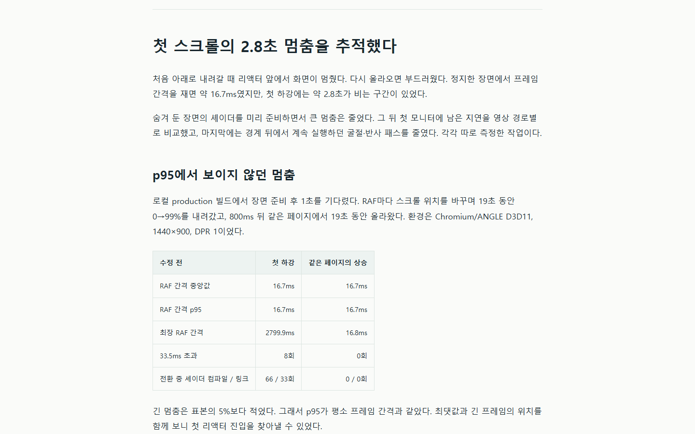
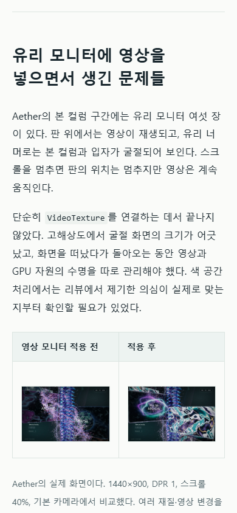
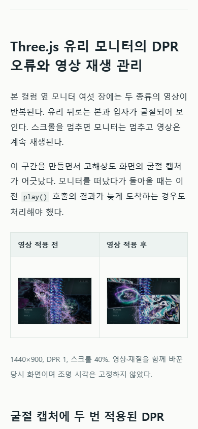

# 블로그 문체 개정 검수

2026-09-22 · 문서·이미지 기준 `1f44d09739df70ee1930aaea9ae48768f16b24f0` · 초판 비교 기준 `89d72e1ea3b4730d8acf4e2ac5ea344473b448b8`.

## 확인 결과

| 검사 | 결과 |
| --- | --- |
| 원고 7편의 코드 실행 부분 | 주석·빈 줄을 제외하고 기존 예시 유지 |
| 수치가 있는 측정표 행 | 단위·행 이름을 포함해 유지 |
| 이슈 색인 | 66개 ID·분류·근거 행 유지 |
| 실제 캡처 | 25개 모두 초판과 동일한 bytes |
| 설명 그림 | 7개 제목·박스 제목을 명사형으로 검토, 문구 영역 초과·텍스트 겹침 0 |
| 게시용·보관용 Markdown | 원고 7편과 URL 이외의 본문 동일 |
| 오프라인 HTML | 1440×900·390×844, 11개 챕터·32개 이미지 정상 |
| 오프라인 링크·레이아웃 | 내부 앵커 누락·깨진 이미지·문서 가로 넘침·외부 요청·브라우저 오류 0 |
| 모바일 설명 그림 | 760px 폭 유지, 7개 그림의 키보드 가로 스크롤 확인 |
| ZIP | 57개 항목, 예상 파일 목록·CRC·파일 SHA-256 일치 |
| 로컬 코드 검사 | lint와 `tsc -b`를 포함한 production build 통과 |

도식의 문구는 원본 해상도와 PC 본문에서 확인했다. 모바일 HTML에서는 그림을 좌우로 움직여 읽는다. Velog용 Markdown은 원본 해상도의 이미지를 연결하며 실제 에디터 미리보기는 게시 단계에 남는다.

7편 전체를 다시 읽고 반복되는 대조·교훈·추상적인 결과 설명을 줄였다. 자동 검사 결과를 자연스러움 점수나 AI 탐지 결과로 사용하지 않았다. 근거와 조건이 필요한 비교 문장은 유지했다.

## 검사 자료

- [편집 대조](editorial-audit.json)
- [파일·본문·ZIP 대조](package-audit.json)
- [PC·모바일 브라우저 검사](browser-audit.json)
- [편집 기준과 조사 출처](../../troubleshooting/editorial/README.md)

## 시각적 변경

같은 HTML 뷰포트에서 해당 챕터 제목으로 이동한 실제 캡처다.

| 대상 | 변경 전 | 변경 후 | 판단 포인트 |
| --- | --- | --- | --- |
| 성능 글 · PC 1440×900 |  |  | 도입과 소제목, 측정표의 조건 유지 |
| 모니터 글 · 모바일 390×844 |  |  | 문장 길이, 표·코드와 캡션의 흐름 |

## 설치형 스킬

현재 Windows 컴퓨터의 `korean-tech-blog-editor`를 검증·설치했다. 저장소 사본과 설치본을 다시 읽은 SHA-256은 모두 `38f51a273ef61f8d9acc2ec8cdf616a82791cadeb33cd594e628f3ca89dd328b`다. 다른 기기의 설치 상태는 확인하지 않았다.

앱 실행 코드와 과거 성능 측정은 수정하지 않았다. 실제 Velog 게시도 수행하지 않았다.
