# 포레스트 경계의 식물형 입자와 빛 · 2026-09-23

상단 포레스트가 본 컬럼으로 바뀌는 구간과 스케일 패널에서 하단 포레스트로 돌아오는 구간에 낮은 가지형 입자 무리를 더했다. 두 경계에서만 작은 주변 입자와 안개 빛이 짙어지며, 기존 숲 안쪽의 나뭇가지·잎 밀도는 유지한다. 기준은 7단계 병합 커밋 `bc9d9d0`이다.

## AT 관찰과 확인 범위

2026-09-23에 [Active Theory](https://activetheory.net/)를 Chromium 1264×625에서 열었다. 포인터를 링 주변으로 옮기고 휠로 상단 포레스트를 벗어났다가 돌아왔다. 첫 링 아래에는 낮게 솟은 두 갈래의 밝은 입자 무리와 드문 주변 점이 있었다. 아래로 가면 상부 수관의 잎 사이로 밝은 빛이 안개처럼 번지며, 기계 씬의 어두운 면이 화면 경계에서 잎을 가렸다. 빛은 같은 위치에서 녹색·청색·노란색으로 바뀌었다.

계속 하강해 스케일 패널에서 하단 포레스트로 전환되는 장면을 보고, 휠 `-650`으로 경계를 다시 올렸다. 하단 링 위로 촘촘한 입자와 안개가 모이고 더 아래에서는 검은 여백이 넓어진다. 포인터를 `(470,360)→(760,430)`으로 옮긴 직후 작은 밝은 광점과 곡선 궤적이 보였고, 2.2초 정지한 뒤에도 주변 색과 밝기가 변했다. 포인터가 식물 입자 자체를 얼마나 변위시키는지, 변화 중 영상과 절차적 조명이 각각 얼마나 기여하는지는 분리하지 못했다. 배경에서 시간에 따른 흐릿한 빛 변화는 보았으나 영상 파일의 수와 반복 종료·재시작은 화면만으로 확인하지 못했다.

관찰 화면은 로컬 `.qa/at-forest-*.png`와 agent-browser 임시 캡처에만 두었다. 별도 Playwright 브라우저는 `YOUR BROWSER IS NOT SUPPORTED`를 표시해 진행에 사용하지 않았다. AT 원본 소스·영상·모델·로고·캡처는 앱과 공개 근거에 복제하지 않았다.

## 구현 선택

`SceneForest`에 두 포레스트가 공유하는 절차적 점 geometry를 추가했다. 각 군집은 짧은 줄기 2~4개와 양옆 잎 점으로 만들었다. 줄기 길이는 약 `.33~1.9` 월드 단위이며, 상단에서는 포레스트 로컬 y `-8.7`, 하단에서는 `6.8`에 놓인다. 기존 잎 4,500/18,000/60,000개 예산은 바꾸지 않는다. 새 점 geometry는 software·모바일·일반 화면에 따라 군집 65/135/250개, 주변 점 220/600/1,400개, 엷은 안개 점 40/75/120개를 만든다. 점 수는 군집의 줄기·잎을 포함하므로 군집 수와 다르다.

상단 밀도는 progress `.055~.12`에 올라가 `.175~.205`에 사라지고, 하단 밀도는 `.845~.895`에 올라가 `.955~.985`에 사라진다. 기존 포레스트 커튼과 가까운 카메라의 fade를 마지막 픽셀에도 적용한다. 식물과 주변 점은 기존 `PointerFlow`의 화면 국소 변위, 포인터 밝기, 공유 light film의 색·밝기 영향을 함께 받는다. 포인터가 떠나면 기존 입력 강도와 flow가 감쇠한다. 스케일 패널이나 본 컬럼의 포인터 계약은 바꾸지 않았다.

[기존 자체 제작 영상](light-projection-media.md) `light-projection.mp4` 한 편을 곡면 배경과 광선, 잎·입자 표면에서 공유한다. 이 영상의 14초 반복 재생은 기존 앱의 선택을 유지한 것이며 AT의 재생 방식이라고 주장하지 않는다. 곡면과 광선은 경계 progress에서만 안개처럼 더 밝아진다. 영상 로드 실패에는 기존 절차적 빛이 남는다. 새 영상·텍스처·광원·렌더 패스는 추가하지 않았고, 영상의 지연 로딩과 첫 화면 준비 경로도 유지한다.

## 같은 조건의 전후 화면

독립 `npm ci`로 설치한 기준본과 변경본의 production build/preview를 사용했다. Chromium software WebGL, DPR 1, 포인터 이탈, PC 1440×900·모바일 390×844에서 같은 scroll progress와 기본 카메라로 캡처했다. `document.fonts`의 Barlow Condensed·DM Sans·IBM Plex Mono는 모두 loaded였고 폰트 요청 실패는 없었다. 시간과 영상 프레임은 동기화한 비교가 아니다. software 경로는 영상·광선 draw를 생략하므로 이 표의 화면은 식물·주변 입자와 기본 빛의 증거다.

| 대상 | 변경 전 | 변경 후 | 판단 포인트 |
| --- | --- | --- | --- |
| 상단 경계 PC · .14 | 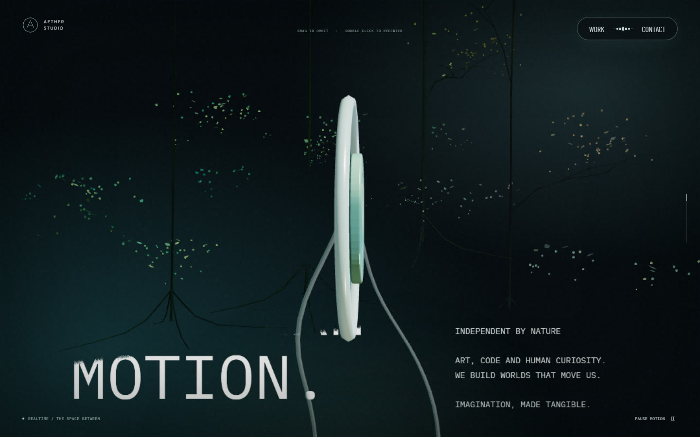 | 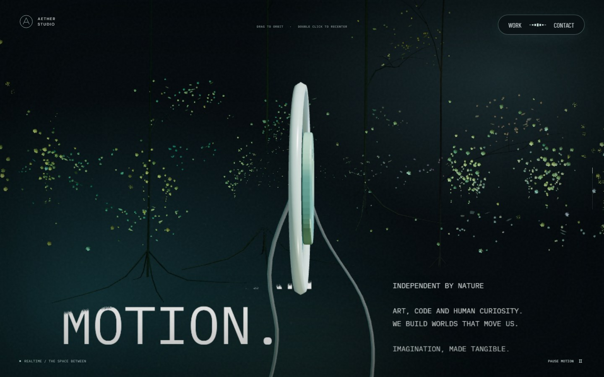 | 링 옆의 낮은 식물 무리 |
| 상단 경계 모바일 · .14 | 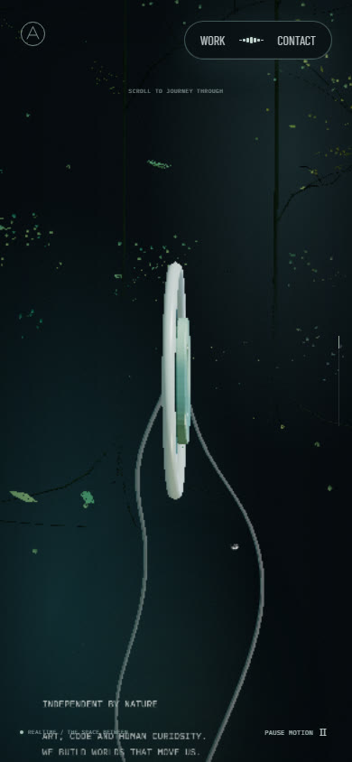 | 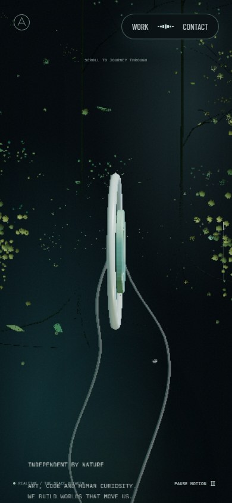 | 좁은 화면의 주변 밀도 |
| 하단 경계 PC · .90 | 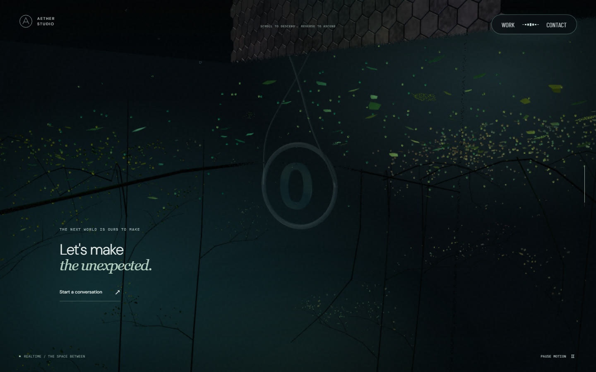 | 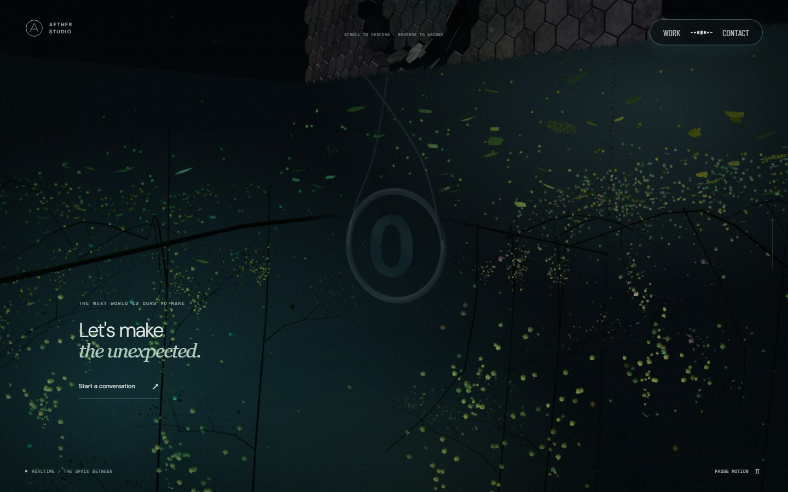 | 식물 군집과 전환 문구 |
| 하단 경계 모바일 · .90 | 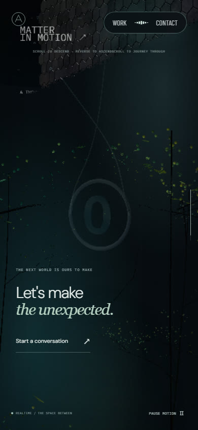 | 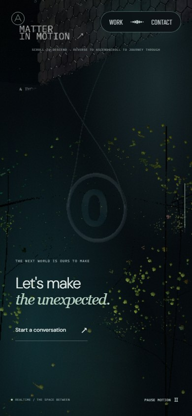 | 식물·입자와 연락처 진입 |
| 본 컬럼 진입 PC · .20 | 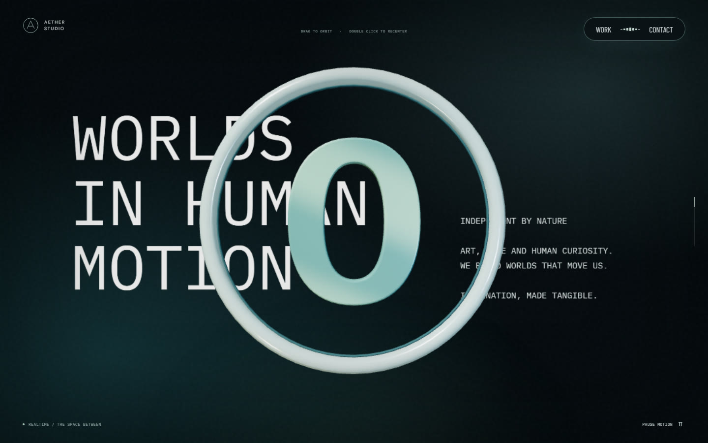 | 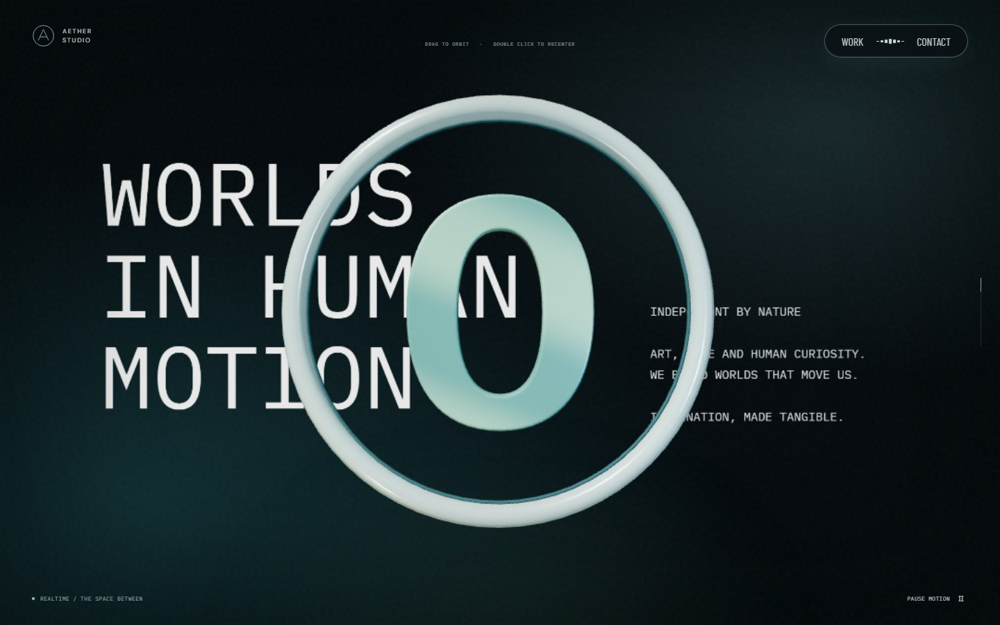 | 포레스트 입자의 기계 씬 누출 여부 |
| 포레스트 안쪽 PC · 1 | 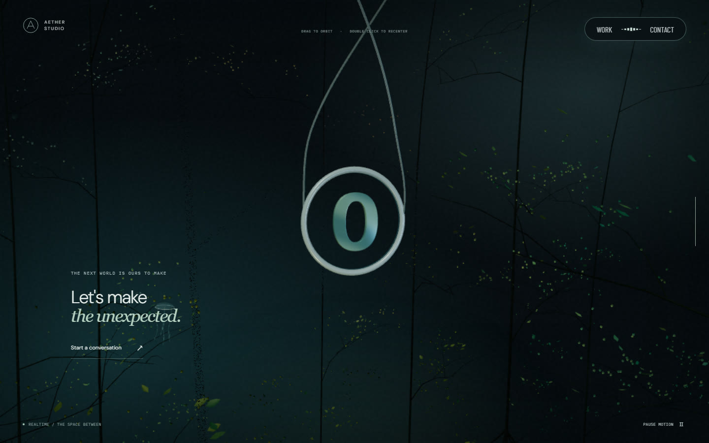 | 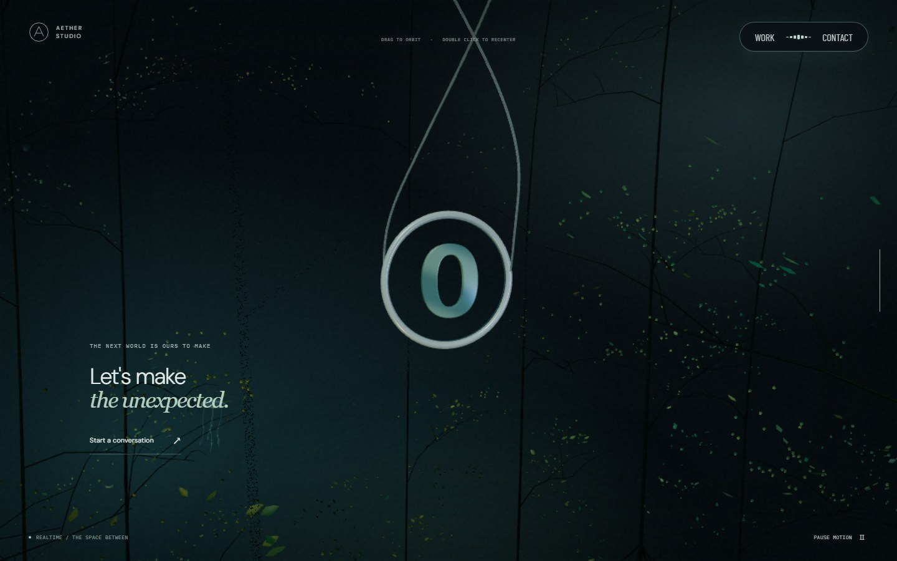 | 경계에서 먼 기존 밀도 |

포인터를 경계 왼쪽에서 오른쪽으로 두 번 옮긴 뒤 정지·이탈한 실제 연속 캡처도 남겼다. 각 GIF는 원본 화면을 5장으로 캡처해 2fps로 묶은 자료다. 시간·영상 프레임을 기준본과 동기화하거나 프레임률을 측정한 결과는 아니다.

| 경계 | PC | 모바일 |
| --- | --- | --- |
| 상단 · .14 | 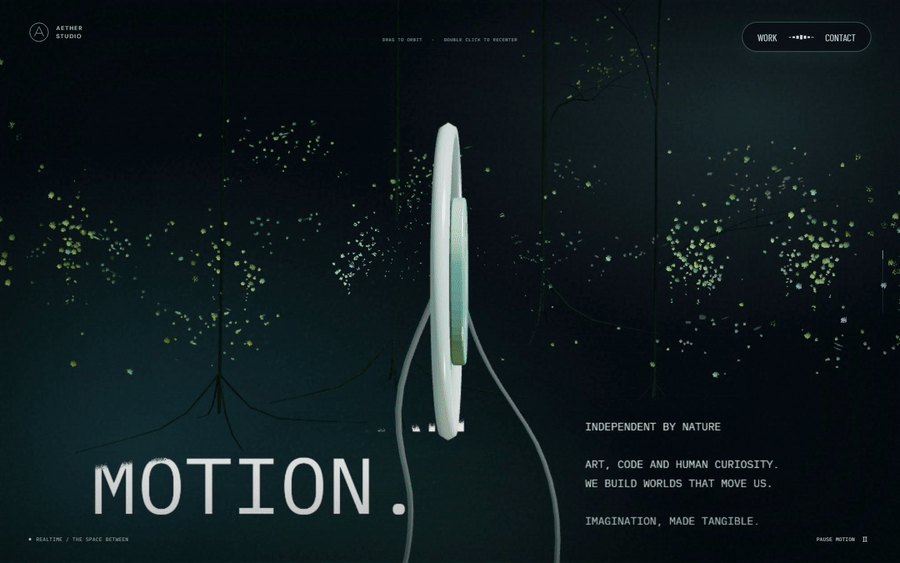 | 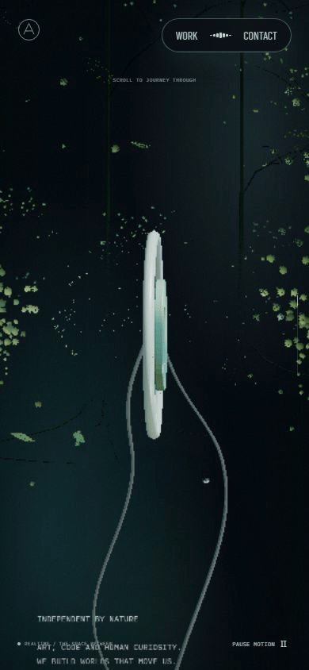 |
| 하단 · .90 | 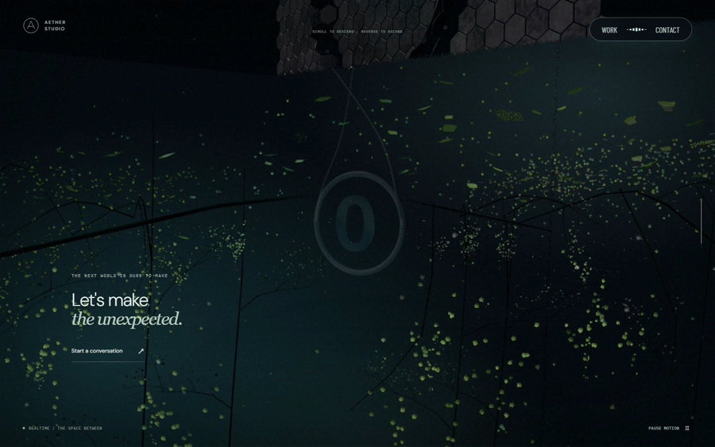 | 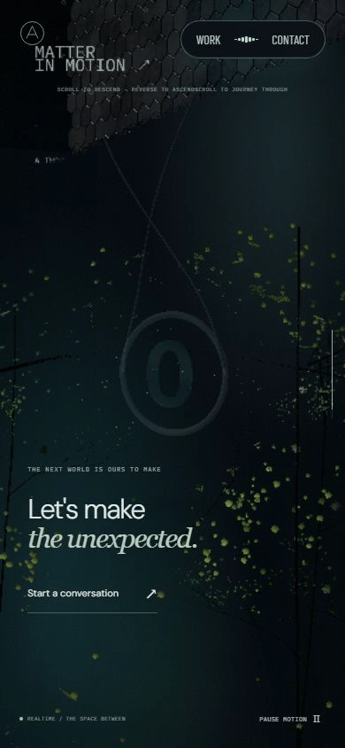 |

## 검증과 남은 범위

기준본과 변경본의 software WebGL 정지 화면에서 상단 경계 draw call은 `18→19`, 하단 경계는 `19→20`, 전체 geometry는 `67→68`, texture는 상단 `16→16`·하단 `18→18`, shader program은 `90→92`였다. 이는 해당 장면의 표본이다. 새 경계 mesh 두 개가 geometry와 material을 공유하므로 화면에서 보이는 쪽의 draw call이 하나 늘었다.

각 조건에서 실제 `requestAnimationFrame` 간격 90개도 기록했다. 모바일 에뮬레이션의 중앙값은 두 경계에서 전후 모두 약 `16.7ms`였다. PC에서는 상단이 `16.8→33.2ms`, 하단이 `16.8→16.8ms`였고 95백분위는 대부분 `50ms` 안팎이었다. software WebGL 자동화 환경의 화면 갱신 간격이라 GPU 소요 시간이나 실기기 프레임률로 해석할 수 없다. `data-frame-ms=16.0`도 software 경로의 고정 값이다. 하드웨어 GPU에서 영상·안개·식물 겹침 비용은 측정하지 못했다.

`npm run typecheck`, `npm run lint`, `npm run build`와 Playwright 전체 97개 테스트가 통과했다. 별도의 production preview 확인에서는 PC 1440×900과 모바일 390×844의 차가운 캐시·재방문 모두 첫 프레임 뒤 준비 완료로 표시됐고, 본 컬럼·모니터·리액터·스케일 패널·하단 포레스트를 오가며 17개 정·역스크롤 위치가 `ready`를 유지했다. 대화창 열기·닫기, 포커스 복귀, Contact와 홈 이동, WebGL 모듈 실패 대체 화면도 확인했다. 두 화면에서 페이지 오류와 폰트 요청 실패는 없었다.

영상 경로는 software WebGL에서 렌더러 식별값만 바꿔 비software 분기를 실행한 별도 프로브로 확인했다. 상·하단 경계에서 자체 제작 영상의 재생 시간이 증가했고, 영상을 차단하면 기존 절차적 빛으로 전환하면서 장면은 `ready`를 유지했다. 이 프로브는 하드웨어 GPU 실행이나 영상·조명의 시각적 기여도를 분리한 측정이 아니다. 기존 광선 테스트는 서로 다른 영상 프레임에서 셰이더 픽셀이 바뀌는지 검사했다. 하드웨어 GPU, Safari·Android 실기기와 AT 영상 반복 방식의 확인은 남아 있다.
