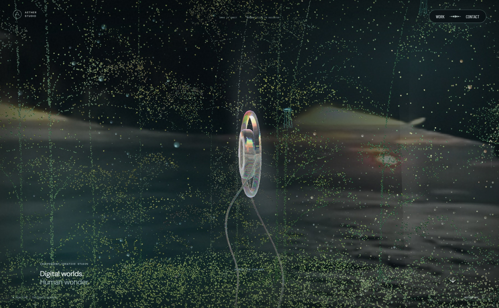
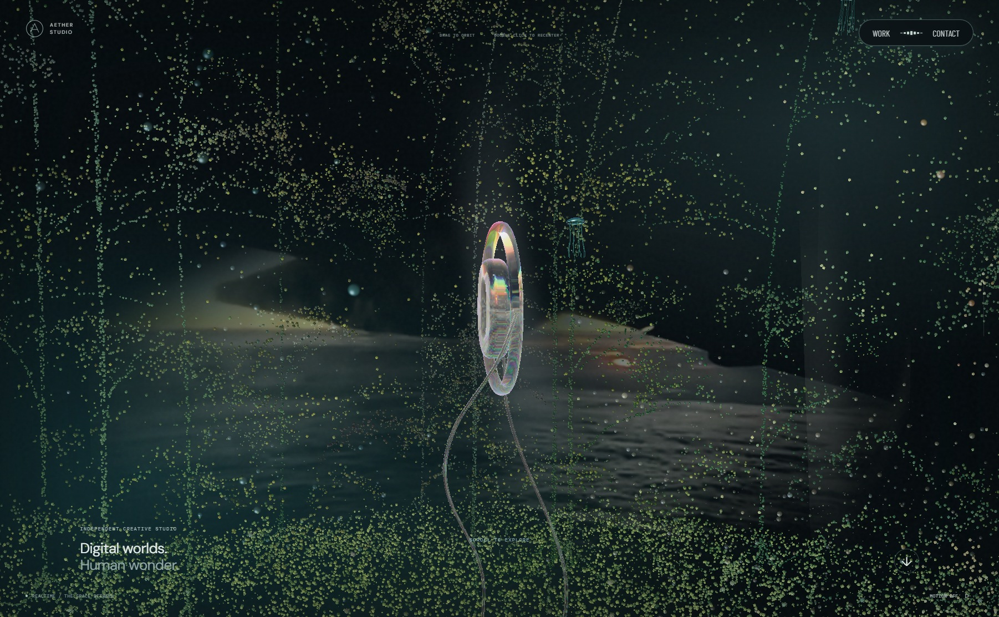
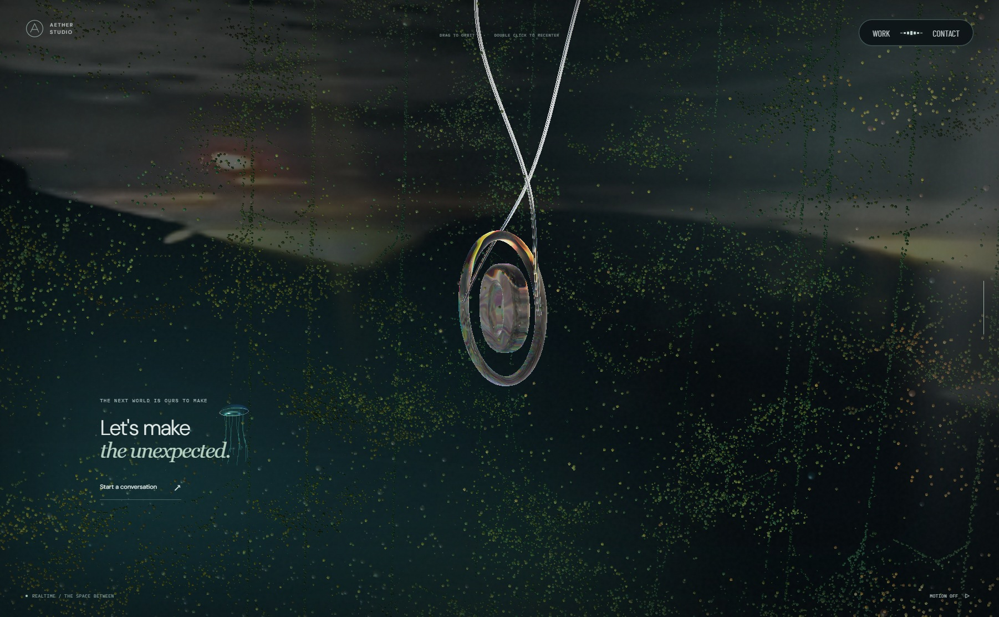
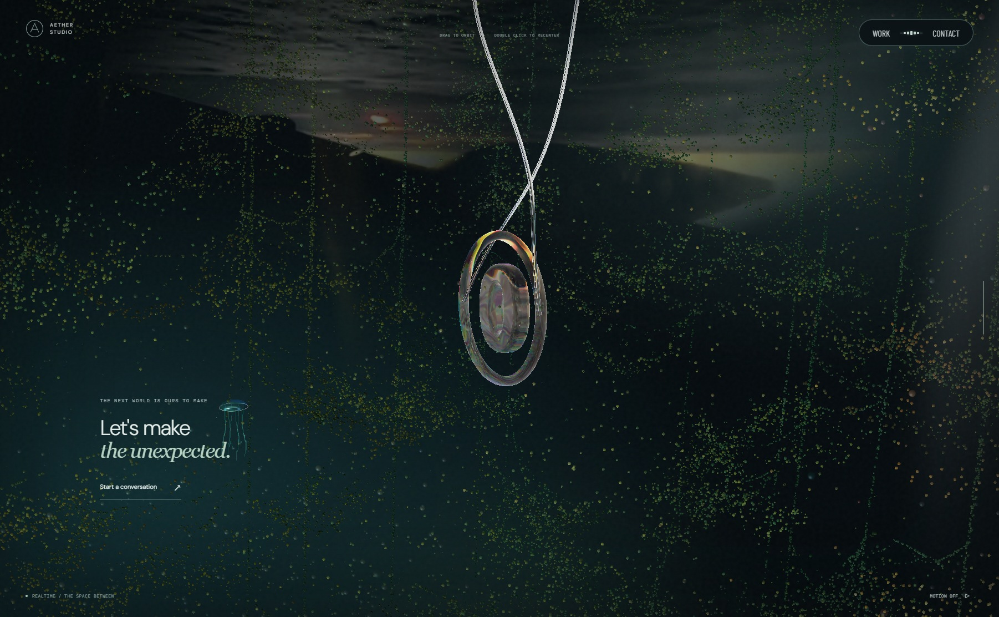

# 포레스트 영상의 화면 점유율 교정

`8c07a35` 배포본은 영상의 공간 고정과 회전 동작을 수정했지만, 곡면이 48×27로 커서 숲 화면을 넓게 채웠다. 사용자가 추가로 제공한 Active Theory 캡처의 경계 부근 영상 크기를 기준으로 다시 조정했다.

`SceneLightShafts.ts`에서 16:9 영상 면을 22×12.375로 줄였다. 곡면 양끝의 깊이 차이도 8에서 3으로 낮춰 축소된 화면이 과하게 휘어 보이지 않도록 했다. 상단 바닥·하단 천장 근처의 월드 위치와 드래그 시 앞쪽 오브젝트를 회전시키는 방식은 그대로다.

## 시각적 변경

1802×1112 뷰포트, 동일 장면 진행률, 모션 정지와 영상 2초 프레임을 기준으로 비교했다. 아래 이미지는 실제 실행 화면이다.

| 대상 | 변경 전 | 변경 후 | 판단 포인트 |
| --- | --- | --- | --- |
| 상단 포레스트 |  |  | 영상 주위의 빈 공간과 경계 부근 배치 |
| 하단 포레스트 |  |  | 천장 쪽 영상 범위와 아래쪽 숲의 구분 |

상·하단 7개 진행률에서 정·역스크롤 위치와 회전 복원을 확인했다. 양쪽 포레스트 드래그에서도 영상 방향은 유지된다. 모바일은 Chromium 390×844 에뮬레이션에서 확인했다. 곡면 고정·시차, 실제 영상 픽셀, 영상 재생과 실패 대체 경로의 기존 검사 5개도 통과했다.
