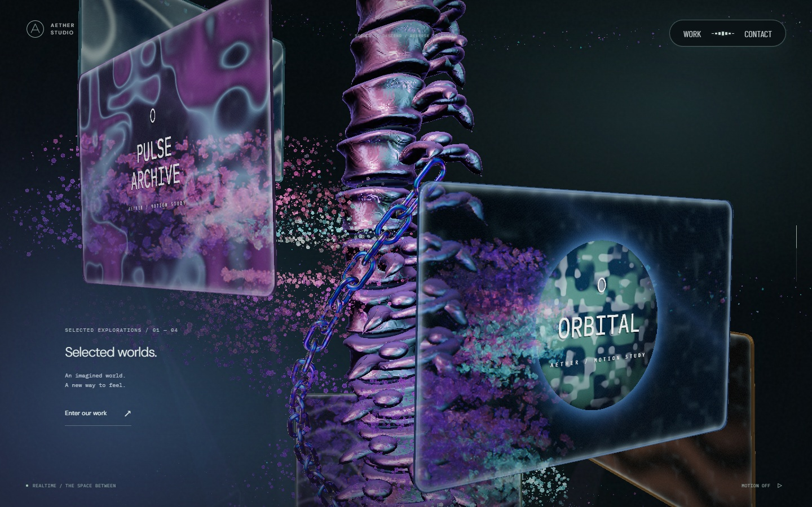
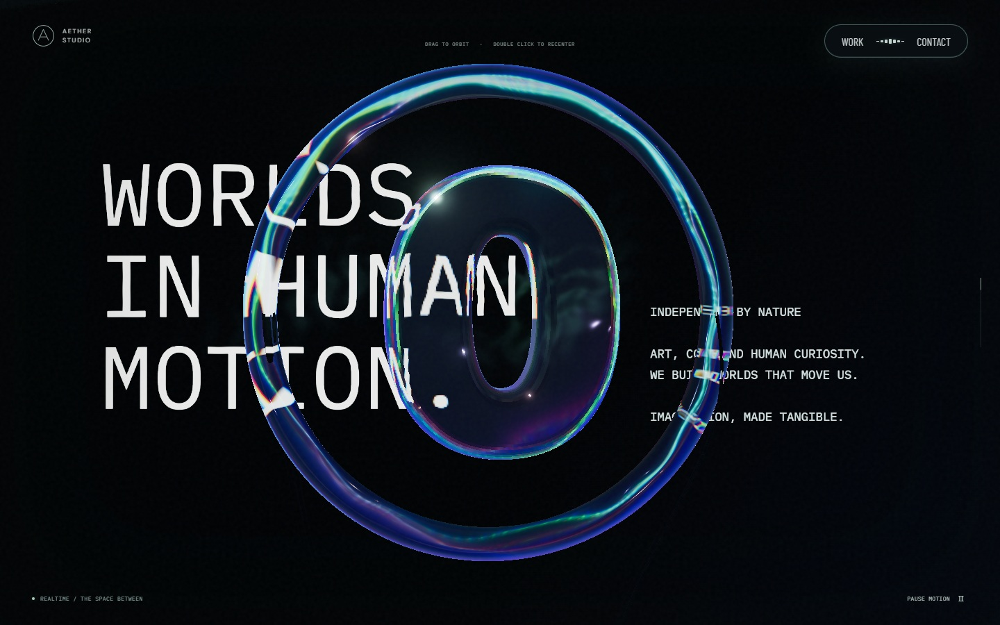
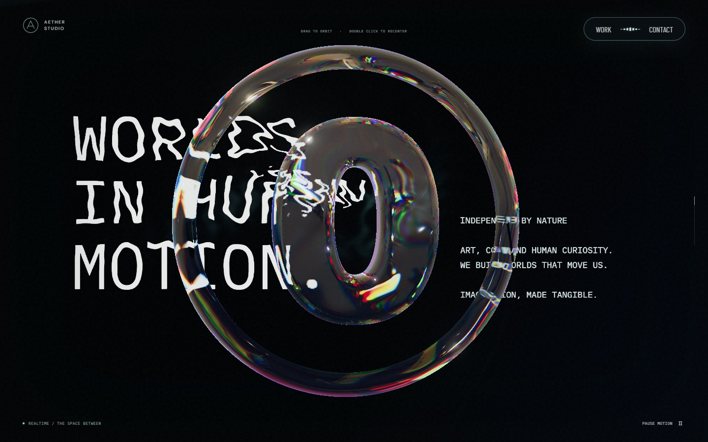
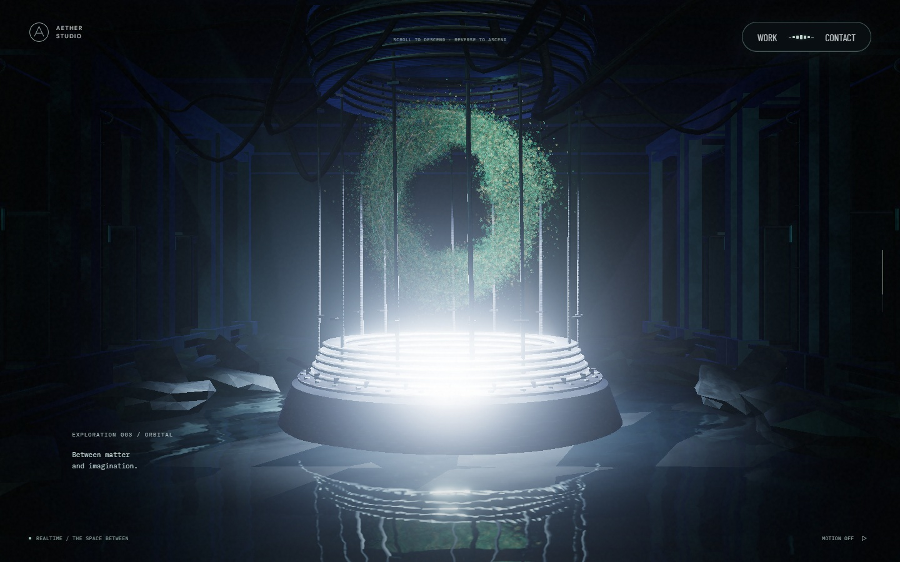
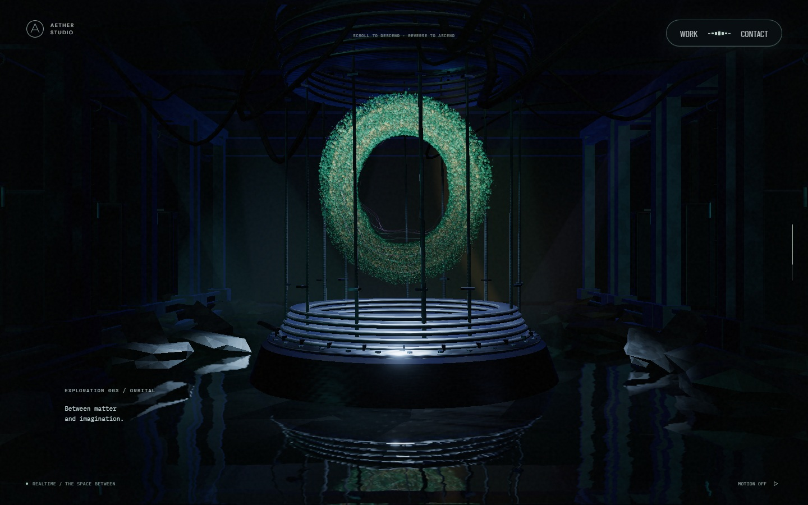
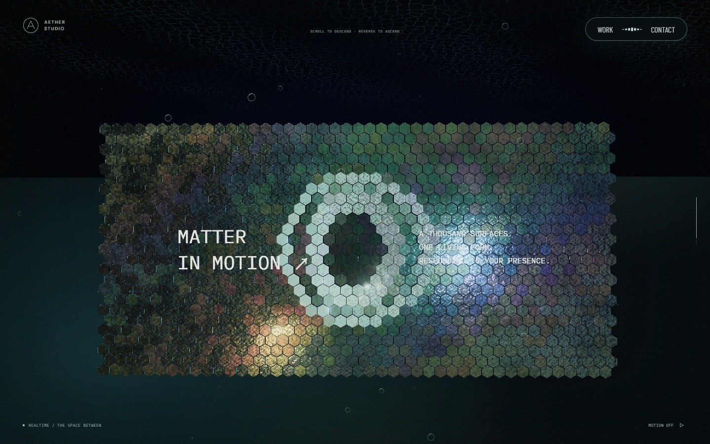
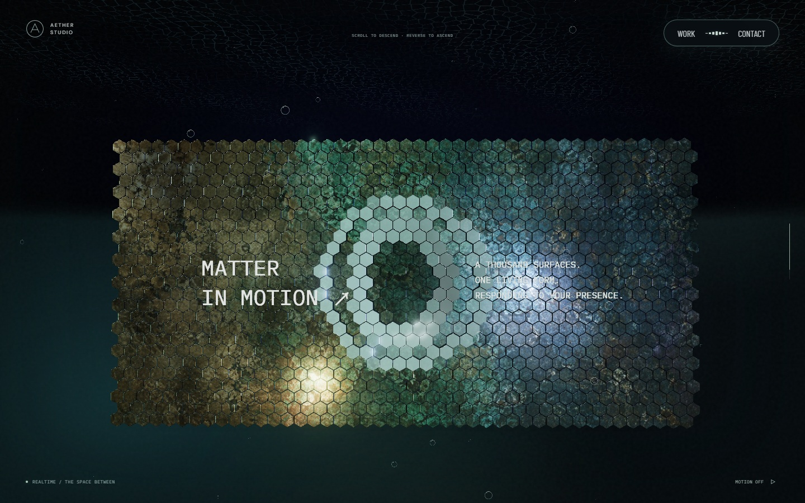
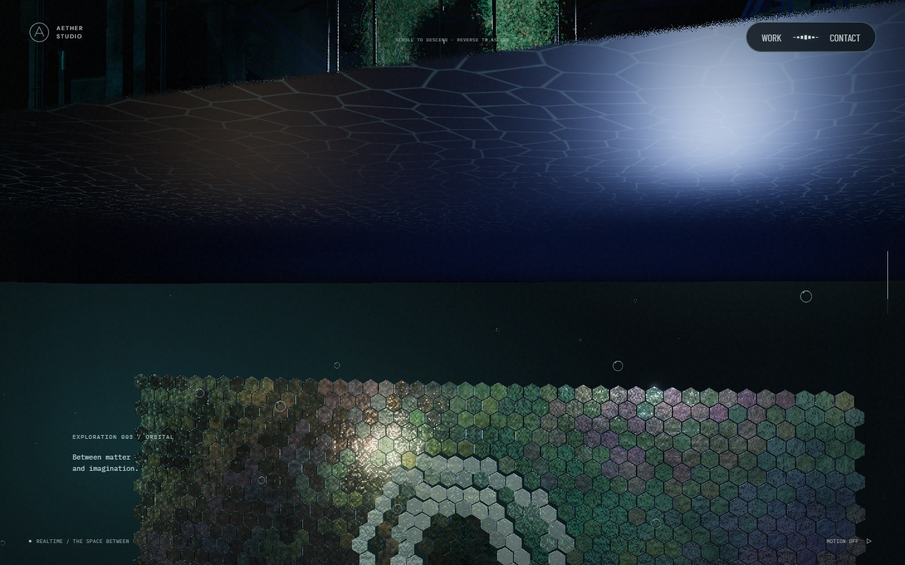
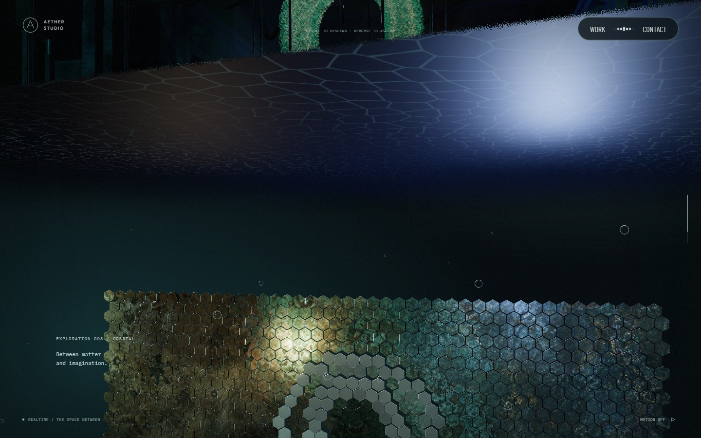

# 재질·유체 표현과 검증 · 2026-09-25

후속 요청의 제목 물살·본 컬럼·체인·영상 조명·포레스트 교정은 [레퍼런스 장면 교정](reference-scene-corrections.md)에 기록했다. 아래 수치와 캡처는 당시 검증 기록이다.

기준은 `b29c5bccf14ce652e519b034f5691a67f5d2b319`이다. 본 컬럼의 미세 무지개 얼룩, 작은 글자 굴절, 이력이 없는 리액터 입자, 단색으로 보이는 스케일 패널과 수면 반사를 비교했다. Three.js를 유지하고 재질·렌더 타깃·입자 상태를 보강했다.

## 효과별 구현과 용어

| 대상 | 구현 | 그래픽스 용어 |
| --- | --- | --- |
| 본 컬럼 | 넓은 반사색과 박막 두께, 중간 주름, 미세 표면을 분리한다. 밝은 반사는 압축하되 원래 PBR 반사의 흰 하이라이트를 남긴다. | PBR, iridescence / thin-film interference, microfacet roughness, surface-gradient bump mapping, highlight roll-off |
| 큰 글자 | 포인터 속도·밀도장에서 높이 기울기를 읽고 글자 텍스처의 UV를 국소적으로 접는다. 변형 상한은 화면 높이의 5.5%다. | fluid-driven UV distortion, refraction, density gradient, advection, vorticity confinement |
| 본 컬럼 좌하단 안개 | 이전 작업의 독립된 속도·밀도장과 잔류·복원 동작을 유지한다. 배경 형상을 비틀지 않고 안개 투과를 바꾼다. | advected density field, opacity mask, dissipation |
| 리액터 입자 | 입자마다 GPU 위치를 저장하고 curl·접선 방향으로 이동시킨다. O형 영역으로 복원하는 힘과 외곽 제한을 적용한다. | GPGPU, ping-pong render targets, position history, curl field, confinement, sphere impostor |
| 챔버 수면 | 여러 방향·속도의 노멀을 합치고 반사 투영 좌표를 원근 나눗셈 전에 바꾼다. 화면 밖 샘플은 유효한 반사 또는 물색으로 복귀한다. | planar reflection, projective texture mapping, Fresnel, multiscale normal field, texture-footprint filtering |
| 스케일 패널 | 실제 육각 타일의 기하와 법선을 함께 회전한다. 연속된 금속 이미지와 거칠기·미세 흠집을 적용한다. | instancing, rigid facet normals, albedo, roughness map, bevel highlights, local ambient occlusion |

이름이 비슷해도 계산은 다르다. 리액터는 입자 간 압력·충돌을 푸는 SPH가 아니며, 수면에는 물리 굴절·caustics를 추가하지 않았다. 스케일 패널의 측면 암부도 이웃 타일이 만드는 실제 그림자 맵과 구분한다.

## 상태와 비용

GPU 리액터는 PC 144,000개, 모바일 40,000개 입자에 고유 위치 texel을 배정한다. Float 위치 타깃 두 개를 교대로 사용하며, 보이는 리액터 구간에서만 갱신한다. 반사 캡처는 시뮬레이션을 다시 실행하지 않는다. 소프트웨어 렌더러나 float framebuffer 미지원 환경은 기존 해석적 흐름을 사용한다.

작은 역스크롤은 위치 이력을 유지하면서 절대 스크롤 형상과 섞는다. 장면 이탈·큰 점프·시간 역행은 초기화한다. 숨김·비활성·모션 정지에서는 적분을 중단한다. 모션 설정 변경으로 렌더러를 재생성할 때만 위치 snapshot을 읽으며 매 프레임 CPU readback은 없다.

리액터 받침의 과노출은 실제 장면에서 발견했다. 방에 필요한 영상 조명의 큰 배율이 금속에도 적용되면서 하얗게 번졌다. 받침·rod·cap의 반사 기여와 보조 발광만 낮추고 방과 바닥의 조명을 유지했다.

하부 장면의 배경 수평선은 천장 평면의 먼 경계였다. 천장을 넓히고 카메라에서 멀어질수록 투명하게 했다. 천장 바로 아래에서는 시선 각도도 반영해 원거리 전이가 몇 픽셀로 좁아지는 현상을 보정했다. 같은 처리를 천장 조명에 적용하며 가까운 면의 차폐와 문양 크기는 유지한다.

## 스케일 이미지 출처

[`scale-alloy.jpg`](../public/media/scale-alloy.jpg)는 이 프로젝트용으로 OpenAI `image_gen`에서 생성한 원본 이미지다. Active Theory의 사진·모델·텍스처는 입력하거나 복사하지 않았다. 생성 PNG를 1536×768 JPEG로 내보냈으며 크기는 451,945바이트다. 규격·색 공간·SHA-256은 [manifest](../public/media/scale-alloy-manifest.json)에 있다.

이미지는 타일 전체에 한 번 이어서 배치한다. 실제 반사광은 기존 재질과 조명이 계산하고, 이미지는 산화 무늬와 밝기에 따른 거칠기를 보탠다. 이미지 로드에 실패하면 기존 절차적 금속 표현을 유지한다.

## 검증 범위

실제 production 셰이더를 사용하는 GPU fixture에서 글자 이동 거리·복원·전경 보존, 입자 입력 방향·잔류·O 경계·정지·고유 상태, 금속 환경 반사·시점·거칠기 변화·타일 법선, 물 반사 위치·색·경계 누수를 검사한다.

레드팀에서 비활성 상태의 역스크롤 중 입자 혼합 비중이 갱신되지 않는 문제를 발견했다. GPU 적분만 정지하고 진행도·장면 이탈은 계속 반영하도록 고쳤으며 회귀 검사를 추가했다.

로컬 전체 검사는 128개 통과, 2개 실패, 기존 조건부 제외 1개였다. 실패를 확인해 본 컬럼의 흰 반사를 복원했고, 스케일 fixture에는 실제 면 회전에 따른 명암을 읽을 수 있는 고정 사광을 추가했다. Artwork fixture의 포인터 파동도 명시적으로 비활성화했다. 검사 기준은 유지했으며 실패한 두 검사는 수정 후 모두 통과했다. 최종 커밋 전체 검사는 PR의 CI 결과로 확인한다.

추가 WebKit 검사에서는 프로젝트 창을 닫은 뒤 카드로 포커스가 돌아오지 않는 문제를 찾았다. 카드 클릭 시 포커스를 명시해 모달이 실제 열기 버튼을 복귀 대상으로 저장하도록 고쳤다. 다른 프로젝트로 넘긴 뒤 닫기·수동 모션 정지와 재개·시스템 모션 축소 경로의 3개 검사가 수정 후 통과했다. Playwright WebKit의 iPhone 13 프로필 결과이며 실제 iPhone Safari 검증과 구분한다.

로컬 Windows의 Chromium/ANGLE D3D11, 1440×900, DPR 1에서 구간마다 안정화 후 RAF 100개를 수집했다. 상단 포레스트·글자·본 컬럼·리액터·수면 통과·스케일 패널·하단 포레스트 모두 중앙값 16.7ms, p95 16.8~16.9ms였고 품질 배율은 1.00이었다. 독립 GPU 실행 중의 관찰이며 GPU 연산 시간이나 다른 기기의 FPS를 뜻하지 않는다. 브라우저 오류는 없었다. 390×844 화면도 별도로 확인했다.

### 시각적 변경

아래는 1440×900 실제 화면이다. 본 컬럼 `.405`, 리액터 `.715`, 천장 전환 `.763`, 스케일 패널 `.825`는 모션 축소·시간 0·같은 카메라의 비교다. 글자는 `.175`에서 동일 좌표의 42회 포인터 이동 직후이며, 실시간 프레임의 촬영 시각에는 작은 차이가 있다. 정지 화면으로 유체의 시간 이력을 증명하지 않는다.

| 대상 | 변경 전 | 변경 후 | 판단 포인트 |
| --- | --- | --- | --- |
| 본 컬럼 |  |  | 미세 무지개 얼룩을 줄이고 넓은 반사색·요철 구분 |
| 글자 물살 |  |  | 획이 국소적으로 접히는 변형 폭과 링 전경 유지 |
| 리액터·수면 |  |  | 금속 받침의 과노출 감소, 물에 반사되는 색과 굴곡 |
| 스케일 패널 |  |  | 타일 전체에 이어지는 금속 무늬, 개별 면의 반사 |
| 천장 전환 |  |  | 천장과 배경 사이 수평선 제거, 가까운 문양 유지 |

## 비교 한계

원본 사이트의 정지·이동 화면과 공개 셰이더 구조를 관찰했지만 앱에 원본 코드를 복사하지 않았다. 절차적 모델, 이미지, 조명 배치, 입자 수가 달라 픽셀 단위의 동일성을 주장하지 않는다. GPU fixture 통과는 기능과 수학적 계약의 검증이며, 원본과의 시각적 동일성을 증명하지 않는다. 모바일은 렌더 예산에 따라 반사와 입자 수가 다르다.
