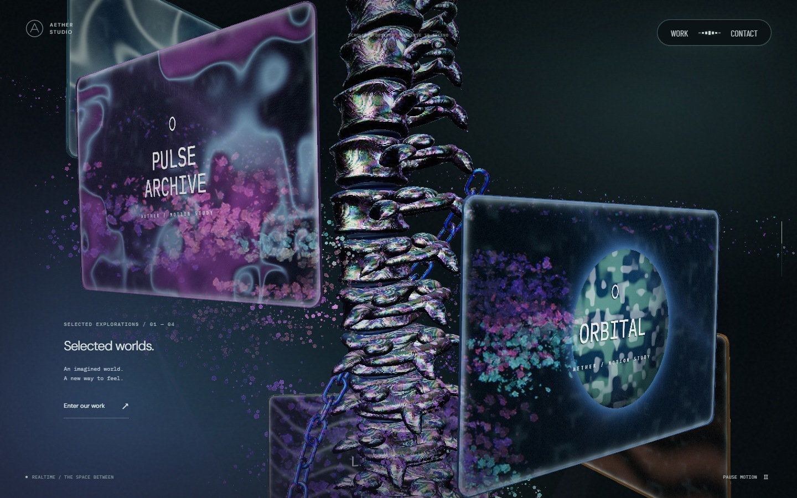
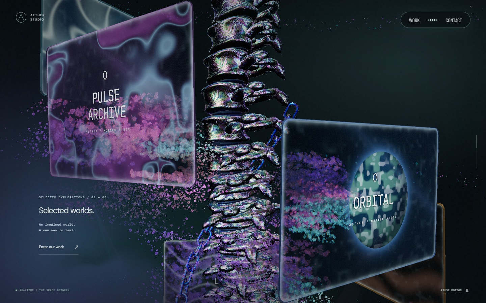
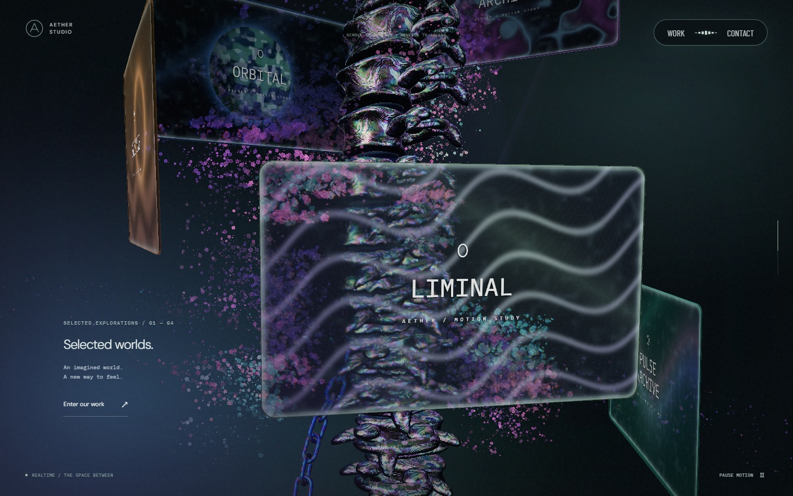
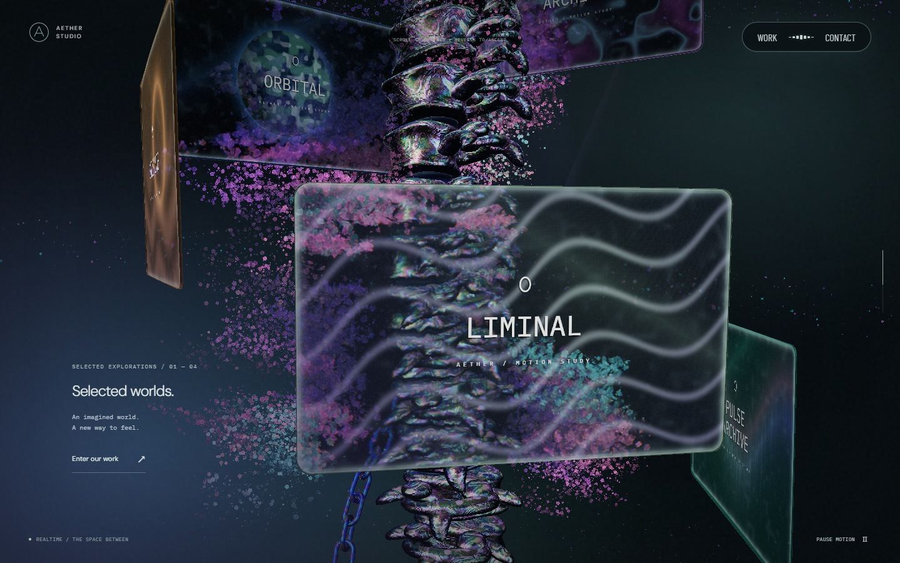
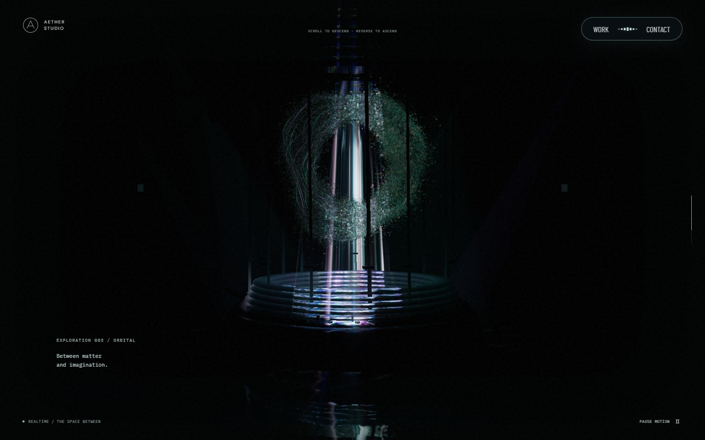
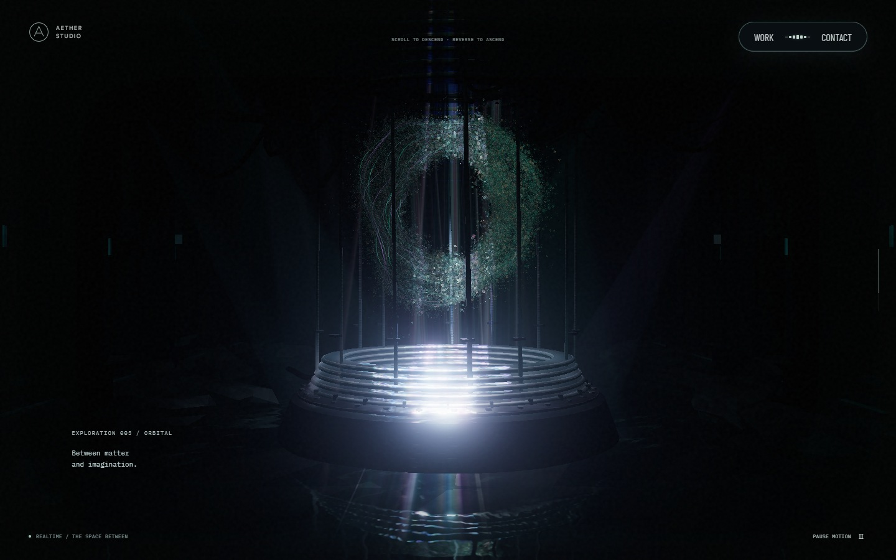
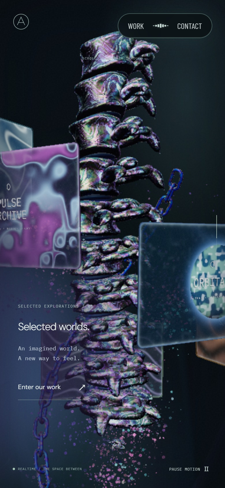
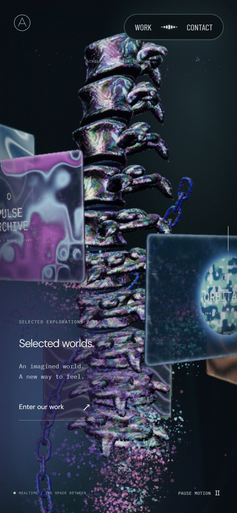
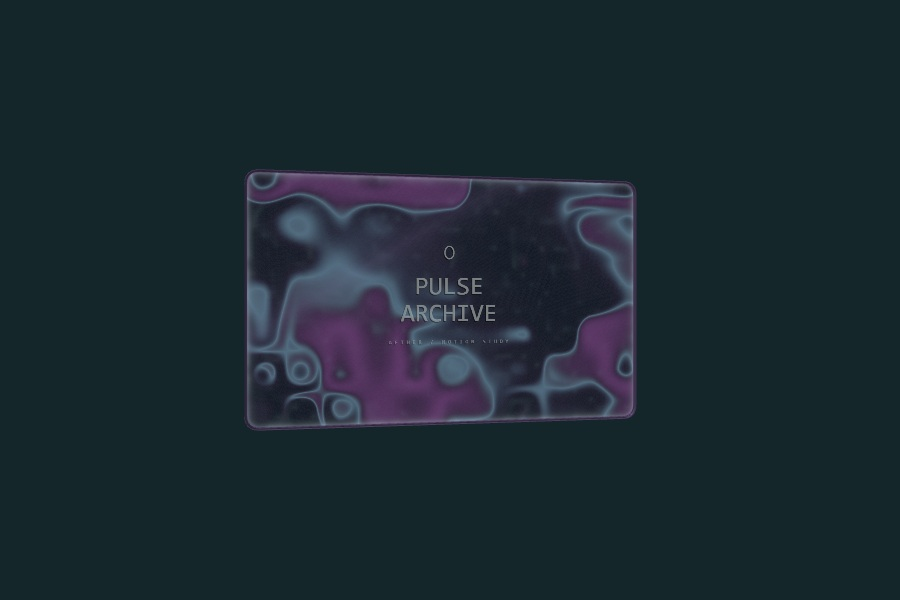
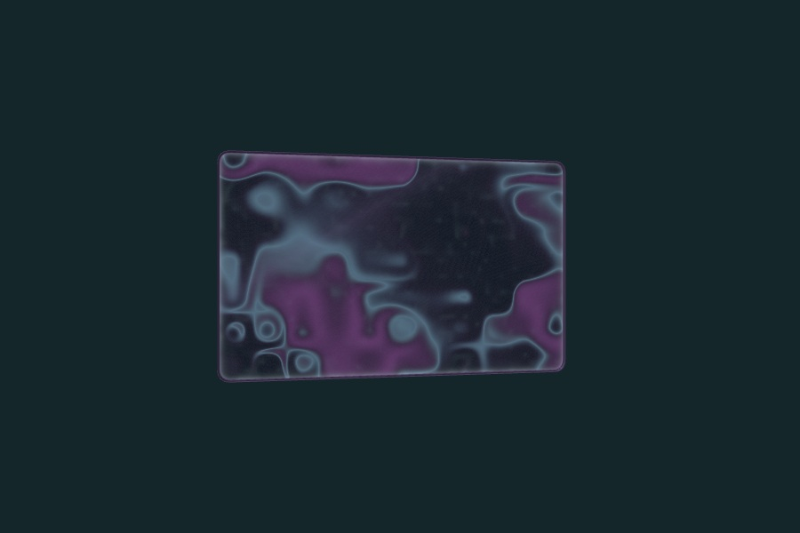

# 안개 잔상·리액터 조명·꽃 밀도 교정

안개가 UI를 지날 때 끊기던 문제를 고치고 기체처럼 길게 운반되는 잔상을 적용했다. 리액터는 가는 빛줄기의 대비를 낮추고 넓은 조명과 반사로 주변을 밝힌다. 본 컬럼에는 꽃 입자를 추가하고 원경 나선의 감김 간격을 줄였다.

기준은 `6c06a53`(PR #47 병합본)이다. 2026-09-25 [Active Theory](https://activetheory.net/)의 실제 화면에서 안개 입력 후 잔상과 본 컬럼 여러 높이의 입자를 확인했다. 공개 셰이더에서는 원경 입자가 큰 반경의 연속 나선을 따르는 것을 확인했다. 별도 두 개의 블랙홀로 단정하지 않고, 여러 감김의 호가 위아래로 함께 보이는 연출을 반영했다. 참고 사이트의 소스·자산·캡처는 재배포하지 않는다.

## 변경점

| 대상 | 변경 |
| --- | --- |
| 안개 초기화 | 링크·버튼 위로 포인터가 이동할 때 물막과 함께 지우던 안개를 분리했다. 새 터치의 `pointerdown`도 이전 잔상을 지우지 않는다. 잠깐의 프레임 지연에는 작은 단계만 적분하고, 실제 페이지 전환·숨김·비활성화에는 정리한다. |
| 안개 반응 | 초기 브러시 지름을 10% 줄였다. 96×64 안개 전용 필드에서 흐름의 운반·회전을 강화하고 농도 감쇠를 늦췄다. 고정 시간에 지우는 대신 출력이 중립값에 도달한 뒤 정리한다. 문구 판·스케일 패널의 기존 물막 필드는 유지한다. |
| 리액터 | 개구부 아래 조명 반경을 2.45에서 4.6으로 넓히고 경계를 부드럽게 했다. 좁고 반복적인 광선 무늬와 영상 투영의 대비를 줄였다. 주변의 간접 확산광·반사를 더하고 영상의 밝은 부분을 압축해 중앙 과노출을 줄였다. |
| 꽃 입자 | 기존 시드·형태를 보존하며 PC 44,000개, 모바일 16,000개, 소프트웨어 렌더러 1,800개의 꽃 전용 입자를 추가했다. 본 컬럼과 퇴장 경계에서만 그리며 포레스트·리액터 개수는 그대로다. 꽃은 스크롤에만 회전한다. |
| 원경 나선 | 반경 약 24~27을 유지하고 높이 48에 걸친 감김을 1.7회에서 3.8회로 바꿨다. 약 12.6 간격의 인접 호가 뒤쪽에 함께 보인다. 시간·스크롤 회전과 성긴 입자 수는 유지한다. |

## 시각적 변경

실제 실행 화면이다. 전후 모두 PC 1440×900, 모바일 Chromium iPhone 13 에뮬레이션 390×844·DPR 2에서 카메라·스크롤·시간 10초·영상 6초·입력 경로를 맞췄다. 안개 잔상은 입력 후 0.8초다.

| 대상 | 변경 전 | 변경 후 | 판단 포인트 |
| --- | --- | --- | --- |
| PC 안개 잔상 |  |  | 지나간 경로의 농도가 운반되며 감쇠 |
| PC 꽃·원경 띠 |  |  | 꽃의 밀도와 멀리 떨어진 인접 나선 호 |
| PC 리액터 |  |  | 가는 광선 완화, 바닥·주변 구조물의 밝기 |
| 모바일 본 컬럼 |  |  | 기존 꽃 형태를 채우는 입자 |

## 검증과 비용

Chromium/D3D11에서 입력·안개·입자·리액터 관련 검사 36개, Windows WebKit 모바일 설정에서 안개 수명·화면 합성·입자 회전 검사 3개를 통과했다. 린트·타입 검사·프로덕션 빌드도 통과했다.

안개 수명 검사는 UI 진입, 재진입, 터치 시작, 짧은 프레임 지연 뒤에 잔상이 유지되고 비활성화 뒤에는 없어지는지 확인한다. GPU 픽셀 검사에서는 화면 좌표를 변형하지 않는 색 혼합, 자연 감쇠 후 정확한 복구, 꽃의 정지, 인접 나선의 큰 반경과 높이 간격을 확인한다. 기존 물막·포레스트·리액터 경계 검사도 유지한다.

꽃 정점과 본 컬럼 안개용 CPU 필드의 비용이 추가된다. 꽃 추가분은 다른 장면에서 draw range로 제외하며 렌더 패스·조명 개수·프레임별 텍스처 할당은 늘리지 않는다. 실제 iPhone Safari의 화면·장시간 성능은 미검증이다. AT와의 픽셀 단위 동일성은 주장하지 않는다.

## 모니터 뒷면 문구 제거

모니터의 문구·그림자·호버 색 번짐은 앞면에서만 합성한다. 뒷면의 유리·영상 재질과 테두리는 유지한다. 같은 운영 모니터 메시와 셰이더를 분리한 900×600 검수 화면에서 카메라·시간·회전 각도를 맞췄다.

| 대상 | 변경 전 | 변경 후 | 판단 포인트 |
| --- | --- | --- | --- |
| 모니터 뒷면 |  |  | 문구와 그림자 없이 패널 재질 유지 |

GPU 픽셀 비교에서 정지·호버 상태 모두 앞면은 변경 전과 같았다. 뒷면은 문구 텍스처를 빈 텍스처로 바꿔도 차이가 0이어서 문구·그림자·색 번짐이 남지 않는 것을 확인했다. 추가 변경 후 lint와 타입 검사를 포함한 production build도 통과했다.
