# 카메라 높이에 따른 입자 보강

포레스트와 꽃의 보강 입자가 카메라 높이에 맞춰 움직이도록 수정했다. 스케일 패널의 정지 구간과 하단 링의 투명도 전환도 제거했다.

## 포레스트와 꽃

포레스트 식물 높이는 직전 배포의 50%다. 움직이는 입자는 잎의 약 68%에서 34%, 줄기의 약 46%에서 23%로 줄였다. 나머지는 완성 위치에 머무른다. 보강 입자는 각 목적지에서 0.18~1.35 단위 위에 대기하고, 높은 가지부터 순차적으로 합류한다. 하단은 배치를 대칭으로 맞추어 마지막 화면에서도 숲과 보강 전 입자를 볼 수 있다.

꽃은 기존 입자를 유지하고 그 수의 40%를 보강 입자로 추가했다. 본 컬럼 위쪽에서는 카메라가 내려오며 꽃 위의 입자가 합류하고, 아래쪽에서는 꽃에서 아래로 빠져나온다. 시간 적분 없이 카메라 높이로 위치를 결정하므로 역스크롤은 같은 경로를 되짚는다. 최하단 꽃의 개구부 합류는 유지한다.

모니터의 실제 행렬·너비·높이·곡률로 유리 주변의 여유 공간을 계산한다. 꽃 입자는 유리면에 접근할 때 안쪽으로 휘어진다. 모니터 설정을 바꾸어도 같은 계산을 사용하며, 모니터 뒤의 꽃이 유리에 굴절되어 보이는 표현은 유지한다.

## 화면 전환과 표면

스케일 패널은 기존 100svh 구간과 정면 시점을 유지한다. 가운데 고정 위치를 연속 상승으로 바꾸고, 전후 사선 경계와 연결했다. 하단 포레스트 링은 경계 뒤에서 이미 완성된 상태로 나타나며 별도 투명도 페이드를 사용하지 않는다.

좌측 문구의 빛은 `/` 방향으로 길게 번지고, 문구와 같은 물결 변형과 사선 경계에 묶인다. 블러를 한 번 만든 뒤 재사용한다. 반복 블러로 초기 준비가 느려졌던 중간 구현은 교체했다.

본 컬럼은 수평 단면과 높이별 꼬임을 유지하면서 몸통의 위·아래를 조금 줄였다. 미세 요철의 강도를 낮추고 거칠기·금속 반사·코팅 색을 조정해 마디 사이와 청색·은색 반사가 드러나도록 했다. 기존 NIH 메시의 이용 조건과 출처를 유지한다.

## 실제 화면

1600×900, 동일 진행도·기본 시점·모션 정지 상태다. 영상의 정지 프레임은 달라질 수 있다. AT 화면이나 에셋은 포함하지 않았다.

| 대상 | 변경 전 | 변경 후 | 판단 포인트 |
| --- | --- | --- | --- |
| 상단 포레스트 · 0% | 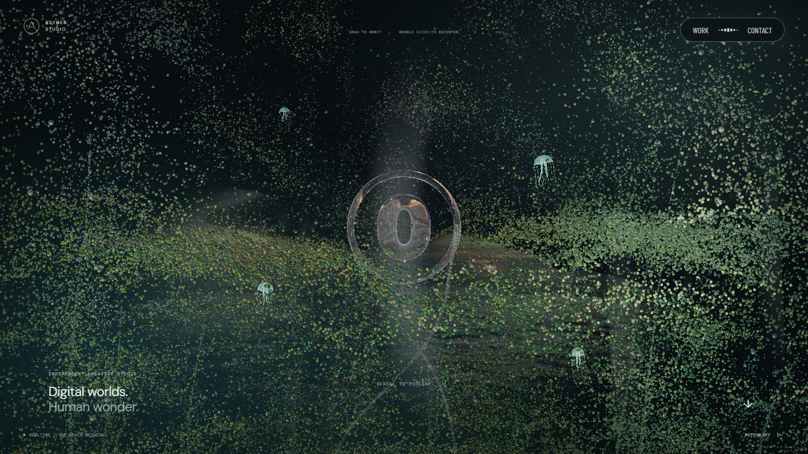 | 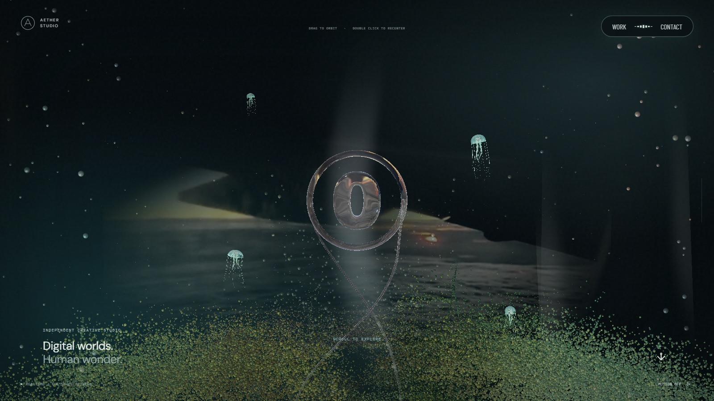 | 식물 높이와 첫 화면의 여백 |
| 하단 포레스트 · 100% | 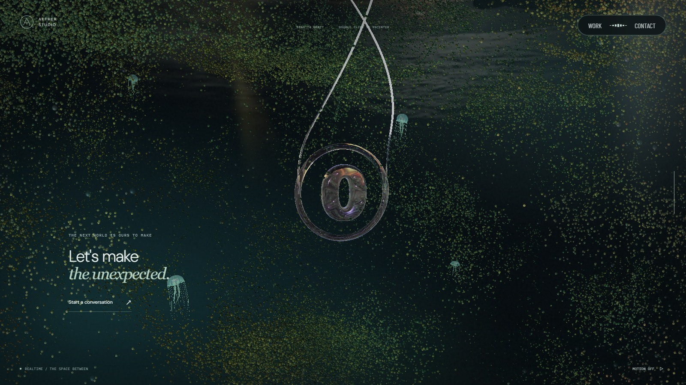 | 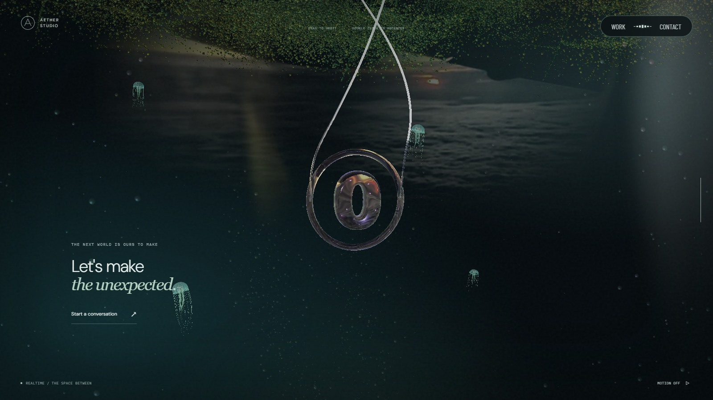 | 낮아진 식물과 보강 전 위치 |
| 좌측 문구 · 15% | 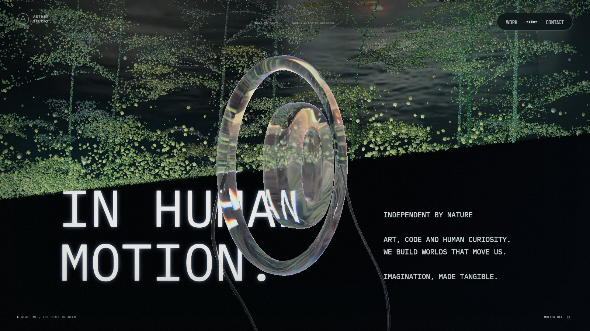 | 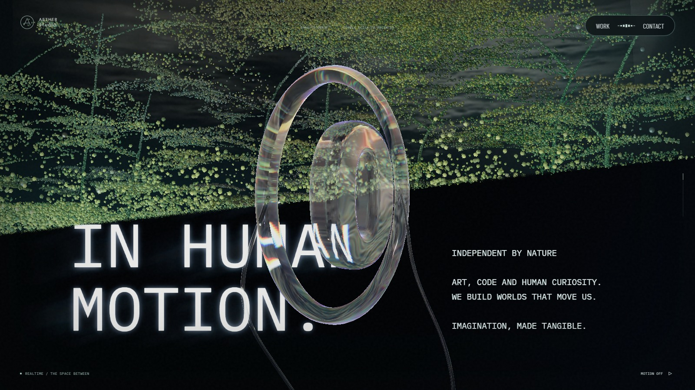 | `/` 방향 빛 번짐 |
| 본 컬럼 · 40% | 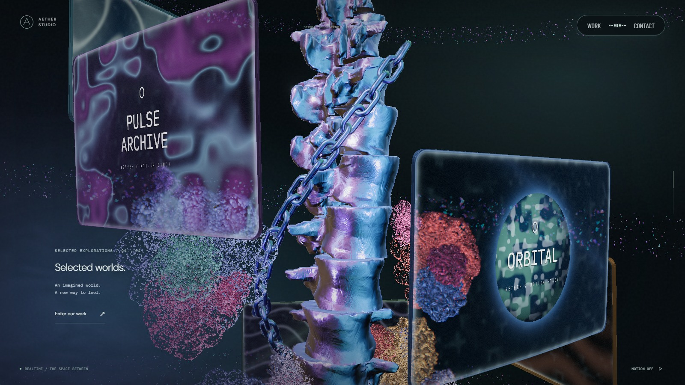 | 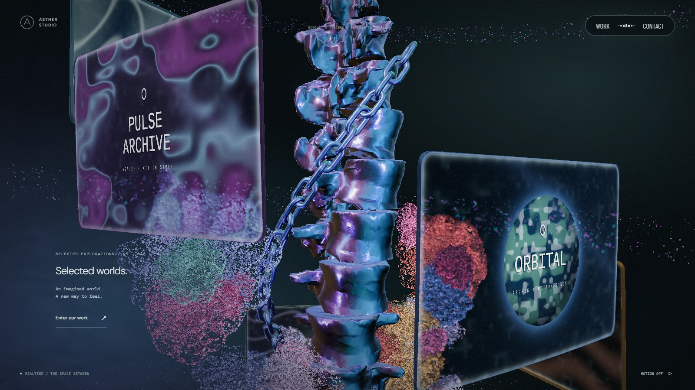 | 마디 간격·반사·추가 입자 |
| 모니터와 꽃 · 46% | 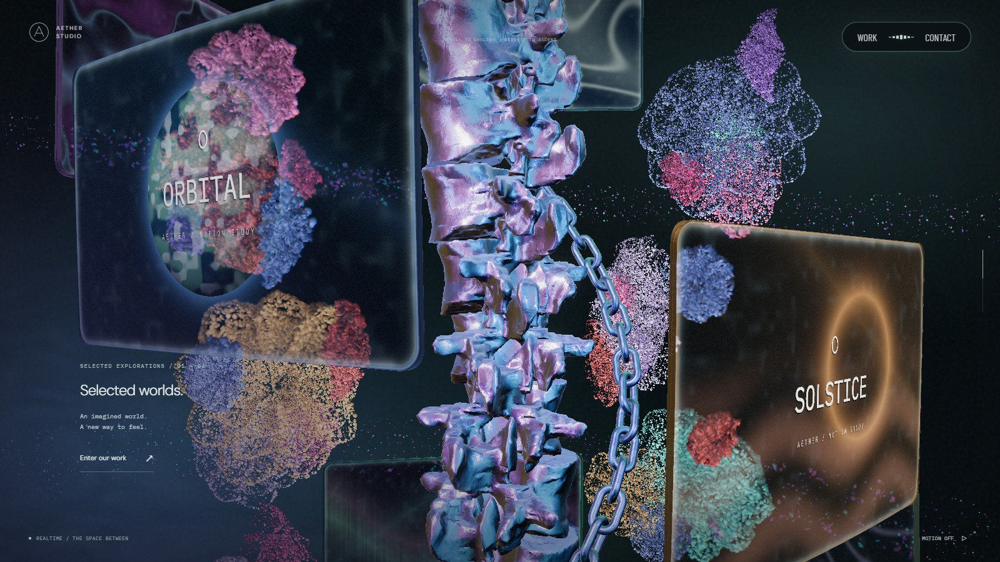 | 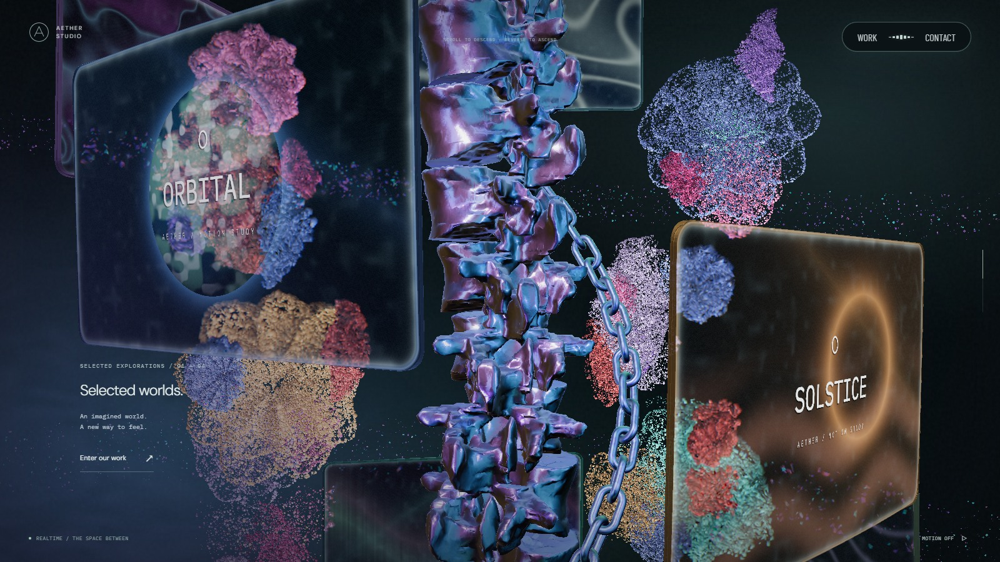 | 유리면 주변의 입자 배치 |
| 하단 링 진입 · 91% | 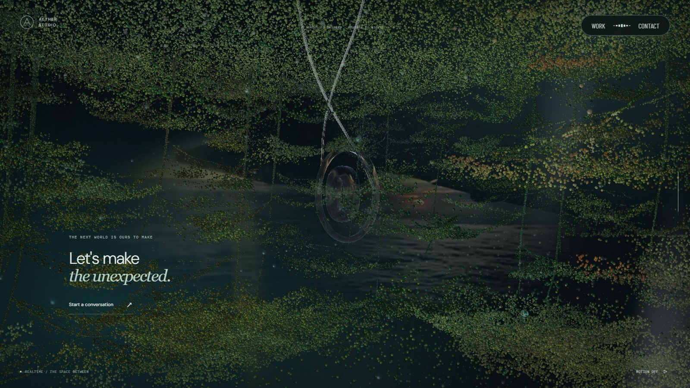 | 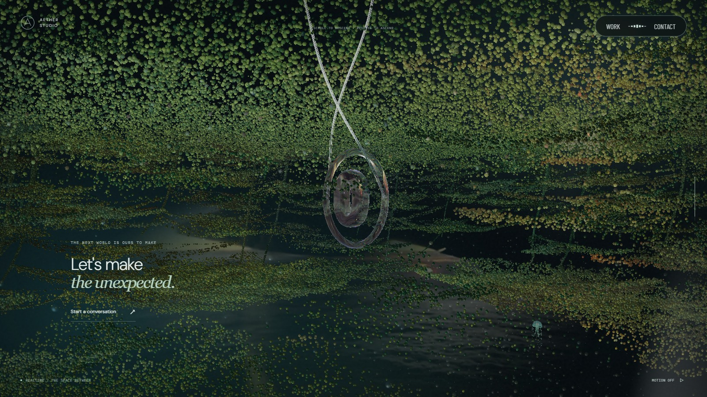 | 경계 뒤 링의 완성된 형태 |

문구가 모두 드러난 [22% 지점의 수정 후 화면](verification/height-assembly/text-full-after.jpg)에서도 사선 빛 번짐을 확인했다.

## 검증 범위

GPU 셰이더 검사에서 기존 꽃의 위치·밀도 유지, 추가 입자의 수직 이동·역방향 복원, 모니터 유리면과의 간격, 하단 링의 일정한 알파를 확인했다. 모니터로 접근하는 31개 깊이에서도 유리면 앞뒤를 통과하지 않고 연속 이동하는지 검사했다. 포레스트 높이·이동 입자 비율·높이별 합류와 패널의 연속 상승도 검사한다. 전체 실행 결과는 PR 검증란에 기록한다.

실제 GPU 화면은 1600×900, 2480×1080, 390×844에서 확인했다. 모바일은 Chromium 에뮬레이션이며 실제 Safari/iOS와 저사양 GPU의 장시간 성능은 확인하지 않았다. 꽃의 추가 입자는 일반 데스크톱 120,000개, 모바일 38,000개, 소프트웨어 모드 3,600개다. AT와 동일한 자산이나 물리 시뮬레이션을 사용한 것은 아니다.
