

# 포레스트·평면 소개·지하층 전환과 포인터 반응

포레스트·소개·지하층을 연결한 초기 전환 기록이다. 아래 입자 수·캡처·검사 결과는 당시 조건이다. 현재 장면 경계와 포인터 효과의 범위는 [구조 문서](architecture.md)에서 확인한다.

2026-09-22. [Active Theory](https://activetheory.net/)를 실제 마우스 휠로 내려갔다 되돌아오며 관찰하고, 사용자가 제공한 전환 캡처 7장을 비교했습니다. 원본의 코드·모델·영상은 사용하지 않았습니다.

## 달라진 흐름

- **포레스트 → 소개 → 본 컬럼:** 전경·중경의 수관 입자와 골짜기 안개가 사선 경계를 따라 위로 올라갑니다. 평면 소개 문구 앞에 확대된 3D O 링이 남고, 아래에서 모니터와 본 컬럼이 들어옵니다.
- **모니터 → 리액터:** 모니터 화면은 사선으로 위쪽부터 남아 있다가 사라지고, 본 컬럼과 입자는 위로 이동하며 리액터를 드러냅니다.
- **리액터 → 스케일 패널:** 리액터 중심 `Y=-40.4`, 바닥 `Y=-44.1`, 스케일 패널 중심 `Y=-48.0`을 각각 고정했습니다. 카메라가 그 사이를 내려가며 유한한 바닥의 위·아래를 통과합니다.
- **스케일 패널 → 포레스트:** 스케일 패널과 그 위의 평면 문구가 함께 위로 지나가고, 아래에서 다음 포레스트 입자층이 사선으로 들어옵니다. 마지막 O 링은 상하로 뒤집히지 않습니다.

| 대상 | 변경 전 | 변경 후 | 판단 포인트 |
| --- | --- | --- | --- |
| 포레스트와 평면 소개 | 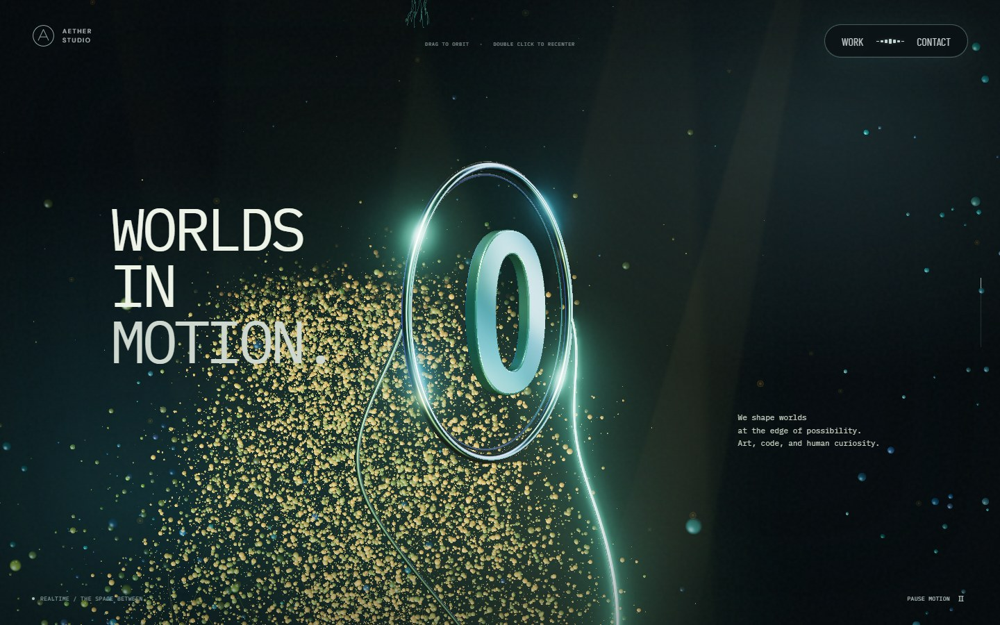 | 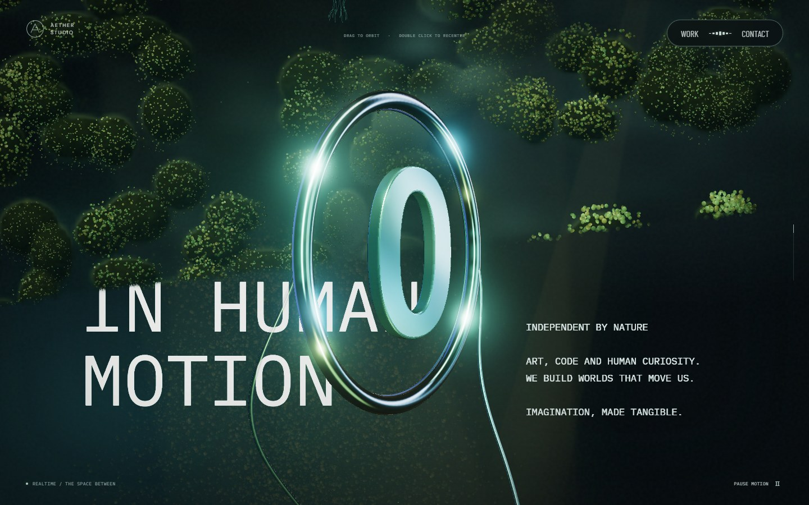 | 화면 전체 수관과 사선 경계, 문구 앞의 3D 링 |
| 모니터에서 리액터로 | 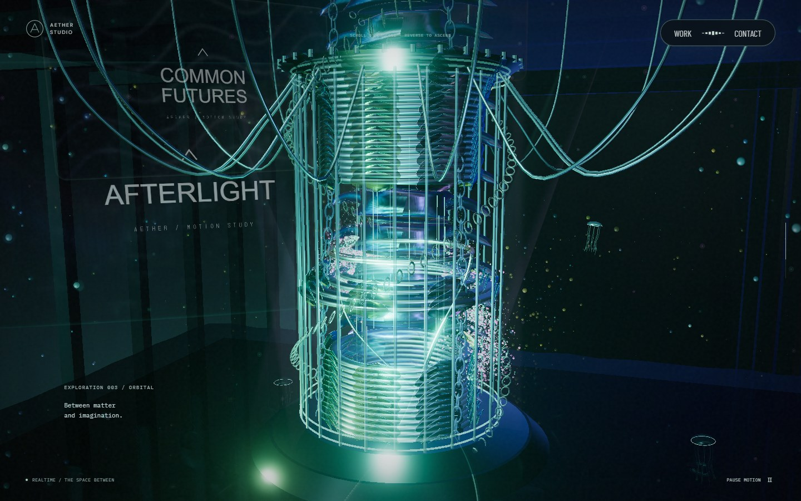 | 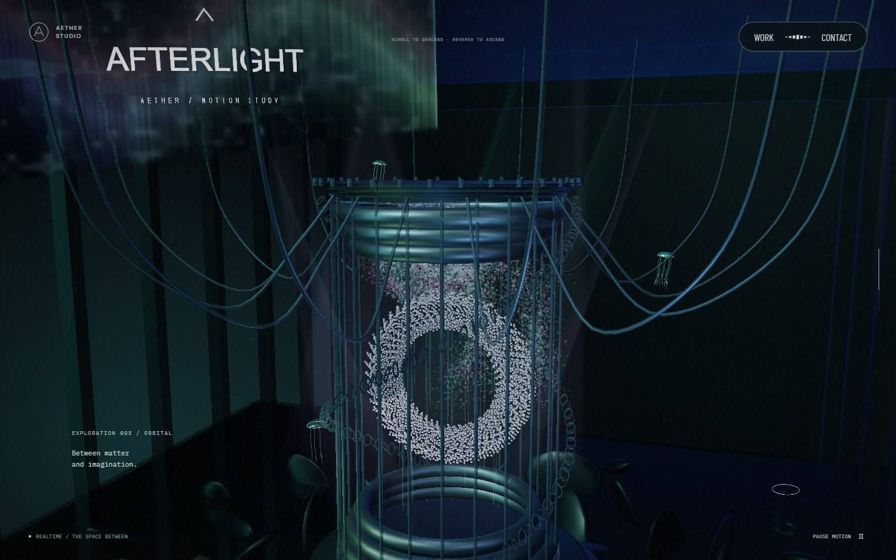 | 모니터가 위로 지나가며 드러나는 리액터 |
| 바닥 아래 스케일 패널 | 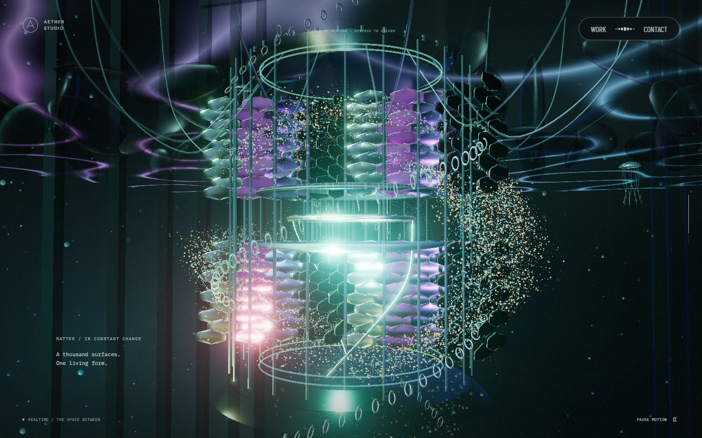 | 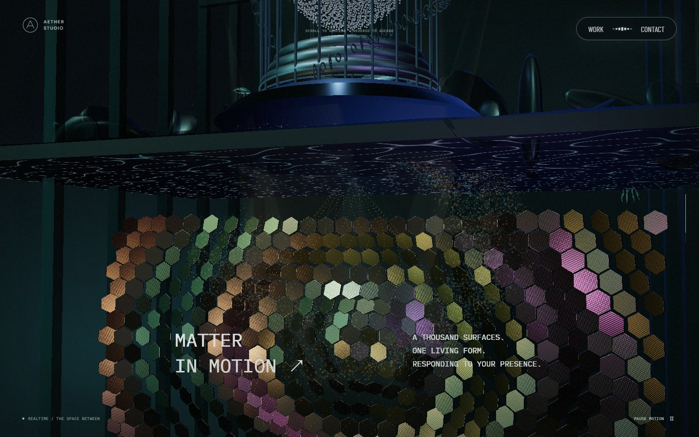 | 같은 화면 안에서 분리되는 리액터·바닥·스케일 패널 |
| 스케일 패널에서 포레스트로 | 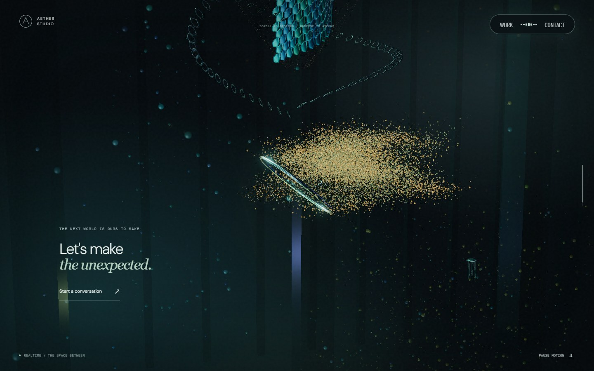 | 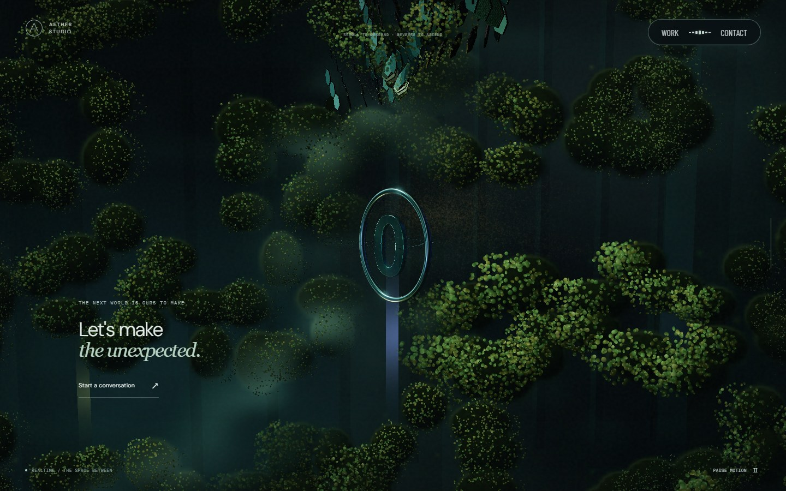 | 위로 이동하는 스케일 패널과 아래에서 올라오는 포레스트 |

동일한 1440×900 뷰포트와 스크롤 비율의 production 빌드 캡처입니다. 정지 위치는 같지만 자율 영상·조명 시계는 일치시키지 않았습니다.

## 움직임과 입력

| 상단 실제 휠 입력 | 하단 실제 휠 입력 |
| --- | --- |
| 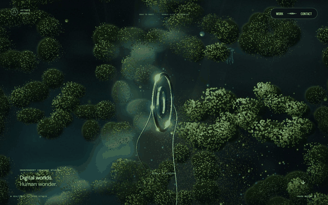 | 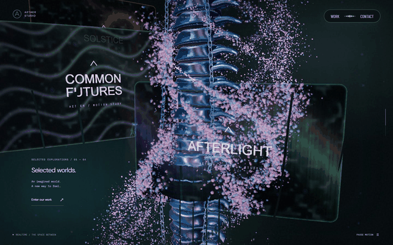 |

GIF는 실제 wheel 입력 중 캡처한 화면의 요약이며 실시간 FPS 영상은 아닙니다. 각 구간을 다시 위로 스크롤해 카메라 높이가 복원되는 흐름도 확인했습니다.

카메라 드래그 권한과 마우스 조명은 분리했습니다. 본 컬럼·모니터·리액터·스케일 패널 구간에서 카메라는 잠겨 있지만, 마우스 주변 입자는 부드럽게 밀리며 은녹색·진주빛으로 밝아지고 스케일 패널은 국소적으로 굴곡과 반사광이 변합니다. 독립적인 곡선 흔적은 길이와 폭을 늘리고 밝기를 낮췄습니다. 조명 입력은 이동 후 감쇠하며, 버튼·대화상자·화면 이탈·탭 숨김·모션 축소에서는 초기화합니다.

| 포레스트의 국소 조명 | 스케일 패널의 국소 반응 |
| --- | --- |
| 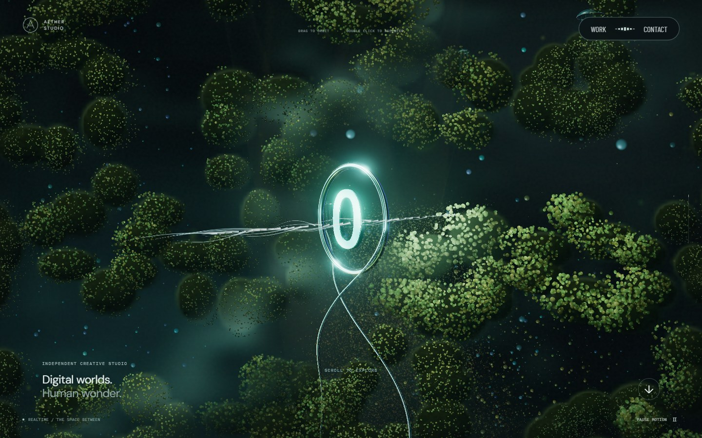 | 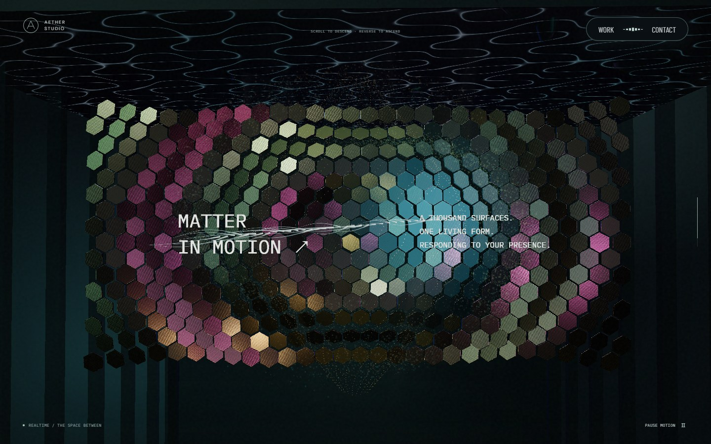 |

## 비용과 검증 경계

포레스트는 최대 35,000개 입자와 3 draw로 구성합니다. 모바일은 12,000개, 소프트웨어 렌더러는 3,500개로 줄입니다. 수관 바탕은 직접 생성한 작은 밀도 텍스처이며 외부 이미지 요청이 없습니다. 스케일 패널은 정적 인스턴스 행렬을 공유하고 변위를 GPU에서 계산합니다. 포레스트 입자의 크기는 적응형 해상도 변경을 포함한 실제 renderer DPR을 사용합니다.

27개 Playwright 항목은 기존 탐색·카메라·정지/왕복·굴절 RT 복구에 더해 포인터의 수명, 실제 리액터·바닥·스케일 패널 높이, 평면 전환 경계값, 독립 장면에서 production 스케일 패널 셰이더의 실제 픽셀 변화와 원복을 검사합니다. 사선 경계의 가림 순서와 전체 장면의 포인터 연결은 실제 캡처로 별도 확인했습니다. [입력 증거](screenshots/transitions/input-evidence.json)에 실제 화면 검수 결과를 보관합니다.

로컬 production 빌드에서 lint·타입 검사·빌드와 27개 테스트가 모두 통과했습니다. 데스크톱 33장·모바일 21장, 실제 휠과 입력 84개 지점의 브라우저 오류는 0건입니다. 이 GPU 환경에서 캡처 지점의 프레임 시간 진단값 중앙값은 각각 16.7ms·16.7ms·16.8ms였습니다. 전체 프레임 표본의 성능 벤치마크나 저사양 기기 보장은 아닙니다.

리뷰에서 확인한 스케일 패널 문구의 접근성 회귀도 수정했습니다. Canvas가 정상일 때는 DOM 문구의 투명도만 낮춰 스크린리더에 남기고, WebGL이 없으면 보이는 문구를 유지합니다. 기존 데스크톱·모바일 스크롤 및 WebGL 미지원 테스트에서 접근성 트리의 텍스트를 함께 검사합니다. Linux SwiftShader의 정지 화면 연속 캡처 시간 초과는 실제 production WebGL 렌더 직후의 픽셀을 직접 읽는 방식으로 회피합니다. 동일 영역·고정 시계·이미지의 엄격한 일치와 드래그 후 변화 판정은 유지하며, 빈 버퍼·컨텍스트 손실·읽기 오류도 검사합니다. DOM 합성은 별도 UI 테스트와 실제 화면 캡처로 확인합니다.

모바일은 390×844 Chromium 에뮬레이션으로 확인했습니다. 실제 Safari/iOS 기기 검증과 시각적 유사도 백분율 측정은 수행하지 않았습니다. 원본의 복잡한 모델·광학 표현과 동일한 구현이라는 의미는 아닙니다.

| 모바일 소개 전환 | 모바일 지하층 | 모바일 하단 포레스트 |
| --- | --- | --- |
| 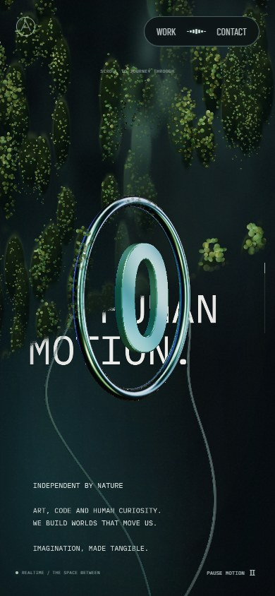 | 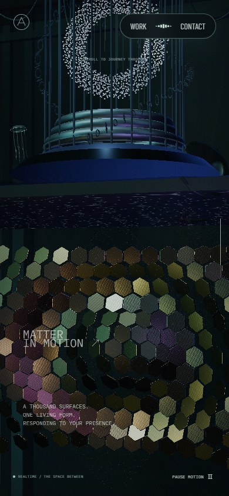 | 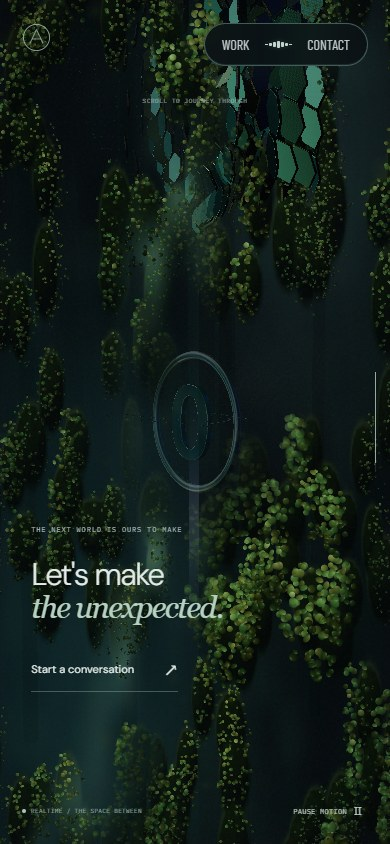 |
