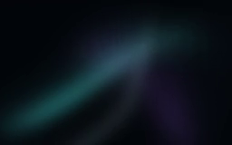
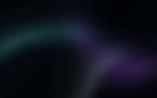
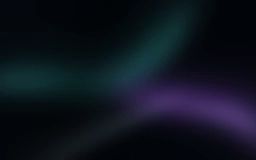

# 공유 조명 영상

숲과 지하 장치에 투사하는 [`light-projection.mp4`](../public/media/light-projection.mp4)는 독립적인 수식으로 만든 어두운 추상 조명 루프입니다. 흑연색 바탕에 딥청록·잉크보라·희미한 실버를 겹쳐 비대칭 사틴 곡면과 연무가 천천히 움직입니다. 넓은 검은 여백과 부드러운 반사광의 대비를 유지하며, 순백 윤곽선·명확한 소용돌이·격자를 만들지 않습니다. 모니터 영상을 색 보정하거나 샘플링한 파생본이 아니며 외부 영상 자산도 사용하지 않습니다.

| 항목 | 값 |
| --- | --- |
| 파일 | [`light-projection.mp4`](../public/media/light-projection.mp4) |
| 크기 | 40,498 bytes — 생성 상한 400,000 bytes |
| 규격 | 256 × 160, 12 fps, 14초, 168프레임 |
| 포맷 | H.264 Main / yuv420p, 무음, faststart |
| SHA-256 | `0b8e42c3a247292b7e6513a6a922cb1260dfa7237f3ff2e0614f7272a0d6779d` |
| 제작 방식 | 입력 영상 없이 주기적 수식으로 RGB 프레임 생성 |

크기와 위치가 다른 세 곡면의 방향·굴곡·반사광을 14초 위상의 정수 배수로 변화시킵니다. 넓은 그림자가 곡면을 가로지르며 빛의 위치와 색이 달라집니다. 수식의 0초와 14초 결과는 같고, 실제 파일에는 0초부터 167/12초까지의 168프레임을 담습니다.

## 실제 디코딩 프레임

다음은 게시된 MP4 전체 디코딩 결과에서 꺼낸 원본 해상도 스틸입니다. 밝기를 올리거나 색을 보정하지 않았습니다. 사이트의 최종 렌더링 캡처가 아니라 투사에 사용하는 영상 자체를 비교합니다.

| 1초 · 청록 사틴 | 5.5초 · 보라 연무 | 10초 · 흑연 반사광 |
| --- | --- | --- |
|  |  |  |

## 밝기와 반복 경계 검증

아래 밝기는 전체 168프레임의 디코딩된 RGB에 `0.2126 R + 0.7152 G + 0.0722 B`를 적용한 0–255 범위의 luma입니다. 선형 광량이나 최종 WebGL 화면의 밝기가 아닙니다.

| 전체 디코딩 결과 | 값 |
| --- | --- |
| 평균 luma | 19.03191 |
| luma 95 / 99백분위 | 49.52420 / 65.70780 |
| 최대 luma | 89.56220 — 생성 검증 상한 160 |
| luma 24 미만의 픽셀 비율 | 70.0672% — 생성 허용 범위 40–95% |
| luma 150 초과의 픽셀 비율 | 0% |
| 프레임별 평균 luma의 최소 / 최대 | 18.04792 / 20.28342 |

[`생성 스크립트`](../scripts/generate-light-video.py)는 168프레임 전체를 RGB로 디코딩하고 크기·프레임 수·12 fps·14초·무음·H.264/yuv420p·faststart를 확인합니다. 밝기 상한과 검은 여백 비율을 벗어나면 게시하지 않습니다.

반복 경계는 마지막→첫 프레임의 평균 절대 RGB 차이와 **모든 인접 프레임 쌍**의 차이를 비교합니다. 이번 파일의 반복 경계 차이는 1.01357/255, 인접 차이의 95백분위는 0.82772/255입니다. 허용 상한 `max(1, 인접 p95 × 1.65)`인 1.36574/255 이내이며 수식의 0초·14초 결과도 동일합니다. 이는 인코딩 후 반복 경계가 통상적인 프레임 변화보다 과도하게 튀지 않는지 확인한 결과입니다. 저장된 마지막 프레임과 첫 프레임이 같은 이미지라는 뜻은 아닙니다.

상세 수치와 해시는 [`미디어 manifest`](../public/media/light-projection-manifest.json)에 기록합니다. 실제 숲·장치에서의 색, 광선, 가림과 디코더 성능은 이 CPU 영상 검사와 별도로 전체 장면에서 확인해야 합니다.

## 모니터 자산 보호와 재생 수명

생성 시 `chrome-current.mp4`, `aurora-bloom.mp4`, 대응 WebM 두 편, `media-manifest.json`, `monitor-webm-manifest.json`의 SHA-256을 전후 대조합니다. 이번 생성에서도 6개 보호 파일은 모두 동일했습니다. 이 파일들은 영상 입력이나 쓰기 대상이 아니며, 조명 manifest의 `sources`는 빈 배열입니다. 보호 대상 해시는 `protected_monitor_hashes_before`와 `protected_monitor_hashes_after`에 따로 남깁니다.

조명 영상은 모니터 영상과 별도로 하나의 디코더와 텍스처를 공유합니다. 요청은 호출부가 실제 조명 구간을 활성화할 때 시작합니다. 초기 모션 감소 상태에서는 URL을 연결하지 않으며 호출부는 소프트웨어 렌더링에서도 활성화를 차단합니다. 탭 숨김, 장면 비활성화, 모션 일시 정지에서는 재생을 멈추고 받은 프레임과 재생 위치를 유지합니다. 재생 거부 또는 미디어 오류는 해당 소유자의 수명 동안 재시도하지 않으며 조명 셰이더는 기본 절차적 효과로 돌아갑니다.

[`SceneLightVideo.ts`](../src/SceneLightVideo.ts)의 `texture`는 준비 상태에 따라 검은 1px 텍스처 또는 영상 텍스처를 반환하는 getter입니다. 호출부는 `texture`와 `getReady()`를 공유 조명 uniform에 함께 반영합니다. `dispose()`는 재생, 미디어 URL, 프레임 콜백, 이벤트 리스너와 두 텍스처를 정리합니다. [`수명 테스트`](../tests/light-video.spec.ts)의 DOM 모의 검증과 실제 브라우저·디코더 검증은 구분합니다.

## 재생성

Python, **NumPy**, FFmpeg가 필요합니다. `--qa-dir`로 PNG 스틸을 만들 때는 **Pillow**도 필요합니다. FFmpeg가 PATH에 없으면 `--ffmpeg`로 기존 실행 파일을 지정하거나 설치된 `imageio-ffmpeg`의 번들 실행 파일을 사용합니다. 생성 과정에서 외부 영상이나 실행 파일을 다운로드하지 않습니다.

```powershell
python scripts/generate-light-video.py
python scripts/generate-light-video.py --ffmpeg "C:\tools\ffmpeg.exe"
python scripts/generate-light-video.py --qa-dir .qa/light-film/stills
python scripts/generate-light-video.py --output-dir .qa/light-film/candidate --qa-dir .qa/light-film/stills
```

기본 출력 위치는 `public/media`입니다. `--output-dir`로 검수용 후보를 별도 디렉터리에 만들 수 있습니다. 인코딩은 libx264, CRF 22, 최대 비트레이트 160k, GOP 24, 단일 스레드를 사용합니다. 임시 디렉터리에서 인코딩·전체 디코딩·밝기·반복 경계·보호 파일 검사를 마친 뒤 파일별로 원자적 교체하고 manifest를 마지막에 게시합니다. 두 파일을 하나의 트랜잭션으로 교체하는 방식은 아닙니다.

`--qa-dir`에는 1초·5.5초·10초의 실제 디코딩 PNG와 평균 RGB, 전체 luma, 반복 경계 검사 결과를 저장합니다. 제작 환경의 FFmpeg 버전은 manifest에 기록하며 버전과 인코더 차이로 출력 해시는 달라질 수 있습니다. 최종 표면의 밝기는 이 영상의 luma만으로 보장하지 않고 조명 셰이더와 함께 검수합니다.
