

# 월드 공간 포레스트·본 컬럼·리액터 개선

[배포 사이트](https://aether-studio-nu.vercel.app/) · [이전 모니터 개선](monitor-cinema.md)

2026-09-22. Active Theory의 실제 스크롤·정지·역스크롤·상하단 드래그와 포인터 잔광을 관찰하고, 사용자 제공 전환 이미지를 함께 참고했습니다. 원본의 코드나 자산을 복사하지 않았습니다. 나무, 가지, 고사리형 잎, 부서진 바닥과 리액터 부품은 이 저장소에서 절차적으로 생성합니다.

## 바뀐 동작

- 포레스트의 둥근 구체 군집을 실제 가지와 작은 잎이 있는 월드 공간 구조로 교체했습니다. 상단과 하단 포레스트는 각각 고정된 높이에 있고, 링을 중심으로 드래그하면 원근과 가림이 함께 바뀝니다. 카메라 가까이에 지나오는 가지는 부드럽게 사라져 화면을 덮지 않습니다.
- 링과 평면 소개에서 본 컬럼·모니터로 넘어갈 때 같은 사선 경계를 공유합니다. 링은 위쪽에 남고 본 컬럼과 영상 판은 아래에서 드러납니다. 역스크롤에서도 같은 경계를 되짚습니다.
- 본 컬럼 체인은 앞과 뒤를 지나며 두 줄의 나선으로 감깁니다. 본 컬럼과 체인 위치는 스크롤로 결정되며 정착 후 멈춥니다. 시간은 영상, 조명과 미세 반짝임에 사용합니다.
- 본 컬럼 입자를 고정 역할과 스크롤 이류 역할로 나누었습니다. 여기서 고정은 입자 흐름 안에서 이류하지 않는다는 뜻이며, 카메라 하강까지 무시하는 화면 고정은 아닙니다. 포인터 근처의 추가 이동은 현재 스크롤 방향을 따르고, 정지하면 추가 위치 변화가 사라집니다.
- 같은 입자 흐름이 리액터의 고정 높이로 내려가 O로 모입니다. 별도로 겹쳐 있던 리액터 입자 코어를 제거했습니다. O의 국소 조명과 색 반응은 유지합니다.
- 마우스 잔광의 밝은 선두 광점이 입력을 멈춘 뒤에도 완만한 곡선을 따라 전진합니다. 잔광 궤적은 선두 광점의 이전 경로를 따르며 약 2.35초에 사라집니다. 생성점에 고정된 채 뾰족하게 늘어나던 스트릭의 형상을 수정했습니다.
- 리액터에 얇은 금속 층, 지지대와 전선, 표면 마모를 적용하고 주변에 부서진 지층·바닥 판·배관을 배치했습니다. 반사 바닥 아래로 내려가면 금속 스케일 패널 구간으로 이어집니다.
- 스케일 패널 퇴장을 94%까지 완료하고 하단 포레스트의 카메라 입력을 94~97.5%에 점진적으로 복귀시킵니다. 본 컬럼·리액터·스케일 패널 본구간의 드래그 잠금은 유지합니다. 수치는 AETHER 타임라인입니다.

## 성능과 자산

상·하단 포레스트는 같은 geometry와 material을 공유하며 현재 보이는 포레스트만 렌더합니다. 잎·미세 입자 합계 예산은 데스크톱 60,000 / 모바일 18,000 / 소프트웨어 4,500입니다. 나무와 잎은 인스턴싱하고, 작은 입자는 Points로 그려 활성 포레스트 전체가 3 draw입니다. 리액터·본 컬럼의 중복 입자 draw를 제거하고 잔광은 새 입력이나 수명 만료가 있을 때만 CPU 버퍼를 다시 작성합니다. 선두 광점과 잔광 궤적의 이동은 셰이더에서 처리합니다.

기존 적응형 DPR, 모바일·소프트웨어 품질 예산, 콘텐츠 화면·숨긴 탭의 렌더 중단을 유지합니다. 영상 두 편은 기존 자체 제작 MP4 합계 약 2.10MB를 그대로 사용하므로 외부 저장소나 추가 미디어 다운로드는 필요하지 않습니다.

## 검증

같은 1440×900·DPR 1·기본 카메라·동일 스크롤 위치의 실제 GPU 화면입니다. 영상 프레임과 반짝임 시각은 다릅니다. 광학 유사도 백분율은 측정하거나 인증하지 않습니다.

| 대상 | 변경 전 | 변경 후 | 판단 포인트 |
| --- | --- | --- | --- |
| 상단 포레스트 0% | 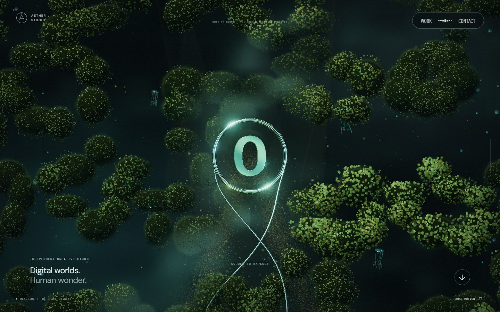 | 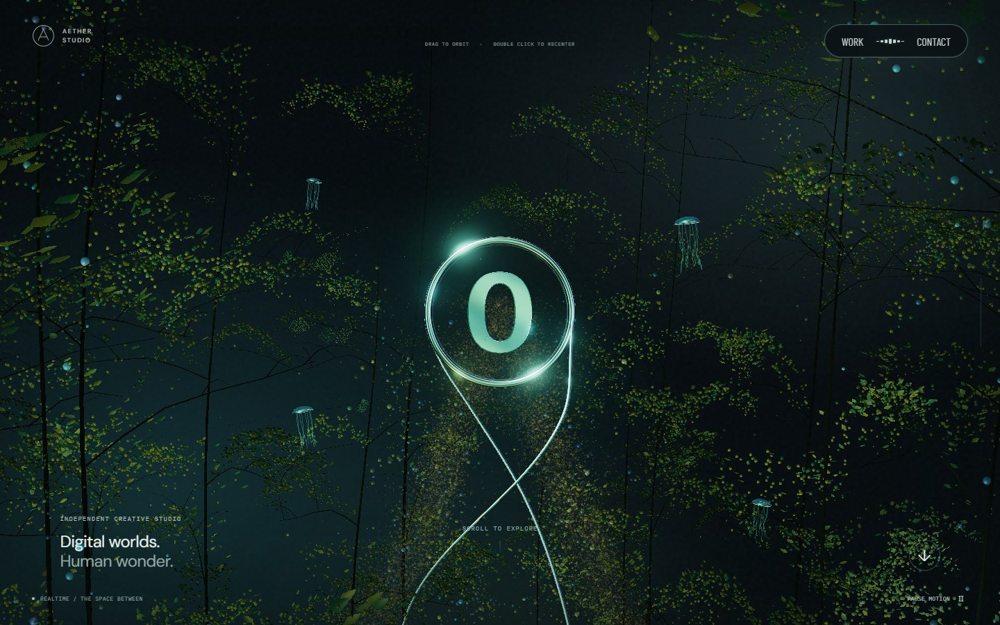 | 구형 군집 대신 가지를 따라 이어지는 입체 포레스트 |
| 본 컬럼 34% | 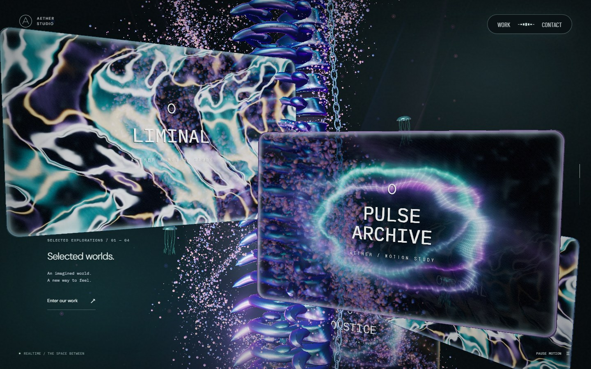 | 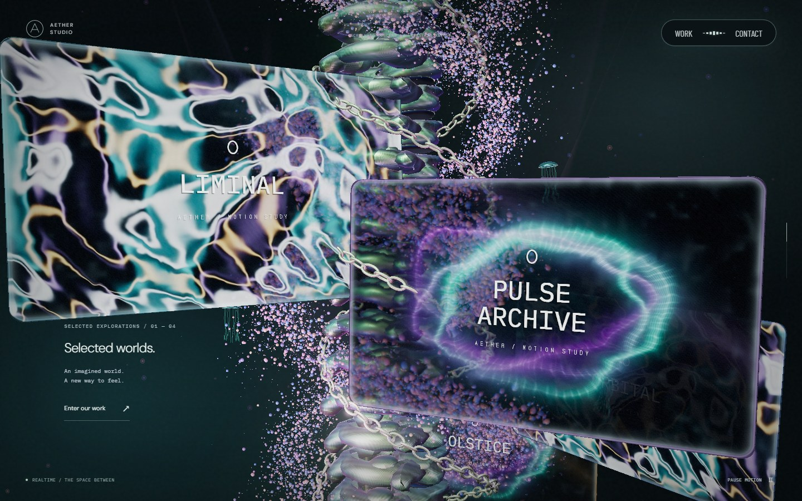 | 앞뒤로 감기는 체인과 스크롤 연동 입자 |
| 리액터 70% | 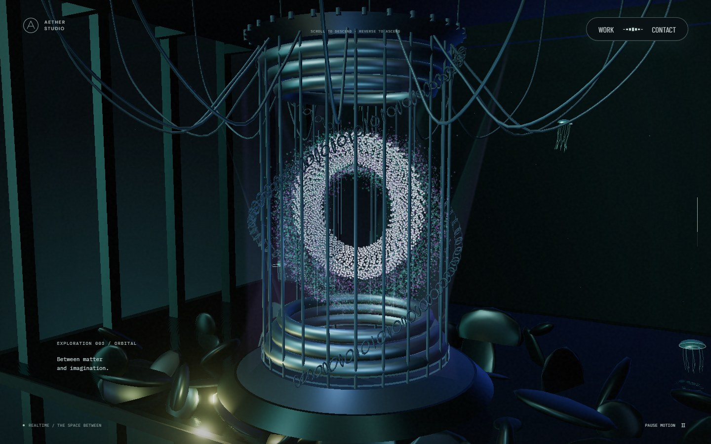 | 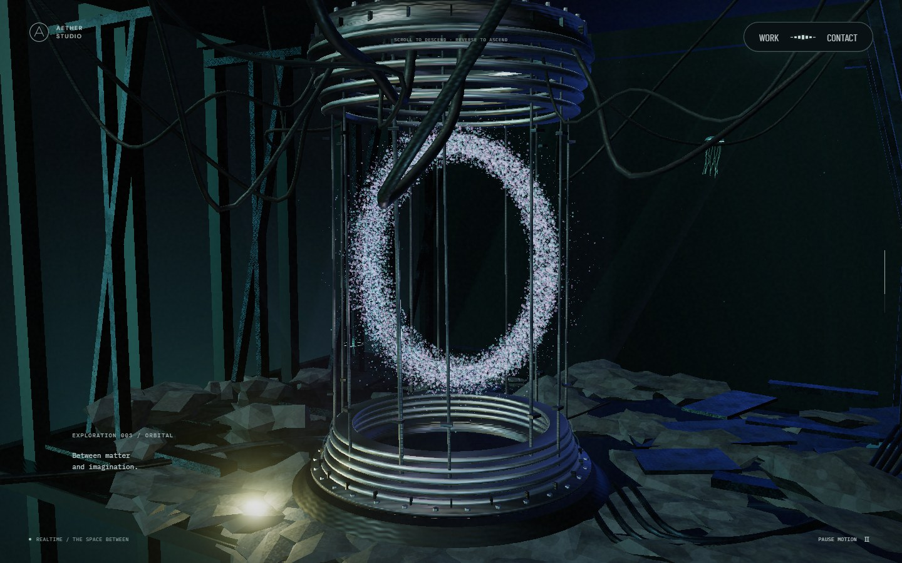 | 단일 입자 O, 얇은 금속 층·전선·지층 |
| 바닥 통과 76% | 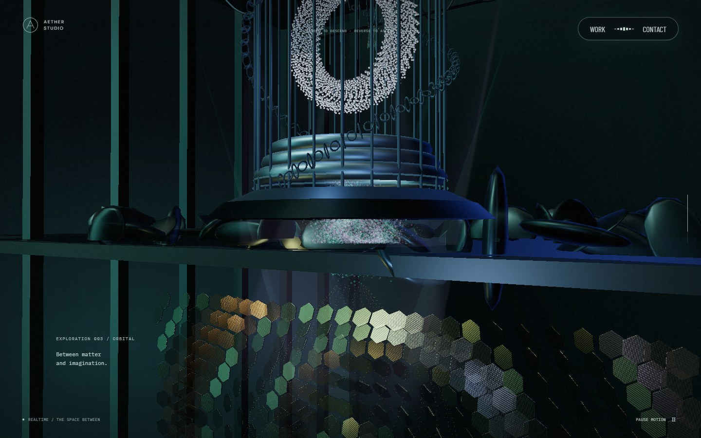 | 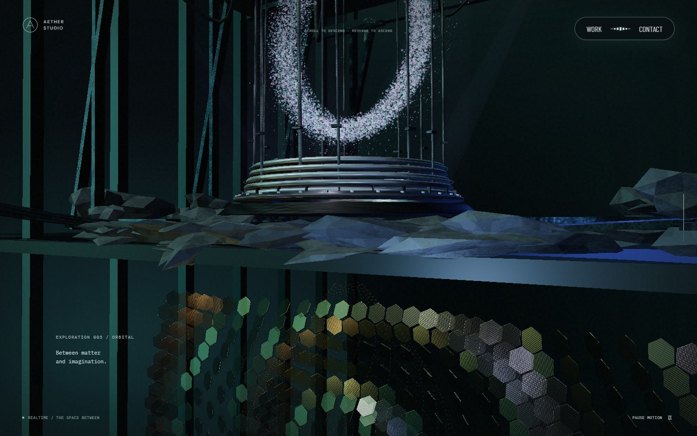 | 바닥 위 리액터와 아래 스케일 패널의 분리 |
| 하단 포레스트 98% | 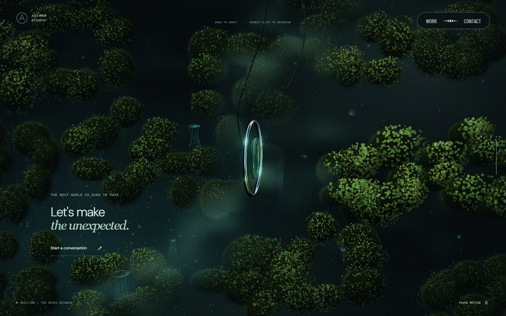 | 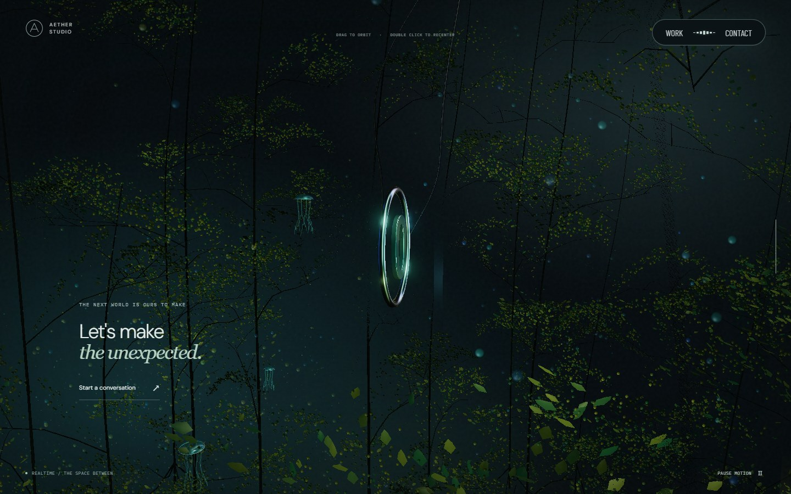 | 포레스트 교체와 링 중심 드래그 복구 |

| 사선 전환 27% | 정지 뒤 전진하는 섬광 |
| --- | --- |
| 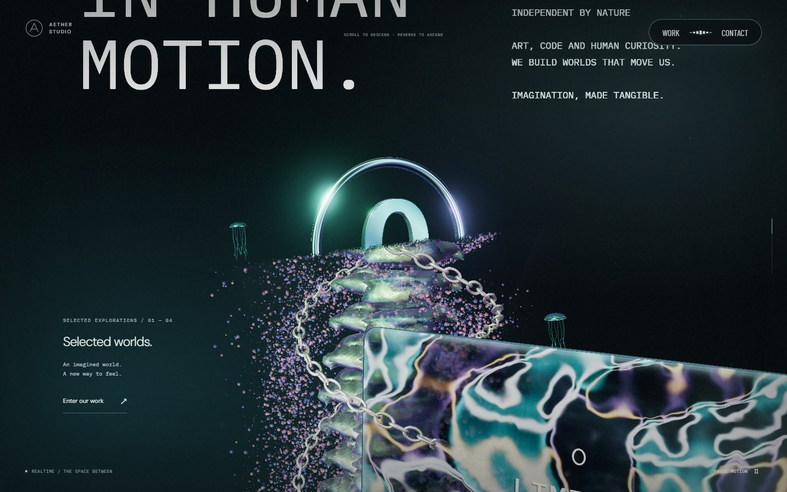 | 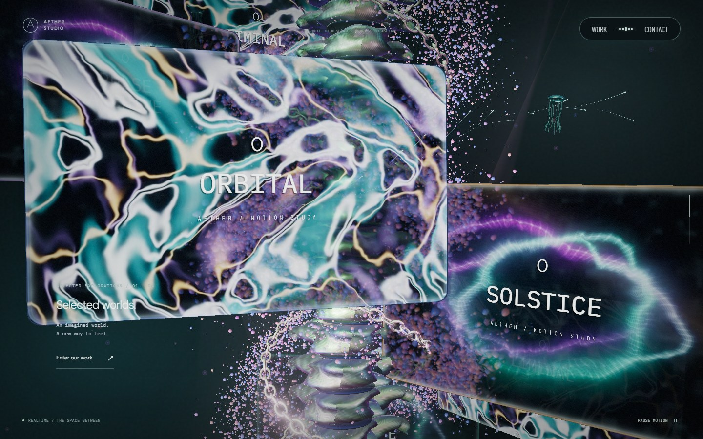 |

원본에서 pointer 정지 후 선두 광점이 전진하는 잔광, +700/-700 휠에 따른 본 컬럼 체인의 전진·복귀, 상·하부 링 드래그를 확인했습니다. 원본 내부 구현·정확한 입자 속도는 추정하지 않았습니다.

최종 production 빌드에서 연속 휠 입력 42장, 데스크톱 14개 정착 지점과 드래그·잔광, 모바일 6개 지점을 캡처했습니다. 브라우저 오류는 0건입니다. 레드팀 검수에서 별도 본 컬럼 core가 사선 위로 새는 경로를 발견했고 `4f76963`에서 제거한 뒤 다시 캡처했습니다.

자동 검사는 36개입니다. 로컬 전체 실행에서 34개가 통과했고, 새 픽셀 좌표 계측 필드와 작은 섬광의 존재 검사 기준을 수정한 뒤 나머지 2개도 재검증했습니다. 새로운 검사는 실제 체인 행렬의 앞뒤 감기·정지·복귀, 입자 역할 분리·스크롤 부호·리액터 높이, 포레스트의 월드 행렬과 카메라 시차, 입력 정지 후 선두 광점의 픽셀 전진을 확인합니다. lint·타입 검사·production build도 통과했습니다.

## 성능 측정

Windows Chromium D3D11, 1440×900·DPR 1, 각 지점 정착 후 120개의 requestAnimationFrame 간격을 측정했습니다. 0/34/70/84/98% 모두 중앙값 16.7ms, p95 16.7~16.8ms였으며 적응 품질은 1.00을 유지했습니다. 이는 이 장비·브라우저의 관측값이며 GPU 실행 시간이나 모든 기기의 60fps를 보장하지 않습니다. [원시 요약](screenshots/living/performance.json)

실제 Safari/iOS 하드웨어는 검증하지 않았습니다. 시각 형태는 자체 생성한 해석이며 원본 모델·조명과 동일하다는 의미는 아닙니다.
