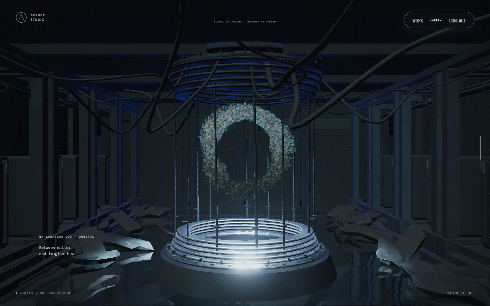

# 초기 로딩 측정과 꽃 입자 생성 최적화

현재 화면을 유지하면서 로딩 시간을 줄이는 첫 작업이다. 기준 구현은 `5e2454c`이며, 변경 전후 빌드에 같은 위치의 로딩 계측을 넣어 비교했다. 입자 수·형상·재질·해상도·반사·영상·로딩 숫자의 속도는 바꾸지 않았다.

## 확인한 병목과 변경

처음 프로파일링했을 때 장면 생성 중 긴 메인 스레드 작업이 있었고, 꽃 입자 생성에서 회전 계산·색 문자열 해석·임시 배열 생성이 반복됐다. GPU 프로그램 준비도 큰 비중을 차지했다. 이번에는 결과가 같은지 바이트 단위로 확인할 수 있는 CPU 계산부터 줄였다.

- 꽃마다 정해지는 층·방향·중심/주변 꽃 조합은 40개다. 각 조합의 크기·회전·이동과 색을 한 번 계산하고 샘플들이 재사용한다.
- 입자 배열을 채울 때 임시 JavaScript 배열을 만든 뒤 복사하던 부분을 TypedArray에 직접 쓰도록 바꿨다.
- 난수 호출 순서와 계산 순서는 유지했다. 위치·입자 속성·이동 구분·리액터 UV·꽃 위치·법선·색의 7개 배열은 세 품질 프로필 모두 기존 SHA-256과 일치한다. [기준 해시](../tests/fixtures/atmosphere-attributes.json), [회귀 검사](../tests/atmosphere-attributes.spec.ts)

장면 생성을 뒤로 미루거나 두 출력 경로의 셰이더 사전 컴파일을 생략하지 않았다. 생성 결과를 파일로 추가하지 않아 별도 다운로드나 디코딩 단계도 생기지 않는다.

## PC 측정 결과

Windows, RTX 2060 SUPER, Chromium 153.0.8010.12, ANGLE D3D11, 1440×900, DPR 1에서 로컬 production preview를 사용했다. 전후 순서를 번갈아 5쌍 측정했고, 각 빌드에서 새 브라우저 방문 후 같은 브라우저로 한 번 새로고침했다. 아래 값은 각 조건 5회의 중앙값이다.

| 항목 | 변경 전 | 변경 후 | 차이 |
| --- | ---: | ---: | ---: |
| 첫 방문 · 입자 생성 | 629.2ms | 314.8ms | 314.4ms 감소 · 약 50.0% |
| 첫 방문 · 실제 첫 프레임 | 5,747.7ms | 5,389.6ms | 358.1ms 감소 |
| 첫 방문 · 로딩 표시 종료 | 6,426.3ms | 6,114.8ms | 311.5ms 감소 · 약 4.8% |
| 새로고침 · 입자 생성 | 638.1ms | 309.0ms | 329.1ms 감소 |
| 새로고침 · 실제 첫 프레임 | 2,052.8ms | 1,762.5ms | 290.3ms 감소 |
| 새로고침 · 로딩 표시 종료 | 4,538.2ms | 4,171.3ms | 366.9ms 감소 · 약 8.1% |

PC 20회 모두 첫 왕복 스크롤의 RAF 간격 p95는 16.7~16.8ms였고, 33.5ms 초과 구간은 없었다. 품질 계수는 1.00으로 유지됐다. RAF 간격은 GPU 실행 시간이나 모든 기기의 FPS를 뜻하지 않는다.

같은 PC에서 화면만 390×844, DPR 1로 바꾼 3쌍 비교에서는 첫 방문의 입자 생성이 222.2→129.2ms, 로딩 표시 종료가 5,403.8→5,258.1ms였다. 새로고침은 각각 217.9→113.8ms, 3,556.9→3,462.7ms였다. 이 조건의 12회 왕복도 RAF p95 16.7~16.8ms, 33.5ms 초과 0회였다. 모바일 화면용 코드 경로를 확인한 것이며 실제 휴대폰 성능은 아니다.

원자료: [PC 20회](evidence/loading-2026-09-27/desktop.json), [작은 화면 12회](evidence/loading-2026-09-27/mobile-viewport.json), [배열 비교](evidence/loading-2026-09-27/attribute-comparison.json). 배열 비교 파일의 일회성 생성 시간은 위 브라우저 반복 측정과 별개다.

비교한 JS 빌드의 해시는 [빌드 기록](evidence/loading-2026-09-27/build-manifest.json)에 있다.

### 전송·파싱·CPU·GPU 준비의 구분

| 구간 · 첫 방문 중앙값 | 변경 전 | 변경 후 | 해석 |
| --- | ---: | ---: | --- |
| Scene import 요청→평가 완료 | 88.1ms | 87.2ms | 전송·파싱·평가·스케줄링을 포함 |
| 마지막 JS 응답 완료→모듈 평가 완료 | 63.1ms | 61.5ms | 파싱 시간만 분리한 값은 아님 |
| 환경 맵 생성 | 670.1ms | 665.1ms | CPU와 동기 GPU 대기를 함께 포함 |
| 입자 생성 | 629.2ms | 314.8ms | 이번 수정 대상 |
| 나머지 장면·입력 생성 | 415.8ms | 415.0ms | 이번에 변경하지 않음 |
| 선형 출력 컴파일 대기 | 1,438.8ms | 1,424.5ms | CPU·드라이버·폴링을 포함한 벽시계 시간 |
| 화면 출력 컴파일 대기 | 1,378.6ms | 1,364.1ms | 두 출력 경로 준비 유지 |

주요 JS의 실제 전송 바이트 합은 첫 방문 중앙값 398,102→398,248바이트였다. 이번 변경은 전송량 개선이 아니며, 146바이트 증가했다. 로컬 연결 결과를 인터넷·모바일 회선의 다운로드 속도로 해석하지 않는다. 각 구간의 중앙값을 더해 총 로딩 시간으로 사용하지 않는다.

새 브라우저는 HTTP 캐시가 새로 시작하지만 OS·GPU 드라이버의 셰이더 캐시를 초기화하지 않는다. 새로고침의 캐시 사용은 각 Resource Timing의 전송량을 확인한다. CPU 샘플링과 WebGL 호출 래핑은 최초 원인 탐색에만 사용했고, 표의 반복 측정에서는 사용하지 않았다.

## 다시 측정하기

`?profileLoading=1`을 붙이면 브라우저의 User Timing에 `aether:` 항목이 기록된다. 기본 접속에서는 기록하지 않으며 수집 서버로 보내지 않는다. Scene import, renderer·환경·입자·장면 생성, 텍스처 업로드, 두 컴파일, 준비 렌더와 첫 프레임을 구분한다. 기록은 페이지를 새로고침하면 초기화된다.

```sh
# 변경 전후 production preview를 서로 다른 포트에서 실행한 뒤
node scripts/measure-loading.mjs --baseline http://127.0.0.1:5188 --candidate http://127.0.0.1:5187 --pairs 5 --output .qa/loading.json
# 작은 화면 비교는 --profile mobile을 추가한다.
```

[측정 스크립트](../scripts/measure-loading.mjs)는 GPU 프로필을 확인하고, 로딩 후 8초간 내려갔다 올라온다. 성능 측정 중 다른 GPU 검사나 캡처를 함께 실행하지 않는다. 서로 다른 브라우저·장비의 수치를 합치지 않는다.

## 품질과 남은 작업

### 시각적 변경

화면을 바꾸는 수정은 없다. 아래는 실제 GPU의 변경 전후 캡처다. 두 빌드 모두 1440×900, DPR 1, 동일 진행률·기본 시점을 사용했다. 시간과 영상 위상을 맞추기 위해 처음부터 OS 모션 축소를 켰고 영상은 시작하지 않았으며 CSS 애니메이션도 캡처에서만 껐다. 정상 모션의 성능 측정과 별개다.

| 대상 | 변경 전 | 변경 후 | 판단 포인트 |
| --- | --- | --- | --- |
| 본 컬럼·꽃·모니터 |  |  | 꽃의 위치·색·밀도, 모니터 반사 |
| 리액터 |  |  | O 입자와 수면, 주변 구조 |

본 컬럼·상단/하단 포레스트·스케일 패널은 픽셀 차이가 0이었다. 리액터는 1,296,000픽셀 중 1,079픽셀(약 0.083%)에서 RGB 채널 최대 1/255 차이가 있었다. 이 수치를 전체 화면 완전 일치로 표현하지 않는다. [촬영 상태](images/loading-2026-09-27/capture.json), [픽셀 비교](images/loading-2026-09-27/pixel-comparison.json)

이 최적화의 대가는 작은 배치 정보와 미리 해석한 색 객체를 잠시 보관하는 것이다. 이를 통해 입자별 객체 생성을 줄인다. 화질을 낮추는 옵션이나 장면별 지연 생성은 추가하지 않았다. 배열 해시 외에도 같은 조건의 실제 화면과 정상·실패·재진입 동작을 확인한다.

남은 초기 대기에서는 두 출력 경로의 셰이더 준비 비중이 크다. 다음에는 실제 배포의 회선별 로딩과 GPU/드라이버별 컴파일을 측정하고, 같은 결과를 만드는 중복 프로그램이 있는지 확인하는 편이 좋다. 컴파일을 지워 초기 시간만 줄이면 첫 장면 진입에서 끊길 수 있으므로 현재는 유지한다.

재방문에서는 실제 첫 프레임 뒤에도 기존 로딩 숫자가 따라오는 시간이 남는다. 숫자의 속도를 바꾸는 작업은 별도의 UX 변경으로 다룬다. 모바일 실기기·Safari·저사양 GPU와 장시간 발열은 이번 데스크톱 측정으로 검증하지 않았다.

## 동작 검사

lint·TypeScript·production build를 통과했다. 입자 배열 보존·꽃 형상·사전 준비의 취소/실패 처리 단위 검사 11개와 GPU production preview의 로딩·화면 이동·상세·포커스·모션·영상 관련 검사 16개를 확인했다.

영상 실패 검사는 처음에 URL 전체 요청 수를 재시도로 판정해 실패했다. 변경 전 빌드에서도 같은 실패를 재현했다. 모니터의 독립 디코더가 조명 영상과 같은 URL을 처음 요청하는 경우였으며, 디코더별 ID·load·play 이력이 유지되는 기존 검증을 기준으로 삼도록 교정했다. 해당 검사를 다시 실행해 통과했다. 영상 런타임 코드는 바꾸지 않았다.

계측과 컴파일 의미는 [MDN User Timing](https://developer.mozilla.org/en-US/docs/Web/API/Performance_API/User_timing), [Three.js WebGLRenderer](https://threejs.org/docs/pages/WebGLRenderer.html)를 참고했다.
