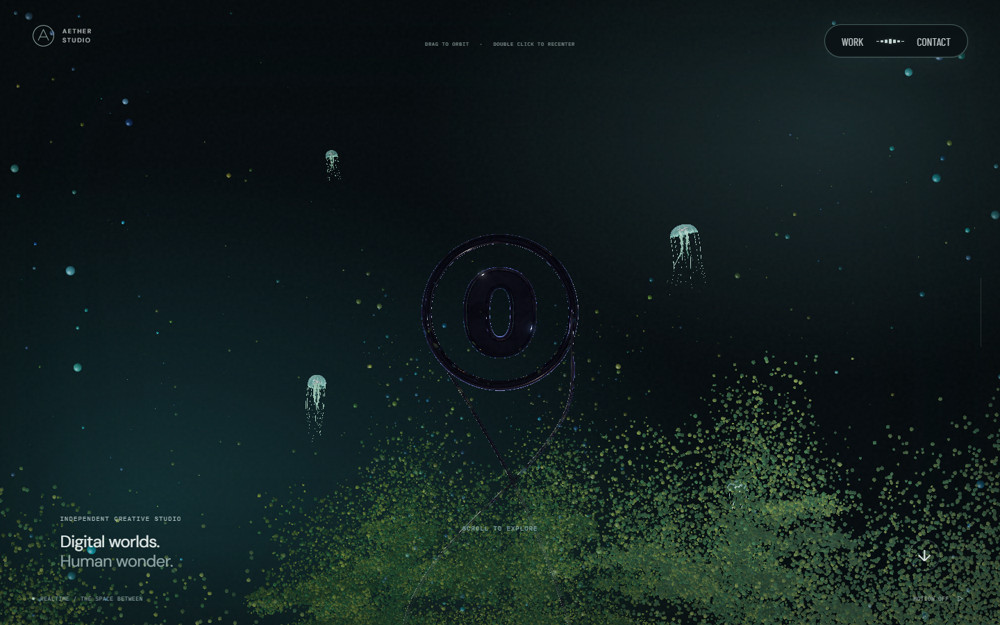
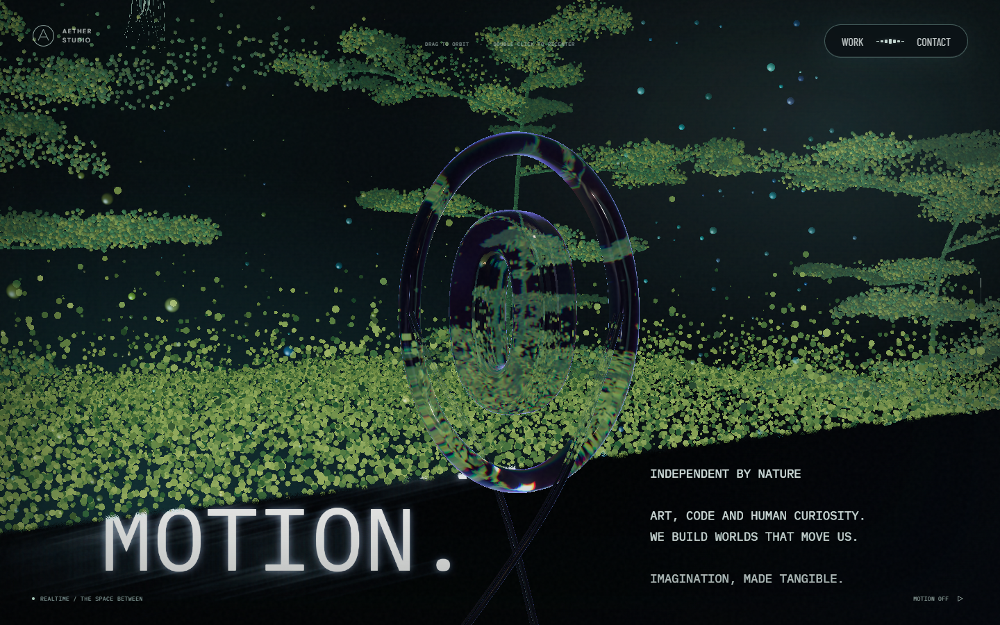
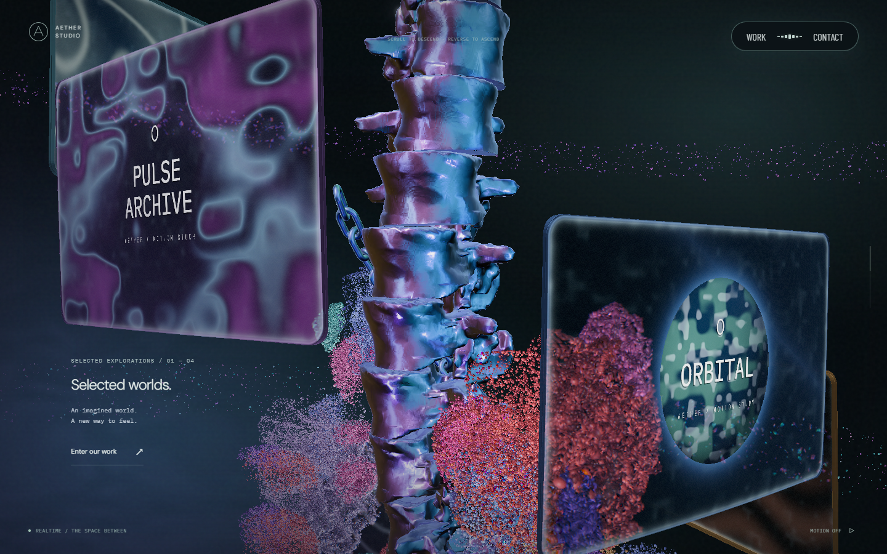
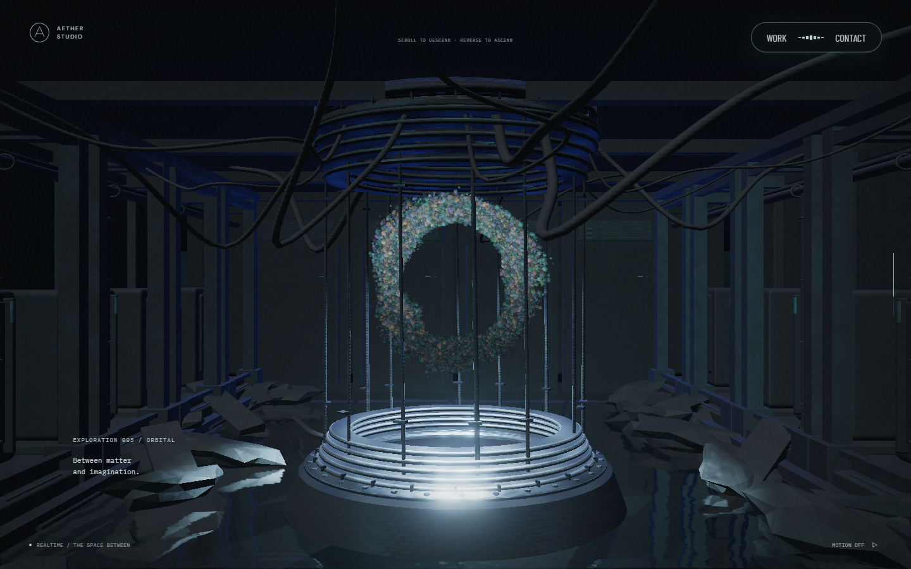
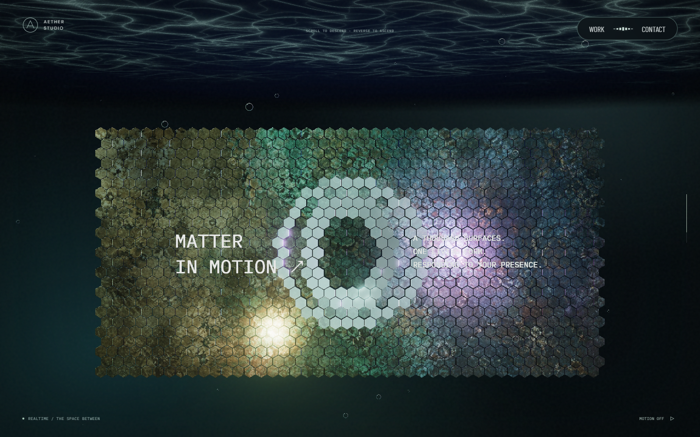
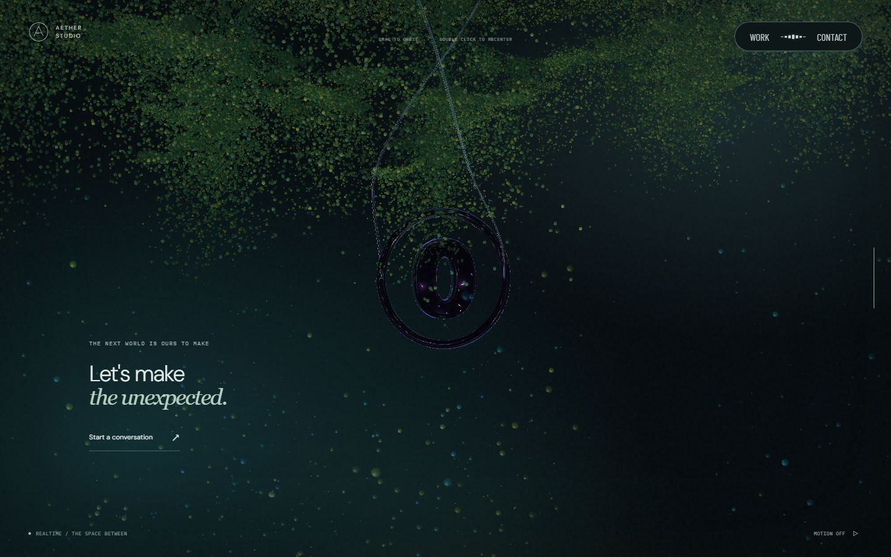

# GPU 프로그램 재사용과 포레스트 생성 최적화

PR #66 이후의 `bdfda295b8e4917271f3416dd057ec2b30ac8d20`에서 다시 측정했다. 유리 엠블럼의 같은 셰이더가 재질 번호 때문에 따로 준비되던 부분과 포레스트 생성의 반복 계산을 줄였다. 환경 맵은 계측으로 비용을 확인했지만 구현을 바꾸지 않았다. [9월 27일 기록](loading-performance-2026-09-27.md)은 비교 기준으로 사용하거나 덮어쓰지 않았다.

## 변경과 보존 범위

- `SceneEmblem.ts`: 유리 분기의 `customProgramCacheKey`에서 재질 번호만 제거했다. 원래 hook의 키는 유지해 링·글리프·리본의 서로 다른 GLSL을 구분한다. 재질과 uniform 객체, 색·두께·영상·굴절 설정은 각각 유지한다. Three.js의 기존 프로그램 캐시가 동일 프로그램을 재사용하도록 한 변경이다.
- `ForestGeometry.ts`, `ForestAssembly.ts`: 한 잎줄기에서 변하지 않는 기준 법선을 한 번 계산한다. 잎·입자 배열을 채울 때 작은 임시 배열과 `subarray` 뷰를 만들지 않고 TypedArray에 직접 쓴다. 행렬 수평 축소의 고정 인덱스도 직접 접근한다. 난수 호출과 Float32 변환 순서는 유지한다.
- `LoadingTrace.ts`, `ScenePreparation.ts`: 선택적으로 켜는 로컬 User Timing을 세분화했다. 프로그램 등록 호출과 Promise 대기, 정적 텍스처 준비, geometry의 첫 사용 렌더, 환경 카드·PMREM, 월드·포레스트 생성을 구분한다. 기존 로딩 단계와 종료 조건은 그대로다.

DPR·해상도·입자 수·재질 효과·반사 품질·모션·영상 동작은 바꾸지 않았다. 두 출력 경로의 순차 컴파일과 숨겨진 장면의 2px 준비 렌더를 유지한다. 장면 생성이나 업로드를 첫 스크롤로 미루지 않는다.

## 측정 조건과 원자료

Windows 10 Home 10.0.19045, Ryzen 7 3700X, RTX 2060 SUPER, 드라이버 32.0.15.6094, Playwright Chromium 153.0.8010.12, ANGLE D3D11을 사용했다. 1440×900, DPR 1, GPU 품질 프로필, 품질 계수 1.00의 로컬 production preview다. Node 25.9.0, Three.js 0.186.0이며 실제 휴대폰 측정은 아니다.

각 성능 비교는 전후 순서를 번갈아 5쌍 실행했다. 각 빌드에서 새 브라우저의 첫 방문과 같은 브라우저의 새로고침을 따로 기록하고, 매 방문 직후 8초 동안 처음으로 내려갔다 올라왔다. 비교 중 다른 빌드·검사·캡처를 실행하지 않았다. 새 브라우저는 브라우저 캐시를 새로 시작하지만 OS·GPU 드라이버 캐시는 초기화하지 않는다. 전송 캐시는 원자료의 Resource Timing으로 구분한다.

첫 프레임은 기존 `data-render-state=ready`, 표시 종료는 `.experience.is-ready`를 관찰한 시점이다. GPU 완료 타이머나 디스플레이 표시 시각을 직접 측정한 것은 아니다. 스크롤 RAF는 기존 스크립트와 같이 첫 콜백까지의 간격 하나를 제외하고 집계한다.

| 빌드 | 소스 | 역할 |
| --- | --- | --- |
| main | `bdfda29` | 변경 없는 production 기준 빌드 |
| 계측 기준 | `bed8a10` | main에 같은 세부 계측만 추가 |
| GPU 단독 | `4e3eaeb` | 프로그램 키 변경만 적용 |
| 결합 | `63e0923` | GPU 변경과 포레스트 변경 적용 |

`8722de9`는 측정 도구 보완이며 제품 빌드는 `63e0923`과 같다. 각 JS 파일의 SHA-256은 [빌드 기록](evidence/loading-2026-09-28/build-manifest.json)에 보존한다.

결과의 `중앙값 ± MAD`에서 MAD는 각 값과 중앙값 사이 절대 차이의 중앙값이다. 신뢰구간이나 표준편차가 아니다. 쌍별 차이의 중앙값과 두 조건 중앙값의 차이는 다를 수 있다. 모든 원자료를 포함하며 느린 회차를 임의로 제외하지 않았다. 단계별 중앙값을 더해 전체 시간으로 사용하지 않는다.

## 최종 결합 결과

User Timing을 끈 실제 main과 결합 빌드의 비교를 최종 수치로 사용한다. 별도 WebGL 호출 래핑이나 CPU 샘플링도 없다. 기존 DOM 준비 상태와 Resource Timing, RAF 관찰은 두 빌드에 동일하게 적용했다.

| 항목 | main 중앙값 ± MAD | 결합 중앙값 ± MAD | 중앙값 차이 |
| --- | ---: | ---: | ---: |
| 첫 방문 · 첫 프레임 | 5,649.9 ± 9.1ms | 5,364.5 ± 39.0ms | 285.4ms 감소 · 5.1% |
| 첫 방문 · 로딩 표시 종료 | 6,306.3 ± 29.5ms | 6,042.1 ± 62.5ms | 264.2ms 감소 · 4.2% |
| 새로고침 · 첫 프레임 | 1,779.7 ± 15.3ms | 1,748.6 ± 15.3ms | 31.1ms 감소 |
| 새로고침 · 로딩 표시 종료 | 4,380.3 ± 34.3ms | 4,338.4 ± 15.8ms | 41.9ms 감소 |

첫 방문 첫 프레임은 다섯 쌍 모두 빨라졌고, 쌍별 감소 중앙값은 324.4ms, MAD 8.7ms, 범위 110.1~360.1ms였다. 표시 종료는 네 쌍에서 줄고 한 쌍에서 359.7ms 늘었다. 표시 종료의 4.2%는 이번 표본의 중앙값 차이이며 모든 방문에서 같은 단축을 보장하지 않는다.

새로고침은 첫 프레임의 쌍별 감소 중앙값 25.1ms보다 MAD 36.9ms가 컸다. 표시 종료도 각각 32.9ms와 40.1ms다. 전체 새로고침 로딩의 개선은 확정하지 않는다. 로딩 숫자의 속도·성공 조건은 수정하지 않았다.

동일 위치의 User Timing을 켠 별도 5쌍에서는 첫 방문 첫 프레임 5,712.5→5,400.3ms, 표시 종료 6,508.7→6,123.8ms였다. User Timing을 끈 비교에서도 첫 프레임 단축이 유지된다. 결합 빌드의 첫 프레임 중앙값은 계측 켜짐 5,400.3ms, 꺼짐 5,364.5ms였지만, 서로 다른 실행 묶음이므로 35.8ms 전부를 계측 오버헤드로 단정하지 않는다. 오버헤드가 0이라는 주장도 하지 않는다.

| 계측 켜짐 · 첫 방문 구간 | 기준 중앙값 ± MAD | 결합 중앙값 ± MAD |
| --- | ---: | ---: |
| 환경 맵 | 684.7 ± 7.9ms | 686.3 ± 7.3ms |
| 장면·입력 생성 | 423.5 ± 2.8ms | 398.5 ± 1.8ms |
| 그중 포레스트 | 309.5 ± 3.7ms | 281.3 ± 3.0ms |
| 정적 텍스처 수집·초기화 | 3.0 ± 0.1ms | 3.1 ± 0.2ms |
| 선형 프로그램 등록 / 대기 | 53.2 ± 1.0 / 1,486.6 ± 5.8ms | 47.0 ± 0.5 / 1,358.2 ± 18.5ms |
| geometry 첫 사용 준비 구간 | 133.3 ± 1.0ms | 132.9 ± 4.0ms |
| 화면 프로그램 등록 / 대기 | 59.5 ± 1.1 / 1,396.0 ± 36.2ms | 58.8 ± 1.3 / 1,265.9 ± 4.7ms |

환경 맵과 준비 렌더·정적 업로드는 개선 성과로 계산하지 않는다. 상세 프로파일링은 아래 비용 분해를 위한 별도 실행이며 이 표와 최종 비교 수치에 섞지 않았다.

네 성능 비교 묶음의 80회 첫 왕복에서 RAF p95는 16.7~16.8ms, 최대 간격은 16.8ms, 33.5ms 초과는 0회였다. 품질 계수는 1.00이었다. RAF 간격은 순수 GPU 실행 시간이나 모든 장비의 FPS를 뜻하지 않는다.

[계측 없는 결합 비교](evidence/loading-2026-09-28/combined-no-trace.json), [단계별 결합 비교](evidence/loading-2026-09-28/combined.json)를 따로 보존한다.

## 개별 실험

GPU 단독 비교는 계측 기준과 GPU 단독 빌드를, 포레스트 비교는 GPU 단독과 결합 빌드를 비교했다. 후자의 두 빌드는 GPU 변경이 같으므로 포레스트 변경의 추가 비용을 구분할 수 있다.

| 실험·구간 | 변경 전 중앙값 ± MAD | 변경 후 중앙값 ± MAD | 쌍별 감소 중앙값 · 범위 |
| --- | ---: | ---: | ---: |
| GPU · 첫 방문 선형 컴파일 전체 | 1,532.0 ± 35.3ms | 1,389.9 ± 6.8ms | 135.9ms · 79.3~222.5ms |
| GPU · 첫 방문 화면 컴파일 전체 | 1,433.0 ± 10.8ms | 1,302.2 ± 34.8ms | 156.7ms · 87.6~261.0ms |
| GPU · 첫 방문 첫 프레임 | 5,695.0 ± 155.8ms | 5,348.5 ± 38.1ms | 350.2ms · 190.7~638.5ms |
| 포레스트 · 첫 방문 생성 | 310.4 ± 4.2ms | 282.0 ± 2.4ms | 20.5ms · 0.4~31.1ms |
| 포레스트 · 새로고침 생성 | 295.3 ± 2.7ms | 268.2 ± 2.0ms | 27.7ms · 22.7~30.1ms |

GPU 변경은 첫 방문에서 두 컴파일과 첫 프레임이 다섯 쌍 모두 빨라졌다. 새로고침의 첫 프레임은 1,778.6→1,779.0ms로 차이가 불분명해 GPU 변경의 재방문 개선을 주장하지 않는다. 포레스트 생성은 첫 방문 약 9.1%, 새로고침 약 9.2% 줄었지만 전체 첫 프레임은 다른 구간의 편차도 포함하므로 이 비율을 전체 로딩 개선율로 쓰지 않는다.

[GPU 원자료](evidence/loading-2026-09-28/gpu-only.json), [포레스트 원자료](evidence/loading-2026-09-28/scene-only.json), [전체 집계](evidence/loading-2026-09-28/summary.json)에 회차·방문 구분·단계별 시간·범위를 보존한다.

## 비용 분해와 보류한 후보

WebGL 호출 래핑은 상세 진단 실행에만 사용했다. 최초 진단의 첫 방문 한 회에서 확인한 값은 다음과 같다. 아래 시간을 순수 GPU 실행 시간으로 해석하지 않는다.

| 작업 | 벽시계 관찰 | 해석 |
| --- | ---: | --- |
| 환경 카드 CPU 생성 | 0.8ms | 카드 geometry·재질·위치 구성 |
| PMREM `fromScene` | 713.8ms | 6면 캡처·초기 블러·LOD 작업과 드라이버 대기 포함 |
| PMREM 중 `getProgramInfoLog` 4회 | 합계 690.7ms | 프로그램 첫 사용의 동기 조회 비용, 순수 GPU 시간 아님 |
| 정적 텍스처 모으기 / 초기화 호출 | 1.4 / 2.0ms | VideoTexture·render target 제외 |
| 선형 프로그램 등록 / 이후 Promise 대기 | 53.8 / 1,487.4ms | CPU·드라이버·완료 상태 폴링 포함 |
| geometry 첫 사용 렌더 | 129.6ms | uniform 조회·버퍼 업로드·추가 텍스처 업로드·draw 제출 포함 |
| 위 렌더의 `bufferData` 427회 | 64,391,944바이트 · 30.8ms | API 제출 시간이며 GPU 전송 완료 시간은 아님 |
| 화면 프로그램 등록 / 이후 Promise 대기 | 67.1 / 1,342.6ms | 화면 출력용 별도 프로그램 준비 |

환경 맵 결과는 이미 CubeUV texture라 Three.js가 표준 재질마다 PMREM를 다시 만드는 구조가 아니다. 정적 텍스처와 geometry도 Three.js가 객체·version에 따라 재사용한다. 이 부분에 별도 캐시를 추가하지 않았다. `onBeforeCompile`에서 연결되는 텍스처는 첫 준비 렌더에서도 올라가므로 정적 텍스처 수집 구간만 전체 업로드 비용으로 부르지 않는다.

[최종 상세 진단](evidence/loading-2026-09-28/detail-final.json)에서 선형·화면 출력의 새 프로그램은 각각 49→47개, 초기 준비 전체 생성은 114→110개였다. 재질 이름 매크로만 제외한 vertex·fragment SHA-256으로 확인한 중복 네 묶음은 사라졌다. 두 빌드 모두 첫 왕복에 새 프로그램 생성은 0개였다. geometry 업로드량도 보존했다. 프로그램 준비를 뒤로 미뤄 얻은 결과가 아니다. [최초 진단](evidence/loading-2026-09-28/detail-baseline.json)은 변경 전 비용 탐색 기록이다.

| 후보 | 판단 | 이유 |
| --- | --- | --- |
| 유리 엠블럼의 재질 번호로 나뉜 프로그램 | 채택 | 같은 GLSL을 기존 캐시로 재사용하며 재질·uniform 독립성 유지 |
| 포레스트의 반복 기준 법선·임시 배열 | 채택 | 전체 배열 바이트 동일, 생성 구간에서 반복 측정 개선 |
| 환경 맵 전역 공유·재사용 | 보류 | 초기 생성은 한 번이며 renderer·컨텍스트별 자원 소유권을 바꿀 근거 부족 |
| 두 출력 컴파일 병렬 시작·한쪽 생략 | 보류 | Three.js `compileAsync`가 폴링 시 재질의 현재 프로그램을 읽어 마지막 출력만 기다릴 위험. 색 공간·tone mapping도 서로 다름 |
| 정적 업로드·숨겨진 준비 렌더 생략 | 보류 | 기존 캐시가 중복을 처리하며 생략하면 첫 진입에 작업이 남음 |
| 천장 geometry 복제로 재계산 축소 | 미채택 | 독립 UV·dispose를 유지해야 하며 추가 복제의 이득은 이번에 실측하지 않음 |

PMREM 해상도·블러·반사 설정과 셰이더 오류 검사도 유지했다. PMREM의 큰 최초 비용은 남아 있다. 프로그램을 재사용하는 만큼 GPU 프로그램 수는 줄지만, 포레스트의 출력 배열 크기·GPU 업로드량은 그대로다. 기준 법선 Map은 생성 함수 안에서만 사용하는 임시 메모리다.

API 의미는 [Three.js WebGLRenderer](https://threejs.org/docs/pages/WebGLRenderer.html)와 [PMREMGenerator](https://threejs.org/docs/pages/PMREMGenerator.html), 캐시·폴링·dispose 동작은 설치된 Three.js 0.186.0 소스와 대조했다.

## 시각적 변경

1440×900, DPR 1에서 실제 main과 결합 빌드를 촬영했다. 처음부터 OS 모션 축소를 적용해 장면 시간은 0, 영상은 시작 전으로 맞췄다. 같은 스크롤 좌표·카메라·입력 상태를 사용하고 촬영할 때만 CSS 애니메이션을 껐다. 정상 모션·영상 동작 검사는 아래에서 별도로 확인했다.

| 대상 | 변경 전 | 변경 후 | 판단 포인트 |
| --- | --- | --- | --- |
| 포레스트 · 진행도 0 |  |  | 입자·색·분포, 모든 픽셀 동일 |
| 엠블럼 · 0.14 |  |  | 링·글리프·리본, 차이 9픽셀 |
| 본 컬럼 · 0.4 |  |  | 금속·모니터·꽃, 모든 픽셀 동일 |
| 리액터 · 0.69 |  |  | 환경 반사·장치, 차이 6,231픽셀 |
| 스케일 패널 · 0.785 |  |  | 패널·천장 반사, 모든 픽셀 동일 |
| 하단 포레스트 · 0.98 |  |  | 나뭇잎·엠블럼·배경, 모든 픽셀 동일 |

한 화면은 1,296,000픽셀이다. 엠블럼과 리액터도 차이가 있는 채널의 최댓값은 1/255였다. 여섯 장면을 직접 확인했으며 형상·배치·반사에서 식별할 수 있는 차이는 없었다. 픽셀 전체가 항상 같다고 주장하지 않는다. [촬영 상태](images/loading-2026-09-28/capture.json), [픽셀 비교](images/loading-2026-09-28/pixel-comparison.json)를 보존한다.

## 회귀 검사와 리뷰

- 관련 단위 검사 21개 통과: 기존 꽃 geometry·대기 입자 해시, 엠블럼 재질·uniform 독립성, 준비 순서·취소·실패 처리, 새 포레스트 전체 배열 해시 검사다. 포레스트 fixture는 변경 전 main에서 만들었으며 PC·모바일·소프트웨어 프로필의 행렬·색 배열 4개와 입자 속성 6개의 SHA-256이 각각 같다.
- 실제 D3D11 production 브라우저 검사 17개 통과: 탐색·모션 정지/재개·OS 모션 축소·영상 재생과 실패·출력 셰이더·수면 반사·모듈 실패·타임아웃·WebGL fallback을 확인했다. 프로그램 공유 후 다른 재질의 uniform 값도 유지됐다.
- 준비 중 컨텍스트 손실, 복원, 재시도와 네 차례 장면 재생성을 main과 결합 빌드에서 각각 확인했다. 오류는 없었고, 완료 시 연결된 유효 컨텍스트는 항상 하나였다. 분리된 이전 컨텍스트는 손실 상태였다.
- 읽기 전용 분석 2개와 별도 레드팀 리뷰를 수행했다. 레드팀이 찾은 `--trace 0`의 기존 URL query 처리 문제는 `8722de9`에서 수정했다. URL에 `profileLoading=1`을 넣은 최종 20회에서도 로딩 mark·measure가 0개임을 확인했다. 제품 코드의 차단 결함은 보고되지 않았다.

재생성 검사에서 활성 프로그램은 main 111개, 결합 107개로 유지됐다. 최초 준비의 누적 생성 114/110과는 PMREM 임시 프로그램 해제 때문에 다르다. 두 빌드의 활성 버퍼는 433개, framebuffer 20개, renderbuffer 6개였다. 텍스처는 최초·복원 직후 44개, 재생성 후 43개로 두 빌드가 같았다.

GC 후 JS heap은 main 약 11.67–14.02MB, 결합 약 11.64–13.96MB 범위였고 단조 증가하지 않았다. backing storage는 각각 약 79.71MB로 유지됐다. 계측기가 이전 컨텍스트의 참조를 보존하고 컨텍스트 손실 시 자원 집계를 비우므로, 이 값을 개별 `delete*` 호출 완료나 장기 메모리 누수 부재의 증명으로 사용하지 않는다. [main 수명 검사](evidence/loading-2026-09-28/lifecycle-baseline.json), [결합 수명 검사](evidence/loading-2026-09-28/lifecycle.json)에 상태와 원자료가 있다.

로컬 `lint`, `typecheck`, production `build`가 통과했다. 전체 필수 CI는 저장소의 `Verify` 3개 job(desktop·no-webgl, mobile, interaction)으로 확인하고 최종 PR의 Checks에 결과를 남긴다. CI의 Linux SwiftShader와 모바일 크기 Chromium은 실제 GPU 성능·모바일 실기기 검증과 구분한다.

## 재현

위 커밋별 production 빌드를 별도 경로에 보관하고 각각 다른 포트에서 preview한다. 다음은 이번에 사용한 포트다. 각 명령은 앞 명령이 끝난 뒤 실행한다. 첫 두 실험에는 기본 User Timing만 켜며, 상세 WebGL 진단은 별도 실행한다.

```sh
# GPU 단독: 계측 기준 ↔ GPU 변경
node scripts/measure-loading.mjs --baseline http://127.0.0.1:5189 --candidate http://127.0.0.1:5190 --pairs 5 --output .qa/gpu-only.json
# 포레스트 추가 효과: GPU 변경 ↔ 결합
node scripts/measure-loading.mjs --baseline http://127.0.0.1:5190 --candidate http://127.0.0.1:5191 --pairs 5 --output .qa/scene-only.json
# 단계별 결합 비교
node scripts/measure-loading.mjs --baseline http://127.0.0.1:5189 --candidate http://127.0.0.1:5191 --pairs 5 --output .qa/combined.json
# 최종 비교: 실제 main ↔ 결합, User Timing과 GL 진단 모두 끔
node scripts/measure-loading.mjs --baseline http://127.0.0.1:5188 --candidate http://127.0.0.1:5191 --pairs 5 --trace 0 --output .qa/combined-no-trace.json
# 호출·프로그램 진단: 최종 성능 집계에 포함하지 않음
node scripts/measure-loading.mjs --baseline http://127.0.0.1:5189 --candidate http://127.0.0.1:5191 --pairs 1 --detail 1 --output .qa/detail-final.json
# 장면 재생성·컨텍스트 손실·복원, 기준/결합 각각 실행
node docs/evidence/loading-2026-09-28/lifecycle.mjs http://127.0.0.1:5188 .qa/lifecycle-baseline.json
node docs/evidence/loading-2026-09-28/lifecycle.mjs http://127.0.0.1:5191 .qa/lifecycle.json
# 배열·준비 순서·재질 검사
npm test -- tests/atmosphere-attributes.spec.ts tests/flower-geometry.spec.ts tests/forest-attributes.spec.ts tests/emblem.spec.ts tests/preparation.spec.ts --project=interaction
```

`--detail 1`은 호출별 벽시계 측정과 소스 수집 비용이 있다. 프로그램 source hash는 `SHADER_NAME` 매크로만 제외하며, GLSL·출력 조건을 임의로 정규화하지 않는다. 준비 중 등록 수, 삭제된 프로그램, 첫 왕복에서 추가된 프로그램을 따로 읽는다.

## 남은 범위

환경 맵의 최초 PMREM 비용과 전체 새로고침 개선은 해결했다고 보고하지 않는다. 이번 측정은 한 PC·브라우저·드라이버 조합의 로컬 결과이며 네트워크 배포 환경의 수치가 아니다. Safari/iOS 실기기, 다른 GPU·드라이버, 장시간 발열·메모리 검증은 남아 있다. 채택한 두 변경의 이득과 보존 검사는 확인했으며, 이번 범위에서 성과가 확인되지 않은 별도 캐시·품질 변경·준비 작업 생략은 포함하지 않았다.
