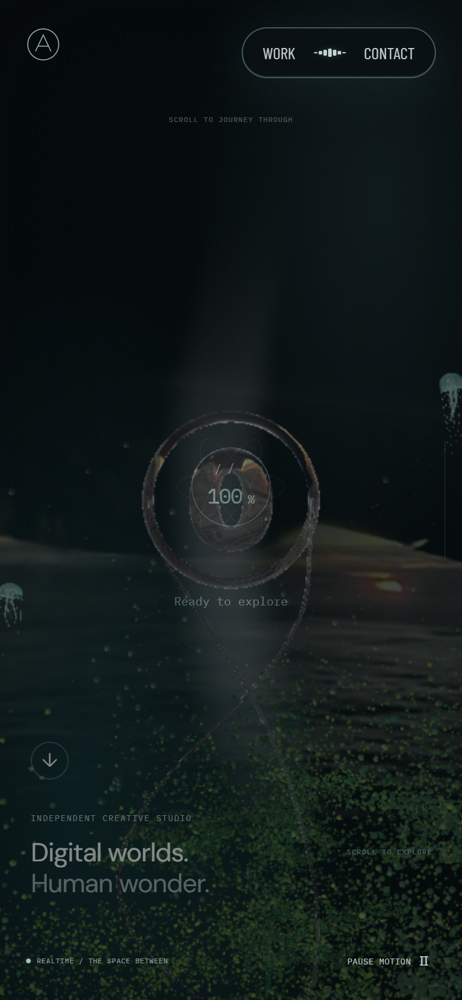
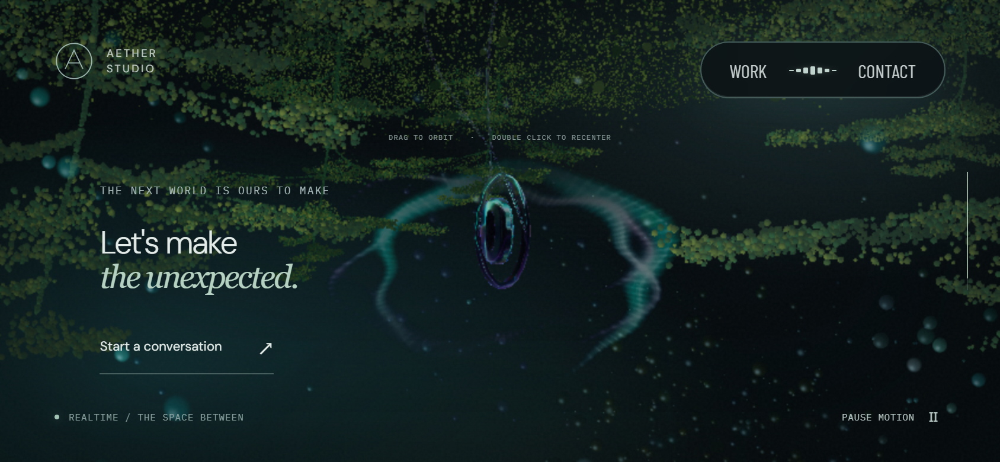

# 운영 전송·JavaScript 실행과 모바일 보조 검사

캐시 정책 변경은 채택하지 않았다. 로컬 5쌍에서 재방문 첫 프레임은 줄었지만 로딩 완료 상태 진입의 개선은 편차보다 작았고, 첫 방문 완료 상태 진입은 5쌍 중 4쌍에서 늦어졌다. 제품 소스·빌드 설정·운영 캐시는 유지하고 재현 가능한 계측과 분석만 추가한다.

## 대상과 비교 경계

PR #66과 #67은 모두 병합됐다. 기준은 `origin/main`의 `b80ba753ae9ce5a2b5523dac430b75107418e0f5`이며, 공개 운영 주소는 <https://aether-studio-nu.vercel.app/>다. GitHub Production deployment `6695808715`가 이 커밋을 가리키며 성공 상태다. 배포별 URL은 인증 화면으로 이동하므로 공개 주소로 측정한다. 보호 설정을 바꾸거나 우회하지 않는다.

[9월 27일](loading-performance-2026-09-27.md), [9월 28일 GPU·포레스트](loading-performance-2026-09-28.md) 기록과 원자료는 보존한다. 이번 결과에 과거 개선율을 더하지 않는다.

초기 운영 측정의 `baseline`과 `candidate`는 **같은 운영 주소의 반복 표본 A/A**다. 후속 overlay 측정은 `single: true`로 같은 배포의 첫 방문·새로고침을 각각 5회 기록한다. 새 배포와 이전 배포의 비교로 읽지 않는다. 캐시 실험에서는 동일한 production 파일을 두 로컬 HTTP 포트에서 제공하고 해시 자산의 캐시 정책만 바꾼다. 그 결과를 운영에 배포된 개선으로 보고하지 않는다.

원자료의 `sourceCommit`은 측정 당시 checkout HEAD이며, 새 계측 코드는 작업 트리 변경이다. 실행 스크립트는 `measurementSources`의 SHA-256으로 구분한다. 제품 빌드와 배포 커밋은 별도의 배포 파일 대조로 확인했다.

## 측정 방법

첫 방문은 새 Chromium 프로세스·새 브라우저 컨텍스트, 재방문은 같은 페이지의 일반 새로고침이다. 브라우저 HTTP 캐시와 코드 캐시가 재사용될 수 있지만 OS·GPU 드라이버 캐시는 초기화하지 않는다. CDN 캐시는 별도로 응답의 `x-vercel-cache`, `age`, `x-vercel-id`를 기록한다. `HIT`는 브라우저 캐시 사용을 뜻하지 않는다.

브라우저 캐시 응답에 남은 CDN 헤더는 저장 당시 값일 수 있다. 실제 네트워크 응답의 304는 `responseReceivedExtraInfo`의 `networkStatus`로 확인한다. Resource Timing의 `transferSize`와 CDP의 `encodedDataLength`도 별도 값으로 보존한다. 상세 trace 최초 묶음은 extra-info 수집 추가 전 자료여서 304 건수 집계에 쓰지 않는다.

첫 프레임은 기존 `data-render-state=ready`, 완료 상태 진입은 `.experience.is-ready`의 DOM 변경 관찰 시각이다. 기존 `visibleReady` 필드는 이 완료 상태를 뜻한다. 오버레이는 그 뒤 CSS로 400ms 동안 사라지므로 두 시점을 같다고 부르지 않는다. 후속 `overlay` 측정은 `transitionend`에서 `opacity=0`, `visibility=hidden`을 함께 확인한 `overlayHidden`도 기록한다. 디스플레이의 물리적 표시 시각이나 GPU timer query는 아니다.

초기 진단·캐시 비교·`production-*-final.json`의 첫 왕복은 완료 상태 진입 직후다. 후속 `production-*-overlay-final.json`은 오버레이 숨김 뒤 8초간 내려갔다 올라온다. 서로 다른 시작 조건을 합산하지 않는다. 첫 RAF 콜백 간격은 제외한다. `scrollTo`로 기존 스크롤 경로를 실행하므로 실제 손가락의 관성·터치 지연을 검증하지 않는다.

최종 측정은 `profileLoading`과 상세 trace, WebGL 호출 래핑을 끈다. 같은 DOM·RAF 관찰과 CDP Network 수집은 유지한다. 상세 trace에는 공개 script URL과 시간 필드만 보존하고 인증·쿠키·응답 본문을 저장하지 않는다. 이름별 V8 이벤트는 중첩되거나 다른 스레드에서 겹치므로 합산해 순수 파싱 시간으로 쓰지 않는다. 마지막 JS 응답 완료부터 모듈 평가 완료까지도 파싱·컴파일·평가·스케줄링을 포함한 구간이다.

평상시 연결은 인위적 CPU·네트워크 제한이 없다. 제한 조건은 PC Chromium의 CPU 4배 slowdown, 지연 150ms, 다운로드 200,000B/s(1.6Mbps), 업로드 93,750B/s(0.75Mbps)다. 모바일 보조 조건은 390×844, DPR 2, 모바일·터치 에뮬레이션이다. CPU 제한은 PC의 GPU·메모리·모뎀·발열을 휴대폰과 같게 만들지 않는다.

PC는 Windows 10, Ryzen 7 3700X, RTX 2060 SUPER, Chromium 153.0.8010.12, ANGLE D3D11이다. PC 기본 뷰포트는 1440×900·DPR 1이다. 모바일 보조 검사의 DPR 2는 브라우저 설정이며, 제품의 기존 `Scene.tsx`는 폭 768px 미만에서 실제 렌더 비율을 최대 1.25로 제한한다. 이번에 그 상한이나 품질 계수를 낮추지 않았다.

수치는 중앙값 ± MAD로 표기한다. MAD는 중앙값으로부터 절대 편차의 중앙값이며 신뢰구간이 아니다. 느린 회차도 포함한다. 단계별 중앙값을 더해 총시간을 만들지 않고, 쌍별 차이와 두 그룹 중앙값의 차이를 구분한다.

## 운영의 최종 관찰값

각 조건에서 첫 방문·새로고침을 각각 5회 측정했다. 상세 trace·User Timing·GL 호출 래핑은 모두 껐고 `aether:` mark는 0개였다. 다음 값은 개선 전후 비교가 아닌 현재 `main`의 기준값이다.

| 조건·방문 | 첫 프레임 | 완료 상태 진입 | 오버레이 숨김 |
| --- | ---: | ---: | ---: |
| 평상시 PC · 첫 방문 | 5,186.7 ± 56.6ms | 5,864.7 ± 38.4ms | 6,305.8 ± 43.2ms |
| 평상시 PC · 새로고침 | 1,732.3 ± 12.0ms | 4,172.1 ± 34.1ms | 4,588.9 ± 31.5ms |
| 제한된 모바일 보조 · 첫 방문 | 8,932.8 ± 41.1ms | 16,087.6 ± 651.1ms | 16,527.9 ± 646.0ms |
| 제한된 모바일 보조 · 새로고침 | 3,009.0 ± 5.0ms | 12,218.2 ± 271.3ms | 12,653.3 ± 289.1ms |

오버레이 숨김의 최솟값~최댓값은 순서대로 6,170.2~6,349.0ms, 4,538.1~4,686.9ms, 15,308.7~17,426.2ms, 12,172.1~13,153.8ms다. 완료 상태 이후 숨김까지의 관찰 간격은 전체 416.8~445.9ms였다. CSS의 명목 400ms를 결과에 단순 가산하지 않고 실제 이벤트를 관찰했다. 이는 관찰 콜백 시각이며 물리 디스플레이 표시 시간은 아니다.

PC 10회 첫 왕복의 RAF p95는 16.7~16.8ms, 최대는 16.8ms였다. 제한 조건 10회는 p95 33.3~33.4ms였고, 마지막 첫 방문에서 50ms 간격이 1회 있었다. 나머지는 33.5ms 이내였다. 시작·종료 품질 계수는 모두 1.00, 브라우저 오류는 0개다. RAF 값은 순수 GPU 실행 시간이나 실제 휴대폰 FPS가 아니다.

[PC 최종 원자료](evidence/loading-transfer-2026-09-28/production-desktop-overlay-final.json), [모바일 보조 최종 원자료](evidence/loading-transfer-2026-09-28/production-mobile-overlay-final.json)를 보존한다. 제한 조건에서 첫 프레임과 오버레이 숨김 사이의 시간이 길지만 기존 숫자 진행·fade 조건을 바꾸어 성과로 보고하지 않았다.

이전 방식의 [PC 20회](evidence/loading-transfer-2026-09-28/production-desktop-final.json)와 [제한 조건 20회](evidence/loading-transfer-2026-09-28/production-mobile-final.json)도 제외하지 않는다. 각각 첫 방문·새로고침 10회다. PC 첫 방문 첫 프레임은 5,144.7~7,480.0ms, 제한 조건은 8,819.9~12,094.1ms였다. 최초 연결 지연과 후반 편차를 포함한다. 이전 제한 조건의 마지막 baseline 새로고침에도 50ms 간격이 1회 있었다. 시작 조건이 다른 두 묶음의 중앙값을 합치거나 느린 회차를 새 표본으로 대체하지 않았다.

## 캐시 후보의 통제 실험과 보류

같은 파일·같은 압축·같은 장비에서 순서를 AB/BA로 바꿔 5쌍 측정했다. 상세 trace와 User Timing은 껐다. 두 서버의 차이는 해시 자산의 캐시 정책뿐이다. 운영 CDN·HTTP/2를 재현한 실험은 아니다.

| 항목 | 기존 정책 중앙값 ± MAD | immutable 후보 중앙값 ± MAD |
| --- | ---: | ---: |
| 첫 방문 · 첫 프레임 | 8,411.3 ± 18.3ms | 8,427.0 ± 63.8ms |
| 첫 방문 · 완료 상태 진입 | 15,320.4 ± 1,116.4ms | 15,491.6 ± 477.2ms |
| 새로고침 · 첫 프레임 | 3,008.5 ± 23.8ms | 2,794.1 ± 17.6ms |
| 새로고침 · 완료 상태 진입 | 11,758.4 ± 34.1ms | 11,748.2 ± 31.0ms |
| 새로고침 · 304 재검증 수 | 7 ± 0 | 2 ± 0 |

재방문 첫 프레임의 쌍별 단축은 중앙값 165.9ms, MAD 46.2ms, 범위 119.7~246.2ms로 5쌍 모두 양수다. 반면 완료 상태 진입의 쌍별 단축은 20.4ms, MAD 82.0ms, 범위 -61.6~1,056.1ms다. 첫 방문 완료 상태 진입은 4쌍에서 느렸으며 쌍별 차이는 큰 편차를 보였다. 캐시 정책이 그 지연의 원인이라고 확정하지 않지만, 요청 감소만으로 전체 로딩의 이득과 회귀 부재를 인정하지 않는다.

20회 첫 왕복의 RAF p95는 약 33.3ms, 최대는 33.5ms 이내이고 33.5ms 초과는 0회였다. 품질 계수는 1.00이다. 이는 제한된 PC 조건의 관찰값이며 실제 휴대폰의 프레임 속도가 아니다.

[예비 1쌍](evidence/loading-transfer-2026-09-28/cache-pilot.json)은 최종 5쌍에 합치지 않았다. [최종 원자료](evidence/loading-transfer-2026-09-28/cache-mobile-final.json), [집계](evidence/loading-transfer-2026-09-28/summary.json)를 보존한다. 초기 자료의 `startedAt`은 당시 스크립트가 마지막 저장 시각을 넣었으므로 실험 시작 시각으로 해석하지 않는다. 이후 운영 최종 자료는 `startedAt`과 `recordedAt`을 분리한다.

새 배포에 캐시 정책을 적용하지 않았으므로 배포 전환·오래된 HTML과 새 asset의 호환성을 검증 완료로 표시하지 않는다. 다시 검토할 때는 해시 경로에만 적용하고, 새 HTML 재검증·이전 HTML의 asset 접근·새 asset 해시와 404 캐시를 실제 preview에서 확인해야 한다. HTML·고정 이름 미디어에 장기 캐시를 적용하는 안은 포함하지 않는다.

## 전송과 의존 관계

HTML → entry JS·CSS → React의 Scene import → Scene·Three.js·effects 순서다. Vite의 preload helper가 Scene의 세 파일을 함께 요청한다. CSS가 사용 중인 폰트를 요청하며, 장면 생성 중 고정 경로의 스케일 패널 이미지가 요청된다. 영상은 기존 활성화 조건을 따른다. 오디오 모듈은 사용자가 소리를 켜기 전에는 초기 필수 요청이 아니다.

운영 HTML·JS·CSS는 Brotli 압축을 확인했다. 해시가 붙은 `/assets/`의 JS·CSS·폰트도 `public, max-age=0, must-revalidate`였다. 압축을 추가해 얻을 근거는 없으며, 재방문의 조건부 요청 제거를 캐시 실험 후보로 삼았다. `/media/`의 같은 URL 반복은 Range 요청·독립 디코더의 사용 여부를 함께 읽어야 한다. 요청 개수만으로 중복 다운로드나 제거 가능한 디코더라고 판단하지 않는다.

[측정 전 배포 파일 대조](evidence/loading-transfer-2026-09-28/deployment.json)와 [측정 후 대조](evidence/loading-transfer-2026-09-28/deployment-after.json)에서 HTML·JS·CSS·폰트 17개가 로컬 `main` production 빌드와 SHA-256이 같았다. 마지막 `origin/main` 재조회도 `b80ba75`였다. 초기 필수 JS는 entry 245,108B, Scene 484,238B, Three.js 587,045B, effects 28,074B로 디코딩 후 합계 1,344,465B다. 평상시 운영 20회에서 첫 방문 JS의 CDP 전송량 중앙값은 약 407,492B, 새로고침은 325B였다. 후자는 JS 본문 재다운로드가 아닌 조건부 응답을 포함한다. Resource Timing의 전송량은 각각 407,759B, 1,200B로 따로 기록했다.

같은 방문의 필수 JS URL은 각각 한 번 요청됐으며 Scene·Three.js·effects는 나란히 요청된다. 초기 오디오는 요청되지 않았다. 폰트의 여러 weight 파일도 전부 내려받는 구조로 추정하지 않고 실제 사용된 요청을 기준으로 본다. 폰트는 초기 진단에서 CDN MISS가 있었고, 배포 파일 대조와 후속 반복에서는 CDN이 이미 따뜻해질 수 있다. CDN 초기화를 수행하지 않았다. 공개 주소의 응답에서 `icn1`을 확인했으며 한 지역의 결과를 다른 지역의 배포 성능으로 확대하지 않는다.

## JavaScript와 장면·GPU 준비

상세 trace는 평상시·제한 조건에서 각각 첫 방문 2회와 새로고침 2회다. 최종 시간 비교에 섞지 않는다. 다음은 각 조건 첫 방문의 첫 trace에서, 요청 시작부터 첫 프레임까지의 이름별 메인 스레드 span 합이다.

| trace 이벤트 | 평상시 PC | 제한된 모바일 보조 조건 |
| --- | ---: | ---: |
| `V8.ParseProgram` | 10.87ms | 53.77ms |
| `V8.ParseFunction` | 29.91ms | 145.39ms |
| `V8.CompileCode` | 54.35ms | 257.09ms |
| `v8.compileModule` | 0.105ms | 0.595ms |
| `v8.evaluateModule` | 19.33ms | 95.13ms |

이 이벤트는 서로 포함 관계가 있고 페이지와 검사 스크립트가 함께 들어간다. 위 열을 더한 값을 JavaScript CPU 총시간이나 순수 파싱 시간으로 사용하지 않는다. `v8.parseOnBackground`의 스레드별 span 합은 평상시 37.35ms, 제한 조건 4,338.61ms였다. 다운로드와 겹치는 streaming 작업의 벽시계 span이며 CPU 사용 시간 4.34초를 뜻하지 않는다. 중첩 이벤트·다중 스레드·스케줄링을 제거한 순수 CPU 파싱 시간은 이 자료만으로 확정하지 않았다.

Scene 요청부터 모듈 평가 완료까지는 평상시 첫 방문 85.0~103.8ms, 제한 조건 2,179.9~2,187.2ms였다. 마지막 JS 응답 이후의 구간은 각각 52.8~77.1ms, 30.7~34.2ms다. 후자가 작은 것은 다운로드 중에 진행되는 작업과도 겹치므로, 제한 조건의 파싱이 더 빠르다는 뜻이 아니다.

| 첫 방문 · 단계별 중앙값 ± MAD · 각 2회 | 평상시 PC | 제한된 모바일 보조 조건 |
| --- | ---: | ---: |
| 환경 맵 PMREM | 686.0 ± 9.5ms | 736.4 ± 3.6ms |
| 입자 생성 | 297.3 ± 3.8ms | 555.8 ± 4.0ms |
| 장면·입력 생성 | 407.0 ± 3.6ms | 826.8 ± 6.0ms |
| 선형 프로그램 등록 | 52.0 ± 3.2ms | 640.1 ± 411.3ms |
| 선형 준비 Promise 대기 | 1,350.4 ± 15.9ms | 709.2 ± 426.4ms |
| geometry 첫 사용 준비 렌더 | 187.4 ± 55.1ms | 256.6 ± 0.4ms |
| 화면 프로그램 등록 | 58.7 ± 2.7ms | 337.8 ± 35.4ms |
| 화면 준비 Promise 대기 | 1,218.1 ± 9.1ms | 922.8 ± 44.5ms |

프로그램 등록과 Promise 대기는 CPU·드라이버·동기 대기·폴링을 포함한다. 제한 조건에서 비용이 등록 쪽으로 이동한 표본이 있어 대기 구간만 비교하면 오해할 수 있다. GPU 타이머로 실행 시간을 측정한 것이 아니다. PMREM 재설계나 초기 준비의 지연은 하지 않았다.

평상시 첫 trace에는 장면 생성과 겹치는 1,637.5ms `RunTask`, 제한 조건에는 2,500.7ms `RunTask`가 있었다. 이후 프로그램 등록·첫 사용·후처리에서도 긴 작업이 확인된다. 네트워크 제한에서는 모듈 전달도 약 2.18초가 되지만, 첫 방문의 장면 생성과 GPU 준비 비용 역시 남는다. 번들 분할·preload만으로 전체 시간을 줄일 근거는 확보하지 못했으며 해당 변경을 추가하지 않았다.

[평상시 상세 원자료](evidence/loading-transfer-2026-09-28/production-detail.json), [제한 조건 상세 원자료](evidence/loading-transfer-2026-09-28/production-mobile-detail.json)와 같은 이름의 `.trace.json.gz` 파일을 보존한다. 압축을 풀면 DevTools/Perfetto에서 열 수 있는 `traceEvents` 구조다. 원래 trace의 모든 args를 보관한 파일은 아니며 공개 script metadata와 시간 필드만 남겼다.

## 모바일 실기기 범위

Windows에서 연결된 WPD·Android·iPhone·ADB 장치가 조회되지 않았고 PATH의 `adb`, `idevice_id`와 기본 Android SDK의 adb 실행 파일도 없었다. 모바일 실기기 측정은 완료하지 않았다. Safari/iOS, 실제 화면 회전·앱 전환과 복귀, 장시간 발열·메모리, 실제 터치 관성은 PC 보조 검사로 대신 증명하지 않는다.

운영 주소의 별도 기능 검수에서는 세로 화면의 영상 재생, 첫 스크롤, 가로·세로 뷰포트 변경, 수동 모션 정지·재개, OS 모션 축소 변경에 따른 장면 재생성, 새로고침을 확인했다. 8개 상태 모두 렌더 준비 완료였고 가로 overflow와 브라우저 오류가 없었다. 이 검수는 CPU·네트워크 제한을 끈 PC Chromium이며 실제 기기 회전 센서·브라우저 주소창·OS 백그라운드 복귀 검사는 아니다. 가로 전환에서 뷰포트 높이가 바뀌어 정규화된 스크롤 위치도 달라지는 기존 동작을 기록했으며 같은 장면을 유지했다고 주장하지 않는다.

[기능 검수 원자료](evidence/loading-transfer-2026-09-28/mobile-smoke.json)와 [재현 스크립트](evidence/loading-transfer-2026-09-28/mobile-smoke.mjs)를 보존한다. 아래는 현재 운영 화면이며 변경 전후 비교 이미지가 아니다. 세로 화면은 100% 완료 직후 fade 중 캡처여서 오버레이가 남아 있다. 이 관찰을 바탕으로 완료 상태와 실제 숨김을 구분했다.

| 세로 · 390×844 · DPR 2 | 가로 뷰포트 · 844×390 · DPR 2 |
| --- | --- |
|  |  |

직접 확인할 때는 다음 절차를 따른다.

1. 기기·OS·브라우저·회선과 배터리 상태를 적고, 사이트 데이터를 지운 첫 방문과 같은 브라우저의 재방문을 구분한다. 첫 프레임, 100% 완료 상태, 로딩 오버레이가 사라진 시각을 각각 기록한다.
2. 로딩 직후 끝까지 내려갔다 올라온다. 영상·모션 정지와 재개, 작품 열기·닫기를 확인하고 끊긴 위치를 적는다.
3. 가로·세로 회전, 다른 앱으로 갔다 복귀, OS 모션 축소 전환 뒤 장면 재생성을 확인한다. 기기별 5회 원자료를 남긴다. 발열·메모리를 측정하지 않았다면 미측정으로 둔다.

## 재현

```sh
# 운영 단일 대상: 첫 방문·새로고침 각각 5회, 오버레이 숨김 뒤 첫 왕복
node scripts/measure-loading.mjs --baseline https://aether-studio-nu.vercel.app/ --candidate https://aether-studio-nu.vercel.app/ --pairs 5 --single 1 --overlay 1 --trace 0 --output .qa/production.json
# 제한된 PC 모바일 보조 조건: 위 명령에 추가
# --profile mobile --dpr 2 --cpu 4 --network constrained
# 원인 분석: 최종 측정과 별도로 실행
# --pairs 1 --timeline 1 (User Timing도 기본 켜짐)

# 동일 파일·압축, 캐시 정책만 다른 로컬 실험 서버
npm run build
node scripts/serve-loading-experiment.mjs dist 5194 5195
# 별도 터미널, 다른 빌드·브라우저 검사·캡처와 겹치지 않게 실행
node scripts/measure-loading.mjs --baseline http://127.0.0.1:5194 --candidate http://127.0.0.1:5195 --pairs 5 --profile mobile --dpr 2 --cpu 4 --network constrained --trace 0 --output .qa/cache.json
node scripts/summarize-loading-transfer.mjs .qa
```

실험 서버는 운영 CDN의 대체 구현이 아니다. 로컬 HTTP/1.1과 미리 압축한 Brotli 파일을 사용한다. 두 포트의 파일과 압축은 같으며, candidate는 `/assets/`에서 8자리 해시가 붙은 JS·CSS·WOFF·WOFF2만 1년 immutable로 제공한다. HTML·고정 경로 이미지·영상·404는 장기 캐시 대상이 아니다.

## 회귀 검사와 변경 범위

`lint`, `typecheck`, production `build`를 통과했다. 관련 Playwright 검사 58개가 통과했고, 터치 전용 검사의 기존 desktop skip 1개가 있었다. 해당 검사는 mobile 프로젝트에서 통과했다. 입자·포레스트 배열 해시, 재질·uniform 독립성, 준비 순서·취소·실패, 모듈 실패·타임아웃·WebGL fallback, 모션·탐색·영상 실패 처리를 포함한다. 로컬 검사는 저장소 기본 실행 설정이며 성능 자료의 명시적 D3D11 측정과 구분한다.

제품 소스·의존성·Vite 설정·배포 설정은 변경하지 않았다. DPR·해상도·입자 수·재질·반사·모션·영상·로딩 숫자·준비 순서도 그대로다. UI를 수정한 PR이 아니므로 전후 시각 변경은 없으며, 운영 파일 동일성·기존 배열 해시·별도 현재 화면 검수를 보존 근거로 삼는다. 새 캐시 정책은 측정 서버에만 있고 production에는 적용되지 않는다.

로컬 빌드·브라우저 검사·캡처·성능 측정은 순차로 실행했다. 최종 PR의 `Verify` 3개 job(desktop·no-webgl, mobile, interaction)은 PR Checks에서 확인한다. 실제 휴대폰, Safari, 장시간 발열·메모리와 배포 설정 변경 후 검증은 이 PR의 완료 범위가 아니다.

**recommend: 계측·분석 기록의 반영. hold: 캐시 정책의 운영 적용.** 제품 로딩의 개선을 검증했다고 주장하지 않는다. 이번에 고친 것은 전송·trace·캐시 구분과 완료 상태/fade 종료를 혼동하던 측정 기준이다.

참고: [CDP Network](https://chromedevtools.github.io/devtools-protocol/tot/Network/), [Vercel 캐시 헤더](https://vercel.com/docs/caching/cache-control-headers), [Vercel 응답 헤더](https://vercel.com/docs/headers/response-headers).
