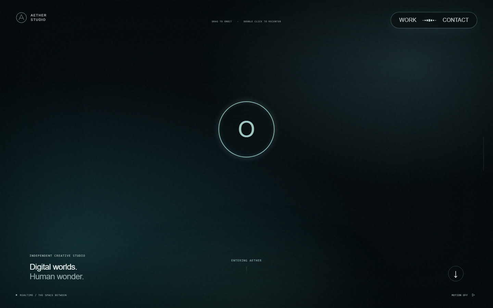
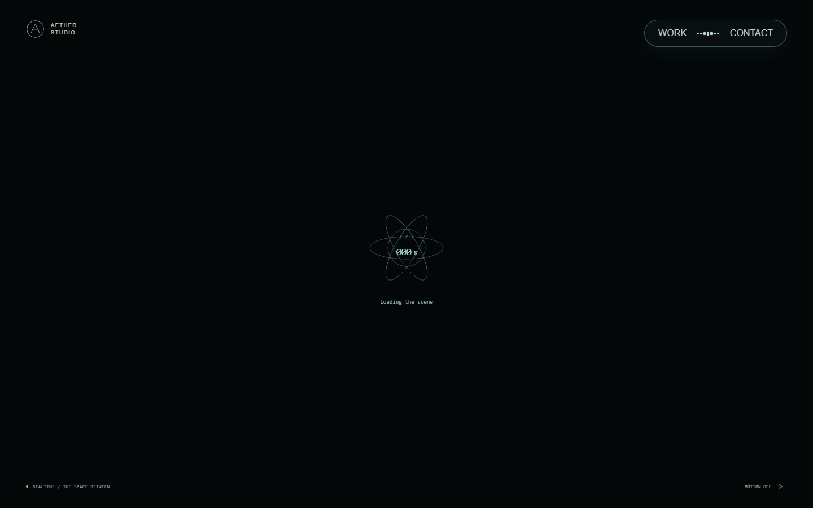
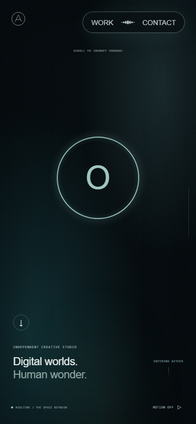
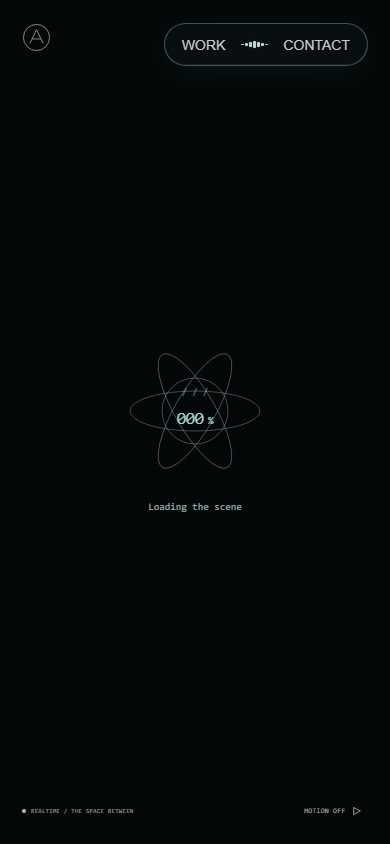
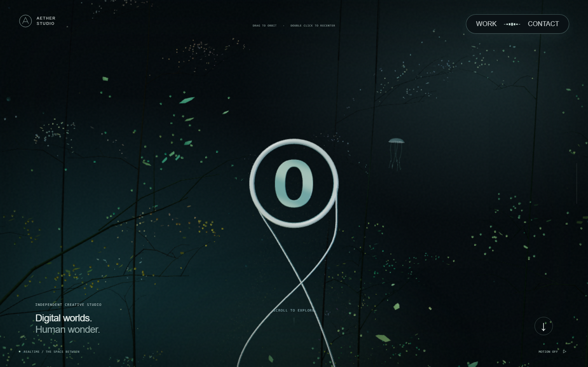
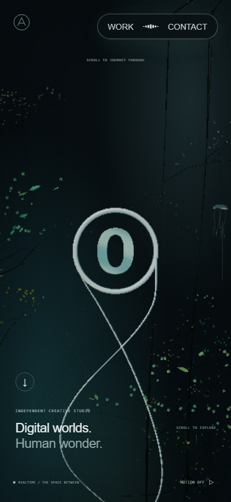

# 초기 로딩 진행률 · 2026-09-23

첫 3D 프레임을 준비하는 동안 검은 화면 중앙에 진행률과 현재 작업을 표시한다. 숫자는 초기화 완료 이벤트의 가중 합이며 다운로드 바이트 비율이나 남은 시간 예측이 아니다. 기존 홈·Work·Contact 탐색과 대체 화면은 유지한다.

## 준비 단계

| 누적 진행률 | 완료 근거 | 다음 작업 |
| --- | --- | --- |
| 0% | React 앱 표시, Scene 모듈 대기 | Scene 모듈 로드 |
| 10% | Scene 모듈이 로드돼 effect 시작 | 절차적 geometry·material·canvas 자원 생성 |
| 25% | 장면 구성과 `worlds.prepare` 완료 | 정적 텍스처 업로드 |
| 40% | `initTexture` 호출 완료 | 선형 출력 셰이더 컴파일 |
| 65% | 첫 `compileAsync` 완료 | 숨은 geometry·uniform의 첫 사용 준비 |
| 80% | 2px 타깃의 준비 렌더 완료 및 상태 복원 | 화면 출력 셰이더 컴파일 |
| 95% | 두 번째 `compileAsync` 완료 | 첫 실제 화면 렌더 |
| 100% | 실제 렌더 호출 성공, canvas `renderState=ready` | 로더를 400ms 동안 숨김 |

GPU 준비에 가중치 70을 배정했다. 다운로드 계측이나 기기별 시간 비중으로 측정한 값은 아니다. 연속된 동기 이벤트는 React가 한 번에 반영할 수 있으므로 모든 중간 숫자가 반드시 한 프레임씩 보이지는 않는다. 최소 대기 시간이나 가짜 숫자 보간을 넣지 않았다.

`ScenePreparation`은 숨은 씬, 선형·화면 출력 경로와 정적 텍스처 준비를 유지한다. `VideoTexture`와 렌더 타깃 텍스처는 선업로드에서 제외하며 후속 씬의 영상 다운로드·디코딩 완료를 기다리지 않는다.

## 종료와 재초기화

- 성공, 준비 중, 사용할 수 없음을 별도 상태로 관리한다. 모듈 실패·WebGL 미지원·초기화 실패·컨텍스트 손실은 진행률을 올리지 않고 기존 CSS 대체 화면으로 전환한다.
- 같은 단계가 보이는 탭에서 60초 동안 끝나지 않으면 Scene을 해제하고 대체 화면을 표시한다. 이 제한은 실패 복구에만 쓰며 진행률 증가에는 쓰지 않는다. 탭이 숨겨지면 감시 타이머를 해제하고 복귀 후 다시 시작한다.
- effect 종료와 준비 generation을 확인한 뒤에만 완료 이벤트를 전달한다. 컨텍스트 복원과 모션 설정 변경은 새 준비 단계에서 시작한다.
- 로더는 홈에만 표시한다. 헤더와 모션 버튼은 로더 위에 남고, 로더가 입력을 가로채지 않는다. 전역 `[hidden] { display: none !important; }`가 Work·Contact·대체 화면에서 로더를 숨긴다.
- `progressbar`의 현재 값·단계 설명과 별도 상태 메시지를 제공한다. 모션 축소·수동 정지는 타원과 문자 움직임, 종료 전환을 끈다.

## AT 관찰과 자체 모션

2026-09-23에 [Active Theory](https://activetheory.net/) 초기 진입을 Chromium 1440×900에서 관찰했다. 로컬 관찰 자료는 `.qa/at-loading-1fps.webm`, `.qa/at-loading-1fps.contact-sheet.png`다. 30fps와 긴 5fps 녹화는 인코더 버퍼 초과로 실패했고, 낮은 프레임 설정으로 짧은 녹화와 23개 변화 프레임을 확보했다. 이 자료로 정확한 속도나 easing 일치를 주장하지 않는다.

관찰 시트의 4.440초부터 작은 중앙 글리프 디스크와 가는 원 테두리가 나타난다. 4.766~5.746초에는 중심 주변의 대칭 곡선이 방사형으로 넓어지고, 5.980초부터 어두워져 6.606초에는 거의 검정이 된다. 7.811초부터 금속 링 장면이 나타난다. 앞부분의 이미 열린 링 장면과 시트의 붉은 변경 영역 표시는 로더 연출이 아니다. 작은 숫자의 전체 변화와 정확한 내부 준비 단계는 이 관찰로 확인하지 못했다.

이 관찰에서 검은 배경, 민트색 중심 표시, 방사형 확장과 사라짐을 참고했다. 앱은 원 1개·교차 타원 3개·슬래시 3개를 직접 작성한 SVG/CSS로 표현한다. 2.4초 확장과 1.8초 문자 움직임은 자체 선택이며 AT 측정값이 아니다. 원본 코드·로고·영상·모델·캡처를 앱 자산으로 복제하지 않았다. 참고 캡처는 로컬에만 보관한다.

## 시각적 변경

기준은 `808fd0d`다. 같은 Chromium, DPR 1, 스크롤 0, 모션 축소, PC 1440×900·모바일 390×844에서 캡처했다. 대기 화면은 양쪽 모두 Scene 모듈 응답을 보류한 동일한 상태다. 실제 네트워크 속도 측정으로 해석하지 않는다. 준비 완료 화면은 모듈을 해제하고 첫 렌더가 끝난 뒤 캡처했다.

| 대상 | 변경 전 | 변경 후 | 판단 포인트 |
| --- | --- | --- | --- |
| PC 모듈 대기 |  |  | 0%와 단계 문구, 탐색 버튼 유지 |
| 모바일 모듈 대기 |  |  | 중앙 정렬·가독성·잘림 없음 |
| PC 첫 프레임 |  |  | 같은 장면으로 복귀 |
| 모바일 첫 프레임 |  |  | 로더 잔존 없음 |

응답 보류 없이 모션을 켠 첫 진입·재방문도 별도로 녹화했다. [실제 로딩 GIF](evidence/loading-2026-09-23/loading.gif)와 [0.5초 간격 연속 프레임](evidence/loading-2026-09-23/loading-frames.png)은 장식이 움직이는 동안 숫자가 완료 이벤트까지 유지되고 첫 장면으로 전환되는 과정을 보여준다. 로컬 전체 영상은 `.qa/loading-cold-cached.webm`이다.

첫 진입에서 DOM에 관찰된 값은 0→40→80→95→100, 재방문에서는 0→40→80→100이었다. 두 경우 모두 100 시점의 `renderFrame`은 1이었다. [첫 진입 기록](evidence/loading-2026-09-23/cold-progress.json)과 [재방문 기록](evidence/loading-2026-09-23/cached-progress.json)은 각각 1회 관찰이며 성능 개선 수치로 쓰지 않는다.

## 요구사항과 검증

| 요구사항 | 상태·근거 |
| --- | --- |
| 실제 완료 이벤트와 진행률 | 구현·검증, 두 컴파일을 미루는 단위 테스트와 실제 첫 프레임 로그 |
| 첫 프레임 이전 100 금지 | 구현·검증, PC·모바일의 첫 진입·재방문 DOM 관찰 |
| 실패·미지원에서 대체 화면 | 구현·검증, chunk 차단·WebGL 미지원·모듈 60초 지연 |
| 취소·재초기화 | 구현·검증, 컴파일 취소 후 이벤트 차단과 모션 변경 후 canvas 1개 |
| 숨은 씬 준비·후속 영상 분리 | 기존 경로 보존, 준비 타깃 복원·정적 텍스처만 업로드하는 테스트 |
| 모션 축소·모바일·탐색 | 구현·검증, CSS 정지·Work/dialog/Contact·복귀 |

lint, typecheck, production build를 통과했다. 기존 탐색 테스트 15건과 최종 로딩·셰이더 준비·영상 테스트 21건을 통과했다. 신규 실패 테스트의 모호한 상태 선택자는 수정 후 통과를 확인했다. PC·모바일 준비 완료 PNG는 각각 변경 전후 SHA-256이 동일했다. 전체 CI와 자동 리뷰 결과는 PR 기록을 기준으로 한다.

실제 휴대폰 Safari/Android, 저성능 하드웨어의 60초 기준 적합성, 모든 드라이버의 컨텍스트 복원은 이 작업에서 실기기 검증하지 않았다. 브라우저가 동기 GPU 호출로 완전히 멈춘 동안에는 JavaScript 타이머도 실행될 수 없다. Playwright 모바일은 에뮬레이션이며 정상 GPU 준비 시간의 통계 표본이 아니다.

## 다음 작업

3단계는 본 컬럼 양쪽 꽃 형상 입자 무리와 화면상 회전 방향만 다룬다. 먼저 병합된 main과 이 준비 이벤트 경로를 읽고 AT 해당 구간을 관찰한다. 자원·material을 추가하면 `ScenePreparation`의 숨은 씬 준비를 유지하고, 마지막 시각 단계 뒤에는 첫 프레임 전 100 금지와 영상 비대기 조건을 다시 확인한다.
