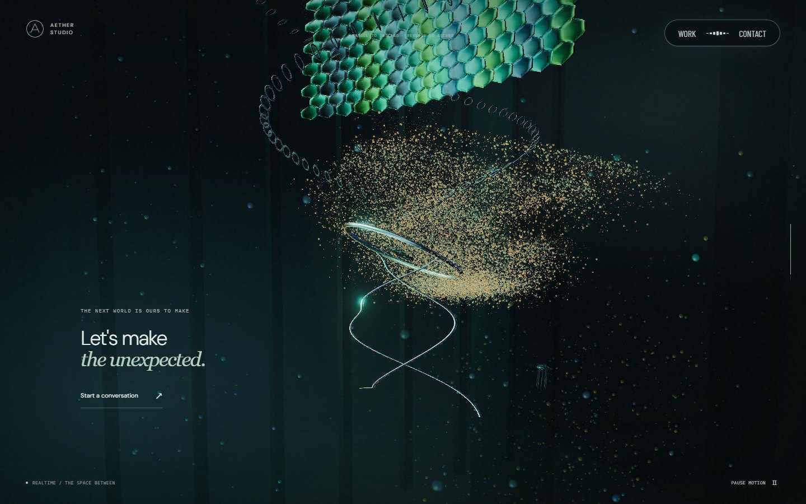

# 리액터·금속 스케일 패널의 카메라 잠금 · 2026-09-22

카메라 잠금을 수정한 당시 기록이다. 이후 스케일 패널 퇴장은 94%, 하단 포레스트 궤도 복귀는 94~97.5%로 바뀌었다. 아래 96% 경계와 비교표는 당시 값을 유지한다. [현재 구조](architecture.md)

[실제 스크롤 검증](dynamic-motion.md) · [배포 사이트](https://aether-studio-nu.vercel.app/)

리액터와 스케일 패널의 본구간은 이미 카메라가 잠겨 있었지만, 스케일 패널에서 하부 링으로 넘어가는 중간에 궤도 입력이 다시 허용됐습니다. 이전에는 진행률 86%부터 마우스 이동에 따른 카메라 영향이 살아나고 89% 이후 드래그가 허용됐습니다. 화면에 금속 구조가 남아 있는 동안에도 시점을 돌릴 수 있는 문제였습니다.

금속 구조의 퇴장이 완료되는 96%까지 카메라 입력 가중치를 0으로 유지하고, 이후 하부 링에서만 부드럽게 복귀시킵니다. 드래그 허용 여부와 실제 카메라 영향에 같은 가중치를 사용합니다. 본 컬럼 진입 때도 두 경계가 일치하도록 정리했습니다. 이 진행률은 AETHER의 타임라인이며 원본의 내부 수치가 아닙니다.

## 실제 입력 검증

1440×900, Chromium / Windows D3D11, 각 위치에서 정착 후 x=1050→350, y=430의 700px 드래그를 동일하게 입력했습니다. 입력 전후 카메라의 실제 방위각을 읽었습니다. 원본 구조물의 화면 위치와 카메라 반응을 기준으로 하며 시간에 따라 변하는 입자·조명의 픽셀 일치를 요구하지 않습니다.

| 위치 | 변경 전 방위각 변화 | 변경 후 방위각 변화 | 기대 동작 |
| --- | ---: | ---: | --- |
| 72% 리액터 | 0 | 0 | 잠금 유지 |
| 83% 금속 스케일 패널 | 0 | 0 | 잠금 유지 |
| 90% 스케일 패널·하부 링 전환 | 1.3433rad | 0 | 금속 구조가 남아 있는 동안 잠금 |
| 94% 전환 끝 | 2.6984rad | 0 | 잠금 유지 |
| 98% 하부 링 | 2.6898rad | 1.3449rad | 드래그 허용, 점진적 복귀 |

[수정 후 실제 입력 근거](screenshots/mechanical-lock/input-evidence.json). 수치는 한 번의 입력 관측값이며 프레임 간격에 따른 관성 차이가 포함됩니다. 잠긴 구간의 목표는 입력 전후 변화 0입니다.

| 대상 | 변경 전 | 변경 후 | 판단 포인트 |
| --- | --- | --- | --- |
| 90%에서 동일한 700px 드래그 후 |  |  | 스케일 패널이 남아 있을 때 링·스케일 패널의 시점을 돌리지 않음 |

수정 후 입력 전 기준 화면:

## 후속 입력·영상 변경

이 기록 이후 포인터의 이동 방향과 감쇠를 사용하는 [입자 흐름](particle-pointer-flow.md), [실제 모니터 영상](monitor-cinema.md)을 추가했다. [PR #20](scene-reference-detail.md)에서는 스케일 패널의 원형 파동과 포인터 변형을 연결하고 중간 장면의 점 잔광을 제거했다. 카메라 잠금과 표면 반응은 별도로 관리한다.
