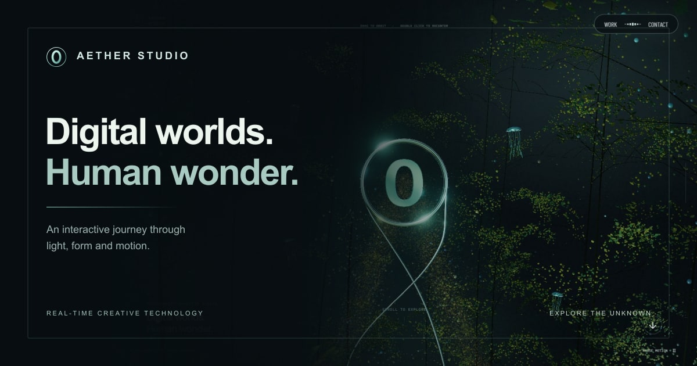

# 사이트 메타데이터

운영 기준 주소는 **https://aether-studio-nu.vercel.app/** 이다. 쿼리 문자열로 방문하거나 Vercel 미리보기 주소에서 열어도 canonical, Open Graph, 구조화 데이터는 같은 운영 주소를 가리킨다. 공개 사이트의 영어 본문에 맞춰 언어는 `en`, 공유 카드 locale은 `en_US`로 맞췄다.

| 용도 | 파일·설정 | 내용 |
| --- | --- | --- |
| 검색·브라우저 제목 | `index.html` | 제목, 설명, 언어, canonical, robots, 색상 |
| 링크 공유 | `index.html`, `public/og-image.jpg` | Open Graph 및 Twitter 대형 카드, 이미지 대체 텍스트, 1200 × 630 JPEG |
| 탭 아이콘 | `public/favicon.svg`, `favicon.ico`, `favicon-16x16.png`, `favicon-32x32.png` | 대문자 O와 원형 링을 사용한 독자적 벡터 도형. ICO에는 16·32·48px 포함 |
| 홈 화면 아이콘 | `public/apple-touch-icon.png`, `icon-192.png`, `icon-512.png`, `icon-maskable-512.png` | 180px Apple 아이콘 및 일반·maskable 아이콘 |
| 웹앱 정보 | `public/site.webmanifest` | 이름·설명·시작 주소·색상·아이콘. 현재 서비스 수준에 맞춰 `display: browser` 사용 |
| 검색 수집 | `public/robots.txt`, `public/sitemap.xml` | 공개 단일 페이지 `/`만 수록. 별도 페이지가 아닌 스크롤 앵커·배포 확인 쿼리는 제외 |
| 구조화 데이터 | `index.html`의 JSON-LD | 확인 가능한 WebSite 이름·설명·URL·언어·이미지 |

사업자 주소, 실제 운영 여부를 확인하지 않은 Organization 정보, 소셜 계정, 평점, 설립 연도는 추가하지 않았다. 검색 키워드 나열이나 오프라인 동작을 약속하는 서비스 워커도 추가하지 않았다. 사이트의 기존 예시 연락처는 구조화 데이터에 사용하지 않는다.

## 공유 카드와 아이콘



공유 카드는 `docs/screenshots/living/after-000.jpg`의 **실제 실행 화면**을 새 SVG 레이아웃 안에 배치하여 만들었다. 카드의 브랜딩·텍스트·아이콘은 신규 제작이며 Active Theory의 이미지나 로고를 사용하지 않는다. 원본 스크린샷 파일은 변경하지 않는다. 공유 카드에 포함된 화면은 PR #9의 구현 상태다.

아이콘과 JPEG는 저장소에 포함되어 배포 시 이미지 변환 서비스, 별도 외부 저장소 또는 추가 런타임 요청 없이 제공된다. 생성에 사용한 `sharp`는 선택 개발 도구이며 앱 의존성에 포함되지 않는다.

재생성:

```sh
npm install --no-save --package-lock=false sharp
node scripts/generate-metadata.mjs
```

이미 설치된 `sharp`를 사용할 경우 `node scripts/generate-metadata.mjs --sharp-module /absolute/path/to/sharp`로 지정할 수 있다. 재생성은 브라우저나 WebGL을 실행하지 않는다. SVG 도형과 텍스트 레이아웃, 캡처 경로는 생성 스크립트에서 관리한다. 파일명 또는 운영 도메인을 바꾸면 `index.html`, JSON-LD, robots, sitemap과 검증의 기준 주소도 함께 바꾼다.

## 검증과 운영 한계

`tests/metadata.spec.ts`는 브라우저를 띄우지 않고 초기 HTML의 canonical·OG·Twitter·JSON-LD 정합성, 공유 이미지 실제 크기·용량, manifest·아이콘 파일의 실제 픽셀 크기, ICO 내부 엔트리를 확인한다. 일반 빌드가 정적 자산을 `dist`로 복사하며, 운영 배포 후에는 자산 응답 상태와 Content-Type을 별도로 확인한다.

검색 결과 반영 시점과 카카오톡·메신저·소셜 서비스의 이전 공유 카드 캐시는 각 서비스가 결정한다. 메타데이터를 바꾼 즉시 이미 전송된 메시지가 갱신되는 것은 보장하지 않는다. 단일 페이지에 대응하는 WebSite 데이터이며 검색 특수 노출을 보장하지 않는다.

공식 기준: [Open Graph 이미지·대체 텍스트](https://ogp.me/), [Google canonical URL](https://developers.google.com/search/docs/crawling-indexing/consolidate-duplicate-urls), [MDN manifest icons](https://developer.mozilla.org/en-US/docs/Web/Progressive_web_apps/Manifest/Reference/icons).
