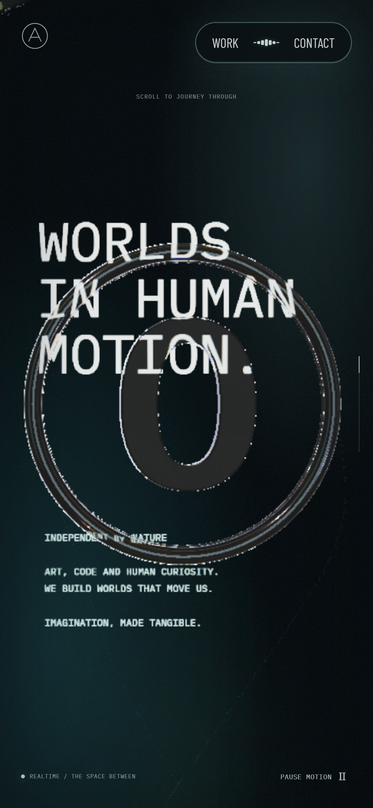
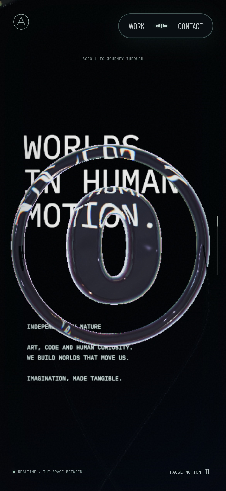
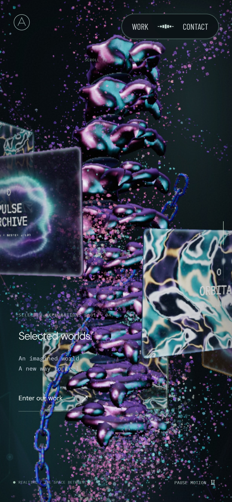
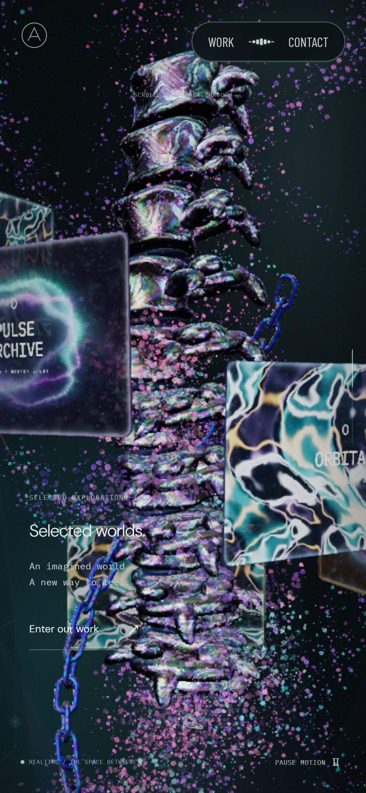
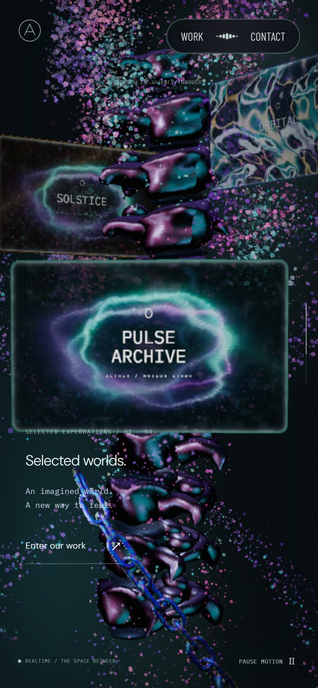
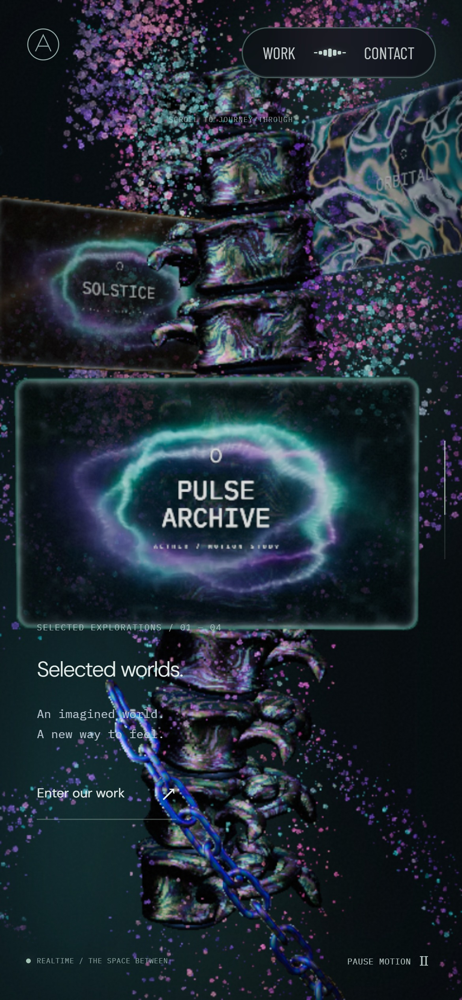
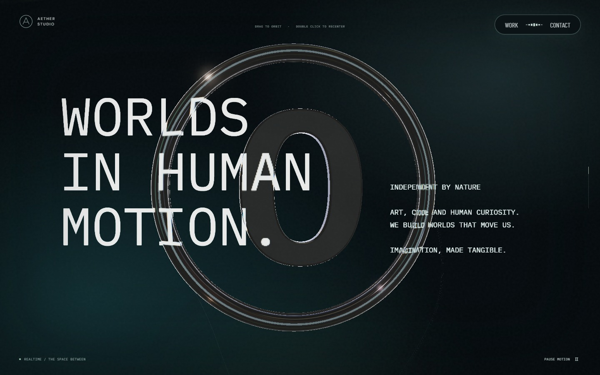
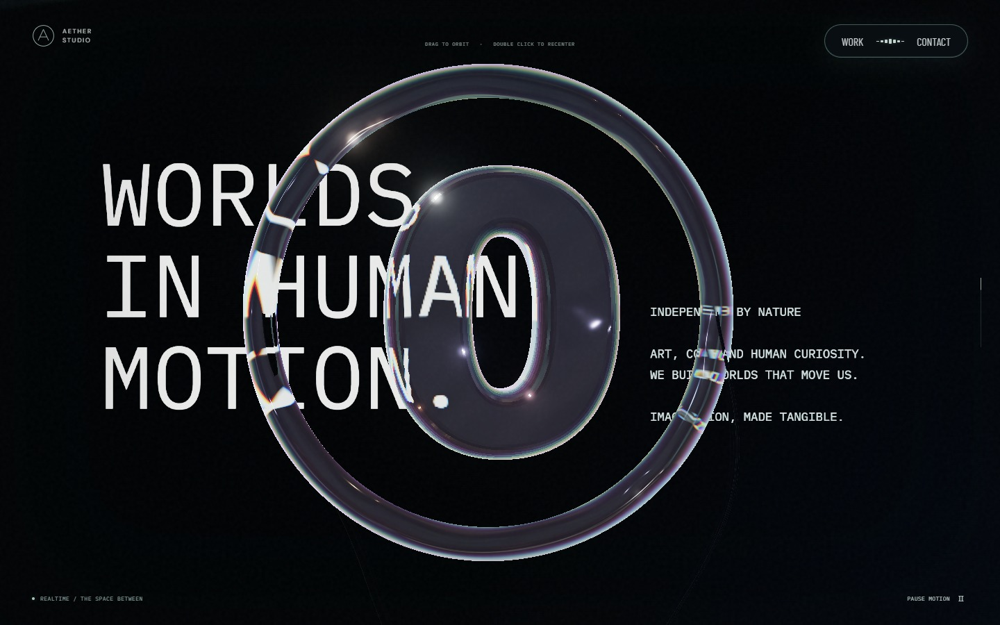
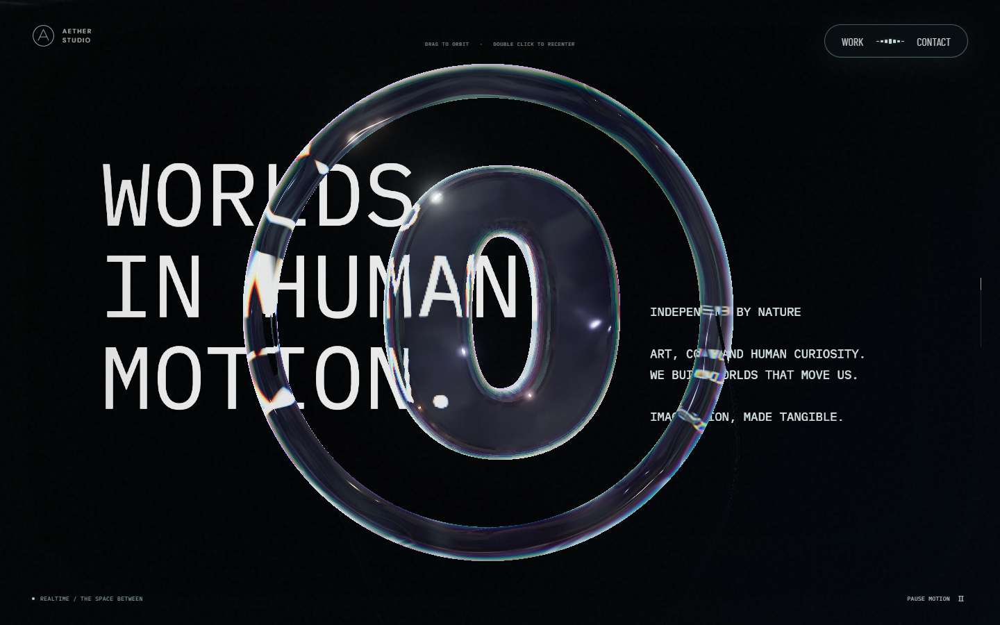
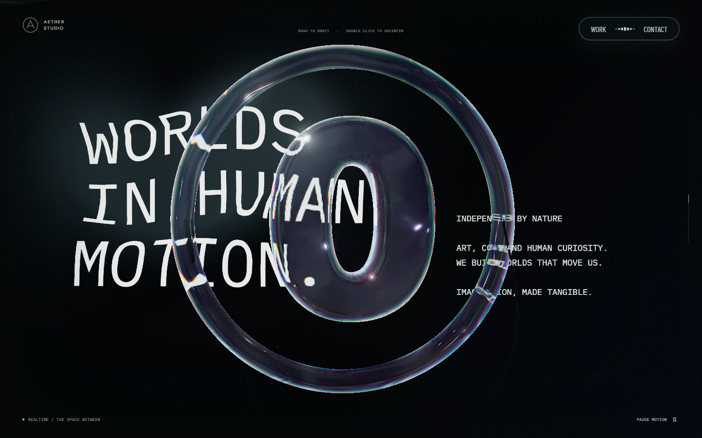

# 문구 판·유리 링·본 컬럼의 모바일 광학 교정

이 문서는 PR #44 당시의 결과다. 이후 물막의 변위 방식, 영상 방향·위치, 링의 영상 반사와 입자 나선은 [후속 교정](atmosphere-detail-correction.md)에서 변경했다.

상단·하단 포레스트의 전체 화면 물막을 제거하고, 큰 문구가 그려지는 검은 판에만 물막 변위를 적용했다. 유리 링은 포인터에 따라 휘지 않는다. 링 너머 문구의 굴절은 유리 재질이 뒤쪽 판을 비추는 결과다.

기준은 `abd29ba`(PR #43 병합본)이다. [이전 광학 기록](optical-scenes.md)의 캡처·검사 결과는 보존한다.

## 참고 화면과 교정

2026-09-24 [Active Theory](https://activetheory.net/)를 모바일 크기와 모바일 사용자 에이전트로 다시 열어 링, 큰 문구 판, 본 컬럼의 여러 스크롤 시점을 확인했다. 공개 화면과 기존 공개 셰이더 연결을 분석 자료로만 사용했다. AT의 로고·모델·텍스처·셰이더를 배포 파일로 복사하지 않았다.

| 대상 | 이전 차이 | 현재 구현 |
| --- | --- | --- |
| 물막 범위 | 포레스트와 링을 포함한 전체 화면 UV가 이동했다. | `SceneGlow`는 원래 픽셀 좌표를 유지한다. `SceneLayers`의 검은 문구 판 재질만 흐름을 샘플링한다. |
| 원형 링 | 가는 torus와 별도 테두리가 겹쳐 모바일에서 여러 줄로 보였다. | 둥근 모서리와 폭·깊이가 있는 하나의 유리 띠를 사용한다. 굴절 강도와 가장자리 분산을 조정하고 별도 테두리는 실버 분기에만 남겼다. |
| 중앙 O | 얕은 압출과 작은 bevel 때문에 평평한 검은 면으로 보였다. | Aether의 O 윤곽을 유지하면서 모서리와 깊이를 넓혔다. 배경 문구와 영상 빛이 곡면을 따라 굴절된다. |
| 본 컬럼 형상 | 몸통보다 둥근 돌출부가 두드러졌다. | 몸통을 넓히고 세로 측면을 길게 유지했다. 돌출부를 가늘고 납작하게 만들고 과한 저주파 울퉁불퉁함을 줄였다. |
| 본 컬럼 표면 | 큰 분홍·청록 덩어리가 매끈하게 나뉘었다. | 물체 좌표에 고정된 여러 크기의 주름·미세 거칠기와 얇은 색 반사를 합성한다. 과한 흰 반사는 압축하며 단계별 암부는 유지한다. |

기존 실버 링의 형상·재질·리본과 체인의 경로는 유지했다. [Scene.tsx](../src/Scene.tsx)에서 `variant: 'silver'`를 선택하면 원래 실버 모듈을 사용한다. 검은 문구 판의 물막 범위는 링 재질 선택과 독립적이다.

## 실제 전후 화면

장면 시간 10초·영상 시간 2초·품질 배율 1.0을 고정하고 같은 진행도에서 캡처했다. 영상 준비 이후의 전환 가중치도 같게 고정해 로딩 속도 차이가 비교에 섞이지 않게 했다. 아래 모바일은 390×844, DPR 3의 Chromium 터치 에뮬레이션이다. 실제 iPhone에서 찍은 결과는 아니다.

| 대상 | 변경 전 | 변경 후 | 판단 포인트 |
| --- | --- | --- | --- |
| 모바일 문구·링 |  |  | 유리 띠의 폭·깊이, O의 곡면, 검은 판 |
| 모바일 본 컬럼 |  |  | 넓어진 몸통과 주름진 금속 반사 |
| 본 컬럼 말미 |  |  | 단계별 암부와 가는 돌출부 |
| PC 문구·링 |  |  | 문구 판 뒤의 굴절과 링의 입체감 |

아래 두 장은 수정본에서 장면 시간 10초·영상 시간 12초를 고정한 포인터 이동 전후다. 문구는 흐트러지지만 링의 외곽은 유지된다. 유리 표면 안쪽의 반사는 뒤쪽 문구의 변화를 따라간다.

| 정지 | 포인터 이동 |
| --- | --- |
|  |  |

## 검증 범위

- `lint`, `typecheck`, production build 통과.
- D3D11 GPU에서 유리·실버·본 컬럼·체인·물막 검사 18개 통과.
- Windows Playwright WebKit에서 유리·실버·본 컬럼·물막 검사 4개 통과. 모바일 Safari 실기기 검증으로 확대하지 않는다.
- D3D11에서 PC 회귀 16개 통과·1개 건너뜀, 모바일 회귀 17개 통과. 상호작용·WebGL 대체 경로 재검사는 90개 통과·1개 실패했다. 실패한 기존 스케일 포인터 검사는 변경 전 `abd29ba`와 수정본 모두 같은 9픽셀을 반환했다(기대값 `>10`). 두 버전의 전체 반환값도 같으며, 이번 수정에서 스케일 코드나 임계값을 바꾸지 않았다.
- 카메라의 픽셀 완전 일치 검사는 실제 영상도 같은 디코딩 프레임에 고정하도록 보완한 뒤 통과했다. 이전 검사는 장면 시계만 고정해 드래그 전 두 화면부터 서로 달랐다.
- 물막 픽셀 검사는 실제 `SceneLayers`와 앞쪽 깊이 기록 링을 함께 그린다. 문구 판의 픽셀은 바뀌고 앞쪽 링 픽셀은 유지되며, 흐름을 지우면 판이 복원된다. 상단·하단 포레스트 단계의 화면 합성 변위는 0이다. 기존 가지·입자의 국소 반응과 시점 드래그는 별도 동작이다.
- RTX 2060 SUPER·D3D11에서 PC와 모바일 화면 크기의 다섯 구간을 변경 전후 각각 측정했다. 각 2.4초 표본에서 앱이 표시하는 평활 프레임 시간의 중앙값·95백분위는 모두 16.7ms, 품질 배율은 1.0이었다. 원시 프레임 시간이나 모바일 실기기의 성능으로 해석하지 않는다. 영상 정지·재개도 확인했고 실행 오류는 없었다.

캡처 조건·해시, 성능 표본, 기존 스케일 검사 전후 값은 [검증 기록](evidence/mobile-optics-correction.json)에 보관했다.

AT의 고유 로고와 스캔 모델을 사용하지 않으므로 픽셀 단위 동일성을 주장하지 않는다. 이 변경은 효과가 적용되는 대상과 링 단면·굴절, 본 컬럼의 몸통 비율·표면 반사를 맞추는 교정이다.
