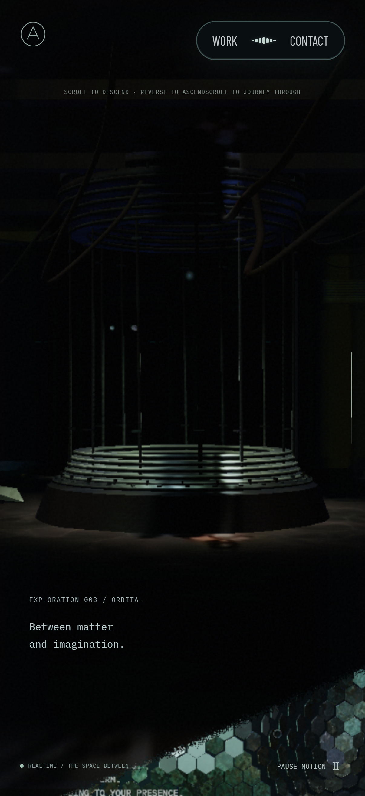
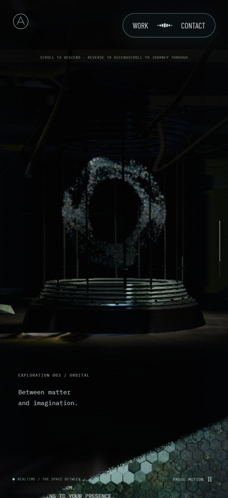

# 모바일 리액터 O 입자와 DPR

iPhone 16 Pro에서 홈 화면에 추가한 사이트를 열고 내려갈 때 O가 잠시 형성된 뒤 흩어진다는 보고가 있었다. PC Chromium의 실제 GPU에서도 모바일 화면과 높은 DPR을 적용하면 정상 모션 중 입자가 거의 사라지는 현상을 재현했다. iPhone 실기기에서 수정본을 확인한 결과는 아직 없다.

## 원인과 수정

`ReactorFlow`는 이전 입자의 위치를 텍스처에서 읽어 다음 위치를 계산한다. 각 입자와 텍스처의 픽셀은 일대일로 대응해야 한다.

`setRenderTarget`이 텍스처 크기에 맞는 뷰포트를 설정한 뒤 `setViewport(0, 0, side, side)`를 다시 호출하고 있었다. 현재 Three.js의 `setViewport`는 화면 DPR을 곱하므로, DPR이 1이 아니면 시뮬레이션이 텍스처 일부의 UV만 읽는다. 초기 위치 복사부터 대응이 틀어지고, 반복 계산에서는 다른 입자의 이력을 계속 읽게 된다.

추가 `setViewport` 호출을 제거해 렌더 타깃의 픽셀 크기를 그대로 사용한다. 입자 수·해상도·물리 계산·모션·반사 품질은 바꾸지 않았다. 일반 모바일 경로는 화면 DPR이 높아도 렌더러 DPR을 1.25로 제한하므로, 정수 DPR뿐 아니라 1.25도 검사한다.

## 검증

- 수정 전 DPR 2의 초기 위치 복사 검사에서 최대 위치 오차 3.861이 발생했다(허용 오차 0.00001). 화면 좌표나 픽셀 오차가 아닌 입자 로컬 좌표 거리다.
- DPR 1·1.25·1.5·2·3에서 초기 위치 보존, O 내부 경계, 움직임·입력 반응, 정지·복원·역방향·dispose와 렌더러 상태 복원을 검사한다.
- 같은 DPR 각각에서 데스크톱·모바일 입자 프로필의 실제 vertex shader 통합 경로도 검사한다.
- 관련 Playwright 검사 13개, lint·typecheck·production build를 통과했다.

## 시각적 변경

아래는 PC Chromium/D3D11의 실제 실행 캡처이며 iPhone 캡처가 아니다. 전후 모두 402×874 CSS 픽셀, 화면 DPR 3, 모바일 렌더러 DPR 상한 1.25, 진행률 0.715, 기본 카메라·포인터 무입력이다. 정상 모션에서 각 진행률 도달 후 3초를 기다렸다. 전체 경과 시간과 영상 위상은 동기화하지 않았으므로 조명이나 개별 입자 위치의 픽셀 동일성을 비교하는 자료는 아니다.

| 대상 | 변경 전 | 변경 후 | 판단 포인트 |
| --- | --- | --- | --- |
| 모션 중 리액터 |  |  | O 입자가 사라지지 않고 형태를 유지하는지 |

[정상 모션 촬영 상태](images/mobile-reactor-dpr/capture-motion.json)와 [모션 축소 촬영 상태](images/mobile-reactor-dpr/capture.json)에 각 구간의 상태를 보존했다. 모션 축소 자료는 시간 0·영상 시작 전 조건이다.

배포 후 iPhone 16 Pro 홈 화면에서 새 문서를 다시 열어 리액터 진입·정지·역방향 스크롤·재진입을 확인해야 한다. PC의 모바일 크기·DPR 검사는 iOS WebKit과 홈 화면 실행의 검증을 대체하지 않는다.
