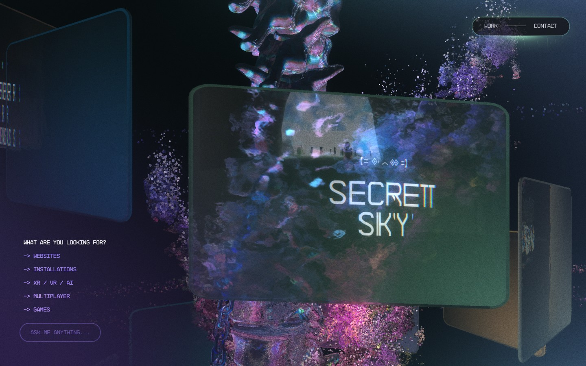
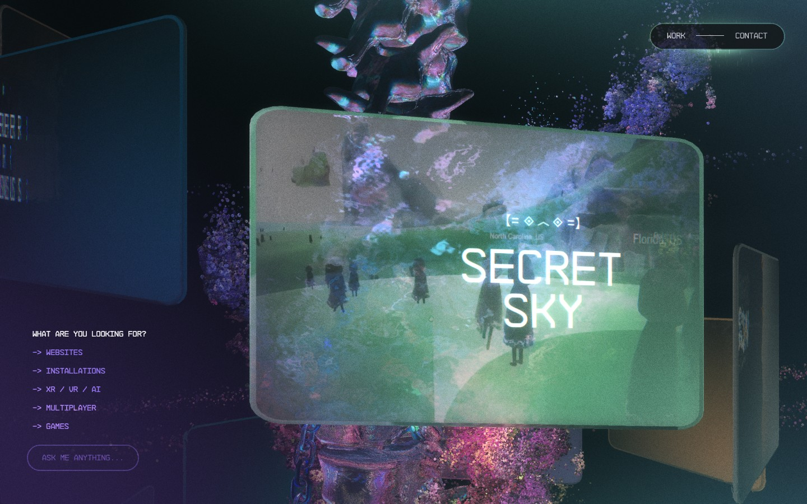
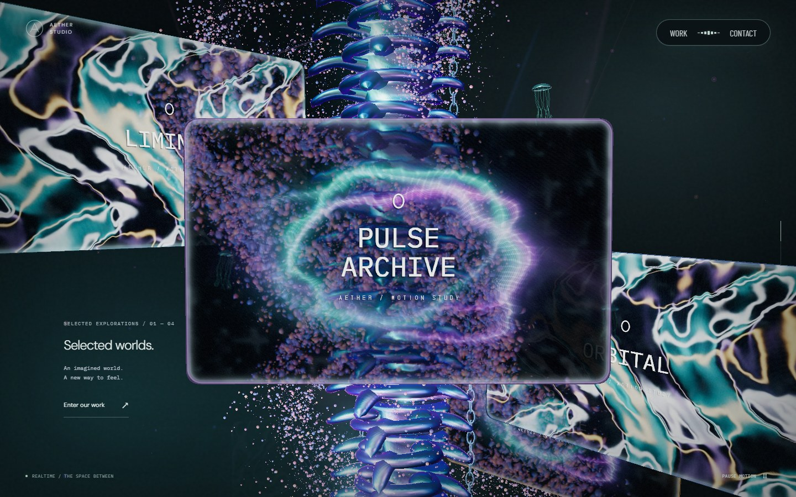
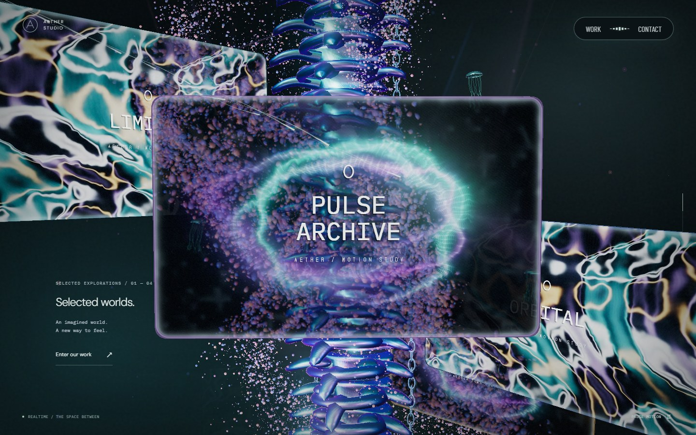
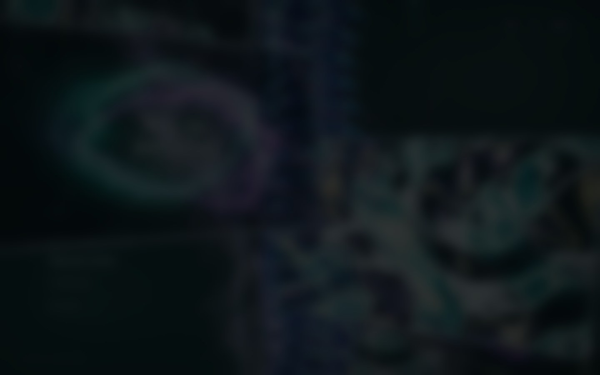
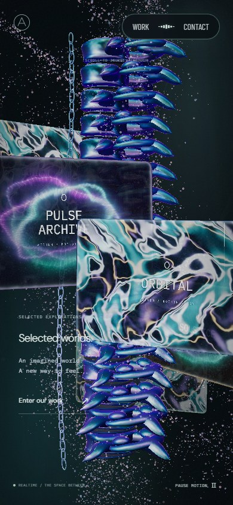

# 실제 영상 모니터와 마우스 입력 · 2026-09-22

[운영 사이트](https://aether-studio-nu.vercel.app/) · [README](../README.md) · [영상 자산](media-sources.md) · [이전 척추·굴절 구현](spine-monitors.md)

모니터 여섯 장에 직접 제작한 MP4 두 편을 공유해 재생합니다. 얇은 유리판 위에서 영상과 뒤쪽 척추·입자의 굴절이 함께 보이며, 마우스를 올린 판은 조금 들리고 기울어집니다. 클릭은 기존 프로젝트 상세 화면으로 연결합니다. 척추 구간의 카메라 드래그 잠금은 유지합니다.

## 원본에서 관찰한 동작

[Active Theory](https://activetheory.net/)를 1440×900·DPR 1의 데스크톱 Chromium에서 실제 휠·마우스로 관찰했습니다. 스크롤을 멈춘 뒤 2.2초 동안 판과 척추의 위치는 거의 유지되지만 영상 프레임은 바뀌었습니다. 역스크롤로 같은 배열에 돌아와도 영상은 재생을 이어갑니다.

- 정면 판은 거의 평평한 둥근 직사각형이며, 얇은 단면과 틴트 유리의 가장자리가 보입니다.
- 호버에서는 작은 들림·기울기가 관찰됩니다. 영상과 반사도 계속 변하므로 정지 이미지의 밝기 차이 전부를 호버 효과로 해석하지 않습니다.
- 700px 좌우 드래그 중에도 전체 카메라가 척추 주위를 회전하지 않습니다.
- 중앙 프로젝트를 클릭하면 같은 탭의 상세 경로로 이동합니다. AETHER는 자체 가상 프로젝트의 기존 dialog를 연결했습니다.

| 원본 정지 상태 | 원본 호버 상태 |
| --- | --- |
|  |  |

원본의 일부 중앙 판과 세 스크롤 위치를 관찰한 결과입니다. 원본 내부 진행률·곡률·광학 값·셰이더 방식을 식별한 것은 아닙니다. 원본 소스·영상·텍스처는 복사하지 않았고, 위 화면은 비교 근거로만 보관합니다.

## 시각적 변경

첫 행의 전후 비교 조건은 1440×900·DPR 1, AETHER 스크롤 진행률 40%, 초기 카메라 드래그 각도 0입니다. 정면 판 비교는 같은 정면 구간에서 포인터 위치를 바꿉니다. 재생 영상과 자율 조명의 시각은 고정하지 않습니다. 원본의 wheel 누적값을 AETHER의 40%와 동일한 위치라고 취급하지 않습니다.

| 대상 | 변경 전 | 변경 후 | 판단 포인트 |
| --- | --- | --- | --- |
| 40% 모니터 배열 |  |  | 영상의 선명도, 배경 굴절, 얕은 곡률과 얇은 가장자리 |
| 정면 판의 마우스 반응 |  |  | 작은 기울기·확대·앞쪽 이동과 표면의 빛 |

| 프로젝트 열기 | 모바일 |
| --- | --- |
|  |  |

GIF는 실제 캡처의 시간 변화를 요약한 자료입니다. 실시간 녹화의 FPS나 디코더 처리량을 측정한 자료는 아닙니다. 정면·호버 비교에서도 영상 프레임과 조명은 달라질 수 있습니다.

## 입력과 재생 수명

판의 배열·척추·사슬은 스크롤을 따르고 영상 재생 시간은 독립적으로 진행합니다. 호버는 마우스가 판 위에 머무는 동안 유지되며 주변 입자 조명의 감쇠와 분리됩니다. 버튼·링크·상세 화면·화면 이탈에서는 호버를 해제합니다. 드래그 중에는 카메라를 잠근 상태로 유지하고 상세 열기도 취소합니다.

같은 판에서 짧게 누르고 놓으면 해당 프로젝트 dialog를 엽니다. 큰 포인터 이동, 스크롤, 다른 판에서의 release, UI 위의 입력은 클릭으로 처리하지 않습니다. 척추·지하 장치의 불투명한 면에 가려진 부분도 선택에서 제외합니다. dialog를 열면 영상을 멈추고 닫으면 기존 스크롤 위치에서 재생을 이어갑니다.

| 상태 | 영상 동작 |
| --- | --- |
| 첫 홈 진입, 모니터 구간 이전 | 영상·포스터 소스를 연결하지 않음 |
| 홈 모니터 구간 진입 | 두 MP4를 처음 로드하고 음소거·반복·인라인 재생 |
| 같은 구간에서 스크롤 정지·역스크롤 | 기존 영상 시간을 이어서 재생 |
| 모니터 구간 이탈, Work / Contact / dialog, 숨김 탭 | 재생 일시 정지 |
| 모션 정지·OS reduced motion | 처음이면 다운로드하지 않음; 이미 로드했으면 마지막 영상 프레임 유지 |
| 모션·홈 모니터 구간 복귀 | 같은 미디어 객체와 재생 위치로 재개 |
| 로딩 전·404/네트워크 실패·자동 재생 차단 | 절차적 영상 셰이더 표시; 반복 활성화로 자동 재시도하지 않음 |
| 장면 최종 해제 | 재생·소스·VideoTexture·이벤트 정리 |

두 미디어 요소와 두 VideoTexture를 여섯 판이 공유합니다. 모션 설정으로 GPU 장면을 다시 만들 때도 미디어 객체를 유지합니다. 지연된 `play()` Promise가 비활성 영상을 다시 켜거나, 새 재생 요청을 오래된 결과로 중단하지 않도록 처리합니다.

## 자산과 렌더링 비용

- `chrome-current.mp4`: 수식으로 정의한 크롬 유체와 반사광, 1,510,755바이트.
- `aurora-bloom.mp4`: 오로라 리본과 미세 발광 실, 591,023바이트.
- 두 영상 모두 640×400·24fps·10초·무음 H.264이며 MP4 합계는 **2,101,778바이트(약 2.10MB)**입니다.
- 영상·JPEG 포스터·생성 스크립트·해시 manifest를 저장소에 포함합니다. 포스터는 별도 자산으로 제공하며, 현재 3D 모니터의 로딩 전·실패 대체 표현에는 절차적 셰이더를 사용합니다.

영상은 사이트의 `public/media/` 자산으로 Vercel CDN에서 제공합니다. 별도 영상 클라우드·스트리밍 API·비밀 키가 필요하지 않습니다. 제작 수식, 재생성 방법, 전체 프레임 디코딩 결과는 [영상 자산 문서](media-sources.md)에 기록했습니다. 교체 시 같은 파일 경로를 사용하거나 `SceneVideo.ts`의 소스 설정을 변경할 수 있습니다.

GPU 데스크톱은 실제 장면의 공유 저해상도 배경 캡처를 굴절에 사용합니다. 모바일·소프트웨어 렌더러는 추가 배경 캡처를 생략하고 실제 영상과 절차적 유리 표면을 합성합니다. 영상의 24fps 인코딩 값은 앱이 모든 환경에서 그 속도를 유지한다는 뜻이 아닙니다.

## 검증 상태와 경계

**로컬 Playwright 31개, lint·타입 검사·production build를 통과했습니다.** 실제 production 빌드의 데스크톱·모바일 스크롤 캡처와 모니터 호버·클릭·복귀에서도 브라우저 오류가 없었습니다. 원격 CI 결과는 연결된 PR에서 확인할 수 있습니다.

- production 장면에서 최초 영상 요청 없음, 실제 두 영상의 재생 시간 증가, 모션 정지·탭 숨김·Work·Contact·dialog의 정지, 객체·재생 위치를 유지한 복귀를 검사합니다.
- 실제 화면 좌표로 판 호버와 입력 없는 정지 호버를 검사합니다. 700px 왕복 드래그 후 카메라 잠금·상세 미열림, 정상 클릭·영상 정지·닫기 후 재개·스크롤 보존·UI 호버 해제를 확인합니다.
- 별도 경량 fixture에서 실제 MP4 요청 실패와 `NotAllowedError`를 유도하여 절차적 대체 상태, 자동 재시도 차단, 처리되지 않은 Promise 오류 없음, 미디어·텍스처 정리를 검사합니다.
- 기존 스크롤·카메라 잠금·사슬 왕복·굴절 RT의 DPR/상태 복구·접근성 검사를 함께 유지하고, 불투명 구조의 클릭 가림과 해당하지 않는 구조의 제외 조건을 검사합니다.

자동검사는 미디어 요소의 실제 시계와 입력 상태를 확인합니다. 최종 영상·굴절·조명 합성의 인상은 위 production 캡처로 별도 검수합니다. 숨김 상태 자동검사는 브라우저의 visibility 이벤트 경계를 사용하며 실제 OS 탭 전환·전원 절약 동작 전체를 보장하지 않습니다. 모바일 자료는 Chromium 에뮬레이션이고 실제 Safari/iOS 기기 검증은 수행하지 않았습니다. 원본과 콘텐츠·영상·모델은 다르며 시각적 유사도 백분율을 주장하지 않습니다.
