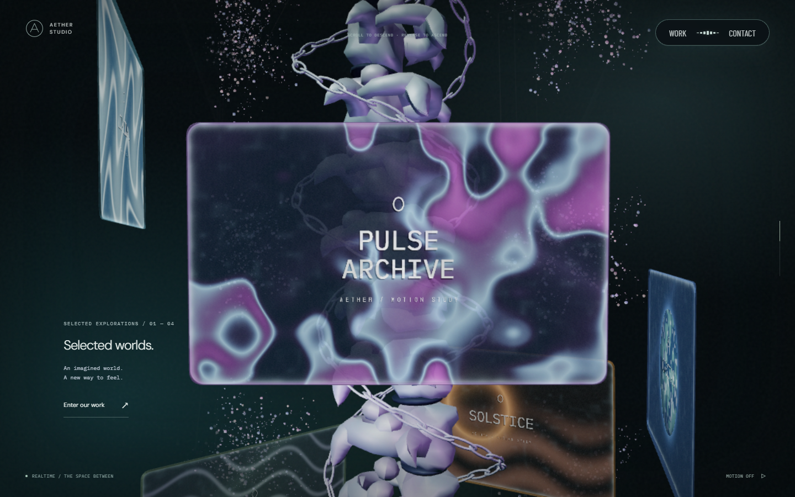
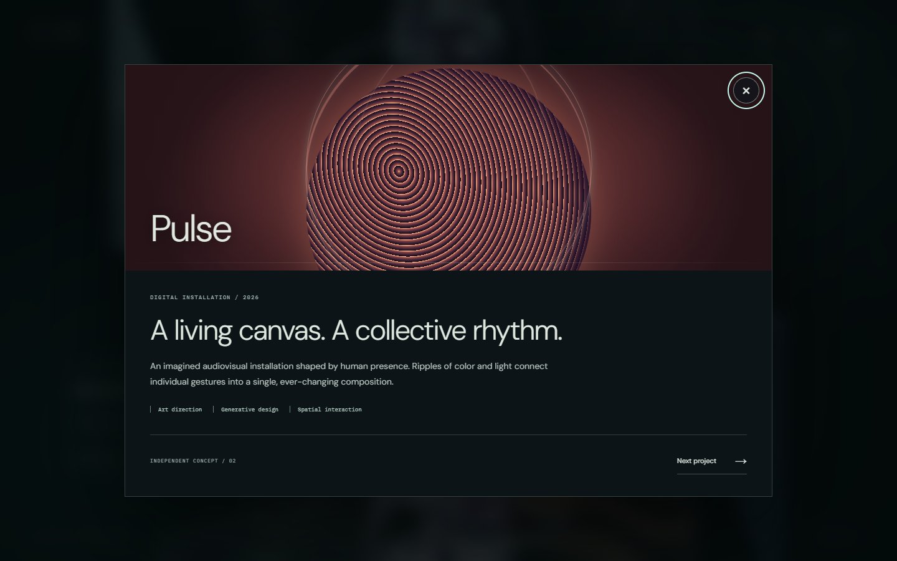
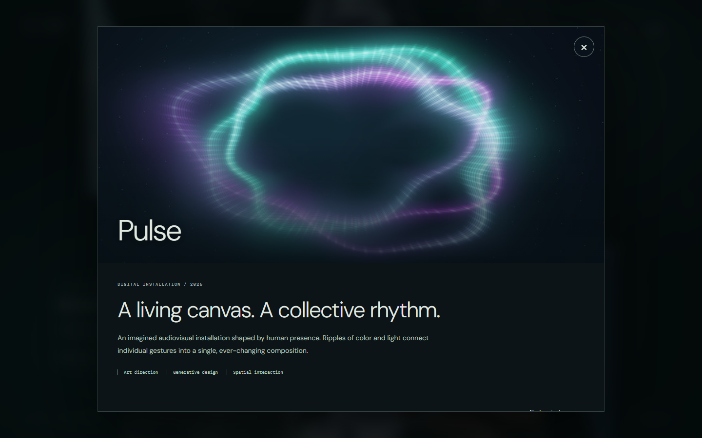
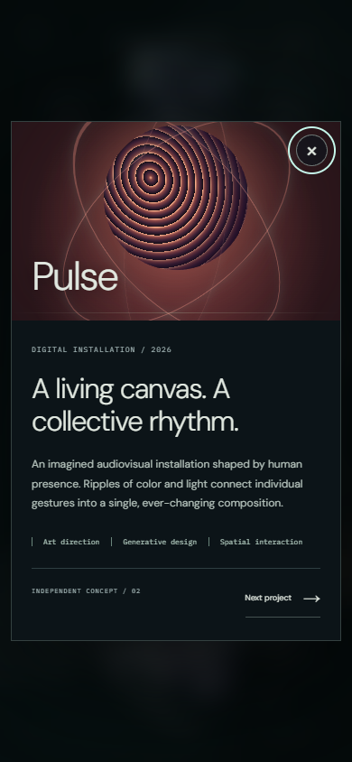
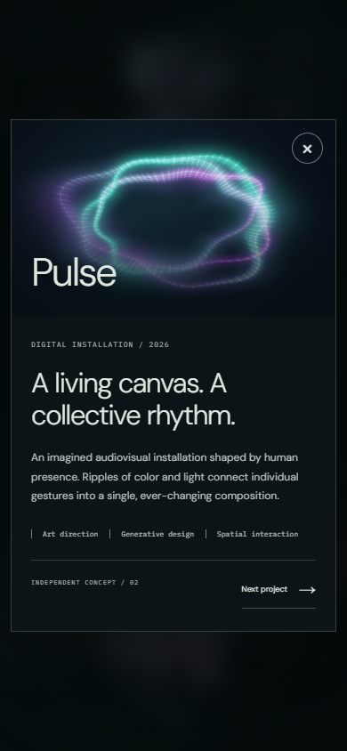
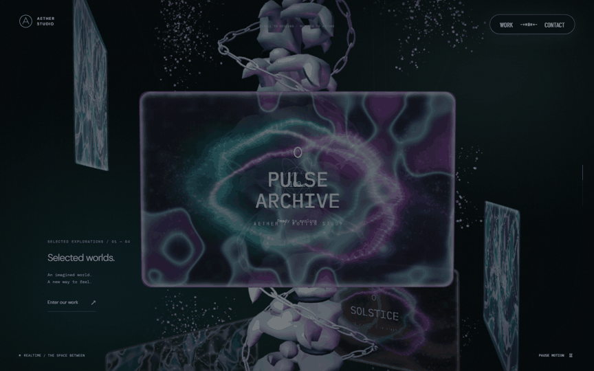
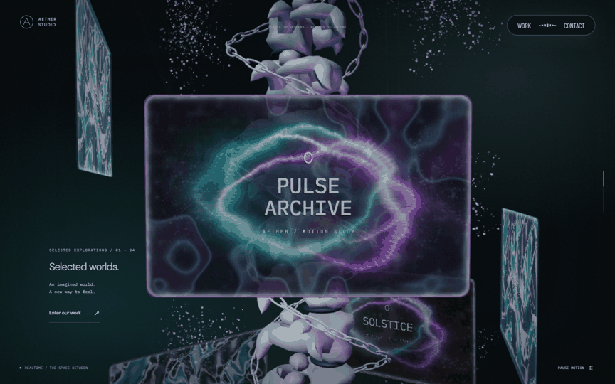
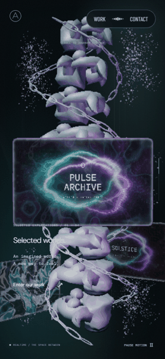
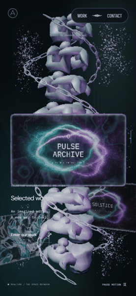

# 모니터 영상과 상세 전환 · 2026-09-23

기존 자체 영상 두 편을 유지하고 모니터 호버의 영상 시차·제목 색 분리, 영상 중심 상세 화면과 열기·닫기 전환을 추가했다. 기준은 5단계 병합 커밋 `5e59591`이다. 모니터와 Work는 같은 프로젝트 dialog를 연다.

## AT에서 관찰한 동작

2026-09-23 [Active Theory](https://activetheory.net/)를 Chromium 1440×900에서 열고 휠 `+3000`, `+3500`으로 본 컬럼 모니터 구간에 진입했다. Racer 모니터 안에서 `(1000,520) → (850,410) → (1130,560)`으로 포인터를 옮겼다. 영상과 배경이 유리 표면 안에서 겹치고, 제목에 색 분리·왜곡이 보였으며 포인터 위치를 바꿀 때 패널의 기울기와 표면 표현도 바뀌었다. 자동 영상·빛의 변화와 포인터 기여를 정량적으로 분리한 결과는 아니다.

첫 CLI down/up은 명령 사이 시간이 길어 상세 진입을 만들지 못했다. 같은 실제 브라우저에 Playwright로 연결해 `(1100,550)`을 한 번 클릭하자 주소가 `/work/racer`가 되고 큰 영상 중심 상세 화면이 나타났다. 화면 왼쪽에 제목·연도·분류·설명과 닫기 버튼이 있었다. 닫기 버튼을 클릭하고 연속 4프레임을 확보했으며 `/work`의 같은 모니터 구도로 돌아왔다. AT의 Escape·모바일 상세·정확한 전환 시간은 측정하지 않았다.

관찰 캡처는 로컬 `.qa/at-hover.png`, `at-detail-real.png`, `at-return-0.png`~`at-return-3.png`, `at-return-final.png`에만 둔다. AT 소스·영상·모델·로고·캡처를 앱이나 공개 비교 자산으로 복제하지 않았다. 유리 표면의 내부 shader와 실제 카메라 이동 여부는 추정 대상이며 확인 사실로 취급하지 않는다.

## 구현 선택

기존 화면에도 나선 궤도의 유리 패널, 자체 크롬·오로라 영상, 포인터 주변 물결과 미세한 방사 방향 이동이 있었다. 기존 영상은 [자산 기록](media-sources.md)과 [생성 스크립트](../scripts/generate-media.py)의 자체 생성 자산이며 새 외부 미디어는 없다.

이번에는 호버 영상 UV에 포인터 방향의 작은 시차를 주고 물결 강도를 조금 늘렸다. 제목 UV에도 물결과 RGB 가장자리 분리를 적용한다. 패널 크기·궤도·raycast·차폐 판정은 유지해 시각 반응과 클릭 영역이 어긋나지 않게 했다. 속도·강도는 자체 선택이며 AT에서 측정한 값이 아니다.

상세 화면에는 해당 모니터가 사용한 것과 같은 종류의 자체 영상을 크게 보여준다. 네 프로젝트가 영상 두 편을 공유하며 실제 고객 프로젝트 영상으로 표현하지 않는다. 영상은 무음·반복이고 상세를 열 때만 생성한다. 초기에는 `preload=none`이며 처음부터 모션 축소 상태이면 포스터를 표시하고, 재생 중 정지하면 현재 프레임을 유지한다. 탭 숨김·모션 정지 때 멈추고, 다운로드·재생 실패 때 기존 절차적 ProjectArt로 대체한다. dialog 종료나 영상 변경 때 소스를 제거하고 디코더를 해제한다. 배경 모니터 두 디코더는 기존 위치를 보존해 복귀 때 이어 재생한다.

열기는 입력 위치를 기준으로 72% 크기에서 400ms 동안 커지고, 닫기는 220ms 동안 94%로 작아지며 사라진다. 모션 축소에서는 두 전환을 생략한다. 닫는 동안 modal을 유지해 배경으로 입력이 새지 않게 한다. Escape 연타가 native dialog만 먼저 닫는 결함을 재현해 keydown과 종료 이벤트를 함께 처리했다. Work는 원래 카드에, 모니터는 스크롤을 유지한 `.hero-stage`에 포커스를 돌려준다.

AT는 별도 경로를 사용하지만 이 앱은 기존 hash 탐색과 공통 dialog를 유지한다. 현재 상세 콘텐츠의 범위에서 새 URL·서버 rewrite·이력 계약까지 추가할 필요는 없다고 판단했다. 열기·닫기는 URL을 바꾸지 않는다. 기존 Work/Contact hash 이동과 dialog 종료 계약은 검사한다.

8px 이상 이동, 700ms를 넘긴 누름, 누르는 동안 스크롤·진행률 변경, 다른 패널에서 놓기는 기존처럼 클릭에서 제외한다. 터치는 호버를 만들지 않으며 짧은 탭으로 연다. 모바일 높이와 내부 스크롤을 유지해 닫기와 본문에 접근할 수 있다.

## 시각적 변경

Chromium software WebGL, DPR 1, PC1440×900·모바일390×844, progress .367을 사용했다. 정지 전후 이미지는 모션 축소와 포인터 이탈 상태다. 기준본과 변경본은 각각 production build/preview로 실행했고 실제 폰트 loaded 상태와 폰트 HTTP 실패를 기록했다. 기준본의 의존성 junction은 빌드에만 쓰고 브라우저에는 빌드된 폰트를 제공했다.

| 대상 | 변경 전 | 변경 후 | 판단 포인트 |
| --- | --- | --- | --- |
| PC 모니터 |  |  | 정지 상태 궤도·내용 보존 |
| PC 상세 |  |  | 영상 중심 구성·제목·닫기 |
| 모바일 상세 |  |  | 작은 화면의 본문·닫기 접근 |
| PC 입력·전환·복귀 |  |  | 호버→클릭→상세→닫기→복귀 |
| 모바일 입력·전환·복귀 |  |  | 터치와 복귀 |

GIF는 모션을 켠 실제 연속 캡처 6장을 편집한 자료다. 캡처 명령 사이의 GPU 처리 시간이 포함되므로 전환 속도·프레임률 측정 자료가 아니다. 원본 영상 프레임의 시각까지 동일하게 맞춘 비교는 아니다.

## 검증과 한계

lint·typecheck·production build와 탐색·초기 로딩·영상·상세 전환 브라우저 검사 33건을 통과했다. 최초 Escape 연타 검사에서 native dialog와 React 상태가 어긋난 문제를 재현했고 수정 뒤 통과했다. 실패 검사는 숨김 여부뿐 아니라 실제 `hidden` 속성도 확인한다. PC·모바일 영상 요청 차단 상태에서 대체 화면과 상세 접근, `WEBGL_lose_context` 손실·복구와 준비 완료를 확인했다. 모바일은 CDP 터치 이동·종료로 드래그가 상세를 열지 않음을 검사했다. [실패·복구 기록](evidence/monitors-2026-09-23/failure-context.json)을 함께 본다.

강화한 실패 검사 2건과 모니터 궤도·유리/수면 캡처·준비 취소 검사 7건도 별도 실행해 통과했다. 일반 반사 경로는 GPU fixture에서 타깃·viewport·가시성과 실패 뒤 상태 복원까지 검사했다. 정지 모니터의 PC·모바일 전후 PNG는 각각 SHA-256이 같았다. 캡처의 Barlow Condensed·DM Sans·IBM Plex Mono는 loaded였고 폰트 HTTP 실패·pageerror는 없었다. 최종 CI·자동 리뷰는 PR 기록을 기준으로 한다.

AT의 정밀한 왜곡·카메라·속도 일치, 실제 Safari/Android 기기와 하드웨어 GPU 성능은 미검증이다. 탭 숨김 검사는 visibility 이벤트 주입이며 운영체제의 실제 탭 스케줄링 측정과 구분한다.

초기 100%/첫 렌더, 숨은 씬 준비, 후속 영상 비대기, 본 컬럼 공유 회전, 리액터 개구부 `(0,-37.25,0)`·반경1.12·출구 -37.38, 입자 동선·천장·빛·수면을 변경하지 않았다. 모니터 캡처·물 반사 타깃과 렌더 상태 복원도 그대로다. 새 SpotLight·3D 자원·렌더 타깃은 없다.

7단계는 스케일 패널의 7초 발생 간격·3초 전파, 국소 포인터 파동과 부유 기포에 한정한다. `excludeChamberSpotlight`는 유일한 개구부 SpotLight 전제이므로 추가 광원이 필요하면 광원별 차단과 GPU 검사를 다시 설계한다. 다음 세션 생성은 조정 세션이 맡는다.
