# 첫 모니터 진입과 겹침 구간 성능

PR #15에서는 같은 해상도·프레임률의 VP8 모니터 영상과 보이지 않는 전환 영역의 렌더 생략을 적용했습니다. **첫 진입의 최장 RAF 간격은 기존 99.9/83.3ms에서 최종 독립 3회 모두 16.8ms로 줄었고, 33.5ms 초과 간격은 없었습니다.** 전체 왕복도 최장 16.8ms였습니다. 반면 겹침 구간의 최대 217 draw와 GPU 시간 편차는 남아 있습니다.

같은 GPU에서 모니터 영상 요청을 차단하면 긴 프레임이 사라지고, 첫 데이터까지만 받은 뒤 재생을 멈추면 지연이 남았습니다. CDP와 trace로 일반 모니터의 D3D11 가속 디코더 초기화 경로를 확인했지만, 특정 내부 단계 하나가 전체 지연을 만든다고 단정하지 않습니다. [측정 증거 요약](evidence/monitor-performance.json)에 진단과 최종 실행을 구분해 보관합니다.

이 작업은 [후속 개선 우선순위](next-improvements.md)의 첫 모니터 지연과 장면 겹침 비용을 다룹니다. [PR #10의 전환 준비 개선](transition-performance.md)과 [PR #13 측정](scene-occlusion-light.md#전환-성능과-한계)은 당시 결과로 보존합니다. 서로 다른 조건의 수치를 이어 붙여 지속적인 성능 개선율로 계산하지 않습니다.

## 재현 조건과 기록

- Chromium / ANGLE D3D11, NVIDIA GeForce RTX 2060 SUPER, 1440×900, DPR 1. 한 번에 GPU 브라우저 하나를 실행했습니다.
- 로컬 production 빌드, CDP로 HTTP 캐시 비활성화. 새 브라우저를 열고 장면 `ready` 확인 후 1초 대기했습니다.
- `requestAnimationFrame`마다 요청 스크롤을 7초 동안 `0→.365`로 진행했습니다. 각 조건은 2회 반복했습니다. 자연스러운 휠 입력 검수와 구분되는 통제된 측정입니다.
- RAF 간격·요청/렌더 진행률·품질·JavaScript 콜백 시간·GL 호출·영상 이벤트·영상 프레임 콜백을 기록했습니다. GPU 시간은 `EXT_disjoint_timer_query_webgl2`를 사용했고 확장 지원 및 `disjoint=false`를 확인했습니다.
- 원본 자료는 `.qa/performance-v14/baseline/{mode}-{0,1}.json`, 진단 도구는 `.qa/performance-v14/diagnose.mjs`입니다. 아래 값은 JSON의 `summary.max`를 소수 첫째 자리로 표시했습니다.
- 최종 첫 진입은 lint·build가 끝난 뒤 다른 작업과 겹치지 않게 3회 실행한 `final-entry-isolated/normal-{0,1,2}.json`을 사용합니다. lint와 겹친 `final-entry/` 기록은 대표 비교에서 제외합니다.
- 전체 스크롤은 `0→.99` 하강 19초, `.99→0` 상승 19초를 두 번의 새 브라우저에서 반복했습니다. `full-before/normal-{rep}-{round}.json`과 `full-after/`를 비교하며 `round=0`은 하강, `round=1`은 상승입니다. 최종 런타임 소스는 `6da8426`입니다.

## 조건별 첫 진입 비교

아래 옵션은 **비교 진단에만 사용했으며 출시 기능이 아닙니다.** 모니터 mesh를 없애거나 전체 장면 해상도를 낮춘 결과로 해석하지 않습니다.

| 조건 / JSON mode | 실제 바꾼 동작 | 최장 RAF 간격 1회 | 2회 | 현재 해석 |
| --- | --- | ---: | ---: | --- |
| 일반 / `normal` | 원래 H.264 모니터 영상 두 편과 조명 영상 | 99.9ms | 83.3ms | 첫 진입에서 긴 프레임 재현 |
| 모니터 영상 요청 차단 / `no-monitor` | 크롬·오로라 MP4 요청을 중단 | 16.8ms | 16.8ms | 영상 초기화 경로를 분리하면 긴 간격이 사라짐 |
| 조명 영상 요청 차단 / `no-light` | 공유 조명 MP4 요청만 중단 | 66.7ms | 49.9ms | 간격은 줄었으나 모니터 진입 지연은 남음 |
| 첫 데이터 후 일시정지 / `still-monitor` | 모니터 영상 로드를 허용하고 `loadeddata` 후 일시정지 | 83.4ms | 66.7ms | 지속 재생을 멈춰도 초기화 비용은 남음. 포스터만 사용하는 실험이 아님 |
| 720×450 draw 생략 / `skip-refraction` | 해당 크기 타깃의 draw를 생략. 굴절 외 bloom 일부도 포함 | 83.3ms | 66.7ms | 굴절 전용 비용을 분리한 실험은 아님 |
| VP9 WebM 응답 / `webm` | 두 MP4 요청에 같은 내용의 VP9 영상을 응답 | 50.0ms | 116.7ms | 반복 결과 편차가 커 안정적인 해법 근거가 부족함 |
| 영상 한 편만 / `single-monitor` | 오로라 요청을 차단하고 크롬만 허용 | 50.0ms | 50.0ms | 동시 초기화와의 관련성이 있으나 영상 한 편 제거는 최종안이 아님 |
| VP8 WebM 응답 / `vp8` | 두 MP4 요청에 같은 내용의 VP8 영상을 응답 | 16.8ms | 16.8ms | 같은 규격의 최종 VP8 채택 근거 |
| 영상 가속 디코딩 비활성 / `software-video` | 브라우저를 `--disable-accelerated-video-decode`로 실행 | 16.8ms | 16.8ms | 디코딩 경로에 따른 차이 확인. 사용자에게 브라우저 플래그를 요구하는 방안은 아님 |

CDP Media 기록에서 VP8 모니터 두 편은 `VpxVideoDecoder`, 가속 디코딩을 끈 모니터는 `FFmpegVideoDecoder`를 사용했으며 둘 다 `platform=false`였습니다. 추가 추적에서 일반 H.264 모니터 두 편은 `D3D11VideoDecoder`·`platform=true`로 확인했습니다. VP8이 모든 브라우저에서 같은 디코더나 성능을 사용한다고 일반화하지 않습니다.

## 영상 초기화와 긴 프레임의 관계

일반 조건의 두 실행에서 관측한 JavaScript RAF 콜백 최댓값은 3.9/2.8ms, GPU 쿼리 최댓값은 약 6.95/6.49ms였습니다. 이는 99.9/83.3ms의 RAF 간격보다 짧습니다. 콜백과 GL 명령을 감싼 측정 범위 밖의 네이티브 미디어 처리·합성·동기화 대기까지 포함한 전체 비용은 아닙니다.

`normal-0.json`의 탐색 시작 기준 시각은 다음과 같습니다.

| 사건 | 관측 시각 |
| --- | ---: |
| 두 모니터 영상 `loadstart` | 9651.7ms |
| 99.9ms RAF 간격 | 약 9695.3→9795.2ms |
| 크롬 `loadeddata` | 9759.3ms |
| 오로라 `loadeddata` | 9798.7ms |
| 두 영상의 첫 관측 `requestVideoFrameCallback` | 9807.9ms |

긴 간격과 영상의 로드·첫 프레임 시점이 겹칩니다. 요청 차단·첫 데이터 일시정지·코덱·디코딩 경로 실험을 함께 보면 **영상 초기화 범주**는 좁힐 수 있습니다. 그러나 이벤트 시각의 일치만으로 특정 H.264 디코더 버그, 텍스처 업로드, 드라이버 대기 중 하나를 유일한 원인으로 확정하지 않습니다. 긴 프레임 끝의 요청 스크롤과 화면의 보간된 진행률도 다르므로 원본 JSON의 두 값을 함께 봐야 합니다.

## 디코딩 경로의 추가 추적

`.qa/performance-v14/traced-baseline/normal-0.json`의 CDP Media 속성과 같은 폴더의 `normal-0-trace.json`을 함께 확인했습니다.

| 재생 대상 | 규격 | 확인한 디코더 | platform |
| --- | --- | --- | --- |
| 일반 크롬·오로라 모니터 2편 | H.264, 640×400 | `D3D11VideoDecoder` | true |
| 공유 조명 영상 | H.264, 256×160 | `FFmpegVideoDecoder` | false |
| VP8 비교 모니터 2편 | VP8, 640×400 | `VpxVideoDecoder` | false |
| 가속 비활성 비교 모니터 | H.264, 640×400 | `FFmpegVideoDecoder` | false |

작은 조명 영상과 모니터 영상이 같은 H.264이면서도 이 환경에서는 다른 디코딩 경로를 사용했습니다. 해상도뿐 아니라 프로파일과 브라우저의 선택 조건도 다르므로, 영상 크기 하나를 원인이나 고정 임계값으로 단정하지 않습니다. 모니터 두 편의 동시 초기화를 줄였을 때 지연이 작아지고 디코딩 경로를 바꿨을 때 긴 간격이 사라진 결과가 함께 근거가 됩니다.

| 일반 H.264 trace span | 관측 최장 시간 |
| --- | ---: |
| `D3D11VideoDecoder::PictureBufferGPUResourceInitDone` | 31.038ms |
| `D3D11VideoDecoder::DoDecode` | 31.036ms |
| `D3D11VideoDecoder::Initialize` | 12.322ms |

이 값은 trace에 기록된 구간 길이입니다. 중첩되거나 서로 다른 스레드에서 실행될 수 있어 합산해 전체 지연으로 계산하지 않습니다. 추적 실행의 최장 RAF 간격은 66.6ms였지만 tracing의 추가 계측 조건이 있으므로 위 반복 비교표의 대표값으로 교체하지 않습니다. WebGL 쿼리가 짧게 끝나도 별도의 영상 디코더 GPU 자원 준비·네이티브 처리 경로는 남을 수 있다는 근거입니다.

## 채택한 영상 규격과 유지 조건

자체 제작 영상 두 편을 **같은 640×400·24fps·10초·무음**으로 재인코딩한 balanced VP8을 채택했습니다. 첫 진입에서 `canPlayType('video/webm; codecs="vp8"')`가 `probably` 또는 `maybe`이면 WebM을 선택하고, 미지원·지원 조회 오류이면 기존 MP4를 선택합니다. 선택한 WebM의 다운로드·디코딩·자동 재생이 실패하면 절차적 영상 셰이더를 유지합니다. 실패 후 MP4를 연속 요청하거나 프레임마다 재시도하지 않습니다.

약 3.3MB의 초기 비교본에서 압축 설정을 조정해 다음 품질·용량을 확인했습니다. 원본 MP4와 공유 조명 영상은 보존하며 지원 형식 하나만 내려받습니다. 포스터 JPEG는 자산 확인용으로 남기되 화면 밖 영상 요소에 연결하지 않아 불필요한 다운로드를 없앴습니다.

| 항목 | 값 |
| --- | ---: |
| 기존 MP4 두 편 합계 | 2,101,778 bytes |
| 채택한 VP8 두 편 합계 | 2,070,979 bytes |
| 크롬 영상 원본 대비 SSIM | 0.977189 |
| 오로라 영상 원본 대비 SSIM | 0.984363 |

재인코딩은 무손실 복사가 아닙니다. 원본 해상도·프레임률과 영상 내용, 3D geometry를 유지하면서 압축 품질을 비교했습니다. 배포 대상 WebM 두 편의 480프레임 전체 디코딩·형식·SSIM도 확인했습니다. [영상 출처·생성·manifest](media-sources.md)에 파일별 검증을 기록했습니다.

영상 전체를 미리 내려받거나 정적 사진으로 바꾸지 않고 모니터 진입 시 지연 로드를 유지합니다. 완전히 닫힌 전환 경계에서는 모니터 그룹도 숨기므로 로드 시점은 약간 뒤로 이동했습니다. 전체 하강의 요청 `loadstart`는 변경 전 스크롤 약 24.66~24.71%, 변경 후 25.12~25.20%였습니다. 최종 결과는 코덱만 바꾼 단일 변수 비교가 아닙니다. 위 진단의 VP8·가속 비활성 실험이 디코딩 경로를 별도로 분리한 근거입니다.

## 보이지 않는 캡처와 반사 생략

사선 경계가 완전히 닫힌 경우 모니터·리액터 그룹을 렌더하지 않습니다. 경계가 일부 열리면 모니터 판과 테두리의 투영 범위를 확인하고 화면에 기여할 수 있을 때만 공유 굴절 배경을 캡처합니다. 첫 등장·재진입·타깃 재준비 때는 기존 격프레임 갱신 일정과 무관하게 즉시 캡처해 오래된 배경이 한 프레임 보이는 것을 막습니다.

주 카메라 밖의 모니터라도 물 반사에 보일 수 있으면 캡처를 유지합니다. 물은 실제 해당 렌더 패스의 카메라와 전환 경계에서 보일 때만 512×512 반사를 계산합니다. 근접면 통과나 범위가 불확실한 경우에는 렌더를 유지하도록 여유를 두었습니다. 모델·입자 수·전체 해상도를 낮춘 변경이 아닙니다.

## 최종 첫 진입과 전체 왕복

| 측정 구간 | 변경 전 최장 RAF 간격 | 변경 후 최장 RAF 간격 | 33.5ms 초과 간격 |
| --- | --- | --- | --- |
| 첫 진입 7초, 기존 2회·최종 독립 3회 | 99.9 / 83.3ms | 16.8 / 16.8 / 16.8ms | 기존 각 1회 → 최종 각 0회 |
| 전체 하강 19초, 2회 | 66.6 / 83.3ms | 16.8 / 16.8ms | 각 1회 → 각 0회 |
| 전체 상승 19초, 2회 | 16.8 / 16.8ms | 16.8 / 16.8ms | 전후 모두 0회 |

최종 독립 첫 진입은 총 1,260개의 RAF 간격을 기록했습니다. 전체 스크롤을 포함해 이 비교의 모든 실행에서 품질 최솟값은 1.00이었고, **측정 스크롤 구간 안**의 longtask·셰이더 컴파일·링크는 0회, 기록된 브라우저 오류는 0개였습니다. 초기 로딩의 longtask까지 0회였다는 뜻은 아닙니다. 전체 왕복의 RAF p95는 전후 16.7~16.8ms입니다.

### 본 컬럼·리액터 겹침 59~69%

GL draw가 있었던 RAF 콜백을 요청 진행률 `p`의 `[.59,.69)` 구간으로 골라 두 반복을 합쳤습니다. draw와 CPU는 그 콜백에서, GPU는 같은 `(t,p)`에 대응하는 유효 쿼리에서 계산합니다. 마지막 미회수 쿼리와 이전 회차의 쿼리는 제외합니다. 화면에 보간된 모델의 진행률과 요청 진행률이 다를 수 있으며, 드물게 갱신되는 화면 telemetry의 draw를 표본으로 사용하지 않았습니다. 백분위수는 정렬 후 `floor(N×.95)` 위치를 사용합니다.

| 방향·두 반복 합산 | 렌더당 평균 draw 전→후 | CPU p95 전→후 | GPU p95 전→후 | GPU 최댓값 전→후 |
| --- | ---: | ---: | ---: | ---: |
| 하강 | 152.71 → 133.83 | 3.8 → 3.9ms | 7.31 → 7.96ms | 9.04 → 9.35ms |
| 상승 | 165.45 → 142.55 | 3.5 → 3.7ms | 6.46 → 5.71ms | 8.03 → 8.25ms |

**하강 최대 217 draw는 남습니다.** 닫힌 경계의 호출은 줄었지만, 보이는 모니터·리액터·물 반사가 동시에 필요한 구간은 계속 렌더합니다. GPU 실행 시간은 방향·반복에 따라 달라 일관되게 감소하지 않았습니다. 겹침 구간의 GPU 시간 개선이나 최대 부하 제거라고 주장하지 않습니다.

### 전체 타깃 호출을 렌더 횟수로 정규화

각 타깃의 GL draw 합계를 최종 canvas draw 수로 나눈 **실제 렌더 1회당 평균**입니다. canvas는 렌더마다 1회이며, RAF 간격 수와는 시작 프레임 1개 차이가 있습니다. `720×450`은 굴절과 bloom 일부가 같은 크기를 공유하므로 굴절 전용 draw가 아닙니다. `512×512`는 물의 평면 반사입니다.

| 방향·반복 | 모든 타깃 합계 전→후 | 720×450 전→후 | 512×512 전→후 |
| --- | ---: | ---: | ---: |
| 하강 1회 | 78.25 → 75.07 | 14.80 → 13.46 | 7.01 → 6.16 |
| 하강 2회 | 78.25 → 75.05 | 14.78 → 13.42 | 7.03 → 6.16 |
| 상승 1회 | 77.68 → 74.41 | 14.86 → 13.47 | 6.85 → 5.93 |
| 상승 2회 | 77.73 → 74.41 | 14.90 → 13.47 | 6.85 → 5.94 |

전체 렌더의 평균 GL 호출은 약 4% 줄었습니다. 호출 수의 감소율을 GPU 시간·전력·FPS 개선율로 바꾸어 해석하지 않습니다.

## 시각적 변경

실제 production 화면을 1440×900·DPR 1, 같은 스크롤 위치와 기본 카메라, 포인터 입력 없이 비교했습니다. 위치마다 60Hz 논리 시계로 270프레임을 진행하고, 로드된 모니터·조명 영상을 2초에서 일시정지해 전후 영상 위상을 맞췄습니다. 이 캡처는 경계·재질·굴절 검수용이며 재생 FPS나 지연 측정 자료가 아닙니다. [캡처 manifest](screenshots/performance/manifest.json)에 조건과 파일을 보관합니다.

| 스크롤·대상 | 변경 전 | 변경 후 |
| --- | --- | --- |
| 24% · 진입 직전 |  | 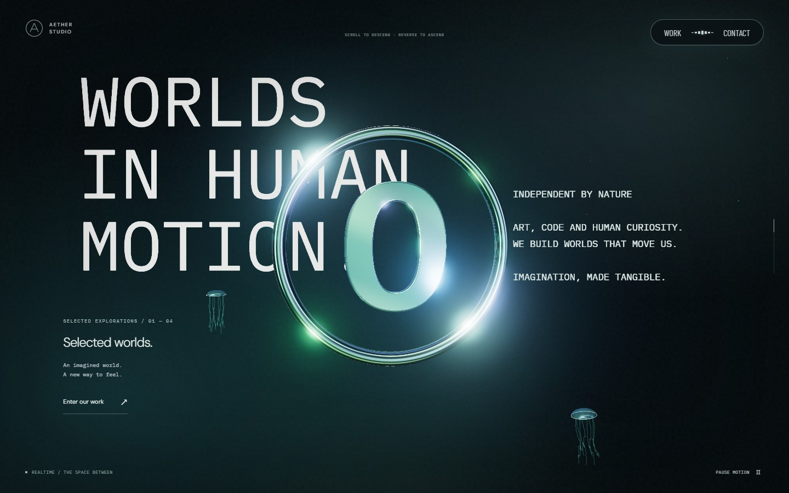 |
| 26% · 첫 모니터 | 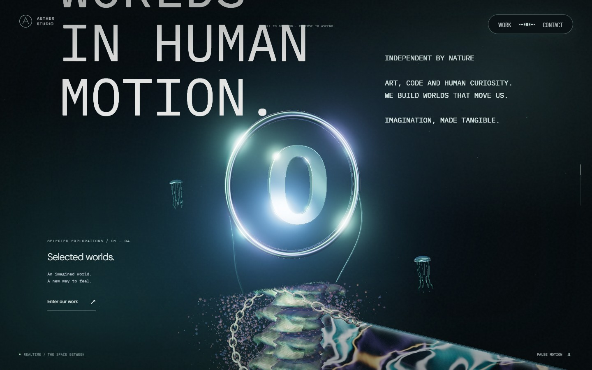 |  |
| 28.5% · 영상·유리 |  | 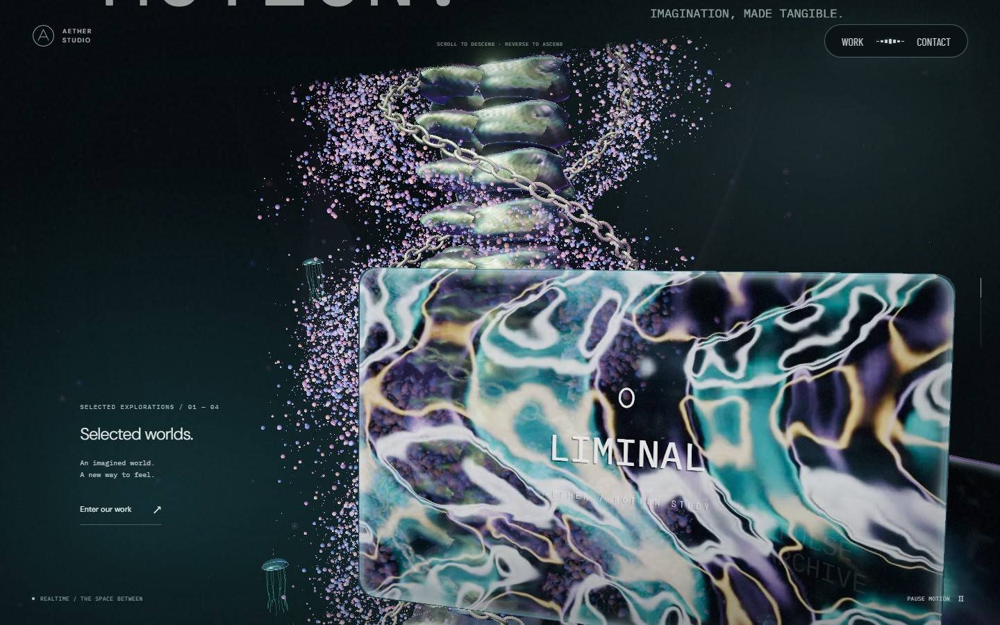 |
| 40% · 본 컬럼 |  | 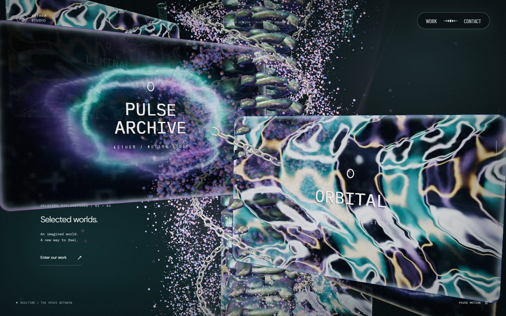 |
| 61% · 리액터 진입 전 |  | 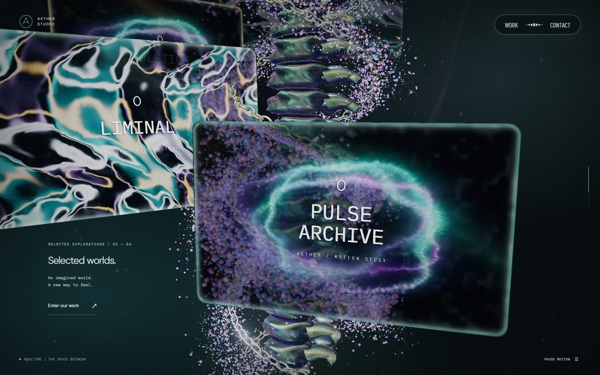 |
| 63% · 경계 겹침 | 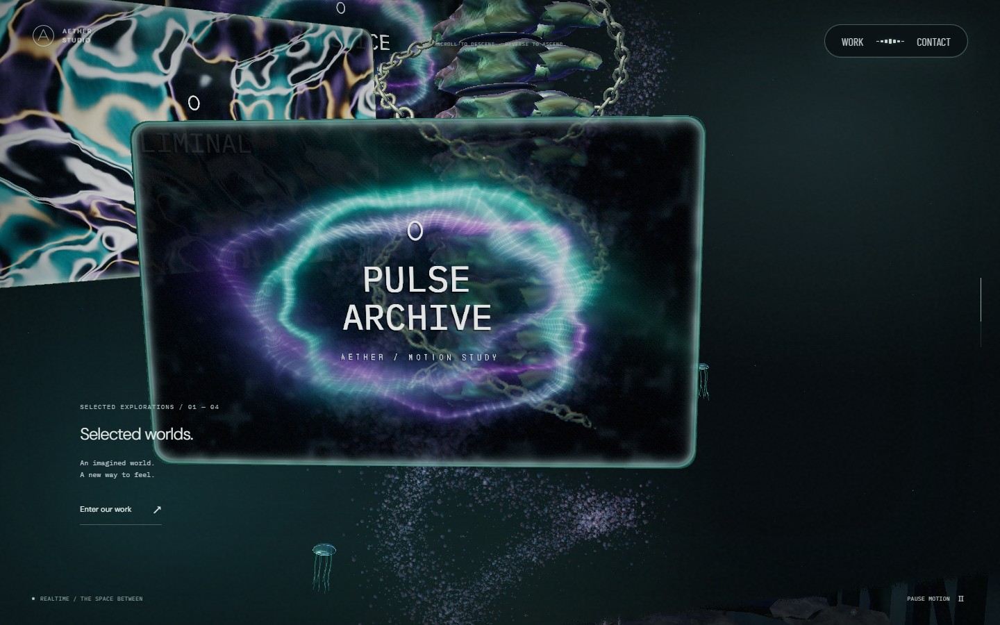 | 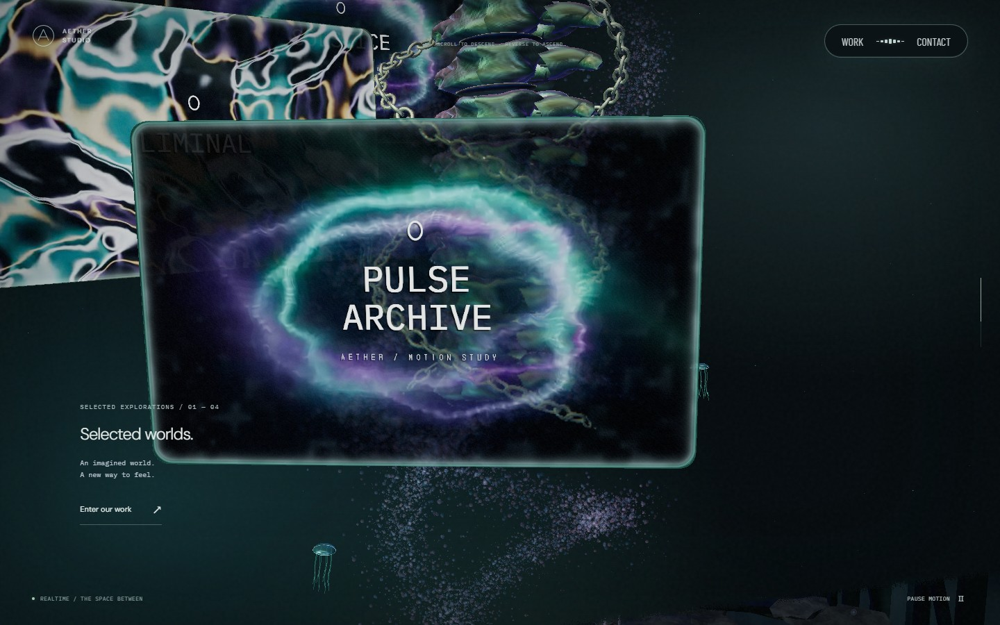 |
| 65% · 모니터·리액터 |  |  |
| 67.5% · 리액터 노출 |  | 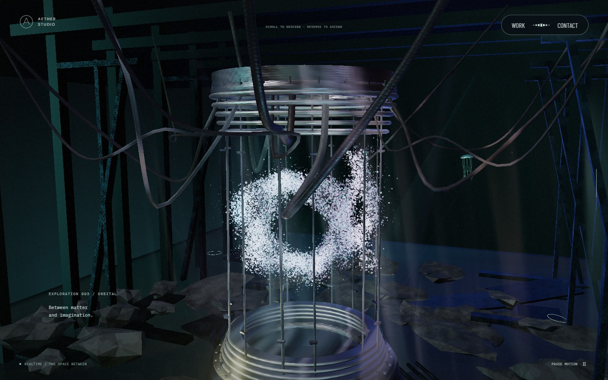 |
| 72% · 리액터·반사 | 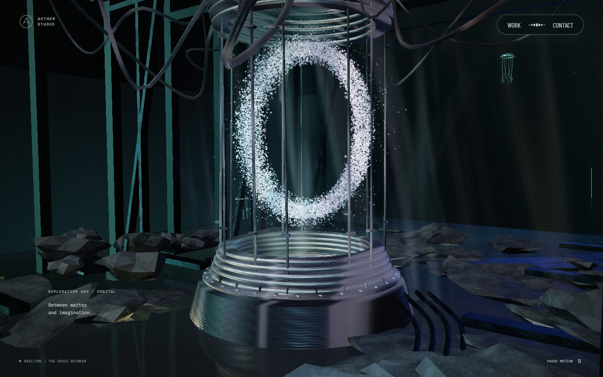 |  |
| 76% · 바닥 통과 |  | 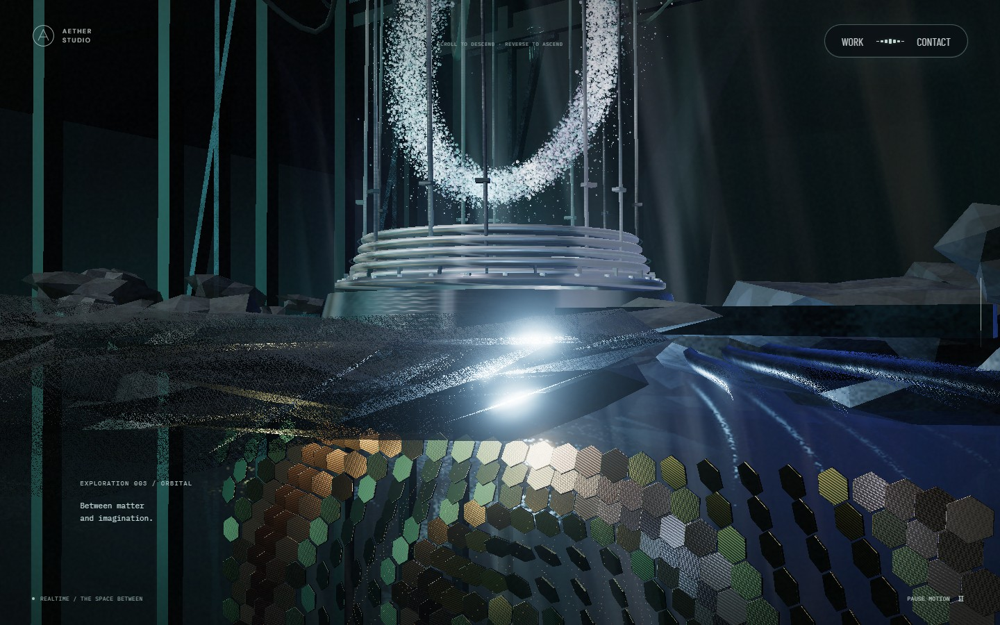 |
| 89% · 하단 포레스트 진입 |  | 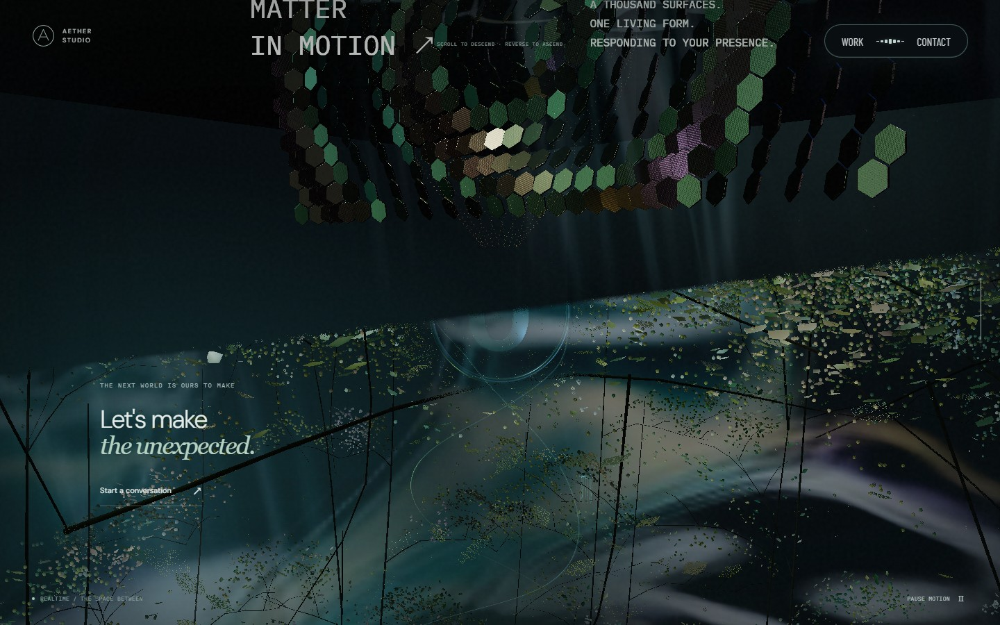 |
| 91.5% · 포레스트·링 | 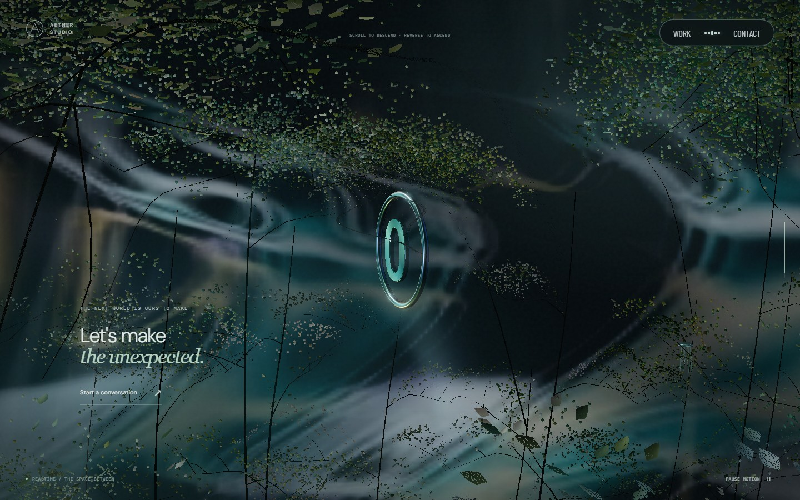 |  |

## 검증

로컬 전체 **68개 테스트가 4.4분에 통과**했고 lint·타입 검사·production build도 통과했습니다. 영상 선택·재생 수명·실패 처리와 캡처 재진입 검증, 12개 스크롤 위치의 전후 24장 비교를 포함합니다. 브라우저 지원 조회를 조작한 MP4 선택 검사는 실제 Safari/iOS 기기 검증을 대신하지 않습니다. GitHub CI와 배포는 별도 상태로 확인합니다.

## 해석의 한계

진단 조건별 2회, 최종 첫 진입 3회, 전체 왕복 2회이며 한 GPU·브라우저의 결과입니다. HTTP 캐시를 꺼도 OS 파일 캐시·드라이버 상태·미디어 서비스의 모든 내부 상태까지 같게 만들지는 못합니다. GL/RAF/영상 콜백을 감싼 계측 비용도 포함됩니다. GPU 타이머가 유효해도 디코더·합성기·브라우저 전체 파이프라인을 재는 것은 아닙니다.

초기 `ready` 시각은 원본에 기록하지만 이번 결과를 초기 로딩 속도 개선으로 표현하지 않습니다. 최종 16.8ms도 모든 장비의 성능 보장이나 Safari/iOS 결과가 아닙니다. 실제 목표 기기의 디코딩·발열·메모리와 겹침 최대 부하는 [다음 개선](next-improvements.md)에 남깁니다.
