# 링·포레스트·본 컬럼의 광학 표현

링에 뒤쪽 장면이 굴절되어 보이도록 하고, 포레스트 영상과 산란광, 본 컬럼의 반사색·꽃 띠, 포인터가 남기는 표면 흐름을 조정했다. 장면 경계와 미디어 수명은 기존 흐름에 연결한다.

비교 기준은 `17f3abb`이다. 작업 중 하단 포레스트 천장 수정 [PR #42](https://github.com/okorion/aether-studio/pull/42)의 `e013e22`를 통합했다. 전후 화면에서 보이는 하단 천장의 높이 변화는 해당 수정에 속하며 이 문서의 광학 변경 성과로 포함하지 않는다.

## 참고 화면에서 확인한 것

2026-09-24에 [Active Theory](https://activetheory.net/)의 공개 화면과 [앱 번들](https://activetheory.net/assets/js/app.1780406240914.js), [설정](https://activetheory.net/assets/data/uil.1780406240914.json), [셰이더 묶음](https://activetheory.net/assets/shaders/compiled.vs)을 읽었다. 아래의 ‘확인’은 공개 코드·설정에서 연결을 확인했다는 뜻이며, 효과별 GPU 기여도를 측정했다는 뜻은 아니다.

| 대상 | 확인한 연결 |
| --- | --- |
| 홈 링 | 배경 캡처를 법선으로 왜곡하는 굴절, matcap 반사, Fresnel 가장자리와 영상 색 합성 |
| 영상·숲 | 배경과 입자가 같은 영상 색을 사용하며, 곡면 배경의 부드러운 마스크와 별도 저해상도 산란광을 합성 |
| 본 컬럼·꽃 | 표면 법선·거칠기·배경 반사와, 높이가 어긋난 꽃 띠·성긴 외곽 궤도 |
| 포인터·안개막 | 속도·밀도 유체장을 입자·텍스트에 연결하고, 좌하단에 노이즈와 색 그라데이션을 제한해 합성 |

본 컬럼의 양 끝이 어두운 원인을 주변 반사 내용과 시점으로 설명한 부분은 추정이다. Aether의 본 컬럼에는 별도로 정의한 진행도 광량 곡선과 시점 의존 반사색을 적용했다. 공개 화면에서 보이는 모든 효과가 같은 품질 설정에서 작동했다고 가정하지 않는다.

AT의 코드·셰이더·모델·텍스처·영상은 앱에 복사하지 않았다. 관찰한 구성과 동작을 바탕으로 Aether의 기존 장면·재질·입력 구조에 맞춰 구현했다.

Aether의 포레스트 산란은 곡면 영상과 광선 팬을 합성한 표현이며, 포인터 흐름은 CPU에서 갱신하는 작은 필드다. AT에서 확인한 렌더 타깃 구성·유체 계산이나 최종 화면과의 동일성은 검증하지 않았다.

## 구현과 변경 위치

| 모듈 | 책임 |
| --- | --- |
| [SceneEmblem.ts](../src/SceneEmblem.ts) | 링·O·리본 트레일과 재질을 소유한다. 자체 오브젝트를 제외한 배경을 캡처하고, 굴절·영상 반사색·가장자리 빛을 합성한다. |
| [SceneLightShafts.ts](../src/SceneLightShafts.ts) | 포레스트 영상에 중앙 수평 띠와 흐림을 적용한다. 밝은 부분의 산란은 같은 높이 주변에 제한하고 어두운 틈·사선 전환 마스크를 유지한다. |
| [SceneLightVideo.ts](../src/SceneLightVideo.ts), [Scene.tsx](../src/Scene.tsx) | 영상별 재생 owner와 공유 uniform을 연결한다. 재생 구간, 모션 상태, 화면 숨김, 실패와 해제를 관리한다. |
| [SceneSpine.ts](../src/SceneSpine.ts) | 본 컬럼의 넓은 반사색과 미세한 표면 거칠기를 분리한다. 진행도에 따른 광량은 본 컬럼 표면에 적용하며 체인에는 적용하지 않는다. |
| [Atmosphere.ts](../src/Atmosphere.ts) | 같은 입자 버퍼에서 꽃의 접힌 부피, 높이가 어긋난 두 갈래 띠와 성긴 외곽 궤도를 구성한다. |
| [PointerFlow.ts](../src/PointerFlow.ts), [SceneSurfaceFlow.ts](../src/SceneSurfaceFlow.ts), [SceneGlow.ts](../src/SceneGlow.ts) | 포인터 속도·밀도를 작은 공통 필드로 전달하고 표면 변위와 좌하단 안개막에 사용한다. 모니터 구간은 영상 픽셀과 클릭 영역이 어긋나지 않도록 전체 화면 굴절을 제한한다. |

기존 실버 링으로 돌리려면 [Scene.tsx](../src/Scene.tsx)의 `createSceneEmblem({ ... })` 호출에서 `variant: 'glass'`를 `variant: 'silver'`로 바꾼다. 링·O·리본의 실버 재질 분기를 함께 선택하며 유리용 배경 캡처 대상도 만들지 않는다. 이동·회전·전환 경계는 같은 모듈에서 유지한다.

## 포레스트와 리액터 영상

| 영상 | 사용 범위 |
| --- | --- |
| [forest-memory.mp4](../public/media/forest-memory.mp4) | 상단·하단 포레스트의 배경, 숲 광선 팬, 링과 포레스트 입자의 영상 색 |
| [light-projection.mp4](../public/media/light-projection.mp4) | 기존 리액터 챔버 조명과 광선 팬. 파일 내용은 유지 |

두 영상은 별도 owner를 사용한다. `SceneLightShafts`의 `forestFilm`은 배경과 zone 0/1에만 연결하고, zone 2/3은 기존 `film`을 사용한다. 화면에 표시하는 상태도 `data-forest-video-state`와 `data-light-video-state`로 구분한다.

`forest-memory.mp4`는 아래 CC0 실사 영상과 기존 자체 영상 `aurora-bloom.mp4`, `chrome-current.mp4`를 편집했다. CC0 원본 파일은 저장소에 포함하지 않는다.

- [Flight over clouds — L. Shyamal](https://commons.wikimedia.org/wiki/File:Flight_over_clouds.webm)
- [Street in Mumbai (video) 02 — Nicolas Vigier](https://commons.wikimedia.org/wiki/File:Street_in_Mumbai_(video)_02.webm)
- [Misty river — Digitura](https://commons.wikimedia.org/wiki/File:Misty_river.webm)

이용 조건은 [CC0 1.0](https://creativecommons.org/publicdomain/zero/1.0/)이며 출처 고지는 [서드파티 자료](../THIRD_PARTY_NOTICES.md)에 정리했다. 원본 URL·파일명·SHA-256·사용 구간·변환·출력 해시는 [forest-memory manifest](../public/media/forest-memory-manifest.json)에 있다. 기존 영상의 기록은 [light-projection manifest](../public/media/light-projection-manifest.json)에 보존한다.

[재생성 스크립트](../scripts/regenerate-forest-memory.py)는 네트워크에 접근하지 않는다. Python과 ffmpeg 또는 `imageio-ffmpeg`를 준비하고, manifest의 원본을 저장소 밖에 둔 뒤 저장소 루트에서 실행한다.

```sh
python scripts/regenerate-forest-memory.py --input-directory /external/forest-sources --output-directory /external/forest-output
```

원본 해시를 생성 전후에 검사하고 전체 디코딩·출력 규격·무음·faststart·크기 제한을 확인한다. 검수 이미지가 필요하면 저장소 밖의 경로를 `--qa-directory`에 지정한다. 인코더 실행 환경에 따라 재생성 파일의 바이트 해시는 달라질 수 있으므로 배포 파일과 해당 manifest를 함께 확인한다.

## 축소 모드와 실패 처리

- 모바일은 링 배경 캡처 크기와 숲 팬 수를 줄인다. 표면 흐름 합성은 유지하고 bloom 피라미드는 만들지 않는다.
- 소프트웨어 렌더러는 두 조명 영상의 요청, 링의 HDR 배경 캡처, 광선 팬과 후처리를 끈다. 기본 재질과 장면 탐색은 유지한다.
- 모션 감소 상태로 시작하면 영상을 요청하지 않는다. 재생 중 모션을 멈추거나 탭을 숨기면 일시정지하고, 재개할 때 같은 owner와 재생 위치를 사용한다.
- 자동재생 거부·영상 오류는 해당 owner의 종료 상태로 남겨 재진입 때 반복 요청하지 않는다. 영상 uniform은 대체 텍스처로 돌아가고 절차적 조명을 유지한다. 링의 배경 캡처가 실패하면 배경 샘플 사용을 중단하고 재질 기반 조명으로 계속 그린다.

## 비교 캡처와 검증 기록

비교 캡처는 데스크톱 `1440×900`, 모바일 `390×844`, 장면 시간 `10초`, 영상 시간 `2초`, 품질 배율 `1`을 공통 조건으로 사용한다. 전후의 스크롤 진행도·카메라·포인터 상태를 맞추고 렌더러 프로필과 영상 준비 상태를 함께 기록한다. 고정 시간의 이미지는 시각 비교용이며 실행 성능 측정값으로 해석하지 않는다.

구현 커밋은 `db1dec5`이며, 아래 이미지는 실제 WebGL 출력이다. 장면 시간·영상 시간을 고정한 비교이므로 자동 회전과 영상 전환의 움직임은 별도로 검사했다.

| 대상 | 변경 전 | 변경 후 | 판단 포인트 |
| --- | --- | --- | --- |
| 상단 포레스트 | 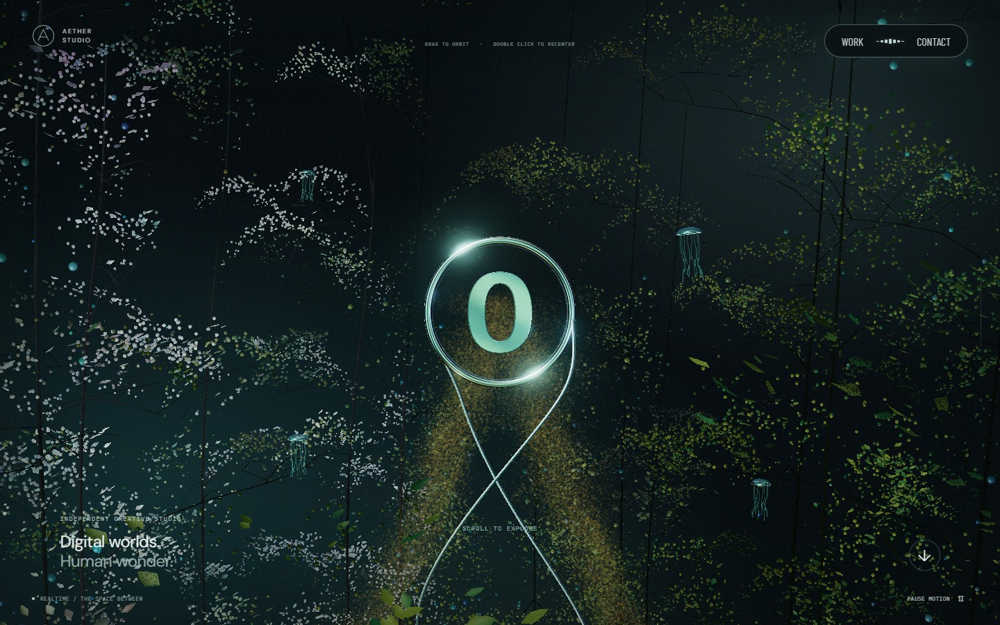 | 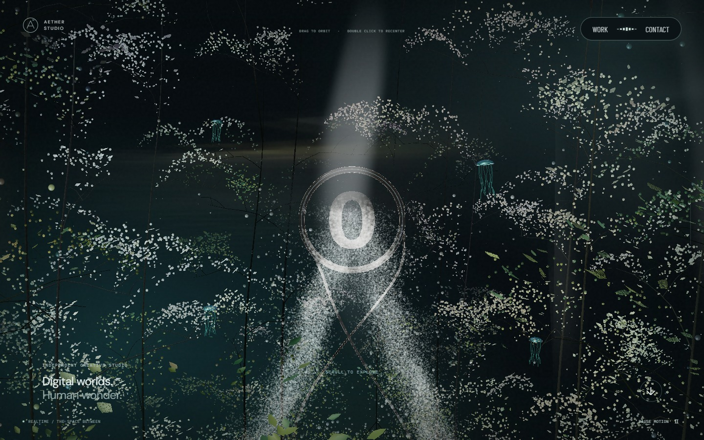 | 영상 띠, 투명한 링, 입자 조명 |
| 큰 문구와 링 | 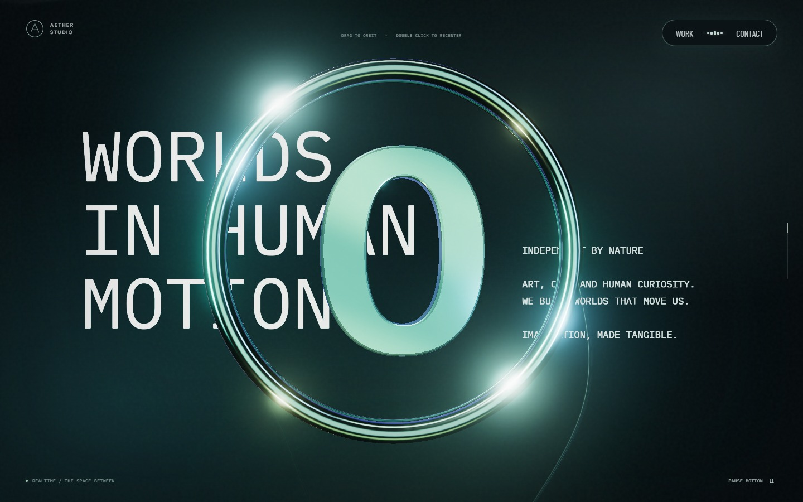 | 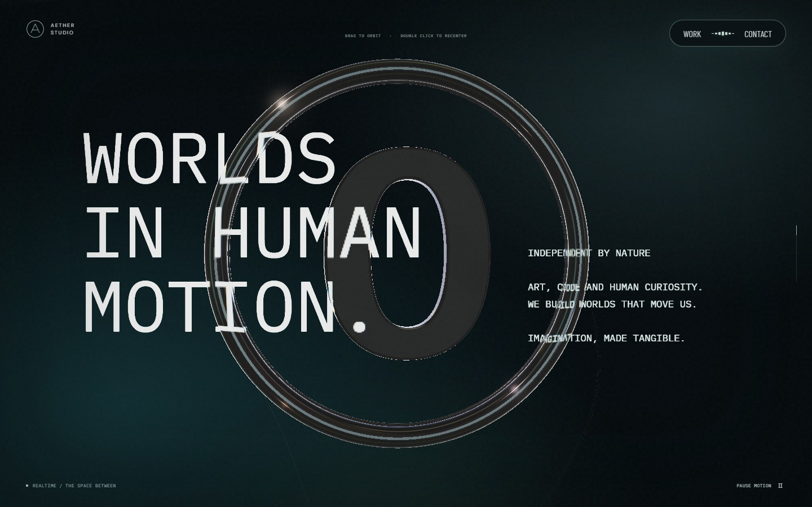 | 링과 O를 통해 보이는 문구와 굴절 |
| 본 컬럼 초입 | 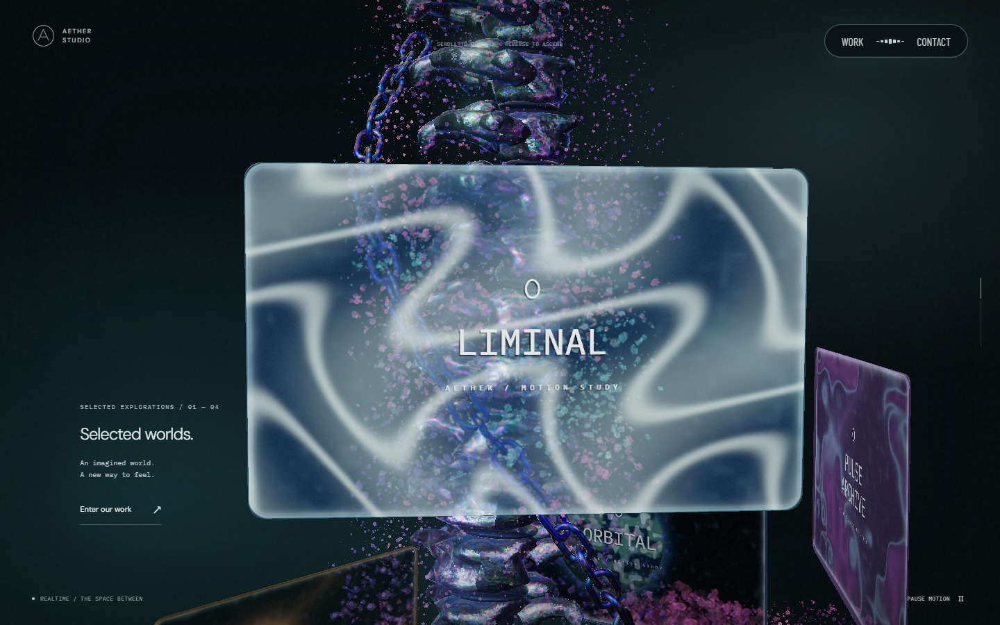 | 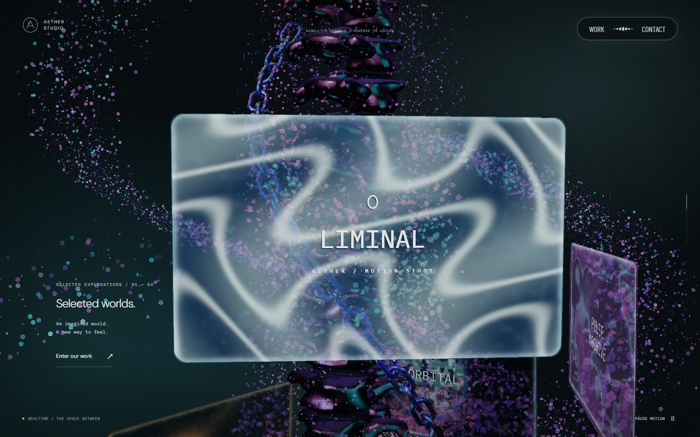 | 중간 구간보다 어두운 표면 |
| 본 컬럼 중간 | 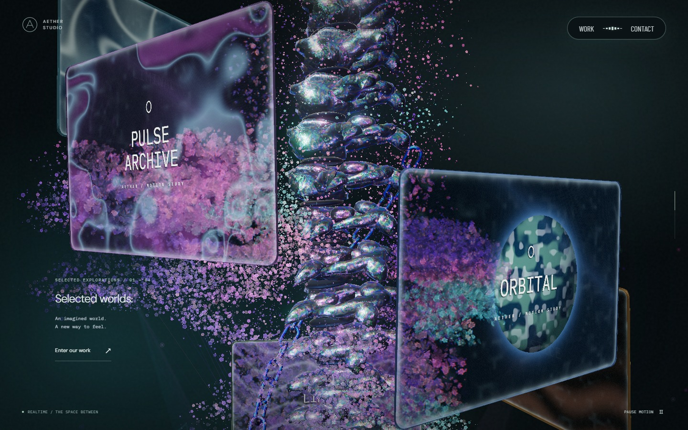 | 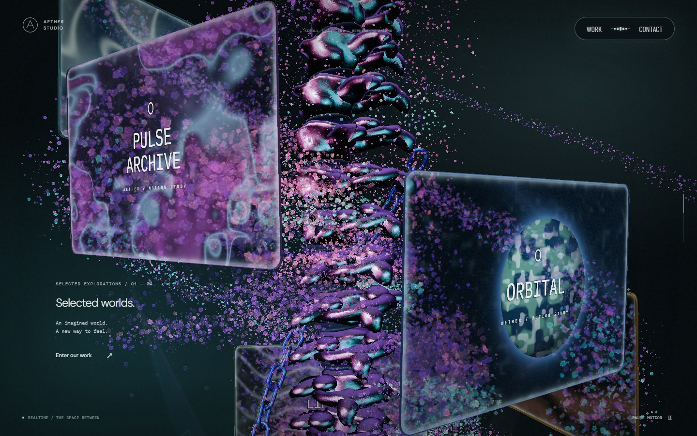 | 넓은 분홍·시안 반사, 검은 면, 뒤쪽 나선 입자 |
| 모바일 포레스트 | 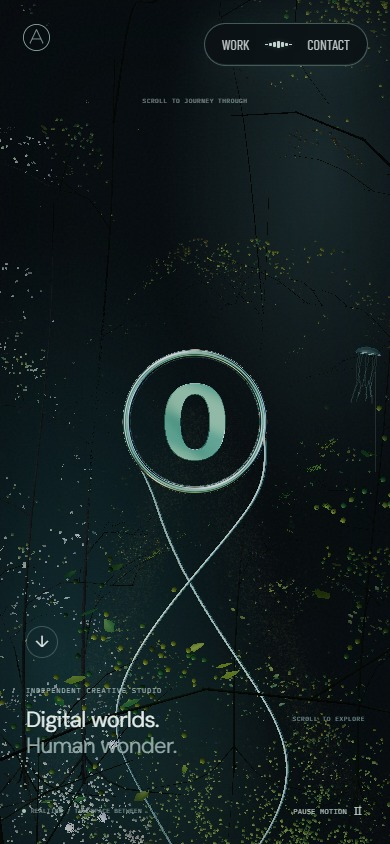 | 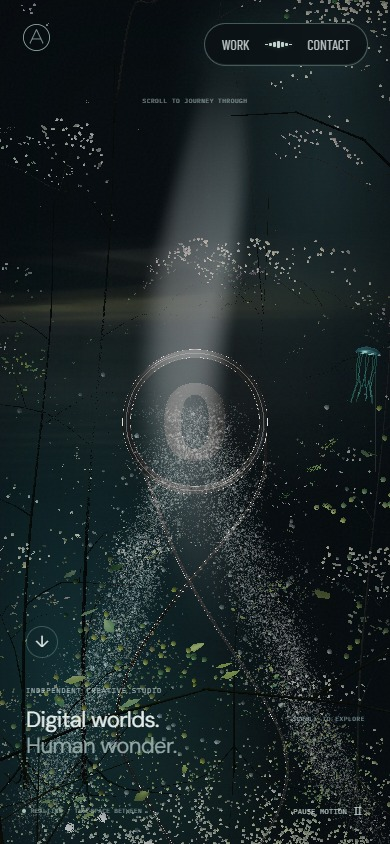 | 축소된 캡처에서도 유지되는 링·영상·문구 |

포인터의 이동 전·이동 직후·잔상 소멸 뒤를 같은 문구 구간에서 확인했다. 별도 픽셀 검사에서는 흐름이 지워진 뒤 중립 출력과 정확히 일치하고, 모니터 구간은 화면 좌표가 이동하지 않는 것을 확인했다.

| 이동 전 | 이동 직후 | 잔상 소멸 뒤 |
| --- | --- | --- |
| 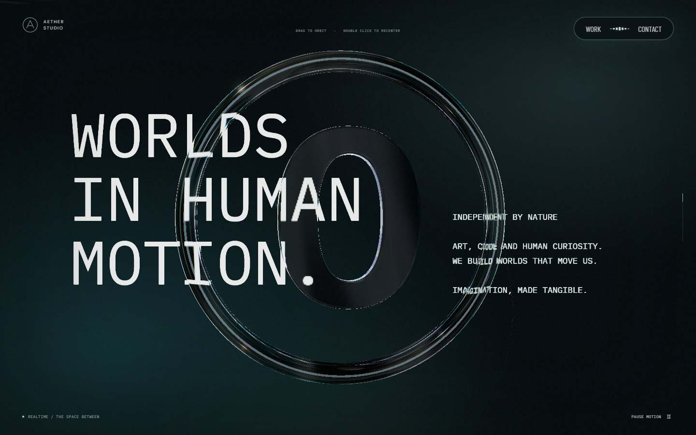 | 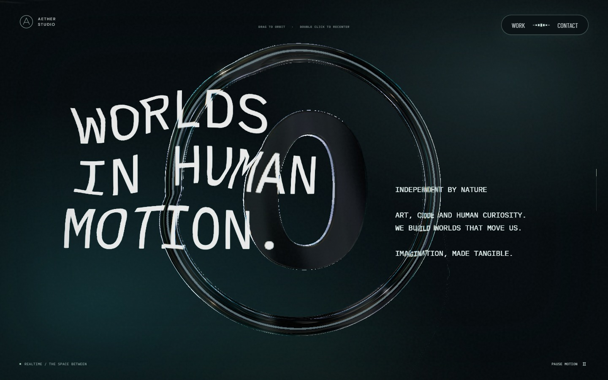 |  |

본 컬럼 좌하단의 안개막은 [이동 전](images/optical-scenes/column-before.jpg)과 [이동 직후](images/optical-scenes/column-mist.jpg)를 비교할 수 있다. 이 구간에서는 모니터 픽셀을 이동시키지 않고 안개만 포인터 흐름에 반응한다.

같은 숲에서 영상만 6·14·22초로 바꾼 결과다. 고정 금색을 줄이고 영상의 색·명암을 입자와 링에 연결했다. 영상 띠 주변의 안개를 넓히되 외곽을 함께 밝히지는 않았다.

| 6초 | 14초 | 22초 |
| --- | --- | --- |
| 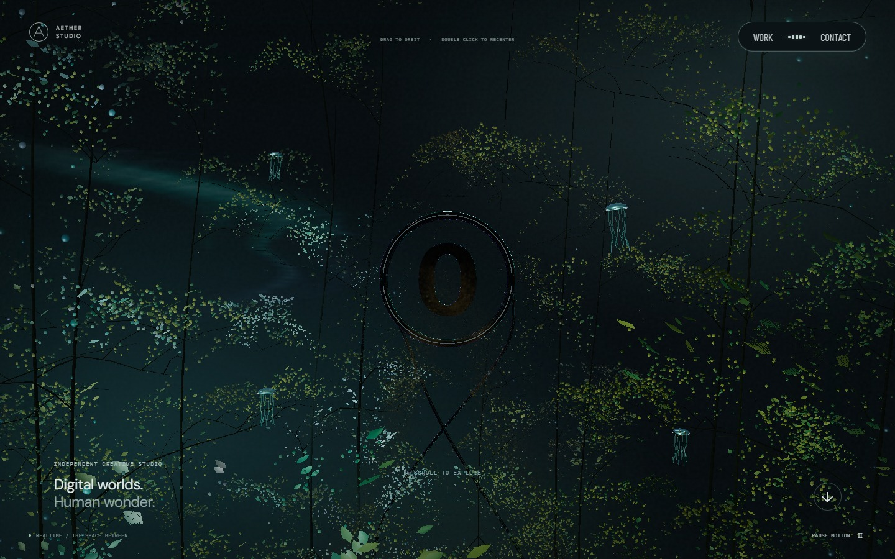 | 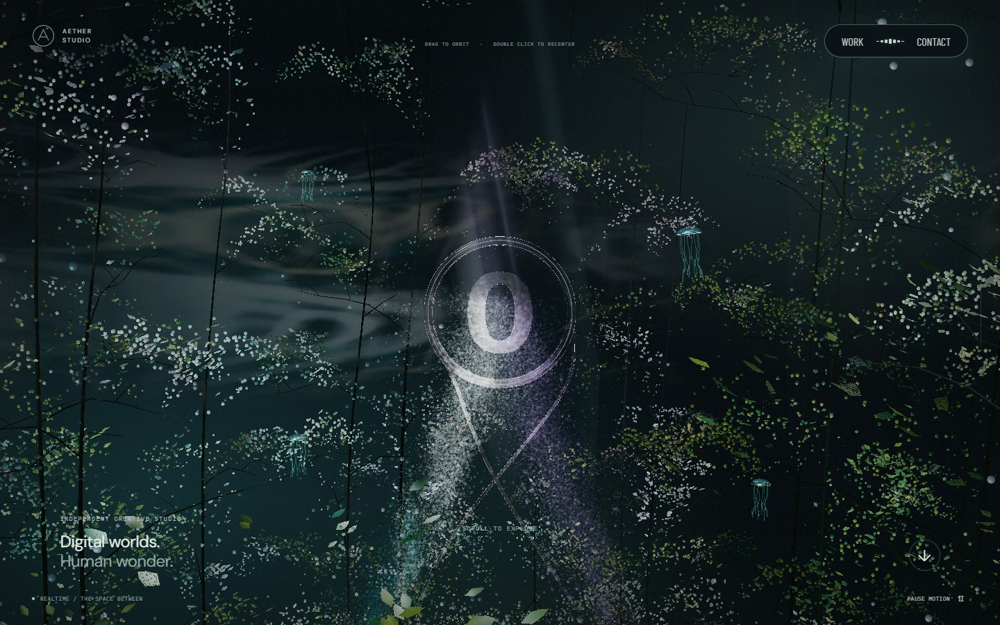 | 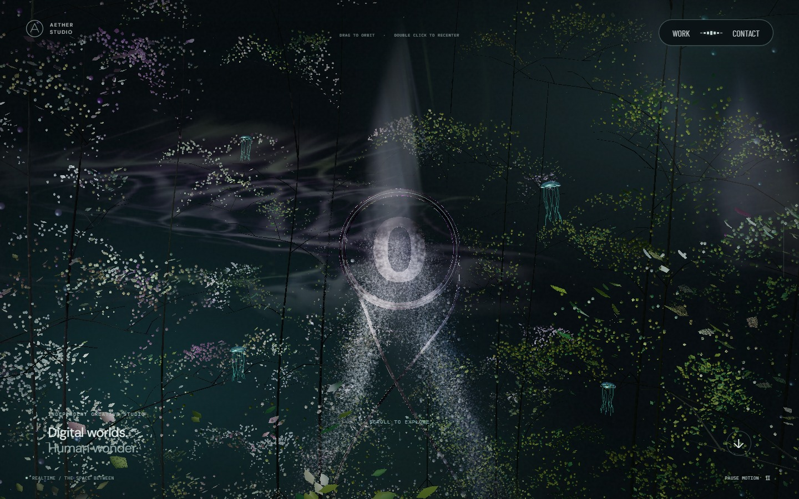 |

`lint`, `typecheck`, production build를 통과했다. 전체 로컬 실행에서 확인한 두 테스트의 시간 가정을 교정했다. 숨김 복귀 검사는 브라우저 안에서 첫 프레임을 읽도록 바꾸었고, 입자 왕복 검사는 시간을 고정해 스크롤 가역성을 확인한다. 두 항목을 포함한 실제 GPU 검사 20개가 통과했다. 마지막 조명 조정 뒤에는 영상 수명·실패 처리·산란광·입자 검사를 다시 실행했다. 자동 검사는 픽셀 동일성, 실버 옵션 보존, 메모리 소유·해제, 영상 실패, 재생 정지·복귀와 모바일 후처리를 포함한다.

실제 재생 측정은 Windows Chromium/ANGLE D3D11, RTX 2060 SUPER에서 진행했다. 각 화면 크기의 진행도 `0 / .175 / .4 / .65 / .975`에서 0.8초 대기 후 약 2.4초씩 관찰했다. 전후 모두 앱의 평활화된 `frameMs` 지표 중앙값은 16.7ms이고 품질 배율은 1.0이었다. 이는 짧은 구간의 앱 지표이며 원시 프레임 시간 분포나 모바일 실기기 성능 보장은 아니다. 원본 요약은 [검증 자료](evidence/optical-scenes-validation.json)에 있다.
