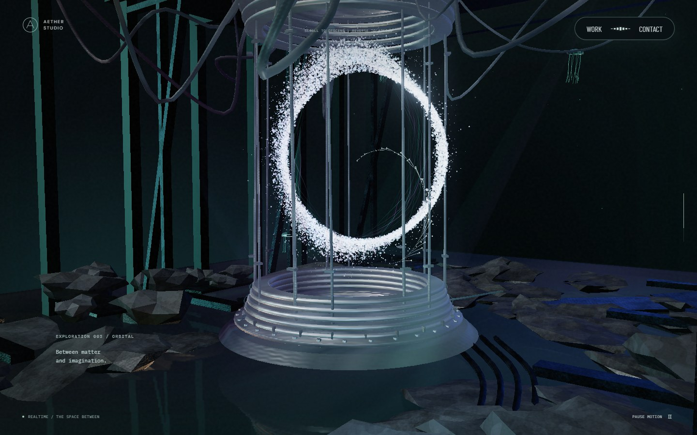
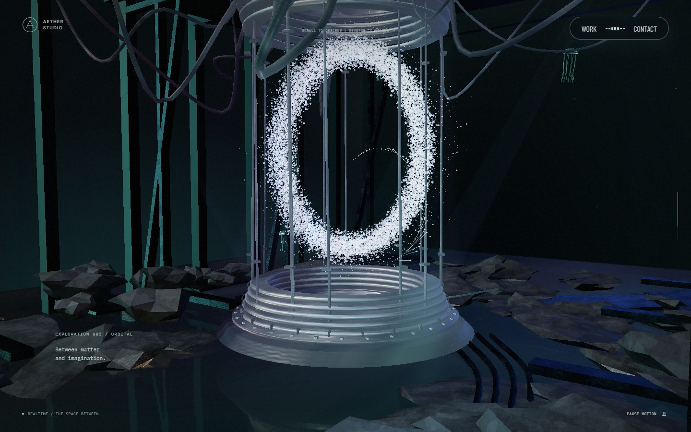
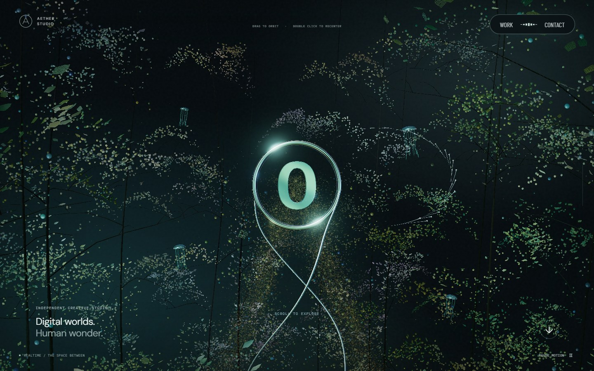
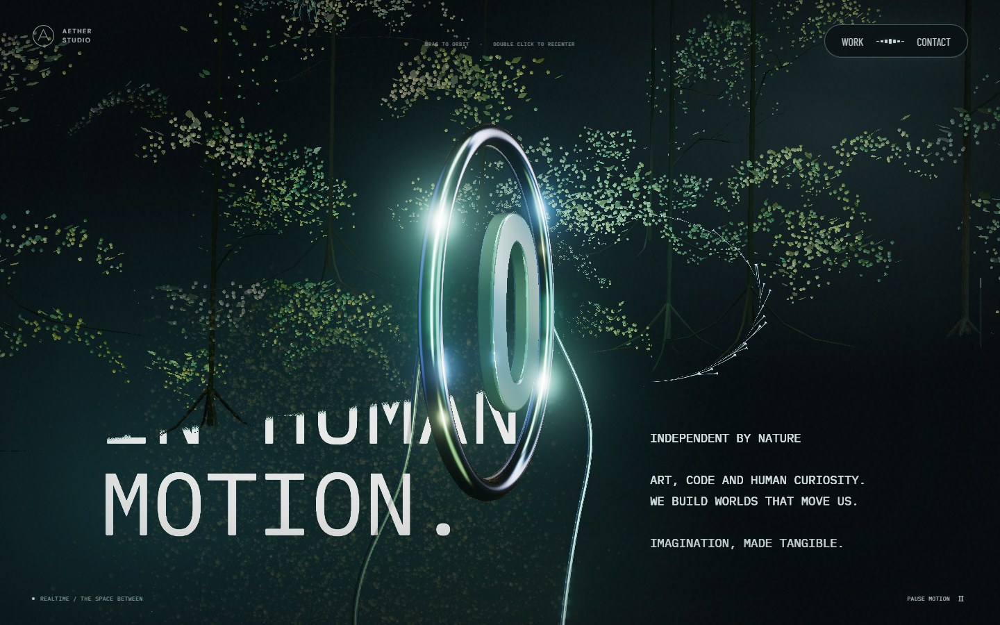
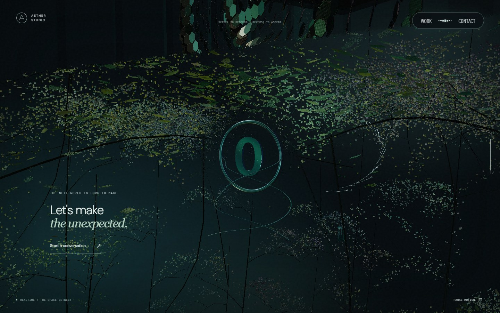
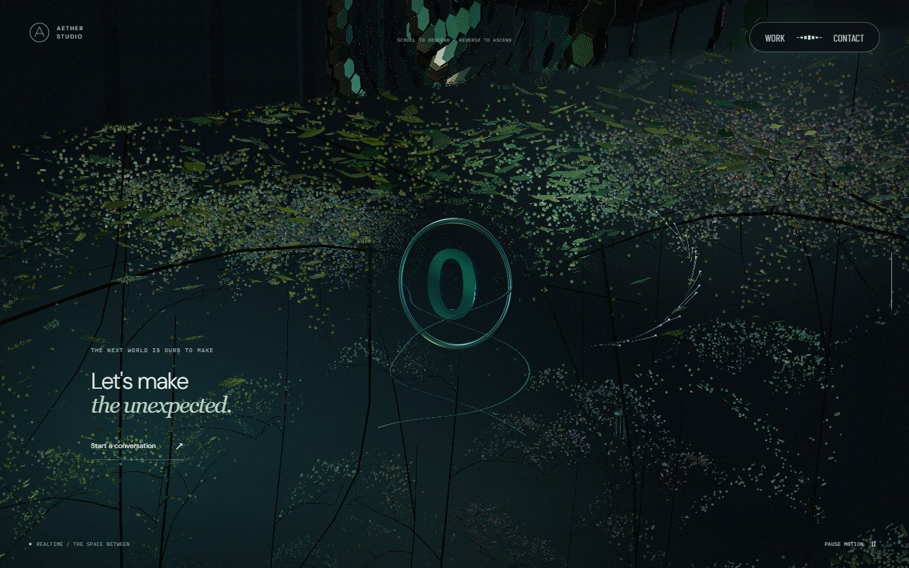
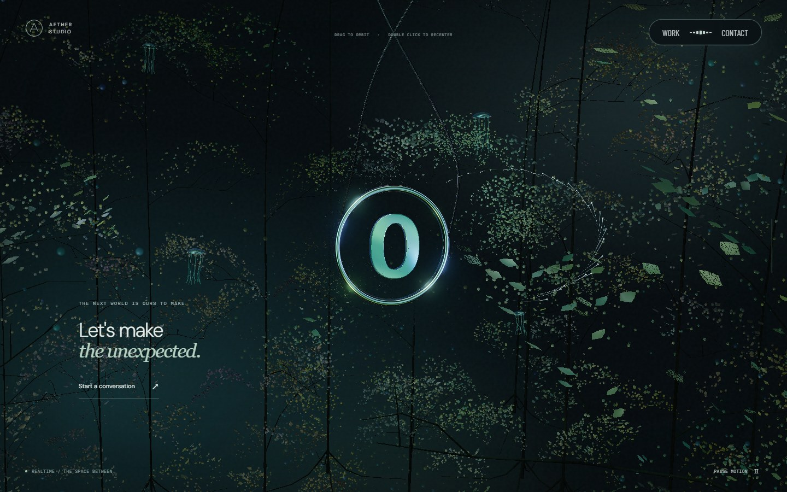
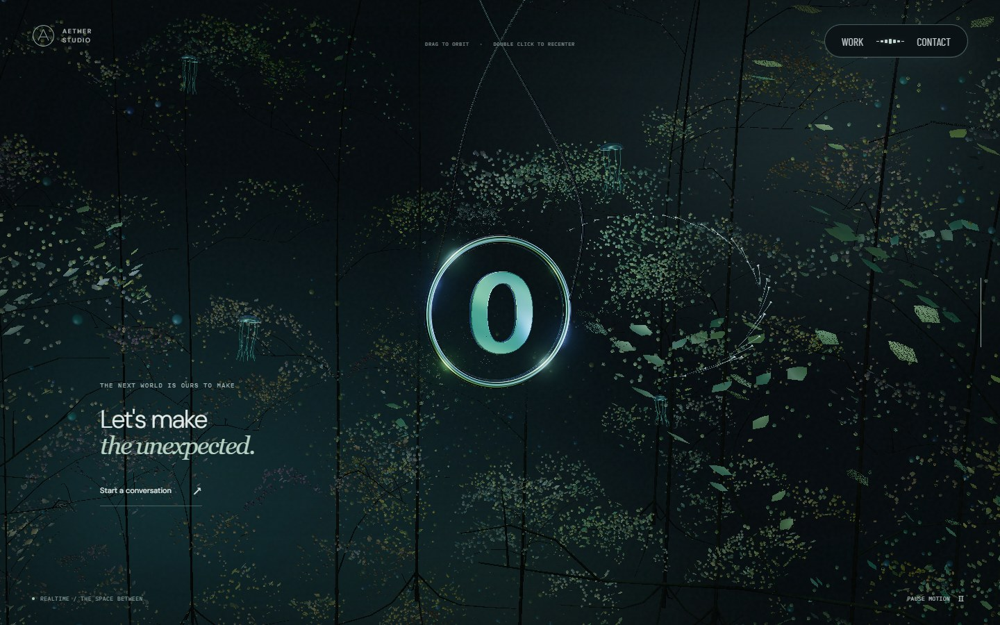

# 입자 마우스 반응과 숲 전환 경계

2026-09-22. 지하 장치의 입자가 포인터 주변에 또렷한 원을 만들던 변형을 완화하고, 상·하부 숲의 미세 입자와 잎에 이동 방향을 따라 남는 흐름을 추가했습니다.

## 원본에서 확인한 메커니즘

Active Theory를 1440×900에서 실제 휠과 동일한 마우스 궤적으로 관찰했습니다. 상단부터 하단까지 9개 지점, 소개·비늘·숲 경계의 추가 4개 지점을 촬영했습니다. 휠 누적값은 원본의 내부 진행률과 다르므로 AETHER의 스크롤 백분율로 해석하지 않습니다.

- Home과 Footer의 입자는 같은 `ParticleTest` 구성을 사용합니다. Footer는 부모 축 반전과 역방향 스크롤 값을 추가합니다. 위치 시뮬레이션 다음에 스크롤 변형을 적용합니다. [공개 앱](https://activetheory.net/assets/js/app.1780406240914.js)
- 입자 목표에 화면의 유체 입력을 카메라 방향으로 더하고, 현재 위치가 목표를 천천히 따라갑니다. 이 계산에서 끝부분이나 전환 경계를 기준으로 마우스 반응을 끄는 조건은 확인되지 않았습니다. [공개 설정](https://activetheory.net/assets/data/uil.1780406240914.json)
- 장면 경계는 별도 화면 합성으로 가리고 왜곡합니다. 경계의 합성 셰이더에는 마우스 유체 입력이 없습니다. 따라서 경계에서 반응이 달라 보이는 현상을 별도의 입력 차단으로 재현하지 않았습니다. 투영·스크롤 변형·경계 왜곡의 기여는 관찰과 코드에 근거한 해석입니다. [공개 셰이더](https://activetheory.net/assets/shaders/compiled.vs)

원본의 구현 코드·자산을 런타임에 복사하지 않았습니다. 아래는 확인된 동작을 기존 AETHER 공간에 맞춘 자체 구현이며 원본의 수치·유체 솔버와 동일하다는 주장은 하지 않습니다.

## 적용한 변경

**지하 장치:** 고정 반경 바깥을 자르던 밀침을 넓은 Gaussian 감쇠로 바꿨습니다. 중심 벡터를 완만하게 만들고 입자마다 폭·접선·깊이를 조금씩 다르게 적용합니다. 모든 입자가 같은 원주로 밀려나는 인상을 줄이되, 원래 O 형태와 스크롤에 따른 이동·형태 변화는 유지합니다. 입력이 사라지면 원래 위치로 복귀합니다.

**상·하부 숲:** 마우스 이동 방향을 40×28 공용 흐름 격자에 기록합니다. 흐름이 주변으로 약하게 퍼지고 감쇠하며, 입자는 지연된 반응을 따라 움직입니다. 서로 다른 위치의 반대 방향 궤적도 함께 남을 수 있습니다. 미세 입자는 실제 정점 위치가 바뀌고 잎은 더 낮은 세기로 따라가며 줄기·뿌리의 기준 위치는 움직이지 않습니다.

입력 텍스처는 화면 좌표에서 읽고 카메라 방향으로 월드 변위로 변환합니다. 하부 숲의 회전이나 카메라 드래그 때문에 화면상의 이동 방향을 다시 반전시키지 않습니다. 변위 다음에 기존 사선 가림을 적용하므로 보이는 숲은 경계에서도 반응하고, 평면 문구나 다른 층 위로 숨겨진 입자가 새어나오지 않습니다.

| AETHER 스크롤 | 검사한 위치 | 동작 |
| --- | --- | --- |
| 0% | 최상단 | 마우스 이동 방향을 따라 변위·복귀 |
| 14.5% | 숲 → 소개 문구의 경계 | 보이는 숲에 같은 반응 유지 |
| 72% | 지하 장치 O | 완만한 국소 변형, 스크롤 형상 보존 |
| 87.5%, 90% | 비늘 → 하부 숲의 경계 | 드래그 카메라 잠금과 별개로 입자 반응 유지 |
| 98%, 100% | 최하부 숲 | 같은 입력·복귀, 화면 방향 일치 |

정지 후 잔상은 완만하게 사라지고 2.25초 이내에 정확한 중립값으로 돌아갑니다. 첫 포인터 접촉·긴 입력 공백·큰 좌표 이동은 위치만 기록하므로 화면을 가로지르는 가짜 궤적이 생기지 않습니다. 버튼 위·터치·화면 이탈·취소·탭 숨김·Work/Contact·모션 축소에서는 흐름을 비웁니다. 드래그 궤도 잠금은 이 반응을 끄지 않습니다.

## 시각적 변경

아래는 같은 뷰포트·스크롤·마우스 궤적에서 촬영한 실제 실행 화면입니다. 영상 조명과 잎의 시간 위상은 고정하지 않았습니다. 정지 사진은 구성·밀침 범위를 비교하는 자료이며 실제 위치 이동과 복귀는 별도의 픽셀 테스트로 확인합니다.

| 대상 | 변경 전 | 변경 후 | 판단 포인트 |
| --- | --- | --- | --- |
| 장치 · 72% |  |  | 원형 빈 공간을 줄이고 O의 폭을 유지 |
| 최상단 · 0% |  |  | 잎과 미세 입자의 방향성 반응 |
| 소개 경계 · 14.5% |  |  | 가림 위에 남은 숲도 반응 |
| 하부 경계 · 90% |  |  | 카메라 잠금 중 입자 반응 유지 |
| 최하단 · 100% |  |  | 반응 방향과 복귀 유지 |

## 검증과 비용

새 흐름 테스트는 첫 샘플·정지, 상하좌우 방향, 반대 궤적의 공존, 정확한 중립 복귀, 비정상 입력과 수명을 검사합니다. 숲의 픽셀 테스트는 포인터 조명 세기를 0으로 두어 위치 변화에 의한 alpha coverage를 분리하며, 끝과 경계 6개 위치에서 이동·정확한 원복·입력 제외를 확인합니다. 장치의 O 위치와 씨드, 숲의 geometry·월드 기준점도 유지되는지 검사합니다.

추가 비용은 **40×28 RGBA8 텍스처 4,480바이트**, 고정 크기의 CPU 배열 3개와 화면당 공유 흐름 계산입니다. 입자별 CPU 갱신이나 추가 draw·장면 캡처는 없습니다. 바이트가 달라질 때만 텍스처를 갱신하며 정지 후에는 격자 계산을 생략합니다. 첫 입력 전부터 샘플러를 준비합니다.

lint·typecheck·production build를 통과했습니다. 로컬 전체 실행에서 61개 검사가 통과했고, 나머지 취소 이벤트 검사는 이벤트를 실제처럼 상위로 전달하도록 테스트를 교정한 뒤 통과했습니다. 제품 코드를 바꾸거나 단언을 완화하지 않았습니다. 총 62개 검사 항목을 확인했으며 새 입자·흐름 관련 8개 검사도 통과했습니다. 읽기 검수에서 새 P1/P2 결함은 발견되지 않았습니다.

동일한 GPU·Chromium ANGLE D3D11, 1440×900, DPR 1에서 각 지점이 정착한 뒤 3.8초 이동과 1.7초 잔상을 한 번씩 측정했습니다. 변경 전은 운영 `7fcebb4`, 변경 후는 로컬 production 빌드 `8f4e430`입니다. 위치 이동·페이지 로딩 시간은 측정에서 제외했고, 측정은 동시에 실행하지 않았습니다.

| 지점 | 이전 최장 / p95 | 수정 최장 / p95 | 이전 → 수정 draw |
| --- | --- | --- | --- |
| 상단 · 0% | 16.8 / 16.7ms | 16.8 / 16.7ms | 76 → 76 |
| 소개 경계 · 14.5% | 16.8 / 16.8ms | 16.8 / 16.8ms | 40 → 40 |
| 장치 · 72% | 16.8 / 16.8ms | 16.8 / 16.8ms | 106 → 106 |
| 하부 경계 · 87.5% | 16.8 / 16.8ms | 16.8 / 16.8ms | 50 → 50 |
| 하부 숲 · 98% | 16.8 / 16.7ms | 16.8 / 16.8ms | 68 → 68 |

모든 구간에서 33.5ms 초과·longtask·새 shader link는 0, 품질 최솟값은 1.00이었습니다. 이 수치는 RAF 간격이며 GPU 실행 시간은 아닙니다. 한 환경의 단일 비교이므로 모든 기기의 성능 개선이나 동일한 체감을 보장하지 않습니다. 초기 모니터 진입과 실제 Safari/iOS 검증은 이전 [잔여 과제](next-improvements.md)에 남깁니다.

[측정 수치·원본 해시](performance/pointer.json) · [캡처 목록·SHA-256](screenshots/pointer/manifest.json)
