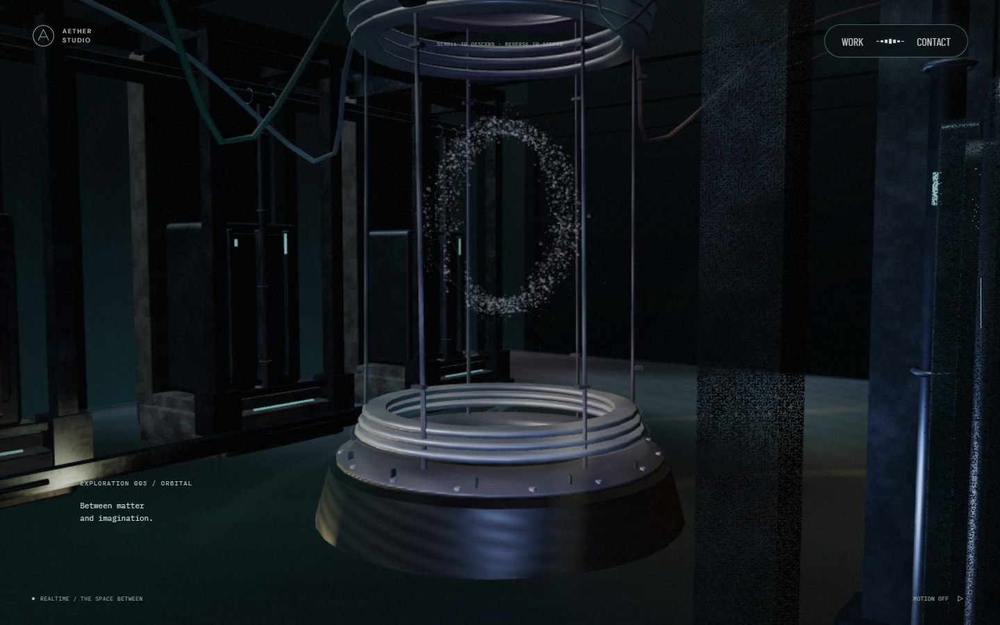
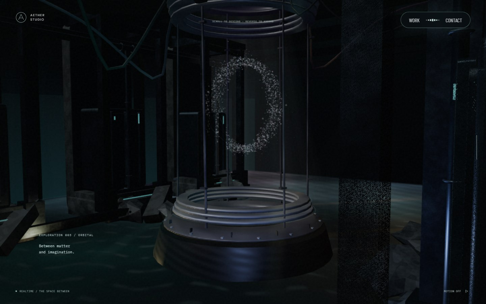
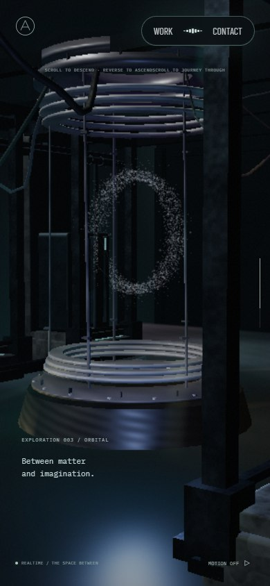
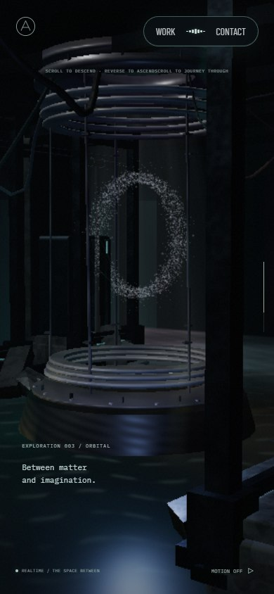
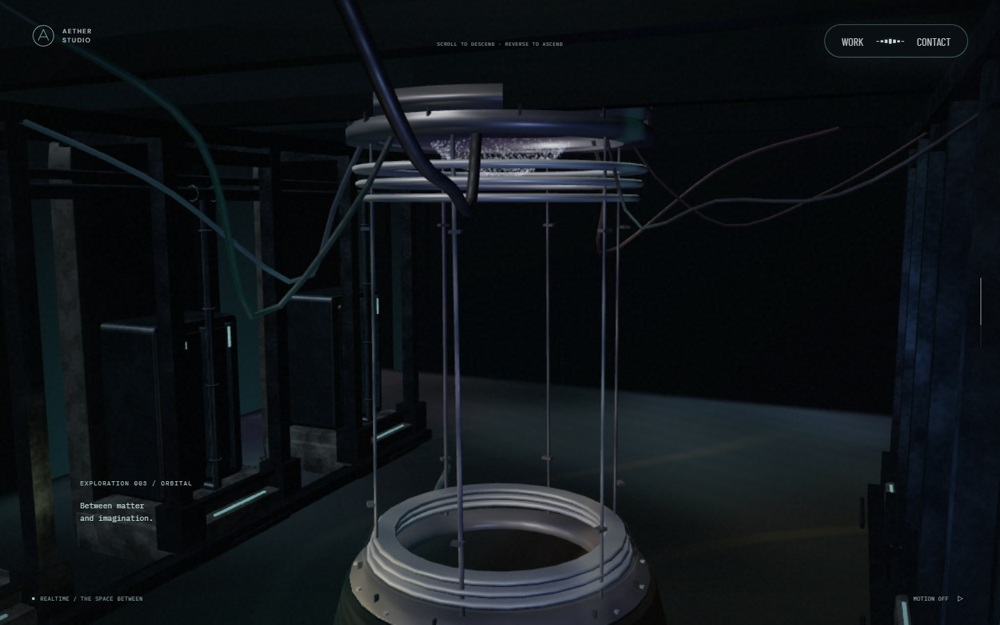
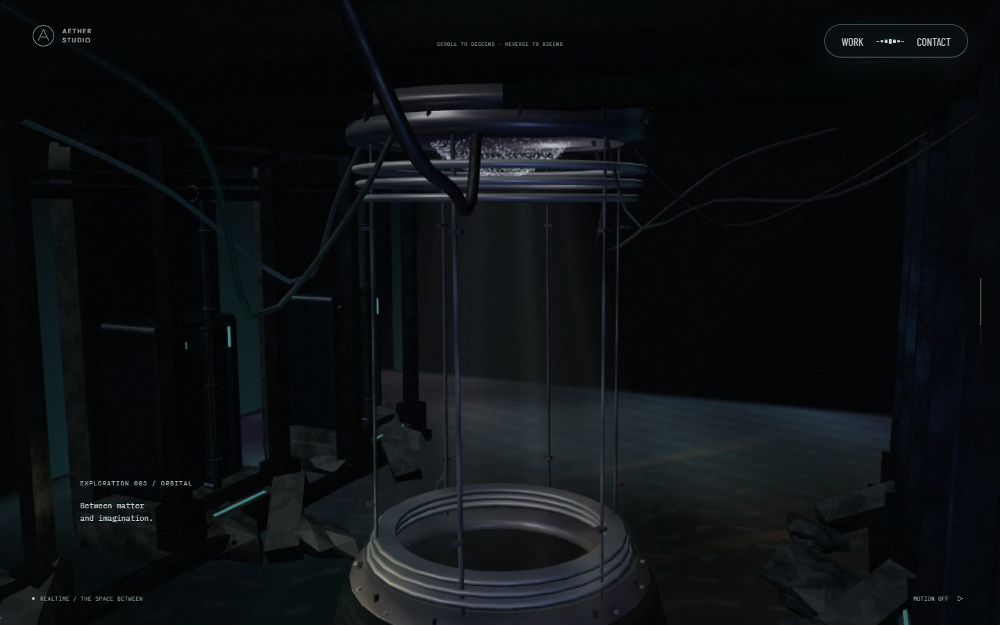
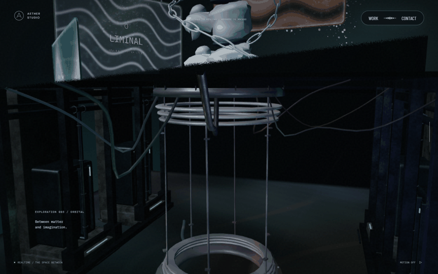
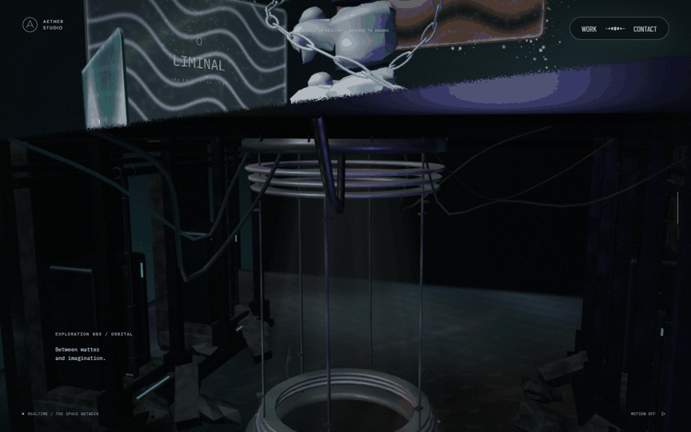
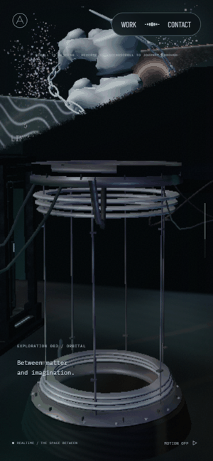
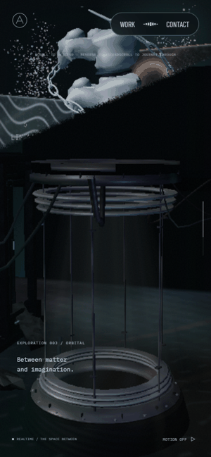

# 리액터 챔버의 개구부 빛과 수면 · 2026-09-23

챔버의 주변광을 낮추고 장치 상단 원형 개구부에서 아래로 내려오는 빛을 추가했다. 수면에는 방향을 가진 흐름과 잘게 끊어진 하이라이트를 더했고, 양쪽 가장자리의 파편을 키우고 쓰러진 보를 배치했다. 중앙 장치와 수면을 읽을 공간은 남긴다. 기준 커밋은 4단계 병합본 `be72562`다.

## AT 관찰과 선택

2026-09-23 [Active Theory](https://activetheory.net/)를 Chromium 1440×900에서 관찰했다. 휠로 본 컬럼을 지나 챔버에 진입한 뒤 `+3500 → -3200 → +500 → -500` 입력과 수면 양쪽으로 포인터 이동을 수행했다. 첫 큰 입력은 스케일 패널 쪽까지 지나쳤고 역방향으로 챔버에 돌아왔다. 챔버를 유지한 연속 캡처에서도 바닥 반사의 작은 무늬와 조명 색이 바뀌었다. 어두운 벽 사이에서 중앙 장치가 밝게 드러나며, 바닥 가장자리에는 크기와 기울기가 다른 잔해가 있다. 수면 반사는 장치 아래에서 전경까지 이어진다.

이는 화면에서 관찰한 사실이다. 내부 광원 종류, 수면 유속, 포인터에 의한 변화와 자동 조명의 기여는 분리해 측정하지 않았다. 위쪽에서 들어오는 빛을 중심 광원으로 해석하되, 원본의 물리적 조명 구조를 확인했다고 주장하지 않는다. 관찰 캡처 5장은 로컬 `.qa/at-observation/`에만 둔다. AT 소스·로고·모델·영상과 캡처를 앱 자산이나 공개 비교 이미지로 복제하지 않았다.

아래 반경·밝기·유속·잔해 배치는 자체 선택이다. AT의 좌표나 동작을 정밀 복원한 결과가 아니다.

## 공간과 렌더 경로

- `Reactor.ts`의 중심과 반경을 공유한다. 개구부 중심은 `(0, -37.25, 0)`, 아래 출구는 y `-37.38`이다. 새 SpotLight는 아래 출구에서 수면 방향을 바라보고, 도달 거리는 수면 높이까지로 제한한다. 광선 형상은 개구부 안쪽 반경의 86%에서 시작해 아래로 넓어진다.
- 숨겨진 `aether-chamber-ceiling` 접촉 기준은 유지한다. 별도의 원환 천장 `aether-chamber-aperture-roof`가 개구부 바깥을 막는다. 중심 구멍 반경은 같은 `1.12`다. 천장 아래쪽만 그려 카메라가 아직 위층에 있는 진입 구간을 덮지 않는다. 천장·빛 메시에는 기존 챔버 화면 경계를 적용한다.
- 챔버의 MeshStandardMaterial 출력만 52%로 감광한다. 공통 조명은 유지해 같은 화면에 들어오는 모니터·스케일 패널에 감광이 번지지 않게 했다. 광원 객체는 강도가 0이어도 씬에 남아 준비·전환 중 셰이더 광원 개수가 바뀌지 않는다.
- 빛은 절차적 반투명 메시와 SpotLight로 표현한다. 새 그림자 맵·영상·텍스처·반사 타깃은 없다. 천장 메시의 시야 차폐와 개구부 정렬은 검사하지만, 모든 구조물의 물리적 그림자나 빛 차폐를 시뮬레이션하지 않는다.
- 수면 법선의 기본 흐름은 XZ `(0.19, -0.11)` 월드 단위/씬 시간 초다. 서로 다른 파장과 기존 작은 파문을 겹친다. 반사 타깃이 없는 모바일·software 경로에도 같은 흐름과 하이라이트가 적용된다. 일반 데스크톱의 기존 512px 평면 반사 타깃은 재사용한다.
- 가장자리 파편의 크기와 회전을 늘리고 쓰러진 보 6개를 하나의 InstancedMesh로 추가했다. 기존 설비 전체를 다른 모델로 바꾸지 않았다. 새로운 외부 자산은 없다.

초기 준비 이벤트·숨은 씬 셰이더 준비·후속 영상 지연 로딩, 본 컬럼의 공유 회전각, 리액터 입자 동선과 포인터 계산은 유지한다. 화면 .72의 software 경로에서는 draw call 29개와 geometry 66개를 관찰했다. 이는 단일 관찰값이며 하드웨어 성능이나 60fps 보장을 뜻하지 않는다. 새 자원은 기존 씬 생성 때 만들어 준비 렌더에 포함되며, 빛의 geometry/material과 광원·target은 소유 모듈에서 해제한다. 천장과 잔해는 기존 소유 배열로 해제한다.

## 실제 전후 화면

독립 `npm ci`와 production build/preview를 사용했다. Chromium software WebGL, DPR 1, PC 1440×900·모바일 390×844다. 변경 전후 모션 축소, 같은 스크롤·카메라·포인터 이탈 상태로 촬영했다. Barlow Condensed·DM Sans·IBM Plex Mono의 실제 loaded 상태와 폰트 HTTP 오류 없음도 양쪽에서 확인했다. 원본 PNG는 로컬에 두고 공개 정지 이미지는 같은 해상도의 JPEG로 압축했다.

| 대상 | 변경 전 | 변경 후 | 판단 포인트 |
| --- | --- | --- | --- |
| PC .72 |  |  | 어두운 벽, 중앙 장치, 양쪽 잔해와 수면 |
| 모바일 .72 |  |  | 좁은 화면의 장치·수면 구분 |
| PC .68 |  |  | 개구부 아래의 입자와 빛 |
| PC 정·역스크롤 |  |  | 위층 진입·수면 통과·스케일 패널 전환 |
| 모바일 정·역스크롤 |  |  | 동일 구간 복귀 |

스크롤 GIF는 `.66 → .68 → .70 → .72 → .75 → .79 → .83 → .72` 정착 화면을 연결했다. `.72`는 왕복 뒤 캡처를 공통 위치로 사용한다. 재생 간격은 편집한 값이며 실시간 프레임률·카메라 속도 측정 자료가 아니다.

[PC 수면 연속 프레임](evidence/chamber-2026-09-23/desktop-flow.gif)과 [모바일 수면 연속 프레임](evidence/chamber-2026-09-23/mobile-flow.gif)은 스크롤을 .72에 둔 채 모션을 켜고 촬영한 5개 실제 화면이다. 촬영 도중 스크롤을 이동하지 않았다. GIF 재생 속도는 실제 촬영 간격과 다르다. [화면 차이](evidence/chamber-2026-09-23/water-frame-difference.json)는 수면 쪽 영역의 변화를 보조하며, 그 영역에는 다른 조명의 기여도 있다. 수면 자체의 시간 변화는 별도 GPU 검사로 분리했다.

## 검증과 한계

`tests/chamber.spec.ts`는 실제 SceneWorlds에서 천장·덮개의 중앙 통과, 가장자리·바깥 천장 교차와 광원 위치를 검사한다. 역스크롤 뒤 천장·빛 행렬이 복원되고 자원·광원이 해제되는지도 확인한다. 실제 수면 shader를 GPU에서 반사 있음/없음으로 렌더링하여 시간 10→12의 픽셀 변화와 10→10의 정지, 12→10의 동일 픽셀 복원을 검사했다. 시간 되감기는 검사 수단이며 사용자 역스크롤에서 수면 시간을 되감도록 구현하지 않았다.

실제 앱에서는 PC·모바일 모두 수동 모션 정지와 운영체제 모션 축소 후 1.8초 간격 canvas PNG의 SHA-256이 같았다. 숨김 이벤트를 주입한 동안 PC의 renderFrame은 15→15, 모바일은 30→30으로 유지되고, 복귀 뒤 다시 증가했다. 이는 앱의 visibility handler 검사이며 실제 운영체제의 탭 스케줄링 검증은 아니다. [PC 기록](evidence/chamber-2026-09-23/desktop-motion.json), [모바일 기록](evidence/chamber-2026-09-23/mobile-motion.json)에 남겼다.

lint·typecheck·production build와 관련 테스트 39건을 통과했다. PC·모바일 탐색·로딩 20건도 이 수에 포함한다. 스케일 패널 .83의 변경 전후 픽셀이 같음도 확인했다. 관련 입자 GPU 동선·포인터 픽셀 복원, 화면 경계, 수면 반사 캡처와 렌더 상태 복원, 초기 셰이더 준비 검사를 통과했다. 카메라 입력 검사는 브라우저 동시 실행 중 시간 초과했고 단독 재실행에서 통과했다. 자동 검사와 최종 CI·리뷰 결과는 PR 기록을 함께 본다.

기존 전경 기둥이 일부 각도에서 장치 오른쪽을 가리는 구성은 남아 있다. 모든 각도에서 잔해가 전부 보인다는 뜻은 아니다. 캡처는 software WebGL이며 일반 반사 경로는 별도 GPU fixture로 확인했다. 실제 하드웨어 GPU, Safari/Android 실기기, 장시간 성능과 AT 정밀 일치는 미검증이다. 모니터 기능, 스케일 파동, 포레스트 표현은 이번 범위 밖이다.

## 다음 단계

6단계는 최신 병합 main에서 모니터 영상·포인터·클릭 후 전환과 복귀를 다룬다. 기존 개구부 좌표와 입자 출발점, 새 천장·빛의 챔버 경계, 영상 비대기 준비 경로를 유지한다. 모니터 캡처를 바꾸면 물 반사가 재귀 렌더되지 않는 경로와 렌더 상태 복원을 다시 확인한다.
