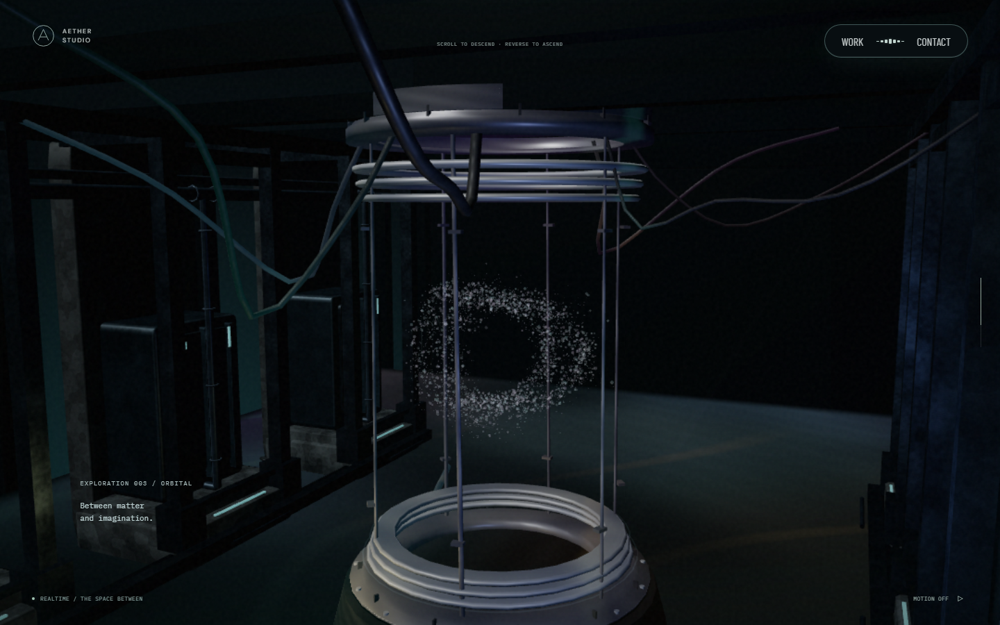
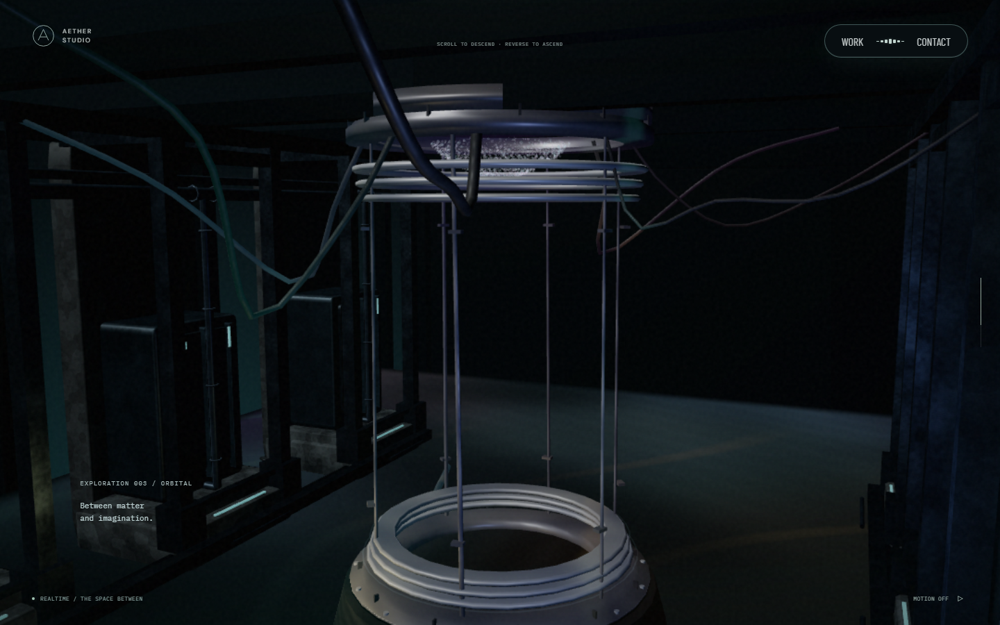
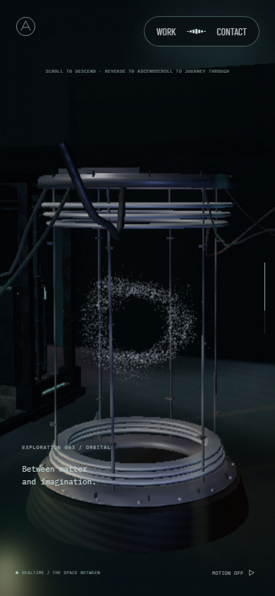
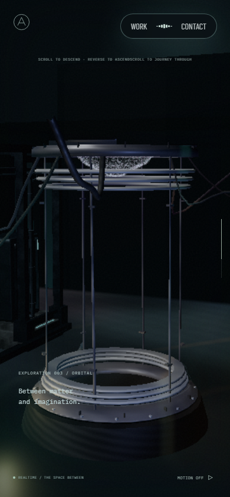
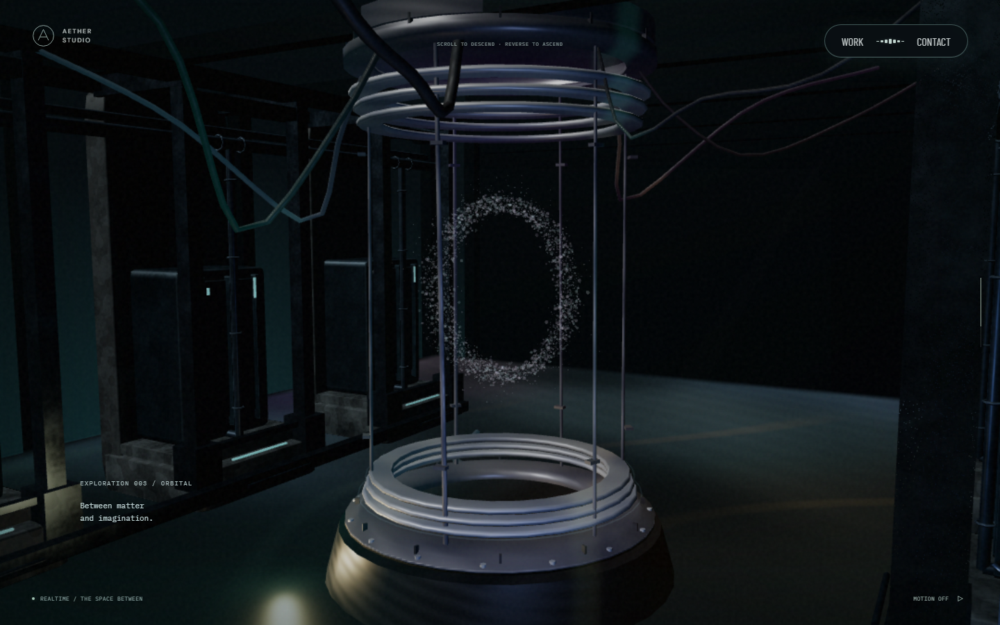
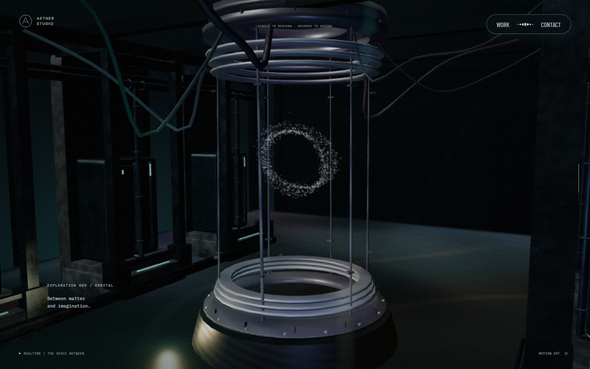
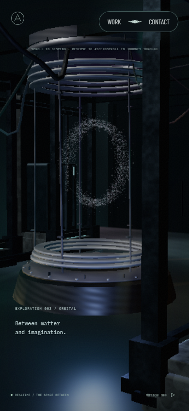
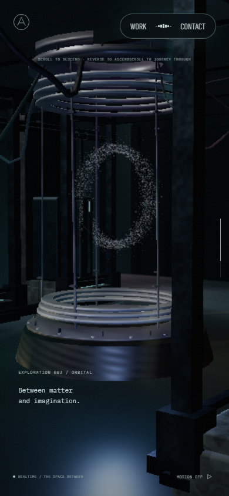
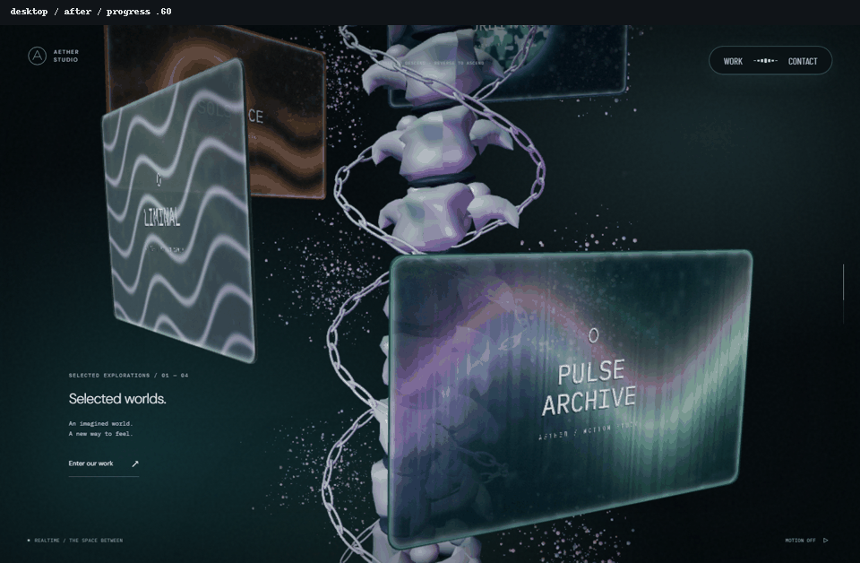
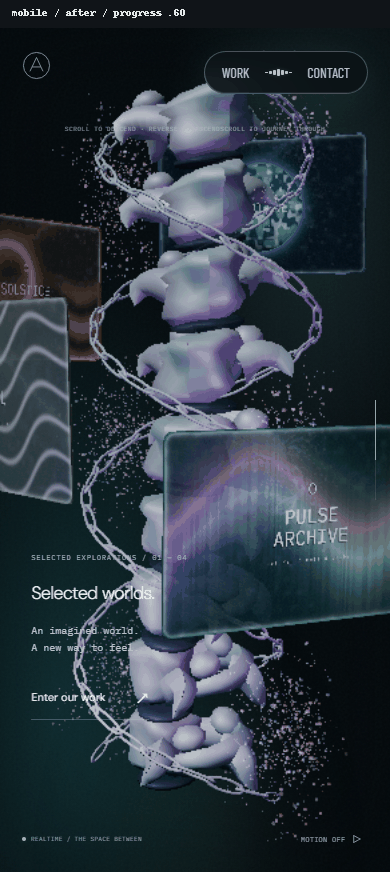

# 리액터 개구부와 입자 하강 · 2026-09-23

입자가 장치 상단 개구부에 모인 뒤 아래로 내려오며 O를 이룬다. 이전에는 이동 중인 본 컬럼 입자와 리액터 O 사이를 보간해 출발 위치가 장치와 떨어졌다. 이제 incoming 입자는 장치의 고정 월드 좌표를 사용하고, outgoing 꽃 군집은 기존 별도 draw와 화면 경계 안에서 유지한다.

## 관찰과 자체 선택

[Active Theory](https://activetheory.net/)를 Chromium 1440×900에서 직접 관찰했다. 일반 페이지 스크롤로 장면이 움직이지 않아 휠 입력을 사용했다. 리액터 구간의 `-400 → +800 → +600 → -600` 입력과 각각 1.6초 정착, 중앙 입자에 대한 포인터 이동을 확인했다. 상단 장치 아래 조밀한 입자에서 아래로 늘어지는 군집, 중앙 빈 공간이 나타나는 형태, O와 위쪽 입자 연결을 보았다. 역스크롤에서 입자가 상단 방향으로 돌아가지만 영상·조명은 계속 바뀐다. 포인터 입력 전후 밝기 차이는 있었으나 조명 변화와 입자 변위의 기여를 분리하지 못했다.

관찰 자료는 로컬 `.qa/at-5.png`부터 `at-9.png`, `at-pointer.png`에 둔다. AT 내부 좌표·반경·스크롤 비율·easing은 측정하지 않았다. 원본 소스·모델·영상·로고와 관찰 캡처를 앱이나 공개 근거 자산으로 복제하지 않았다.

자체 배정은 전체 스크롤 progress 기준이다.

| 구간 | 입자 동작 |
| --- | --- |
| .60~.665 | 장치 좌표에서 수평 원판 군집을 유지, incoming 화면 경계에 따라 노출 |
| .665~.715 | 입자별 작은 지연을 두고 하강 |
| .680~.715 | 하강과 겹쳐 세로 O로 전환 |
| .715 이후 | 기존 크기의 O, 스크롤 이동 입자와 포인터 반응 유지 |

이 비율은 AT의 측정값이 아니다. 입자가 개구부를 떠나는 과정과 O를 읽을 시간을 기존 카메라·챔버 전환 안에 배정했다. 원판은 개구부 반경의 78%를 사용하고 출발 산포를 줄여 금속 안쪽에 남긴다. O가 완성되기 전에는 이동 입자의 순환 위상을 멈춰 하강 도중 빠른 공전이 생기지 않게 했다. 위치·형상은 시간 누적 없이 절대 스크롤로 계산한다.

## 개구부 좌표와 5단계 기준

상단 소켓은 원래 고체 덮개로 막혀 있었다. 바깥 치수·재질·소켓 접촉을 보존하면서 중앙 통로가 있는 회전 단면 메시로 바꿨다. `src/Reactor.ts`를 장치와 입자의 공통 기준으로 사용한다.

| 기준 | 값 |
| --- | --- |
| 장치와 O의 월드 중심 | (0, -40.4, 0) |
| 개구부 중심 | 장치 로컬 (0, 3.15, 0), 월드 (0, -37.25, 0) |
| 개구부 안쪽 반경 | 1.12 |
| 덮개 바깥 반경·두께 | 1.93 · .26 |
| 덮개 상단·하단 월드 y | -37.12 · -37.38 |
| 입자 메시 XY 축척 | 2/3; 개구부 좌표에는 사전 역보정 |

메시 이름은 `aether-machine-aperture`다. 별도의 `aether-chamber-ceiling`은 기존처럼 숨겨진 접촉 기준이며 실제 개구부가 아니다. 5단계에서 그 큰 천장을 그대로 켜면 통로를 막는다. 광원은 위 공통 중심과 아래 출구 평면을 기준으로 두고, 실제 메시·카메라 투영과 함께 차폐를 검증해야 한다. 이번에는 조명·수면·잔해를 변경하지 않았다.

## 시각적 변경

기준 커밋 `8efc263`, 독립 `npm ci`와 production build/preview, Chromium, DPR 1, 모션 축소, 포인터 이탈 상태다. PC 1440×900와 모바일 390×844에서 변경 전후 카메라·스크롤·입력을 같게 맞췄다. 양쪽 모두 Barlow Condensed·DM Sans·IBM Plex Mono의 loaded 상태와 HTTP/요청 실패 없음을 확인했다.

| 대상 | 변경 전 | 변경 후 | 판단 포인트 |
| --- | --- | --- | --- |
| PC .68 |  |  | 상단에서 하강 시작 |
| 모바일 .68 |  |  | 개구부와 입자 위치 |
| PC .70 |  |  | 중간 높이와 O 형성 |
| 모바일 .72 |  |  | O 완성과 기존 크기 |
| PC 정·역스크롤 |  |  | 하강·인접 전환·복원 |
| 모바일 정·역스크롤 |  |  | 좁은 화면에서 같은 동선 |

GIF는 `.60 → .64 → .66 → .68 → .70 → .72 → .75 → .70 → .68 → .66 → .64` 정착 캡처를 650ms 간격으로 연결했다. 실시간 프레임률이나 AT 속도 일치의 근거가 아니다. 초반 개구부 군집은 소켓·콜라와 incoming 경계에 가려지고, .68에서 상단 아래로 드러난다. 모든 입자가 모든 각도에서 보인다는 주장은 하지 않는다.

## 검증과 한계

- 실제 production vertex shader를 GPU에서 실행한 192개 입자 좌표를 실제 장치 메시의 월드 좌표·안쪽 반경과 대조했다. PC·모바일 카메라, 일반·software 자원 설정을 검사한다. 출발 입자는 개구부 내부에 있고, 중앙 광선은 통과하며 가장자리 광선은 금속과 교차한다. 구현 수식을 CPU에 복사한 좌표 검사가 아니다.
- .665/.690/.720에서 출발·하강·O 범위를 확인하고, 중간 시간 변경 및 `.78 → .61 → .74 → .665` 왕복 후 같은 좌표를 확인했다. PC·모바일의 카메라 투영도 대조한다. 모바일 카메라의 추가 거리 4.8을 포함한다.
- 기존 입자 포인터의 실제 픽셀 변화·복원, 본 컬럼 GPU 공유 회전, outgoing 꽃 경계, 장치·바닥 차폐, 인접 화면 경계, 초기 로딩 이벤트·숨은 셰이더 준비 검사를 통과했다. .65에 이미 내려온 입자가 보인다는 옛 테스트는 초기 차폐와 .68 하강 노출을 나눠 교정했다.
- 실제 앱에서 모션을 켠 포인터 입력 강도는 PC .9826, 모바일 뷰포트 .9727이었다. 포인터 이탈 3.2초 뒤 .0116/0으로 감소했고 카메라 yaw는 0을 유지했다. 빠른 왕복 뒤 .70 부근으로 복귀했다. 기본 좌표의 정확한 복원은 GPU 검사로 확인한다.
- 로컬 lint·typecheck·production build를 통과했다. 관련 37개 검사 중 36개가 먼저 통과했고, 옛 노출 시점 assertion을 교정해 해당 검사를 통과했다. 별도 GPU·포인터 관련 검사도 통과했다. 최종 전체 CI와 최신 head 리뷰는 PR 기록을 기준으로 한다.

초기 로딩 완료 이벤트·숨은 씬 셰이더 준비·후속 영상 지연 로딩·본 컬럼 공유 회전각은 수정하지 않았다. draw call과 자원을 추가하지 않았다. 캡처는 software WebGL이며 일반 자원 설정도 같은 GPU probe에서 검사한 것이다. 실제 하드웨어 GPU·Safari/Android 실기기, AT의 정밀 동작 일치는 미검증이다. 챔버 조명·수면·잔해 개선은 다음 단계다.
