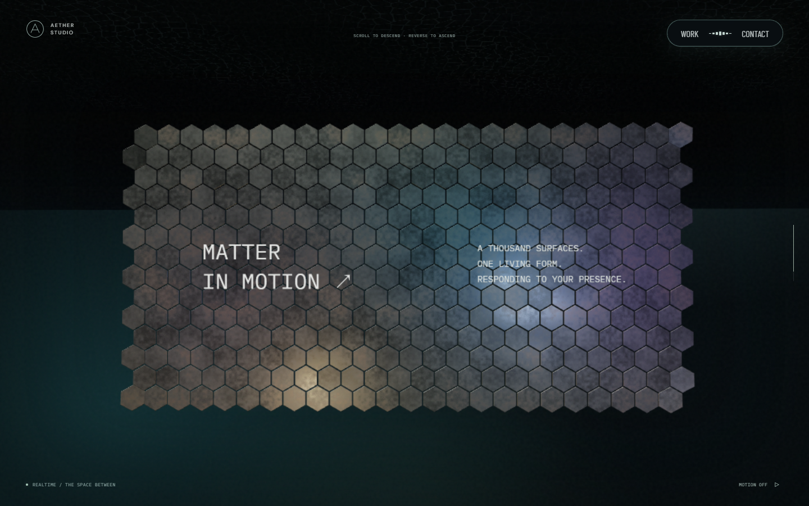
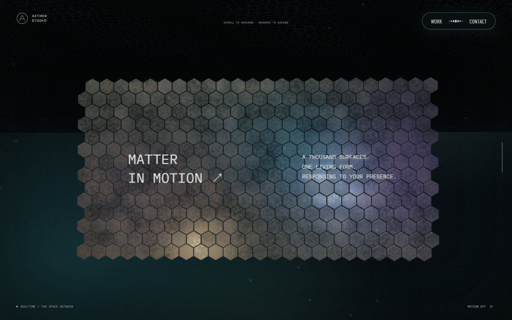
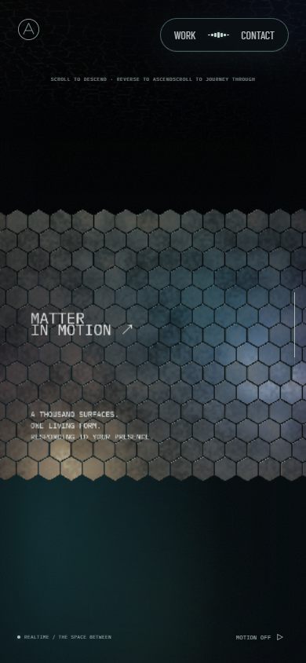
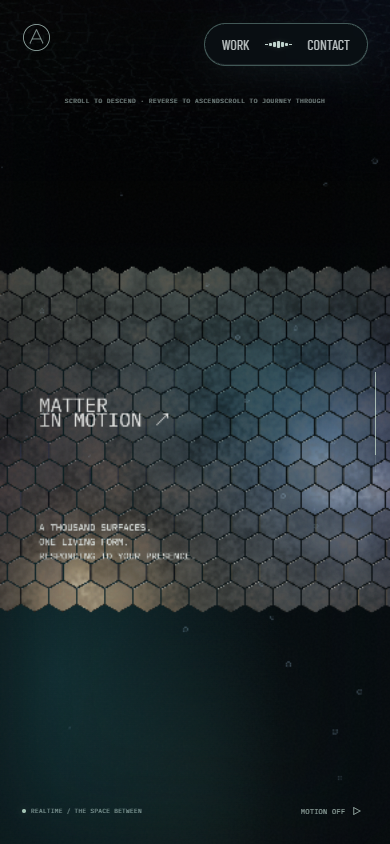
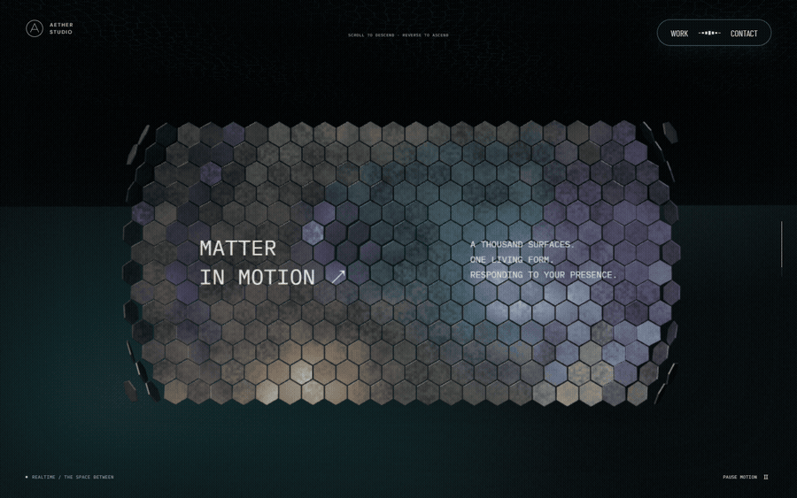
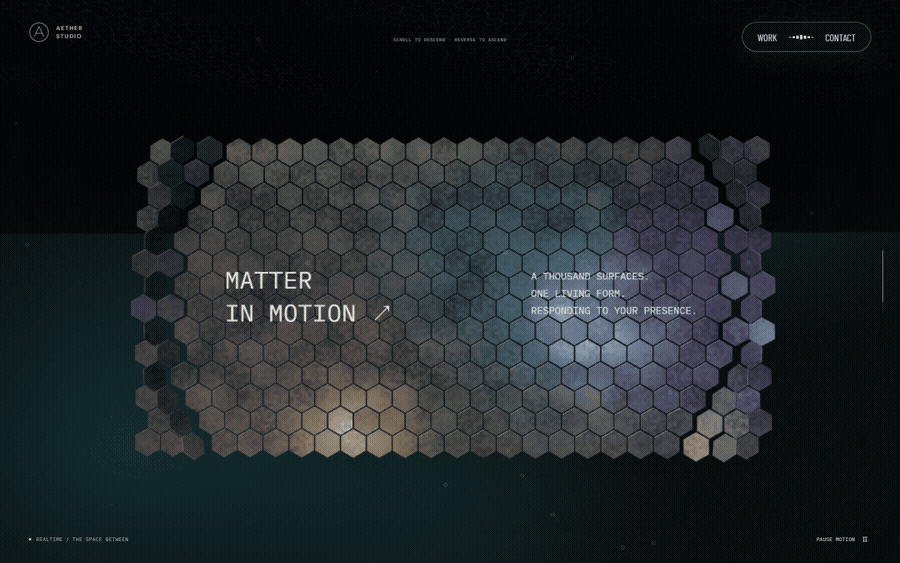
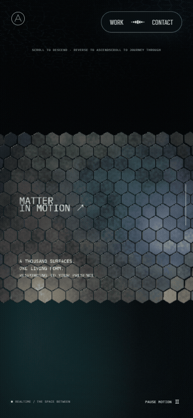
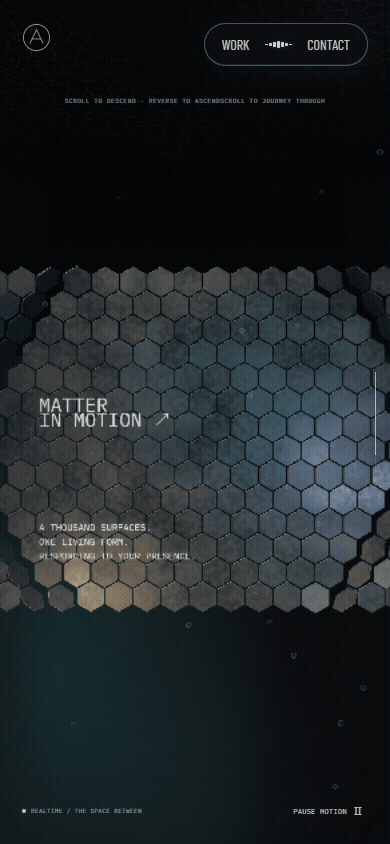

# 스케일 패널 파동과 부유 기포 · 2026-09-23

자동 파동은 7초마다 한 번 시작해 3초 동안 중심에서 패널 끝까지 이동한다. 포인터 이동은 작은 고리로 시작해 주변으로 퍼지고 감쇠한다. 패널 앞에는 드문드문 비치는 작은 기포를 배치했다. 기준은 6단계 병합 커밋 `a2bd609`다.

## AT 관찰과 구현 선택

2026-09-23 [Active Theory](https://activetheory.net/)를 Chromium 1264×633에서 열었다. 일반 페이지 스크롤 대신 휠로 본 컬럼과 리액터 챔버를 지나 스케일 장면에 들어갔고, 정·역방향으로 이동해 패널을 화면 중앙에 놓았다. 포인터를 패널 왼쪽에서 조금 움직인 뒤 멈추고 연속 화면을 확인했다. 육각 패널의 일부가 원형으로 들리는 모양이 정지 중에도 변했다. 주변에는 작은 원형 입자가 드물게 떠 있고, 일부는 가장자리가 밝아 기포처럼 보였다. 위쪽 수면과 아래 포레스트가 함께 보이는 전환 구간도 확인했다.

관찰 화면은 로컬 `.qa/screenshot-1790160585151.png`, `.qa/screenshot-1790160616343.png`, `.qa/screenshot-1790160631318.png`, `.qa/screenshot-1790160636114.png`에만 보관했다. 두 연속 화면에는 자동 조명·파동이 함께 바뀌므로 포인터만의 기여, AT의 정확한 반경·주기·속도를 분리해 측정하지 못했다. 아래 값은 자체 선택이다. AT의 소스·영상·모델·로고·캡처는 앱과 공개 근거에 복제하지 않았다.

자동 파동의 발생 간격 `7초`와 끝까지 전파 시간 `3초`를 별도 상수로 둔다. 각 타일의 중심 거리와 실제 패널의 최대 반경으로 도착 시점을 정하고, 하나의 짧은 펄스만 통과시킨다. 패널 시간은 실제 프레임 간격으로 누적하고 탭 숨김·모션 정지 때 멈춘다. 공통 장면 시간의 50ms 프레임 제한 때문에 software WebGL에서 7초가 더 길어지는 일을 피한다. 기존 1초 박동과 뒤따르던 작은 박동은 제거했다. 자동 파동과 포인터 변위가 겹칠 때 타일 회전을 최대 1.35rad로 제한한다.

포인터 고리는 화면 높이 기준 NDC 반경 `.035`에서 시작해 `.72초`에 `.28`까지 넓어진다. PC 900px 높이에서는 약 16→126px 반경이다. 고리는 1.12초 안에 사라지고, 현재 포인터 주변의 직접 반응과 공유 flow의 잔광은 더 작은 범위와 강도로 제한한다. 스케일 패널은 입력 직후에도 실제 포인터 자리에서 파동이 시작되도록 원시 NDC 좌표를 받고, 다른 장면의 평활 좌표는 유지한다. 최근 입력 위치는 최소 이동 `.035`와 재발행 간격 `.16초`를 만족할 때 갱신한다. 화면 밖으로 빠져나가면 새 파동을 만들지 않고 기존 반응만 감쇠한다. 사용자가 말한 약 70개 파편은 범위의 눈대중 참고값으로 사용했으며 타일 개수는 할당하지 않았다. `PointerFlow`의 다른 장면 동작은 바꾸지 않았다.

기포는 스케일 패널의 자식인 Points 한 개로 그린다. software 경로는 화면 크기와 관계없이 52개, 일반 GPU의 모바일·PC는 각각 76·104개를 배치한다. 점 크기는 렌더 픽셀에서 1.2~5.2px, 불투명도는 낮게 제한한다. CPU에서는 위치 배열을 갱신하지 않고 셰이더 시간만 바꾼다. 모션 정지 때 시간이 멈추고, 패널의 화면 경계와 함께 잘리며, 패널과 함께 해제된다. 새 외부 자산과 SpotLight는 없다.

## 같은 장면의 전후 화면

독립 `npm ci`와 각 커밋의 production build/preview, Chromium software WebGL, DPR 1, PC 1440×900·모바일 390×844를 사용했다. 정지 이미지는 progress `.83`, 같은 카메라·포인터 이탈·모션 축소 상태다. 양쪽 모두 Barlow Condensed·DM Sans·IBM Plex Mono가 실제 `loaded`였고 폰트 HTTP 실패와 pageerror는 없었다. 모바일은 뷰포트 검사이며 실기기가 아니다. [캡처와 폰트 기록](evidence/scale-2026-09-23/capture-check.json)을 함께 남겼다.

| 대상 | 변경 전 | 변경 후 | 판단 포인트 |
| --- | --- | --- | --- |
| PC 정지 |  |  | 기포 밀도와 문구 가독성 |
| 모바일 정지 |  |  | 작은 화면의 패널·기포 |
| PC 입력·파동 연속 화면 |  |  | 포인터 이동·정지·가장자리·이탈 |
| 모바일 입력·파동 연속 화면 |  |  | 좁은 화면에서의 같은 입력 순서 |

GIF는 각 뷰포트에서 `정지 → 작은 이동 → 정지 → 두 번째 이동 → 화면 가장자리 → 이탈` 순서로 얻은 실제 프레임을 일정 간격으로 편집했다. 원본 프레임은 위 뷰포트 크기이며 공개 PC GIF만 가독성과 용량을 위해 너비 900px로 줄였다. 캡처 사이 실제 시간과 자동 파동 위상은 기준본·변경본 사이에 정확히 동기화되지 않았다. GIF만으로 포인터와 자동 파동의 기여를 분리하거나 프레임률을 추론하지 않는다.

## 검증과 한계

실제 스케일 타일 geometry/material을 software GPU로 렌더한 `probeScalePointer`에서 파동 변화의 중심 반경은 시작 후 `.15/1.55/2.65/3.15초`에 화면 정규 좌표 `.024/.272/.445/.550`으로 커졌다. 끝 가장자리까지의 도착은 3초 설정과 별도로 확인했다. 시작 화면과 정확히 7초 뒤의 렌더 픽셀은 같고, 중간 휴지 구간의 변화 픽셀은 0이었다. 좌우 입력은 160×120 표본에서 각각 15픽셀만 바뀌었고 중심도 입력 쪽으로 이동했다. 가장자리 입력은 6픽셀, 자동 파동과 겹친 입력의 추가 변화는 23픽셀이었다. 포인터 정지·flow 감쇠 뒤 변화는 0이며 CPU instance 행렬은 바뀌지 않았다. 이 수치는 임계값을 넘은 **픽셀 수**이며 반응 타일 개수가 아니다.

`probeScaleBubbles`는 실제 기포 셰이더의 시간 0→2 렌더 픽셀 변화, 같은 시간의 동일 픽셀, 정적 위치 배열과 geometry/material 해제를 확인했다. [프레임 카운터 표본](evidence/scale-2026-09-23/frame-samples.json)에서는 같은 위치에서 draw call이 5→6, geometry가 66→67, texture는 16으로 같았다. 프로그램 수는 88→90이었다. software 경로의 `frameMs`는 16으로 고정돼 실제 GPU 시간을 나타내지 않는다. 하드웨어 비용과 장시간 성능은 실기기에서 측정하지 못했다.

lint·typecheck·production build를 통과했다. 관련 49개 브라우저 검사 중 47개는 첫 실행에 통과했고, 포레스트 픽셀 검사와 모니터 영상 검사는 병행 실행의 공용 trace 폴더 충돌로 재시도 통과했다. 두 검사를 다른 출력 경로에서 순차 재실행해 모두 통과했다. 이후 PC·모바일에서 실제 경과 시간에 따른 패널 시계, 숨김·복귀와 모션 정지를 검증한 2개 검사와 WebGL 미지원 대체 화면 2개 검사도 통과했다. 앱 assertion 실패는 없었다. 최종 CI·자동 리뷰 결과는 PR 기록을 기준으로 한다.

초기 로딩 완료·첫 렌더, 숨은 셰이더 준비, 후속 영상 비대기, 본 컬럼 회전·역스크롤, 리액터 개구부·천장·빛·수면, 모니터 캡처·상세 복귀 코드는 변경하지 않았다. 스케일 화면의 실제 PC·모바일 렌더와 모션 축소를 확인했다. 탭 숨김·복귀, 포인터 빠른 이동·정지·이탈과 인접 화면의 회귀는 관련 브라우저 검사를 사용했다. 자동 검사는 CI 결과와 함께 확인한다. 실제 하드웨어 GPU, Safari/Android 기기, AT의 정밀 일치는 확인하지 않았다.

## 다음 단계

8단계는 상단·하단 포레스트 경계의 식물형 입자·안개·영상과 빛에 한정한다. 최신 병합 main에서 AT의 양쪽 전환, 포인터와 배경 영상의 반복 여부를 다시 관찰한다. 이번 스케일 기포가 포레스트 쪽 화면 경계를 넘지 않는지 검사하고, 새 자원을 추가한 뒤 초기 로딩의 첫 렌더 전 100 금지와 숨은 셰이더 준비를 재확인한다.
