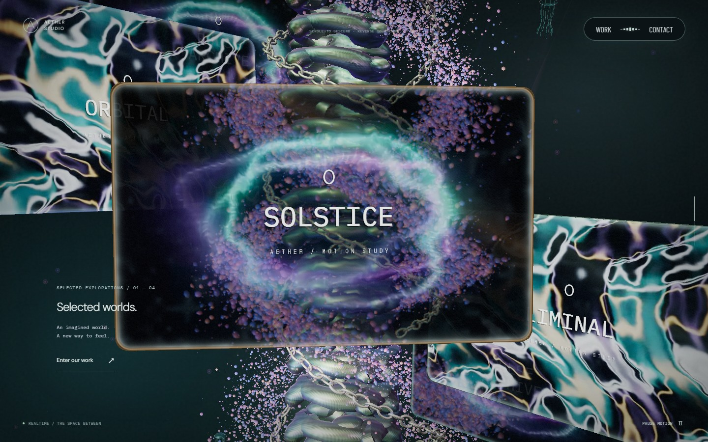
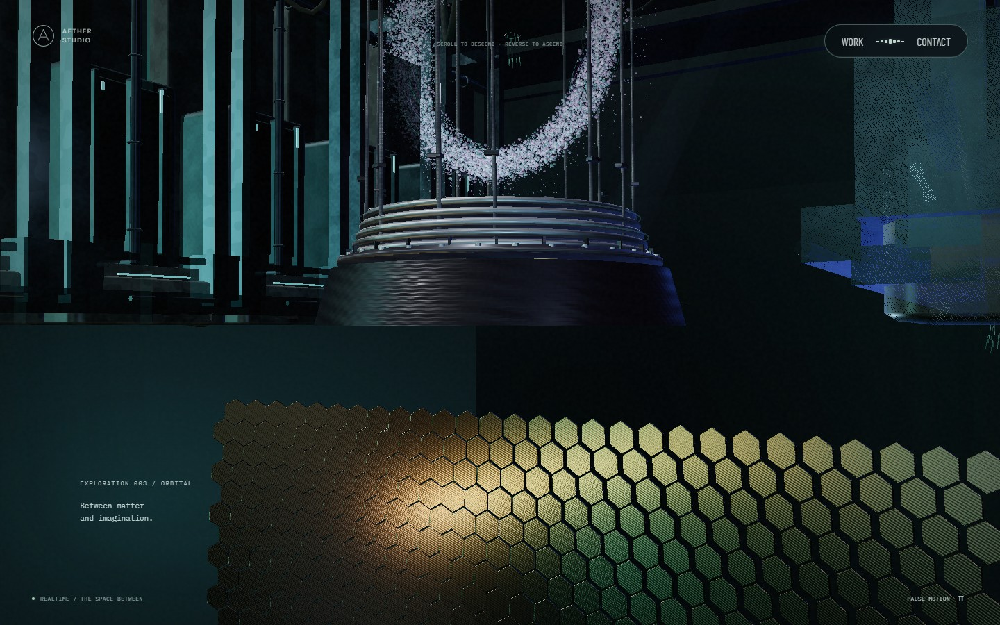
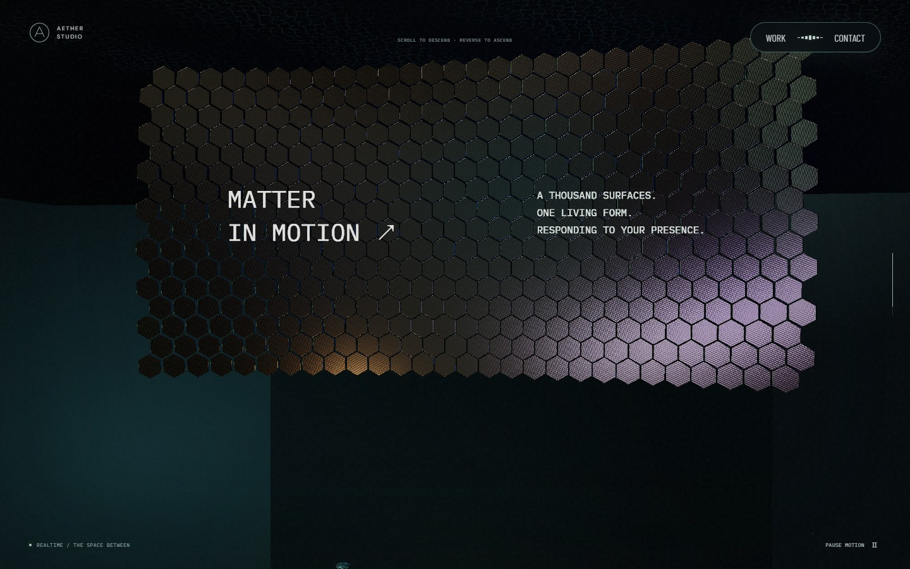
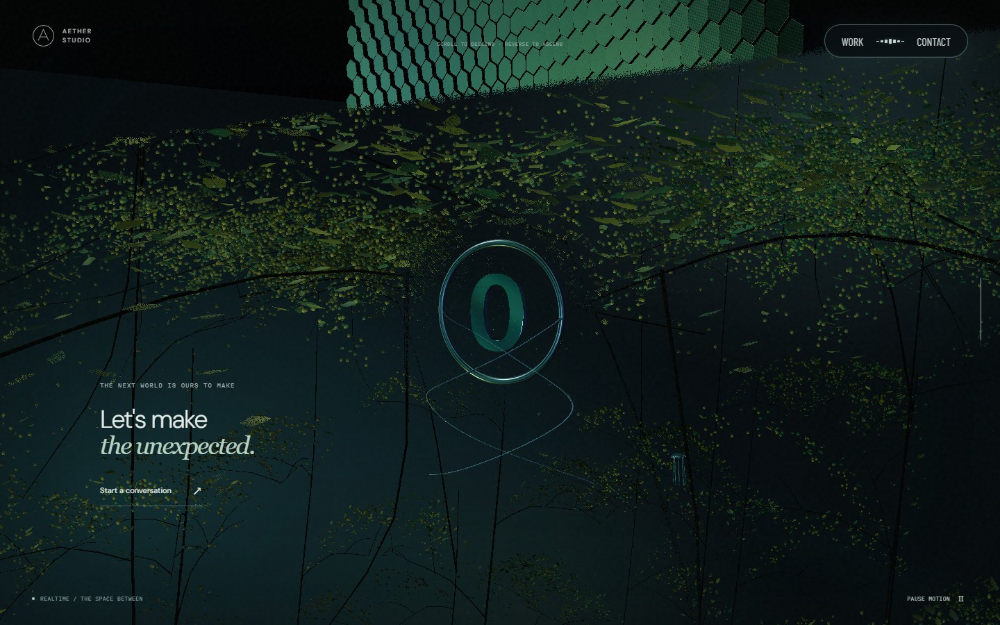
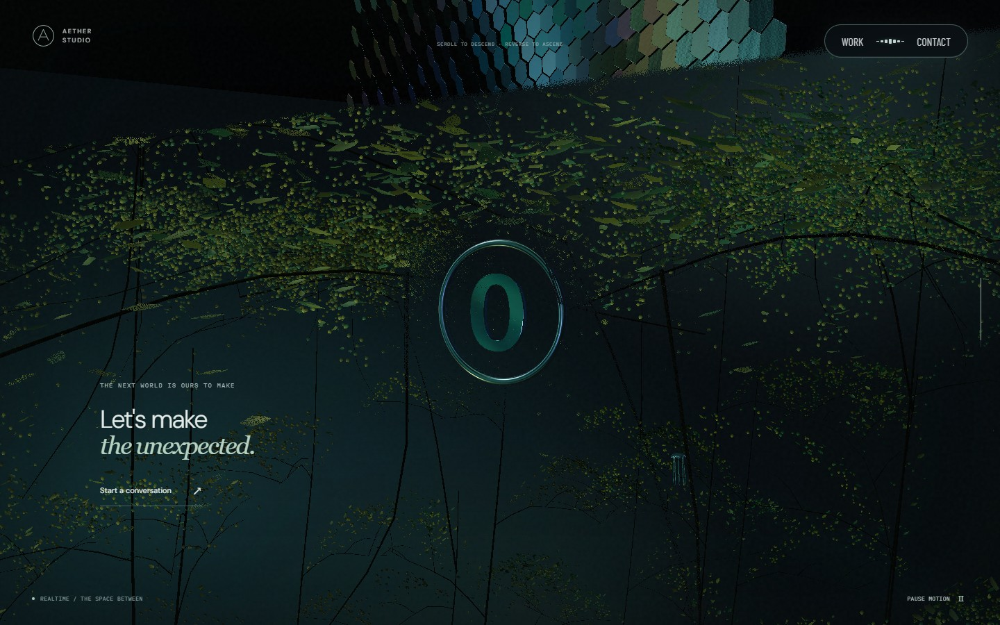

# 장면 경계·본 모니터 배치 검증

구현 기준: `6654c71` · 회귀 검사 기준: `e61208b` · 2026-09-22.

## 반영한 동작

- 본 → 리액터: 넓은 천장 면은 렌더하지 않는다. 장치의 작은 덮개·접점은 보존한다. 본은 전환 후반에도 이동 기준점을 따라 내려가며, 기존의 추가 상승량을 제거했다.
- 본 주변 입자: 전환 중에는 동일 위치·속성 버퍼를 공유하는 Points로 위쪽 본의 흐름을 유지한다. 아래쪽에서 수렴하는 필드와 경계를 공유하고, 끝난 구간은 숨긴다.
- 리액터 → 스케일: `deviceExit` 화면 경계를 공통 사용한다. 위쪽 3D 설비·수면과 아래쪽 3D 패널을 따로 자른다. 하부 천장·투영광은 독립 그룹에 남는다.
- 본 컬럼: 데스크톱/모바일/소프트웨어 경로의 세그먼트를 18/16/12에서 13/11/9로 줄이고 개별 높이를 키웠다. 실버·청록·보라의 반사와 표면별 거칠기를 적용한다.
- 모니터: 패널별 방향·X·Z·크기를 고정하고 스크롤로 Y만 이동한다. 호버 시 컬럼 바깥쪽으로 최대 0.24, 앞쪽으로 0.12만큼 이동한다. 모바일에는 기존 크기 비율을 적용한다.
- 스케일: 타일별 박막 두께·거칠기·미세 표면과 비대칭 굴곡을 적용한다. 추가 렌더 타깃이나 영상 디코더 없이 기존 조명 영상을 공유한다.
- 포레스트: 섬광은 태어나는 위치와 비행 후 픽셀을 모두 숲 경계로 제한한다. 다른 파티클의 포인터 반응은 유지한다. 하단 리본은 나타나기 전에 위쪽 부착 자세를 설정한다.

## 전후 캡처

실제 프로덕션 빌드를 CSS 1440×900, DPR 1로 촬영했다. 같은 스크롤 순서·프레임 시계를 사용하고 영상은 2초로 맞췄다. 모니터 배치·본·재질이 함께 바뀐 누적 비교이므로 한 변수만 바꾼 실험은 아니다. 정지 캡처는 성능 측정 자료가 아니다.

| 대상 | 변경 전 | 변경 후 | 판단 포인트 |
| --- | --- | --- | --- |
| 본·모니터 50% |  |  | 높은 세그먼트, 앞쪽 고정 패널, 체인 깊이 |
| 본 → 리액터 65% |  |  | 남색 판 제거와 본·입자 유지 |
| 리액터 → 스케일 76.5% |  |  | 공통 사선 경계 양쪽 3D |
| 스케일 85% |  |  | 타일별 반사와 거칠기·굴곡 |
| 마지막 포레스트 90% |  |  | 리본이 아래에서 뒤집혀 올라오지 않음 |

전체 13개 위치의 변경 전후 **26장**은 [이미지 manifest](screenshots/continuity-v18/manifest.json)에 경로·진행도·시계·SHA-256과 함께 보관했다. [이전 캡처](screenshots/continuity-v18/before), [수정 캡처](screenshots/continuity-v18/after)를 순서대로 보면 전체 흐름을 확인할 수 있다.

Active Theory는 실제 wheel 입력으로 본·모니터·리액터·스케일·마지막 숲을 확인하고 사용자가 제공한 전환 이미지를 함께 참고했다. 내부 구현이 어떤 2D wrapper/렌더 타깃을 사용하는지는 이 화면 관찰만으로 단정하지 않는다. 원본 사이트 캡처나 자산을 새 배포 자산으로 복사하지 않았다.

## 자동 검사

실제 Three.js 셰이더와 메시를 사용하는 fixture 15개, 포레스트 섬광의 CPU 입력 회귀 2개를 확인했다.

- 13개 전환 상태의 본·리액터·스케일 재질에서 경계 밖 픽셀 누출을 검사한다.
- 본 유출 입자의 원래 형태와 경계, 정지·역스크롤 복원을 검사한다.
- 천장 비표시와 작은 캡·바닥·하부 천장 깊이를 구분한다.
- 7개 스크롤 위치에서 모니터 quaternion·X·Z·scale 불변과 Y 이동·복원을 확인한다. 좌우 패널 호버와 실제 체인·카드 geometry의 카메라 ray 깊이를 비교한다.
- 포레스트를 벗어나면 섬광 기록이 비워지면서 점 입자·포인터 흐름은 유지되는지 검사한다.

전체 검사와 배포 결과는 PR #18의 최종 CI 및 실행 기록을 기준으로 확인한다. [테스트 코드](../tests/interaction.spec.ts), [실제 장면 fixture](../tests/fixtures/interaction-harness.ts), [섬광 검사](../tests/pointer-streak-scope.spec.ts).

## 실시간 왕복 성능

NVIDIA RTX 2060 SUPER, Chromium ANGLE D3D11, CSS 1440×900, DPR 1. 새 브라우저·HTTP 캐시 비활성화·프로덕션 빌드에서 준비 후 19초 하강과 19초 상승을 한 번씩 실행했다. 동시에 다른 GPU 검사·빌드·인코딩은 실행하지 않았다. 정지 캡처와 다른 실행이다.

| 방향 | RAF 중앙값 / p95 / 최대 | 33.5ms 초과 | GPU p95 / 최대 | 콜백 CPU 최대 |
| --- | --- | ---: | --- | --- |
| 하강 | 16.7 / 16.7 / 16.8ms | 0 | 4.56 / 6.61ms | 4.1ms |
| 상승 | 16.7 / 16.7 / 16.8ms | 0 | 4.52 / 7.83ms | 4.3ms |

GPU disjoint는 false, 실행 오류는 0이었다. 장면 준비 완료 시각은 탐색 후 약 3.83초다. 같은 조건의 변경 전 표본이 없어 로딩 시간 개선율은 계산하지 않는다. 15렌더마다 갱신되는 화면 draw 표시의 최대는 하강 212·상승 213이었으며, 모든 프레임의 GL 최대값이나 과거 226 대비 개선율로 해석하지 않는다.

[기록 JSON](evidence/scene-continuity-performance.json)은 이번 구현의 단일 기기 표본이다. 실기기 Safari/iOS, 저사양 모바일, 장시간 발열·메모리는 여전히 후속 검증 대상이다.

## 다음 개선 순서

1. 실제 Safari/iOS에서 영상 복귀·컨텍스트 재생성·포인터 대체 입력을 확인한다. Chromium 모바일 에뮬레이션 통과를 실기기 확인으로 대체하지 않는다.
2. 10~15분 왕복 실행으로 영상 디코더·GPU 메모리·발열을 관찰하고, 품질 단계 하향 전후 화면을 함께 보관한다.
3. 본·영상·장치가 겹치는 구간을 별도로 반복 측정한다. 평균 draw보다 높은 GPU 시간·긴 RAF의 재발 여부를 먼저 본다.

스토리 형태의 설명은 [후속 트러블슈팅 글](troubleshooting/posts/07-scene-continuity.md), 전체 역사 기록은 [문서 인덱스](troubleshooting/index.md)에 있다.
