# 로딩·장면 경계·입자·모바일 터치 수정

2026-09-24 · 변경 전 `382ce87` · 참고: [Active Theory](https://activetheory.net/)

로딩 숫자의 단계 건너뛰기, 화면을 따라 내려오던 꽃 군집, 빈 포레스트 경계, 납작한 리액터 입자층을 수정했다. AT의 실제 스크롤 화면에서 배치·색·하강 과정·수면을 비교했으며 원본 코드나 에셋을 복사하지 않았다.

| 대상 | 변경 |
| --- | --- |
| 로딩 | 실제 준비 단계까지 숫자를 24ms 간격으로 1씩 표시. 첫 렌더 전에는 100에 도달하지 않으며 재준비·실패·숨긴 탭 처리 유지 |
| 포레스트 | 상단 바닥과 하단 천장의 식물·미세 입자를 공통 사선 경계에 맞춤. 뿌리 사이를 입자로 채우고 하단 식물은 아래로 늘어뜨림 |
| 본 컬럼 | 꽃 군집의 중심 높이를 월드 Y -29.8에 고정. 서로 다른 높이·깊이·크기의 꽃을 하단부터 중간에 배치하고 보라·분홍·청록·금색과 입자 명암 보강 |
| 리액터 | 개구부 아래 불균일한 입자 덩어리가 먼저 나타나고 스크롤에 따라 내려와 O를 형성. O의 단면·주변 산포·밀도 확대 |
| 수면 | 서로 다른 방향과 크기의 물결, 미세 요철, 불규칙한 하이라이트, 더 선명한 반사 적용. 기존 반사 패스 하나 유지 |
| 모바일 | 짧은 탭과 드래그를 포레스트 섬광·스케일 반응에 전달. passive Touch Events로 기본 스크롤과 관성을 유지하며 멀티터치·취소·화면 이탈 시 입력 정리 |

## 시각적 변경

두 버전 모두 1440×900, DPR 1, Chromium ANGLE D3D11이다. 같은 스크롤 위치와 위치별 240회 60Hz 시각 증가를 사용했으며 영상은 2초로 맞췄다. 실제 실행 화면이며 성능 측정 자료는 아니다.

| 대상 | 변경 전 | 변경 후 | 판단 포인트 |
| --- | --- | --- | --- |
| 상단 포레스트 | 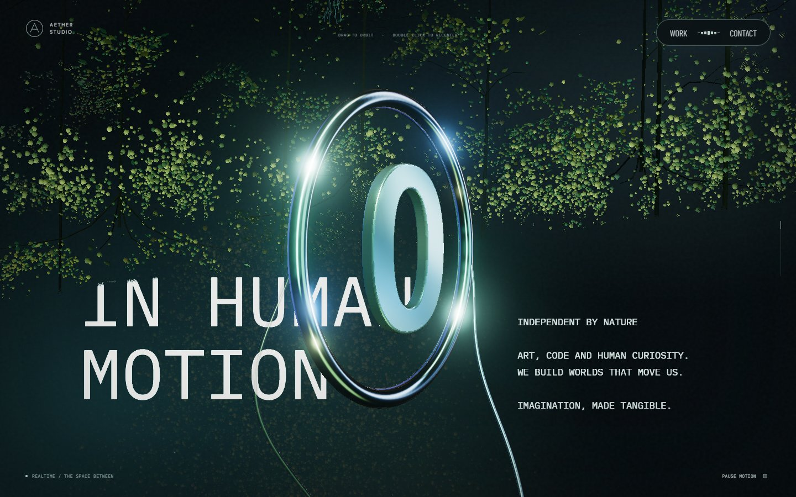 | 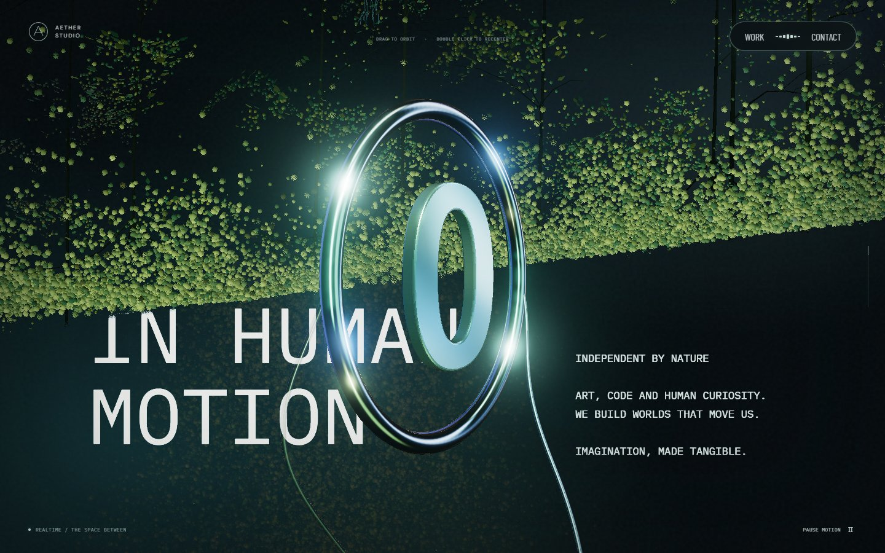 | 사선 경계에 밀착한 바닥·식물 |
| 본 컬럼 중간 | 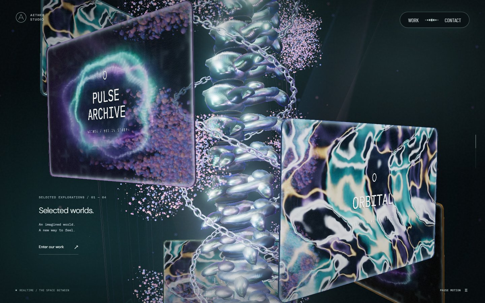 |  | 하단에 자리한 여러 색의 꽃 군집 |
| 본 컬럼 하강 | 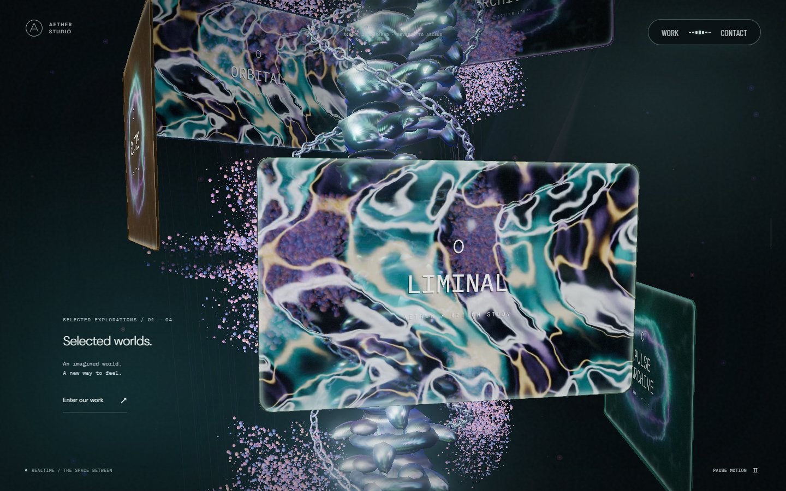 | 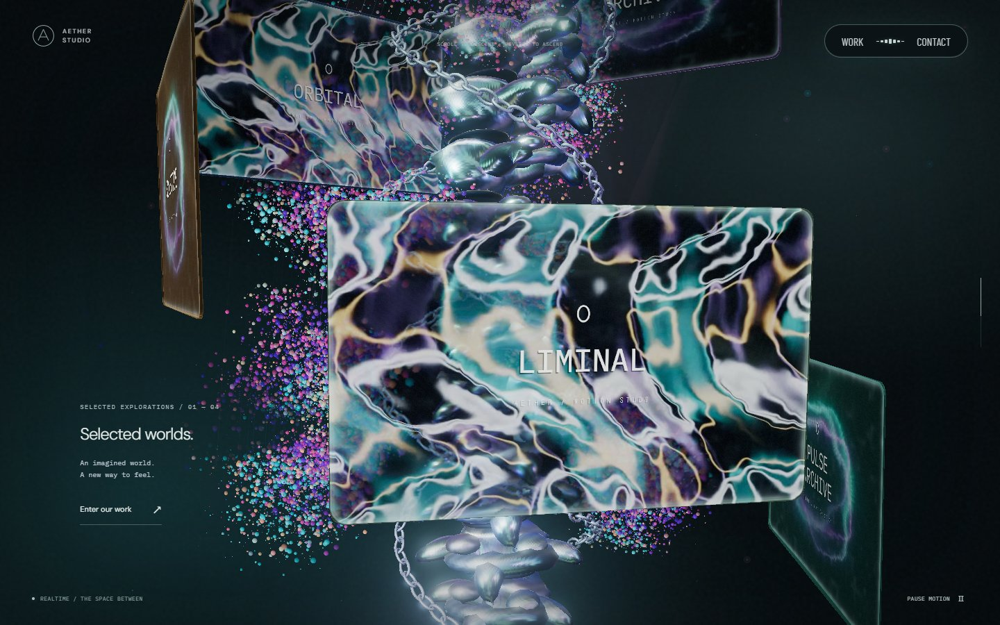 | 꽃이 카메라를 따라오지 않고 위로 이동 |
| 챔버 진입 | 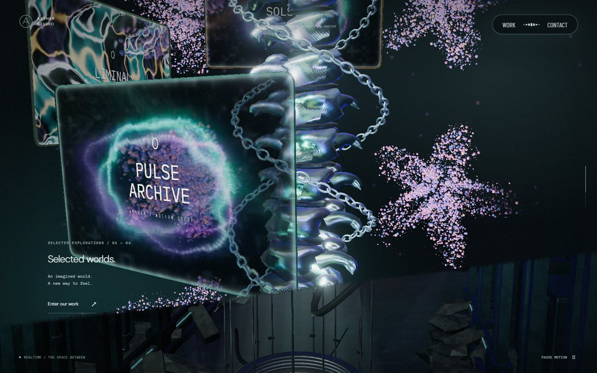 | 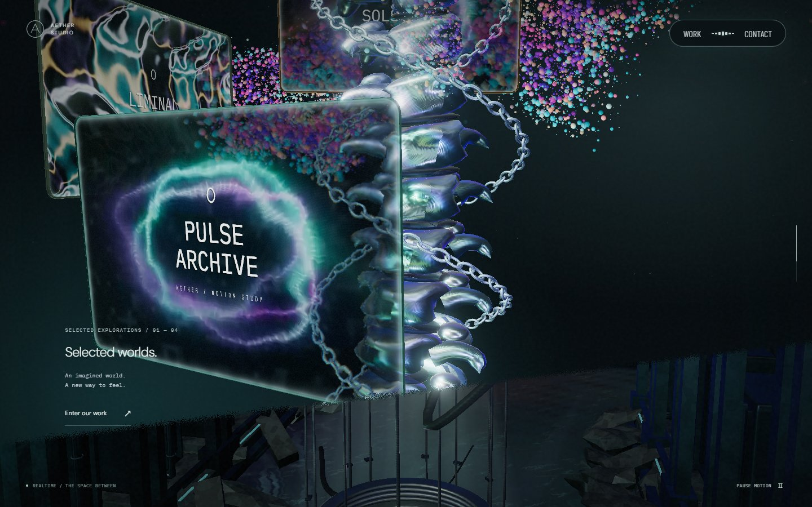 | 위쪽 꽃과 들어오는 챔버의 영역 분리 |
| 개구부 하강 | 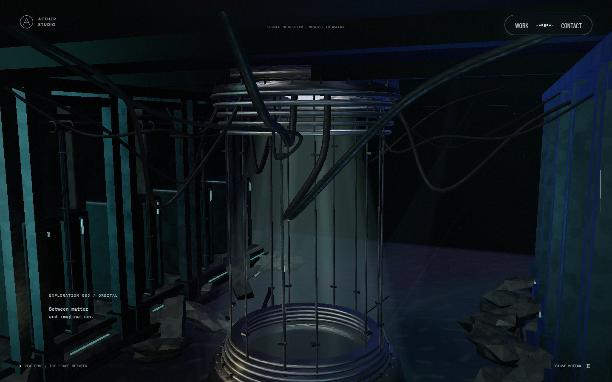 | 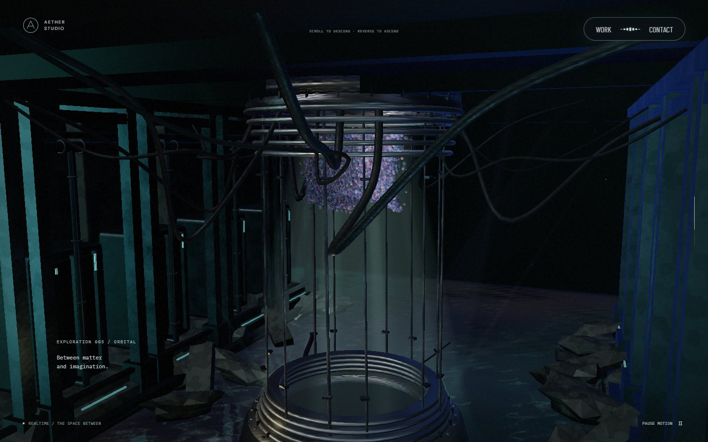 | 납작한 원판 대신 아래로 늘어진 입자 덩어리 |
| 리액터·수면 | 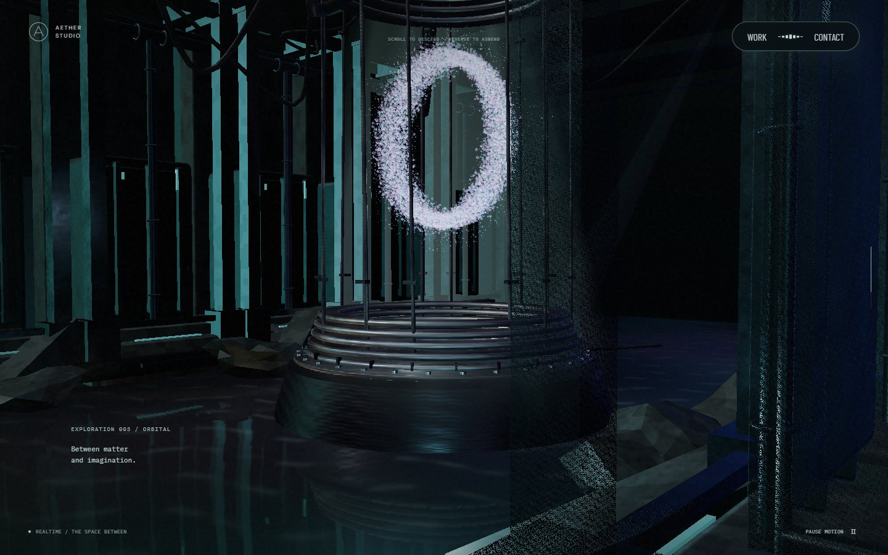 | 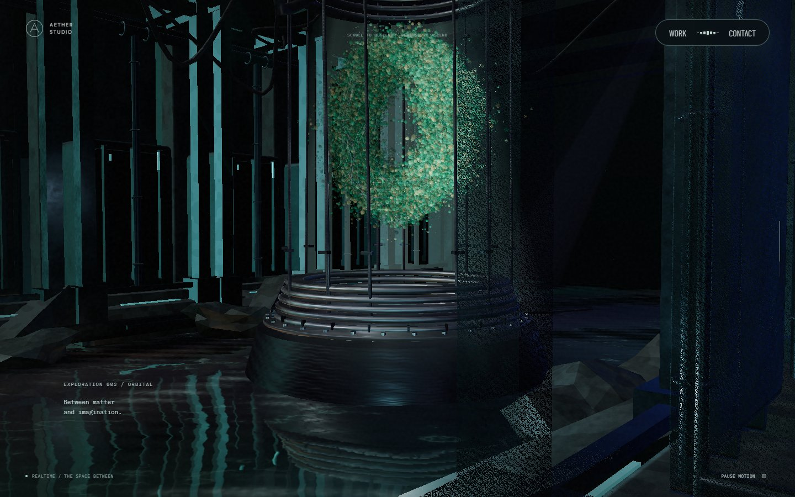 | 두꺼운 O의 명암과 물결에 끊기는 반사 |
| 하단 포레스트 | 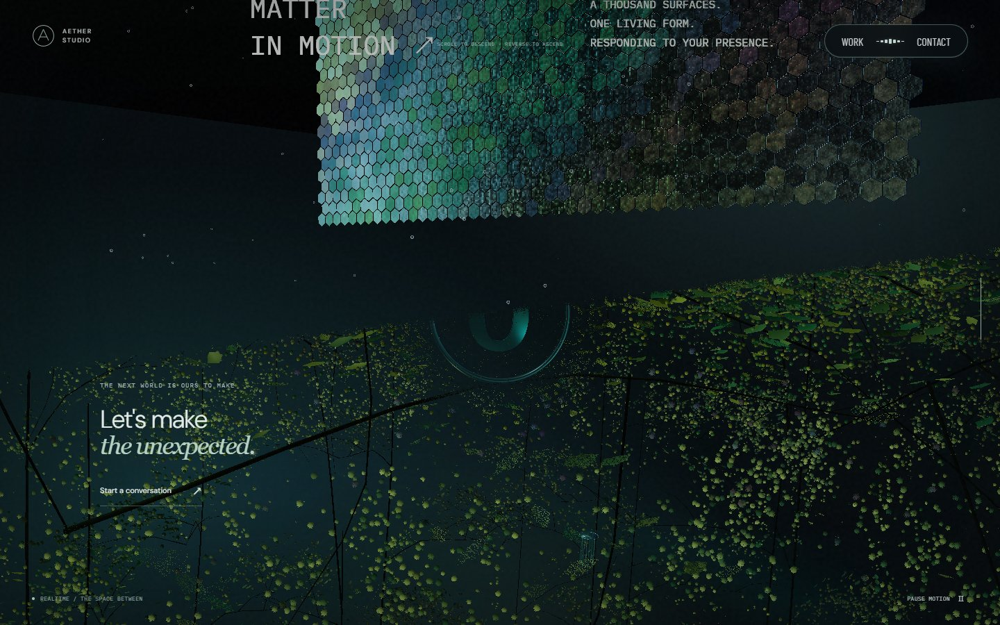 | 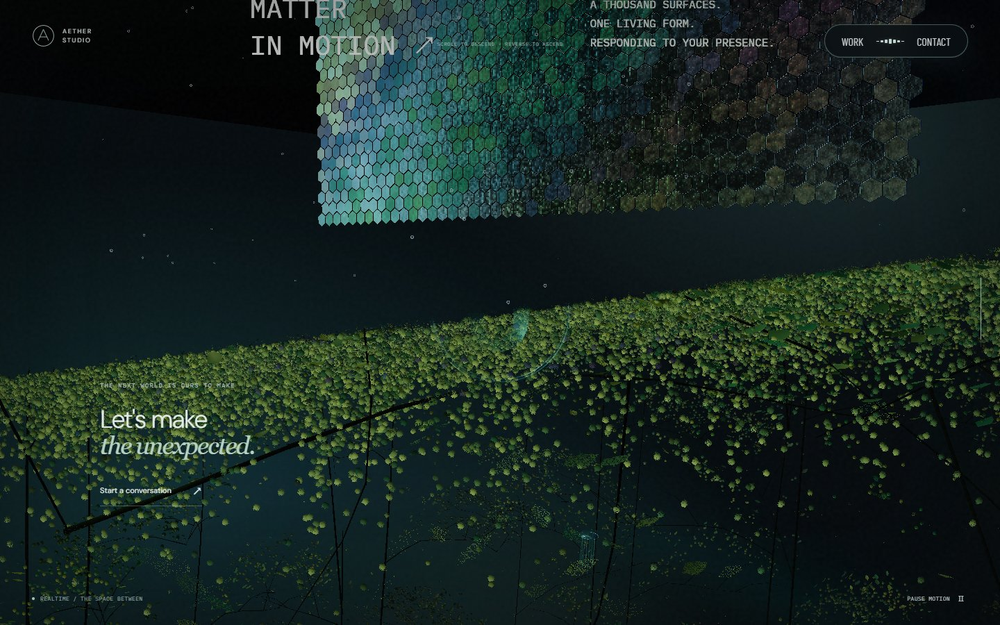 | 경계에서 아래로 이어지는 천장 식물 |

## 검증

- `npm run lint`, `npm run typecheck`, `npm run build` 통과.
- 전체 Playwright 실행에서 97개 통과, 모바일 전용 검사의 PC 실행 1개 제외. 예전 카메라 높이와 초기 원판을 전제로 하던 검사 2개는 새 기준으로 수정한 뒤 모두 재실행 통과했다. 최종 검증 범위는 99개 통과, 의도한 제외 1개다.
- 실제 GPU 셰이더로 꽃의 고정 높이·회전, 입자 하강·정지·역스크롤 복원, 경계 밖 누출, 수면의 시간 변화·정지를 검사했다. 꽃의 가림 전후 비교는 같은 월드 위치를 사용하며 실제 입자를 가리는 후반 경계도 포함한다.
- 로딩의 cold/cached 실행에서 0~100의 모든 정수가 순서대로 표시됐고 첫 렌더 전 완료 표시는 없었다.
- Chromium 모바일 터치 입력 경로로 상단 포레스트·스케일·하단 포레스트의 탭과 세로 드래그를 검사했다. 실제 스크롤 이동과 입력 반응을 확인했고 카메라 회전은 발생하지 않았다. 별도 셰이더 검사에서 탭 섬광, `pointercancel` 이후 흐름, 입력 감쇠·멀티터치 취소를 확인했다.
- PC·390×844 모바일의 16개 스크롤 구간에서 실행 화면을 확인했다. 해당 캡처 실행의 콘솔 오류와 처리되지 않은 오류는 없었다.

## 검증 범위와 비용

PR 리뷰에서 준비 단계가 진행돼도 최초 시작 후 60초에 실패 처리되는 회귀를 발견했다. 감시 타이머가 실제 준비 진행률 변경 때 다시 시작되도록 수정했다. 50초마다 다음 단계가 완료되어 총 150초 동안 로딩이 진행되는 경우와, 마지막 단계에서 60초간 멈춘 경우를 추가로 검사한다. 표시 숫자의 변화는 감시 타이머를 갱신하지 않는다.

입자 예산은 PC 42,000→72,000, 모바일 16,000→24,000, 소프트웨어 4,800→6,000으로 늘었다. 포레스트 경계 입자도 늘었으며 프레임 속도 개선을 주장하지 않는다. 추가 반사 패스나 입자별 CPU 갱신은 없다.

모바일·소프트웨어 수면은 기존대로 별도 반사 타깃 없이 움직이는 법선과 조명을 사용한다. AT와는 모델·영상·절차적 재질이 달라 픽셀 일치 판정은 하지 않았다. 모바일 검증은 Chromium 에뮬레이션이며 실제 iOS Safari와 저사양 기기의 발열·장시간 성능은 확인하지 않았다.
