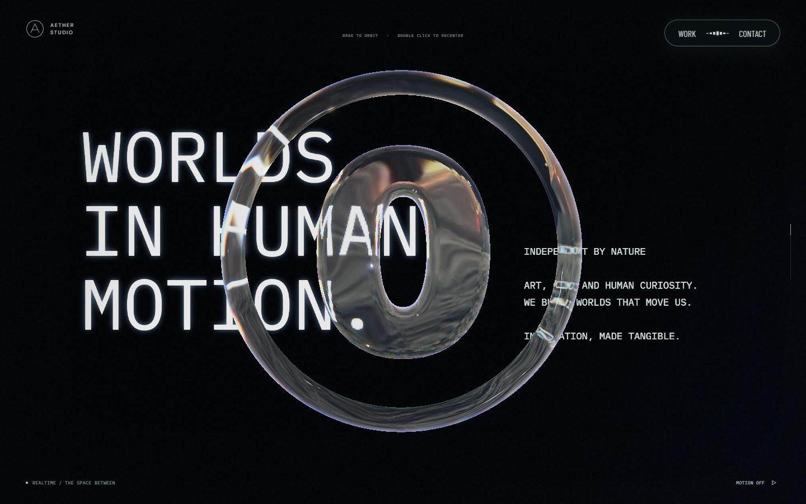
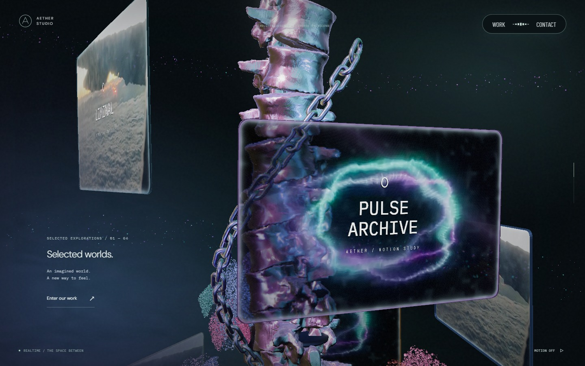
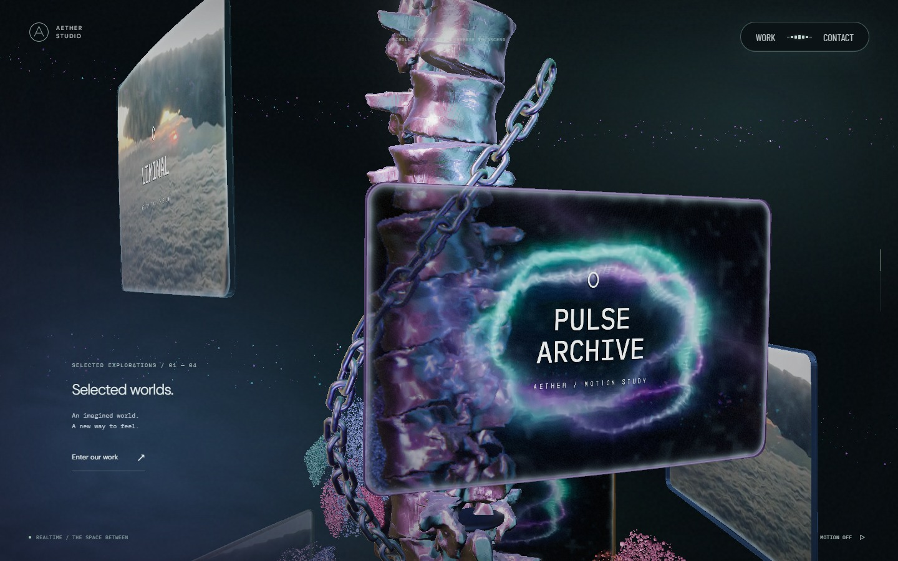
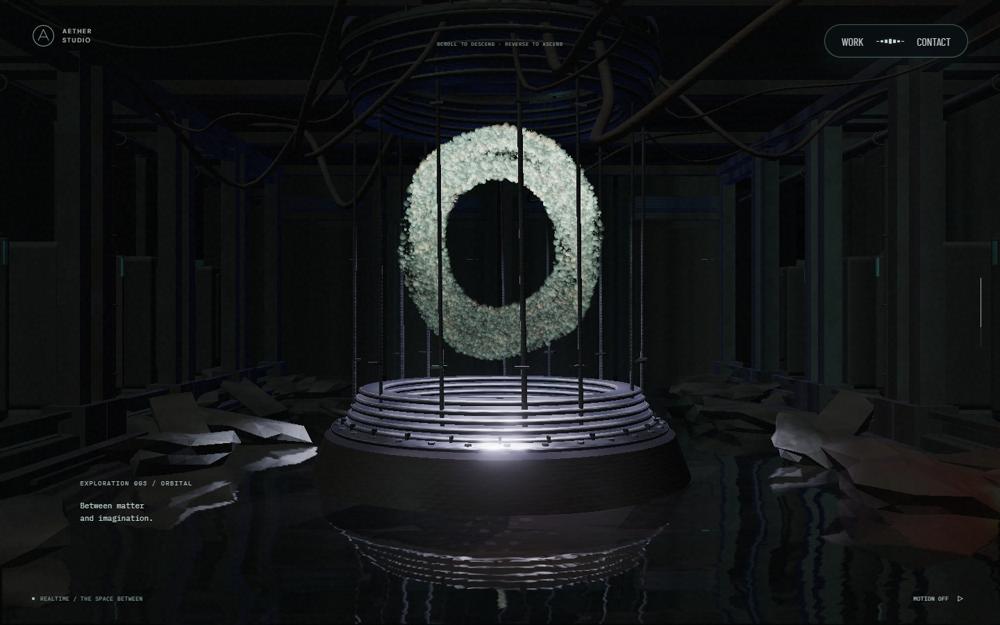
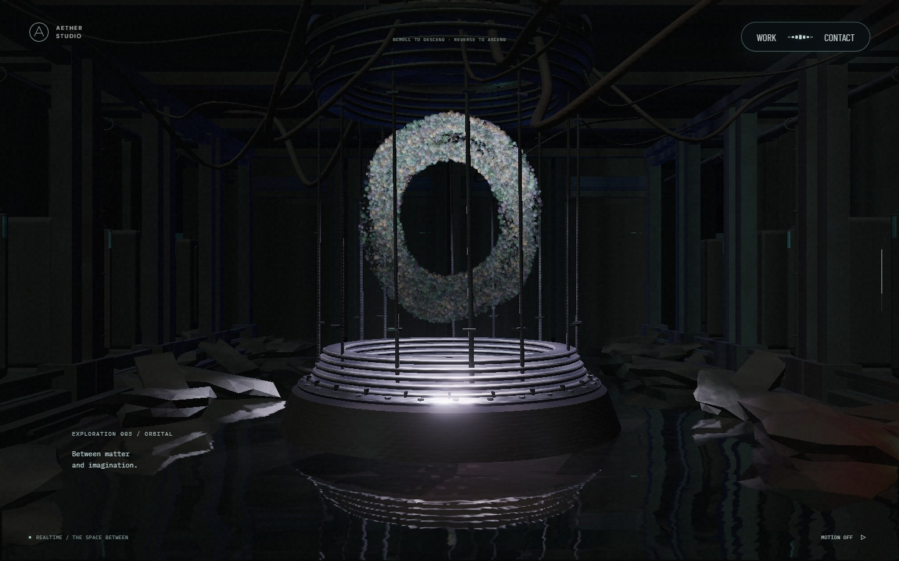

# 숲·꽃의 합류 경로와 모니터 설정

기준 버전은 `915c6f9`다. [Active Theory](https://activetheory.net/)의 공개 화면에서 모니터의 앞뒤 겹침과 리액터 입자를 관찰해 Aether의 독립 구현을 조정했다. 참고 사이트의 코드나 자산은 추가하지 않았다.

## 입자 이동

포레스트 보강 입자의 약 82%는 각 합류 지점보다 0.22~1.4 위에서 기다린다. 나머지는 1.4~3.2 위에서 들어오며 수평 이동도 줄였다. 처음부터 서 있는 잎·줄기는 유지하고, 위치별로 합류 시점을 조금씩 달리해 숲 표면을 보강한다. 하단 숲에도 같은 로컬 경로를 적용하므로 천장 쪽으로 합류한다. 완성 상태 유지 구간과 전체 스크롤 길이는 바꾸지 않았다.

텍스트·링 장면의 작은 점은 숲의 경계 마스크가 0인데 입자 난수도 0인 경우 남을 수 있었다. 완전히 가려진 입자는 난수와 관계없이 먼저 버린다. GPU 검사에는 난수 0인 입자를 넣어 경계가 닫힐 때 보이지 않고, 역스크롤하면 다시 보이는지 확인한다.

본 컬럼 상단 큰 꽃의 바깥쪽 입자는 경계선 쪽의 더 높은 위치에서 들어온다. 하단 큰 꽃의 해당 입자는 넓은 곡선을 따라 안쪽으로 모인 뒤 리액터 개구부 높이로 내려간다. 선택 강도를 꽃잎 사이에서 연속적으로 바꾸므로 절반을 자른 선이 생기지 않는다. 경로는 절대 스크롤 위치로 계산해 역스크롤이 같은 위치를 되짚는다.

리액터 입자는 투명한 고리와 밝은 가장자리를 없애고, 채워진 표면에 작은 명암과 색 편차를 준다. 입자 크기와 조명 영상의 가산 강도를 낮췄다. GPU 유체 위치, 포인터 힘, O 형성 경로는 변경하지 않았다.

## 모니터 추가·삭제

[MonitorCatalog.ts](../src/MonitorCatalog.ts)의 `monitorCatalog`가 표시 순서다. 항목을 추가하거나 지우면 `.303~.623`의 같은 본 컬럼 구간 안에서 첫 모니터부터 마지막 모니터까지 배치된다. 1개면 중앙에 머물고, 0개면 모니터와 클릭을 비활성화한다. 가장 큰 모델의 폭·높이에 맞춰 이웃 간 각도·높이 간격과 나선 반경을 조정한다.

| 설정 | 역할 |
| --- | --- |
| `id` | 모니터 식별자. 목록 안에서 고유하게 지정 |
| `title` | 앞면에 표시할 제목 줄 |
| `projectIndex` | 클릭 시 여는 `projects.ts` 항목의 인덱스 |
| `mediaId` | 같은 파일의 `monitorMedia`에 등록한 영상 ID |
| `tint` | 유리 테두리 색 |
| `model` | `width`, `height`, `cornerRadius`, `depth`, `curvature` |
| `focus` | 영상에서 남길 중심 위치 `[x, y]`. 0~1, 기본 `[.5, .5]` |
| `exposure` | 모니터 영상의 밝기 배율. 기본 `.72` |

영상은 `monitorMedia`에 `id`, `src`, 필요하면 `optimizedSrc`를 등록한다. 파일은 `public/media/`에 두고 이용 조건을 확인한다. 같은 영상을 쓰는 모니터는 디코더를 공유한다. 영상 비율을 유지한 채 화면을 채우며 넘치는 부분은 `focus`에 따라 잘린다. 알 수 없는 영상 ID나 재생 실패는 절차적 영상으로 대체한다. 프로젝트 상세의 영상은 `projects.ts`에서 별도로 설정한다.

[MonitorGeometry.ts](../src/MonitorGeometry.ts)는 곡면 화면과 두께 있는 둥근 테두리를 함께 만든다. 두 메시가 같은 곡률을 사용하며, 제목도 모델 비율을 따른다. 화면의 모서리 마스크와 클릭 영역이 같은 크기를 사용한다. 배경 굴절 캡처, 호버 후 복원, 영상 일시정지·재진입은 기존 수명을 유지한다.

## 검증과 한계

모니터 0·1·3·8개의 배치·프로젝트 연결·역스크롤, 서로 다른 모델 비율, 영상 0·1·3개의 생성·해제를 검사한다. 숲은 근거리 합류 비율과 닫힌 경계의 실제 GPU 픽셀을 검사하고, 꽃은 실제 정점 셰이더의 중앙 수렴·높이·역방향 위치를 읽는다. 기존 리액터 유체·포인터와 영상 실패 처리 검사를 함께 실행한다.

2026-09-26 로컬 검증에서 lint, typecheck, build와 Playwright 140개 검사가 통과했다. 환경 조건에 따른 1개는 건너뛰었다. 1440×900의 숲·꽃 이동 단계와 리액터 입력·복원, 390×844의 주요 장면을 캡처했으며 브라우저 실행 오류는 없었다.

실행 화면은 1440×900, 같은 스크롤 진행도, 기본 시점, 모션 정지, 영상 2초 프레임으로 비교한다. 연속 스크롤과 모바일 화면은 별도로 확인한다. 브라우저 에뮬레이션은 실제 iOS·Android 기기 검증을 대신하지 않는다. 모니터를 많이 추가하면 각 모니터를 보는 스크롤 거리가 짧아지고, 서로 다른 영상 수만큼 디코더 비용이 늘어난다.

## 시각적 변경

| 대상 | 변경 전 | 변경 후 | 판단 포인트 |
| --- | --- | --- | --- |
| 텍스트·링 |  |  | 검은 배경에 남던 숲 입자 제거 |
| 본 컬럼 모니터 |  |  | 곡면 유리·둥근 테두리·영상 비율 |
| 리액터 |  |  | 속이 찬 입자, 줄어든 반사와 크기 |
