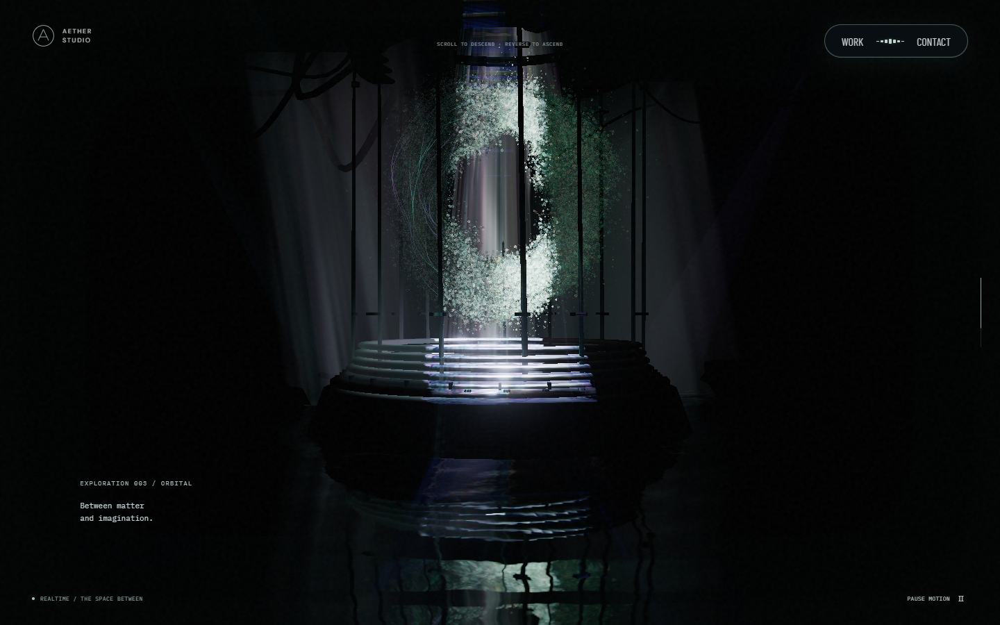
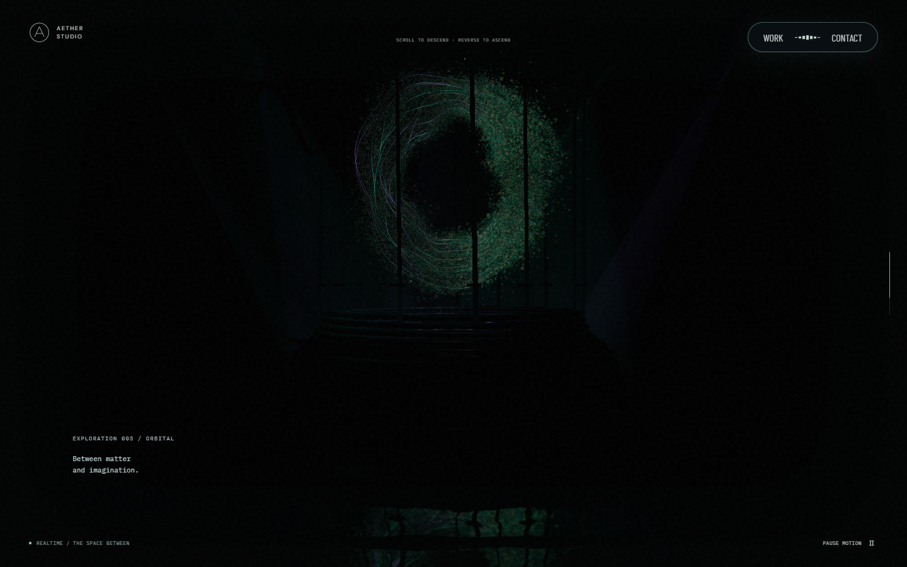

# 장면 전환과 입자 흐름 보정

상단 포레스트의 먼지와 원형링 주변 입자가 텍스트 영역에 남던 경로를 포레스트 전환 마스크로 제한했습니다. 상단 포레스트 전체는 월드 Y 방향으로 1.2만큼 내리고 하단 포레스트 전체는 1.2만큼 올렸습니다. 토양·식물·나무가 함께 이동하며 2D 장면 전환 경계는 지형과 독립적으로 움직입니다.

## 본 컬럼

참고 화면을 초입·중간·말단으로 나눠 확인하면, 꽃 군집은 양옆의 서로 다른 높이에 남고 작은 입자는 컬럼 표면 근처에서 아래로 흐릅니다. 이를 고정 군집과 하강 입자로 나눴습니다. 꽃은 접힌 꽃잎과 굴곡을 따라 밀집시키고 보라·분홍·청록·주황 영역을 섞었습니다. 개별 입자는 구형 음영 대신 불규칙한 가장자리와 얇은 반사를 사용합니다.

데스크톱 입자는 144,000개, 모바일은 40,000개, 소프트웨어 렌더링은 기존 6,000개입니다. 이 중 일반 입자의 20%가 컬럼을 따라 하강합니다. 하강량은 스크롤 절대 위치로 계산하므로 역스크롤하면 같은 경로를 되짚습니다. CPU에서 매 프레임 입자 배열을 갱신하지 않습니다.

## 리액터와 스케일 패널

O를 형성할 때 누적 시간과 스크롤 위상을 곱하던 계산을 없앴습니다. 각 입자는 같은 식별 위치를 유지하며 매달린 덩어리에서 O로 이동합니다. 정지 중에는 내부 단면이 느리게 돌고, O의 전체 방향은 작은 범위에서만 변합니다. 마우스에 가까운 입자는 기존 국소 변형에 반응합니다.

[공유 조명 영상](light-projection-media.md)은 Aether 본 컬럼을 직접 렌더한 영상으로 교체했습니다. 개구부에서 투사되는 빛과 영상에 의해 밝기가 달라지는 금속 반사, 물결 반사를 함께 사용합니다. 실제 광학 산란이나 유체 시뮬레이션을 계산하는 방식은 아닙니다. 영상 재생이 불가능한 환경에서는 기존 절차적 조명을 유지합니다.

스케일 패널의 물방울 지름은 절반으로 줄였습니다. 포인터 파동은 최근 8개까지 유지하고 1.6초 동안 약해집니다. 새 입력이 이전 파동을 즉시 지우지 않으며 파동이 겹쳐도 강도 상한을 넘지 않습니다. 기존 자동 파동과 터치 스크롤 처리는 유지합니다.

## 검증 기준

- 포레스트 지형은 2D 장면 전환 경계 경계만 바꿔도 월드 위치와 화면 투영이 유지되어야 합니다.
- 컬럼의 고정 군집은 높이를 유지하고 하강 입자는 순방향·역방향에서 같은 경로를 따라야 합니다.
- 리액터는 오래 머문 뒤 작은 스크롤을 해도 입자가 튀지 않아야 하며, 정지 중에는 내부 입자가 천천히 움직여야 합니다.
- 포인터를 떠난 후 파동은 남았다가 사라지고, 물방울의 CSS 지름은 DPR·축소 렌더 패스에 따라 달라지지 않아야 합니다.
- 같은 뷰포트·스크롤 위치·장면 시간·영상 프레임의 전후 캡처로 가림, 밀도, 조명을 비교합니다. 참고 사이트 캡처나 자산은 저장소에 포함하지 않습니다.

입자 수와 조명 명암의 변화는 GPU 부하와 화면 밝기에 영향을 줍니다. 모바일·소프트웨어 프로필은 데스크톱과 다른 입자 예산을 사용하며 기기별 프레임 속도가 동일하다고 보장하지 않습니다.

### 영상 프레임에 따른 실제 조명 변화

아래는 PC 1440×900, 스크롤 72.5%, 같은 카메라·장면 시간을 고정하고 조명 영상만 2초에서 10초로 이동한 실제 화면입니다. 밝기를 보정하지 않았습니다. 중앙 챔버 영역 `(400,100)–(1100,800)`의 표시 RGB 기준 평균 luma는 33.58에서 7.75/255로 바뀌었습니다. 해당 영역 픽셀의 59.98%에서 채널 차이가 8/255를 넘었습니다. 최종 프레임의 차이이며 물리적 광량 측정값은 아닙니다.

| 영상 2초 | 영상 10초 |
| --- | --- |
|  |  |

모바일의 네이티브 터치로 상단 포레스트·스케일 패널·하단 포레스트을 움직인 검사도 통과했습니다. 드래그 스크롤과 기존 입력 취소 처리를 유지합니다.
