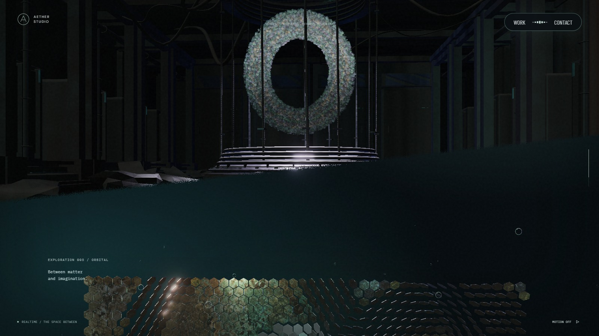
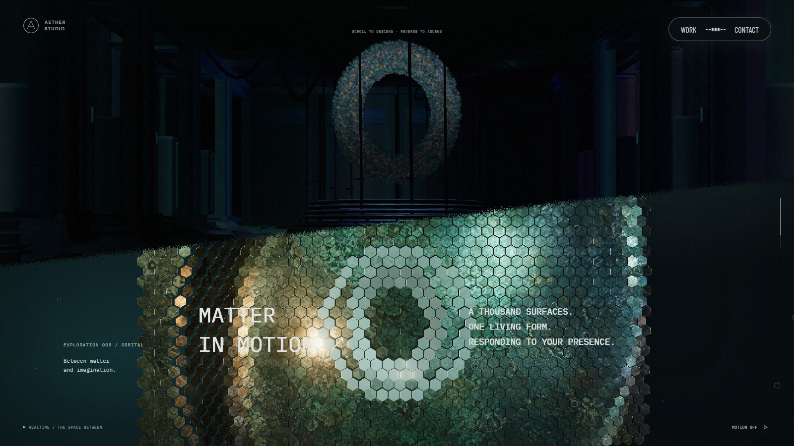
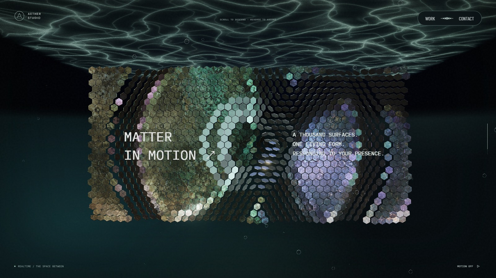
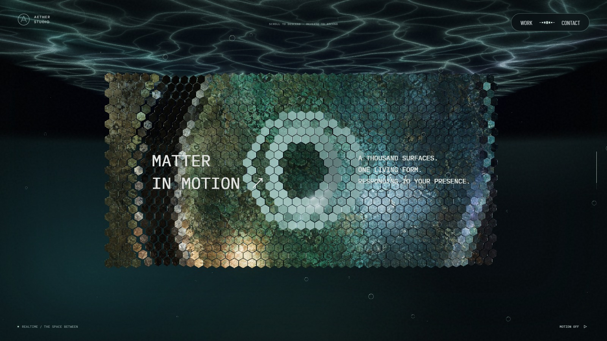
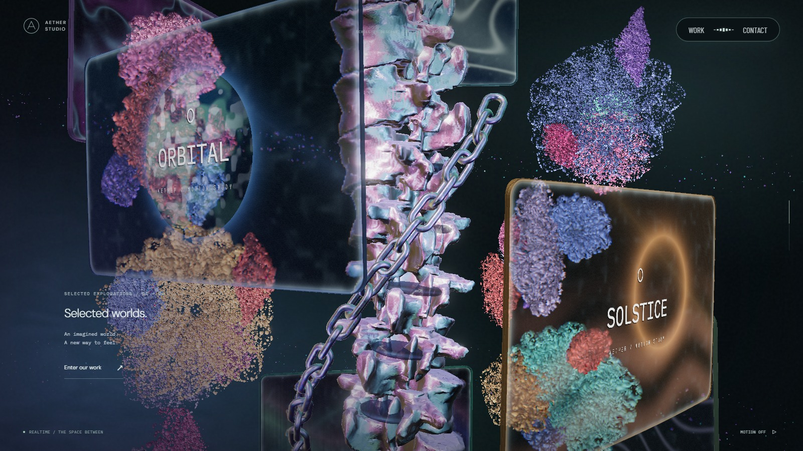
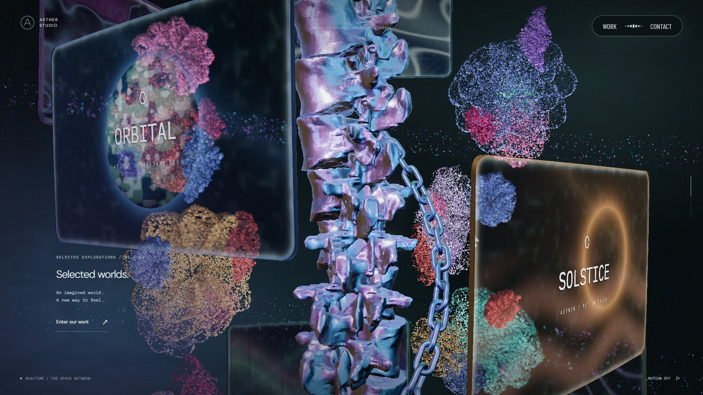
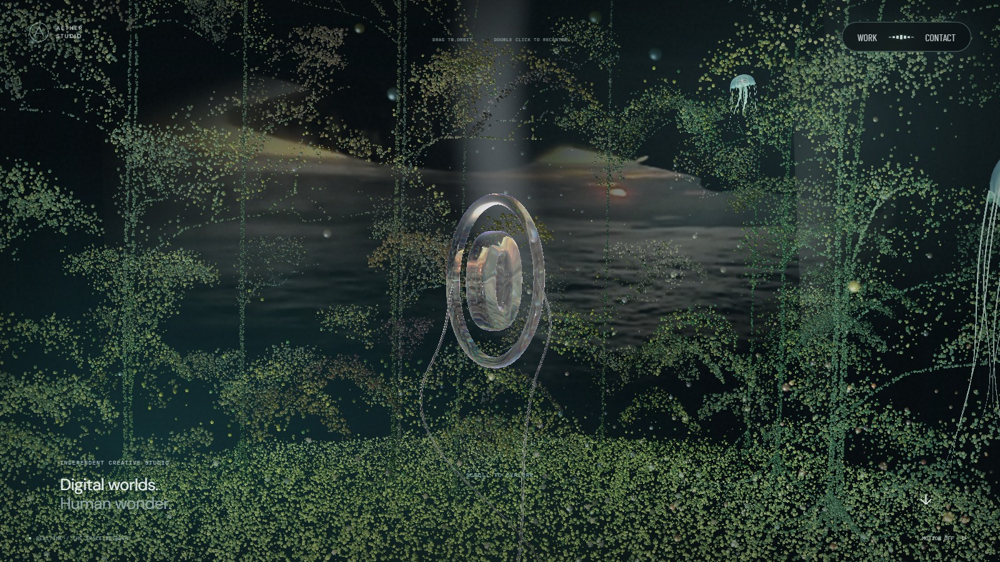
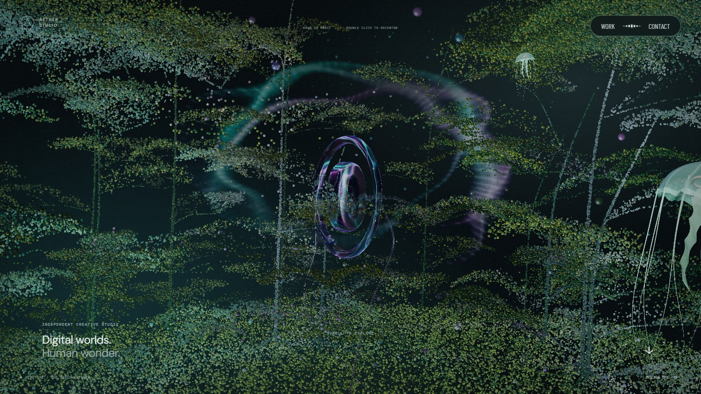

# 스케일 패널 전환과 본 컬럼·포레스트 배치

기준 화면은 `cfb4243`이다. 스케일 패널의 스크롤 길이를 줄인 뒤에도 기존 카메라의 긴 하강 경로가 남아, 빈 공간 뒤로 패널과 천장이 급하게 들어왔다. 진입 경계부터 퇴장 경계까지를 100svh로 묶고, 패널의 상하 이동을 사선 경계에 맞췄다. 정면 구간의 거리·방향을 유지하고 리액터 수면은 나가는 경계가 닫힐 때까지 남긴다.

`ScaleStage`는 들어오는 패널과 천장의 배치를 담당한다. 리액터는 기존 월드 높이를 유지하고, 두 공간은 같은 화면 경계에서 교대한다. 패널 천장을 카메라가 관통하는 방식은 사용하지 않는다. 패널 모델 크기, 타일 수, 포인터 뒤집힘은 유지한다.

## 본 컬럼과 체인

본 컬럼은 마디의 X·Z축 기울기를 없애고 높이별 Y축 꼬임을 유지한다. 원본 메시의 본체 상·하단에도 경사가 있어 두 면의 기울기를 보정했다. 신경궁으로 갈수록 보정량을 줄여 기존 연결 구조를 유지하고, 내부에 별도로 추가했던 타원형 디스크는 제거했다. 본 컬럼과 체인은 청색·보라색 반사의 비중을 늘렸다.

체인은 나선 경로를 구한 뒤 Y축만 옮기던 보정을 없앴다. 화면에 보이는 끝 높이를 나선 위에서 구하고, 모든 링크의 위치와 방향을 같은 경로에서 계산한다. 정면에서 `/`로 보이는 부분은 링크 방향을 따라 왼쪽 아래로 흐른다. 퇴장 경계에서 끝 링크가 화면 아래쪽 1/3 부근에 오는 배치는 유지한다. 이는 스크롤 경로 연출이며 강체 체인 시뮬레이션은 아니다.

모니터의 기본 나선 반경을 바깥으로 늘리고 꽃 중심은 안쪽으로 옮겼다. 꽃잎 겹 수를 줄이고 입체적인 말림과 꽃잎 사이 간격을 늘렸으며, 꽃 입자 크기를 줄였다. 배경 나선은 같은 입자 예산 안에서 표시 비율을 높였다.

## 포레스트

완성된 나무의 입자 높이를 바닥 기준으로 절반으로 줄였다. 이미 서 있는 입자는 그 위치에 남고, 보강 입자는 기존 높이 부근에서 새 합류 위치로 이동한다. 하단의 가장 끝에서도 보강 전 상태가 남으며 역스크롤로 천장 쪽에 합류한다. 상단에서는 반대 방향으로 같은 동작을 한다. 영상의 바닥·천장 간격과 방향은 유지한다.

## 시각적 변경

1600×900, 같은 장면 진행도, 기본 시점, 모션 정지 상태의 실제 실행 화면이다. 재생 영상은 정지 시점 차이가 있을 수 있으므로 영상 프레임의 색은 비교 기준에서 제외한다. AT 비교는 공개 화면의 정면 구도·경계 이동·꽃과 체인을 관찰했으며, 아래 이미지는 Aether 실행 결과다.

| 대상 | 변경 전 | 변경 후 | 판단 포인트 |
| --- | --- | --- | --- |
| 스케일 패널 진입 · 75% |  |  | 사선 경계 바로 아래에서 올라오는 패널 |
| 스케일 패널 정면 · 83% |  |  | 정면 구도와 천장 간격 |
| 본 컬럼 · 46% |  |  | 단면·내부 판·꽃과 모니터 배치 |
| 상단 포레스트 · 8.5% |  |  | 완성된 나무 높이와 가지 밀도 |

## 검증

스크롤 거리의 양방향 변환, 패널과 경계의 간격, 정면 구도, 마디 높이축·상하 단면, 체인 링크의 이동 방향·연결·역스크롤 복원, 포레스트 높이·보강 시작 상태를 검사한다. 기존 물결·리액터 유체·모니터 상세·모바일 입력 검사도 함께 실행한다. 실제 모바일 기기의 GPU·터치 감각은 브라우저 에뮬레이션과 구분한다.
