# 장면 형상과 입력 반응 조정

기준 버전은 `6608100`이다. [Active Theory](https://activetheory.net/)의 공개 화면과 입력 전후 변화를 참고해 독립 구현을 조정했다. 참고 사이트의 코드·모델·텍스처는 저장소에 복사하지 않았다. 동일한 원본 에셋을 사용하는 재현이나 픽셀 단위 일치를 뜻하지 않는다.

## 입력과 전환

- 텍스트·링 물결은 마우스 이동 속도에 따라 힘을 받고, 정지 후에도 짧게 이동한다. 움직이는 포인터 중심의 빈 영역은 정지 직후 채워지며 잔떨림 없이 사라진다.
- 본 컬럼 왼쪽 아래 기체는 같은 입력의 관성과 세밀한 흐름 경계를 사용한다.
- 체인 자유단은 카메라 이동을 포함해 위치를 보정한다. 하단 전환 시작 구간에서는 체인의 윗끝이 화면 아래 약 1/3에 오며, 꽃은 체인 경로 바깥에 배치한다.
- 리액터 챔버가 전환 경계 위에 남아 있는 동안 카메라는 수면 위를 유지한다. 스케일 패널 중앙 도달 후 전환까지의 스크롤 간격은 줄이고 패널 크기는 유지한다. 포인터가 닿은 타일은 반 바퀴 뒤집힌 뒤 복원된다.

## 형상과 조명

본 컬럼에는 Bill Lorensen의 [NIH 3D 첫 번째 요추 모델](https://3d.nih.gov/entries/3DPX-000307)을 수정해 사용했다. [CC BY 4.0](https://creativecommons.org/licenses/by/4.0/) 출처와 변경 내용은 [메시 크레딧](../src/assets/README.md), 배포본의 `/asset-credits.txt`에 있다. 267,680개 삼각형을 10,000개로 줄이고 열 개 마디로 반복 배치한다. 인접 마디가 약 15도씩 돌아가도록 높이별 회전을 적용하며 전체 컬럼 회전은 별도로 유지한다.

꽃은 양쪽에 큰 꽃 네 개와 작은 꽃 여덟 개씩 배치하고, 꽃잎을 여러 겹으로 나누어 크기와 깊이를 달리했다. 양 끝의 큰 꽃은 바깥쪽 절반에 부드러운 선택 경계를 두어 스크롤에 따라 모인다. 리액터 입자는 크기를 키우되 일부만 표시해 구슬 사이의 빈 공간을 남긴다. 챔버 조명은 더 짧은 주기로 색이 바뀌고, 뒤쪽 설비 패널·환기구·표시등을 추가했다.

## 포레스트와 영상

상단·하단 숲은 처음부터 기본 형태가 남고, 완성된 상태를 보는 스크롤 구간을 늘렸다. 바닥·천장 경계의 입자를 보강하고 미세 조각의 가장자리를 둥글게 정리했다.

곡면 영상은 22×12.375 크기의 월드 고정 메시다. 상단 바닥 높이 −9.9를 기준으로 영상 아래를 −9.45에, 하단 천장 높이 −48.6을 기준으로 영상 위를 −49.05에 둔다. 두 영상 모두 원래 상하 방향을 유지한다. 숲 회전과 영상의 배경 위치는 독립적이다. 크롬 패턴은 강물·안개·구름 구간으로 대체하고 링의 영상 반사 강도와 색 분리를 낮췄다. [영상 출처와 재생성](media-sources.md)을 따른다.

## 검증 기준

1440×900의 같은 장면 진행도, 기본 시점, 모션 정지, 영상 2초 프레임에서 기준 버전과 수정본을 비교한다. 추가로 실제 입력 후 물결 프레임, 타일 뒤집힘·복원, 상하 숲 드래그, 390×844 화면을 확인한다. 자동 검증은 물결 재유입·잔떨림, 컬럼 꼬임·역스크롤, 체인 위치, 영상 경계 간격, 챔버 수면, 타임라인 역함수와 기존 탐색·영상 실패 처리를 포함한다.

화면 캡처는 Aether 실행 결과만 보관한다. 모바일 검증은 브라우저 뷰포트·입력 에뮬레이션이며 실제 iOS/Android 기기 검증과 구분한다. 꽃과 기체는 참조 화면을 바탕으로 조정한 절차적 표현이다.

로컬 lint·TypeScript·빌드는 통과했다. 전체 회귀 실행의 130개 통과·1개 건너뜀 이후, 공유 영상의 요청 구분과 긴 소프트웨어 렌더 검사 시간 제한을 보완했다. 해당 두 검사, 추가한 마디별 회전 검사, 상세 창 회귀를 포함한 후속 10개가 모두 통과했다. 실제 GPU 브라우저에서는 데스크톱 10개 장면과 입력·회전·모바일 흐름에서 콘솔 오류가 없었다.

## 시각적 변경

| 대상 | 변경 전 | 변경 후 | 판단 포인트 |
| --- | --- | --- | --- |
| 상단 포레스트 | 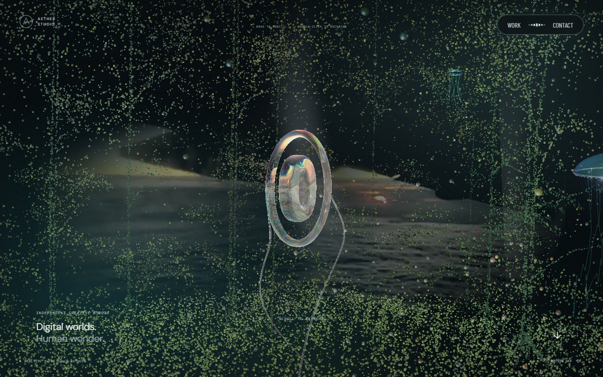 | 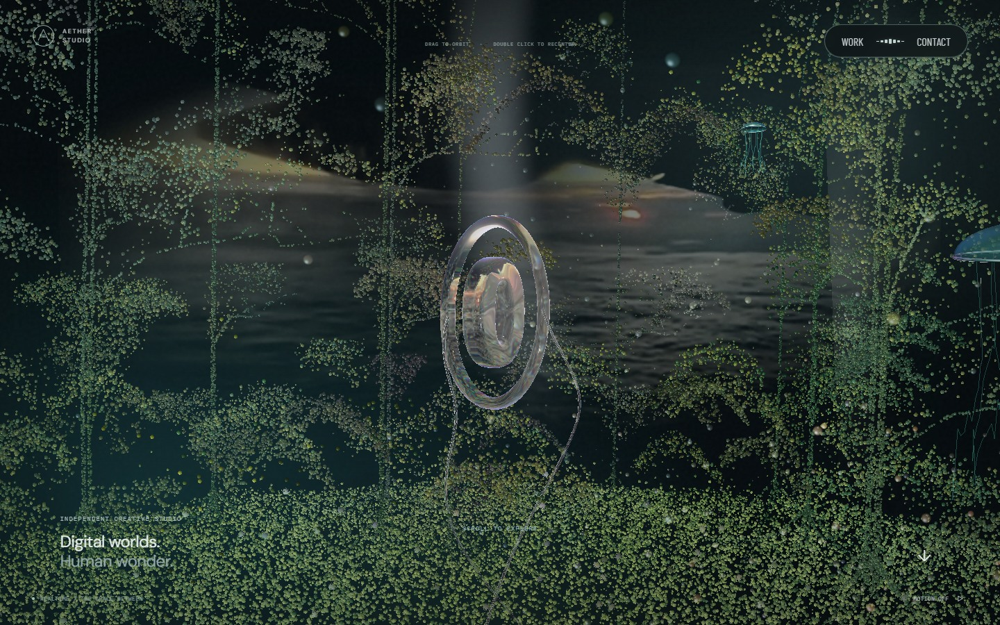 | 바닥 위 영상, 완성된 숲과 경계 입자 |
| 하단 포레스트 | 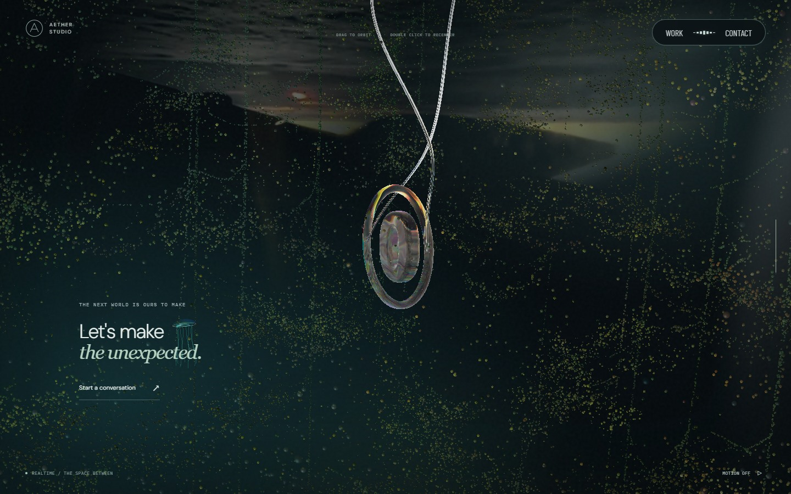 | 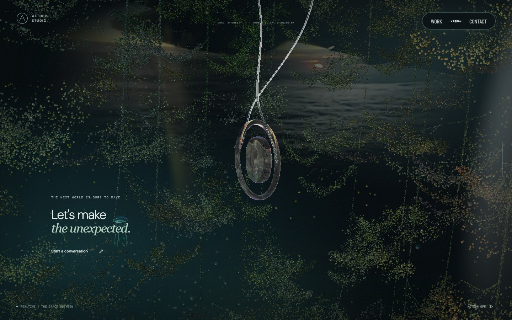 | 천장 아래 영상, 상하 방향 유지 |
| 본 컬럼 | 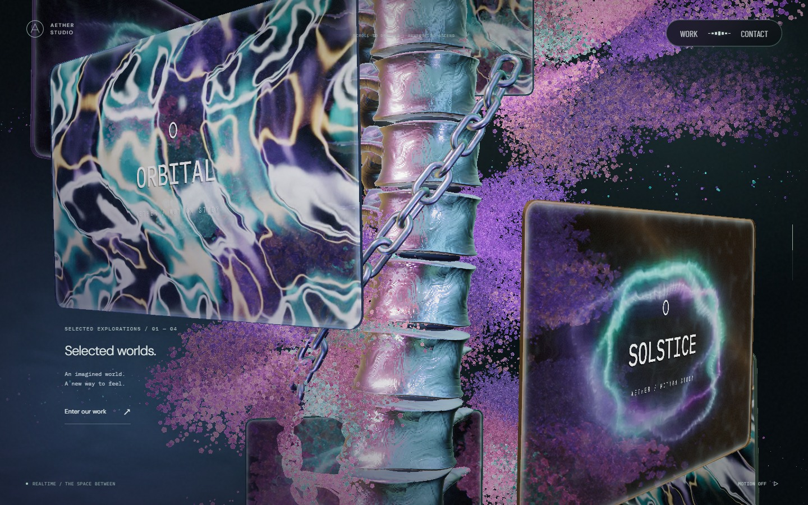 | 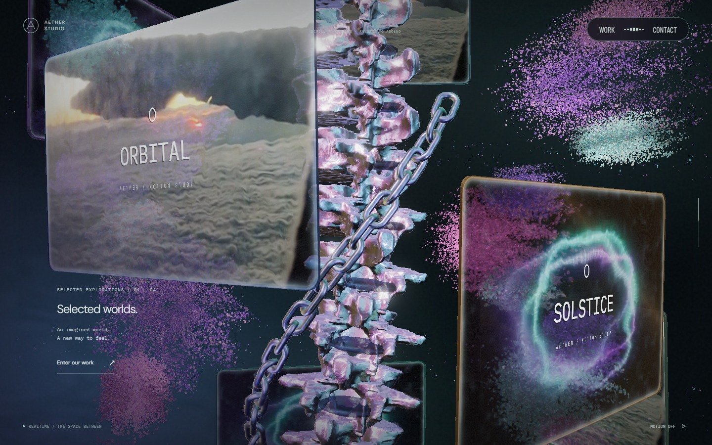 | 마디별 꼬임, 해부학 형상, 꽃 크기·층 |
| 체인 퇴장 | 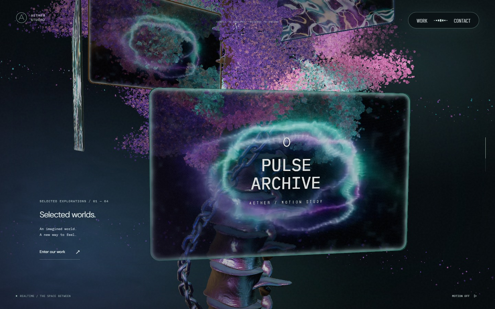 |  | 아래 1/3로 내려간 자유단 |
| 리액터 챔버 | 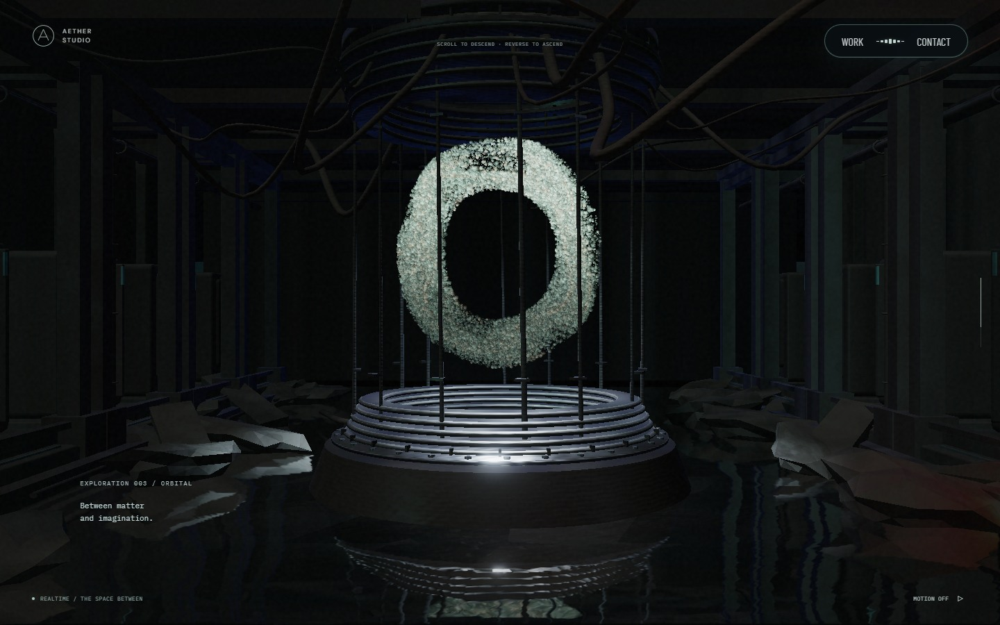 | 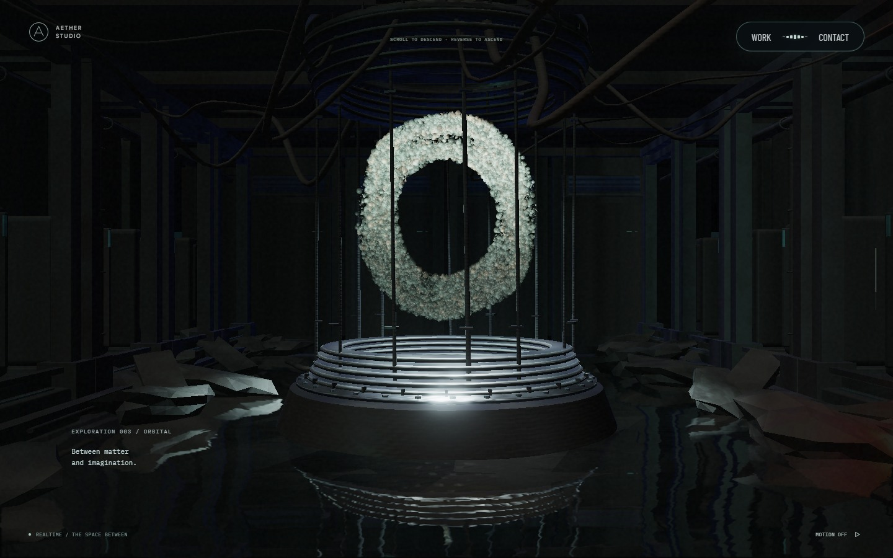 | 큰 입자, 뒤쪽 설비, 수면 |

다음은 수정본의 실제 입력 연속 프레임이다. 타일의 자동 파동과 영상 시간도 함께 흐르는 캡처이므로 포인터 효과만 분리한 차영상은 아니다.

| 입력 | 시작 | 반응 | 복원 |
| --- | --- | --- | --- |
| 빠른 물결 후 정지 | 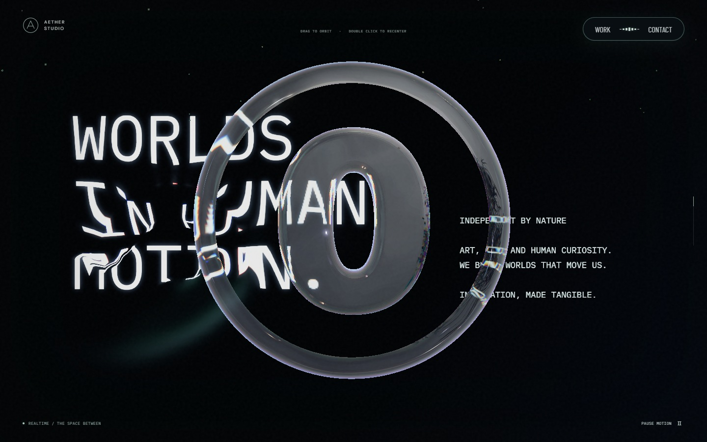 | 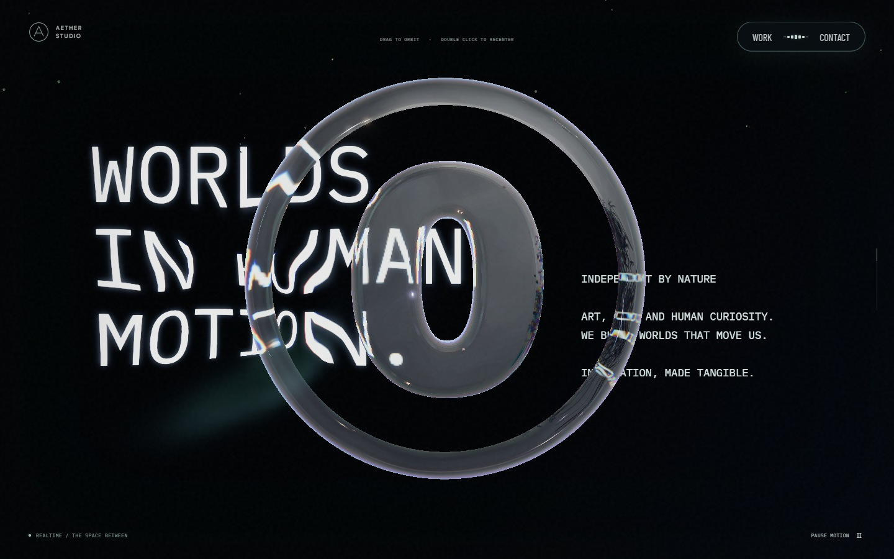 | 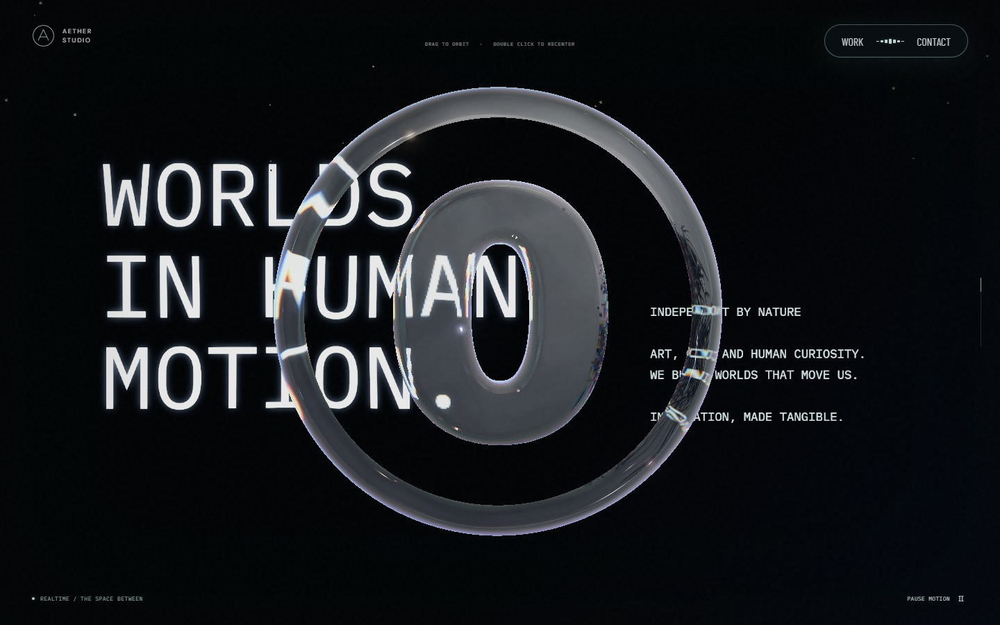 |
| 스케일 패널 | 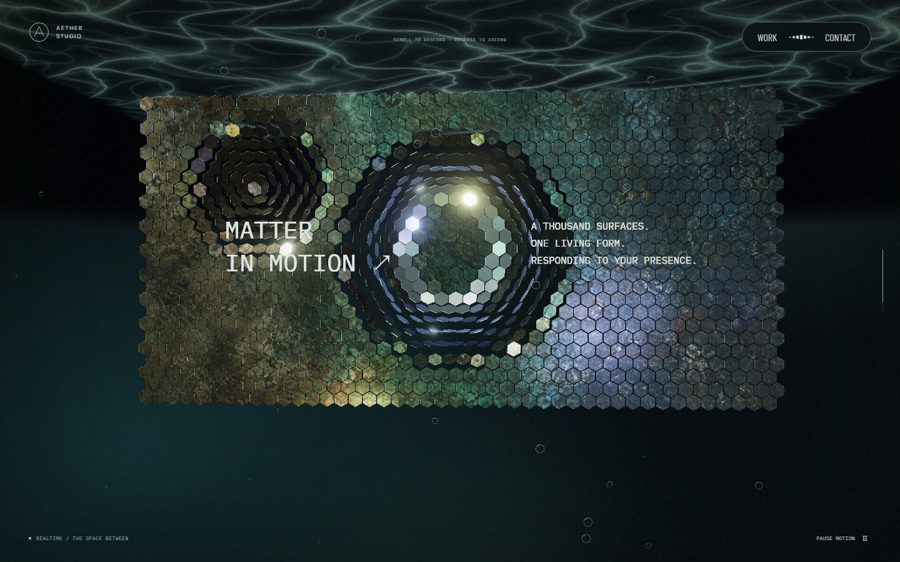 | 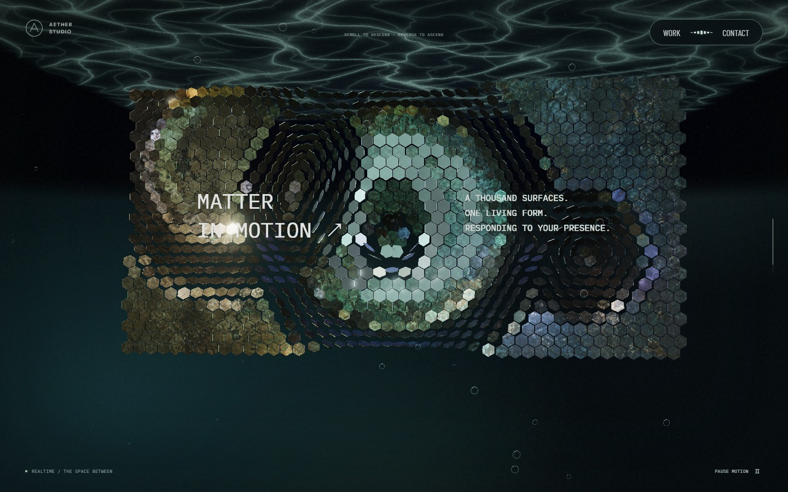 | 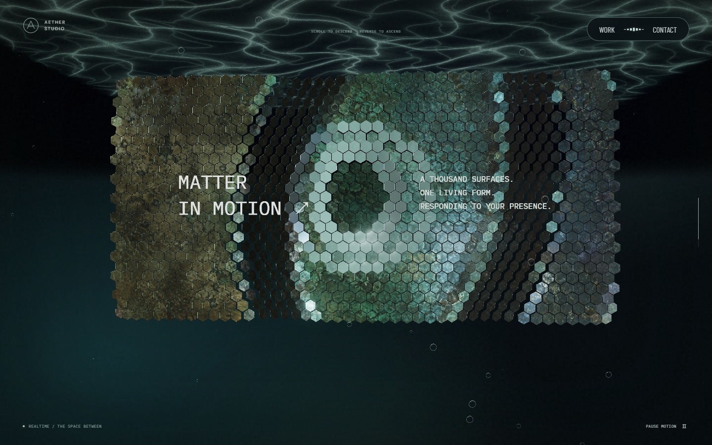 |
