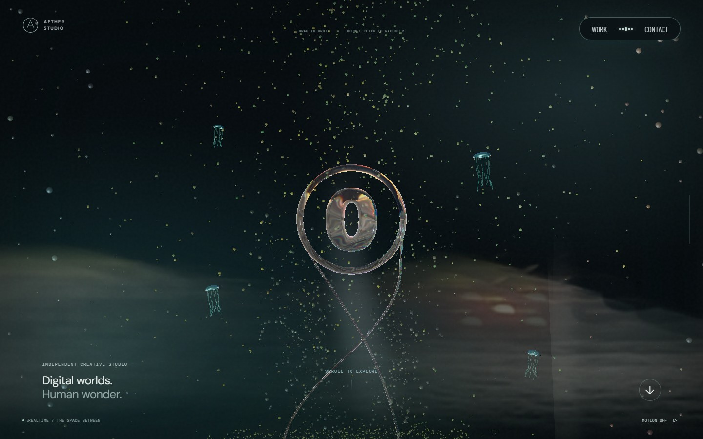
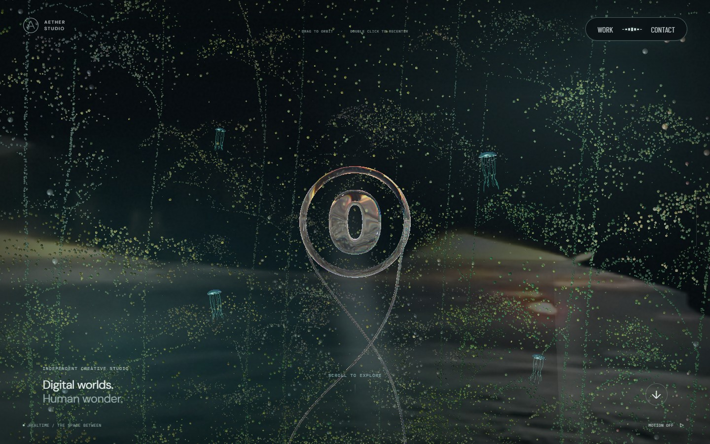
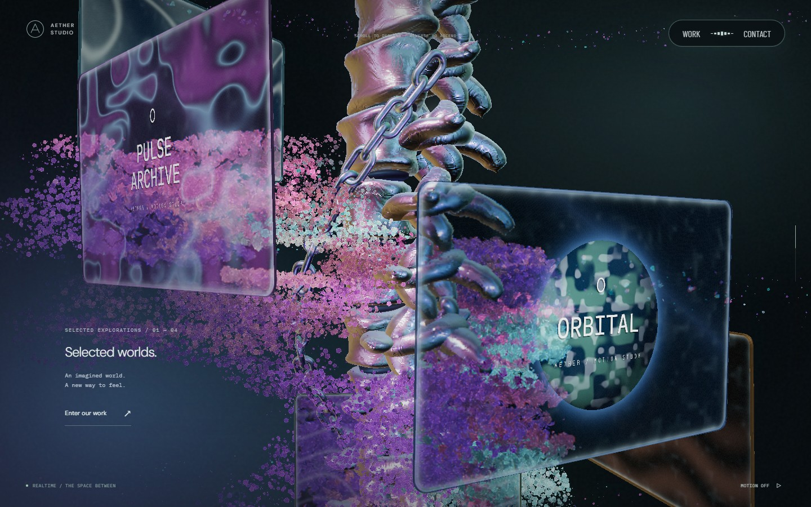
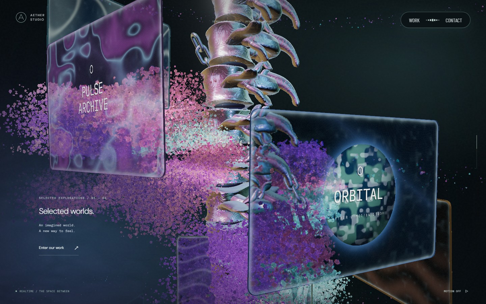
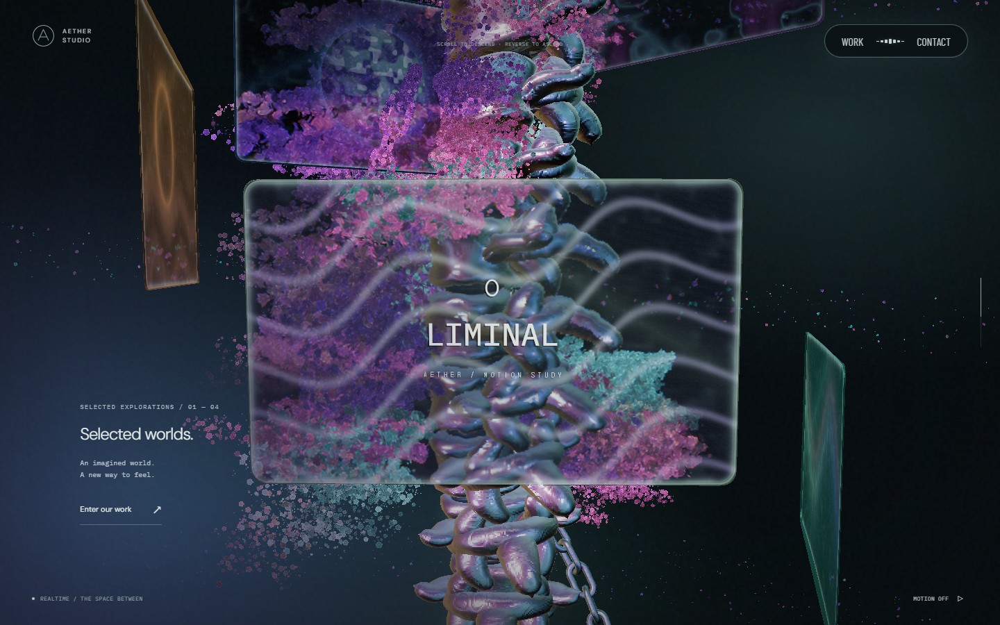
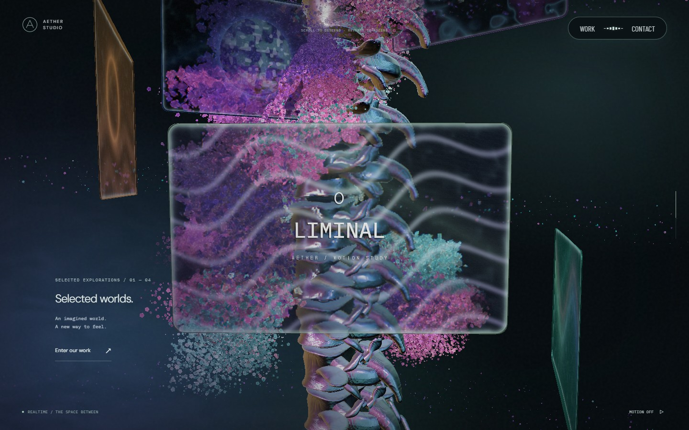
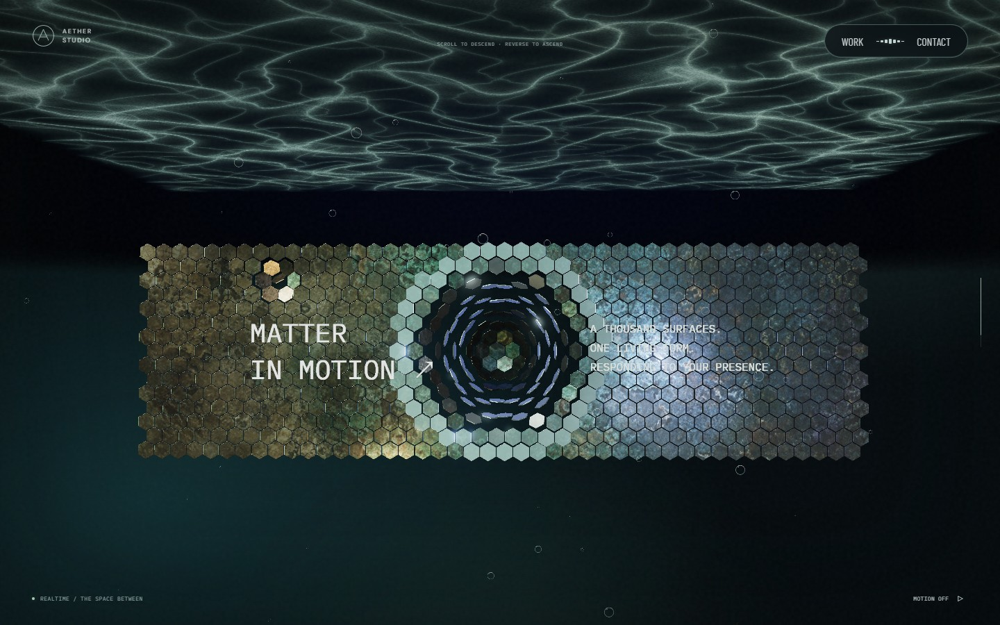
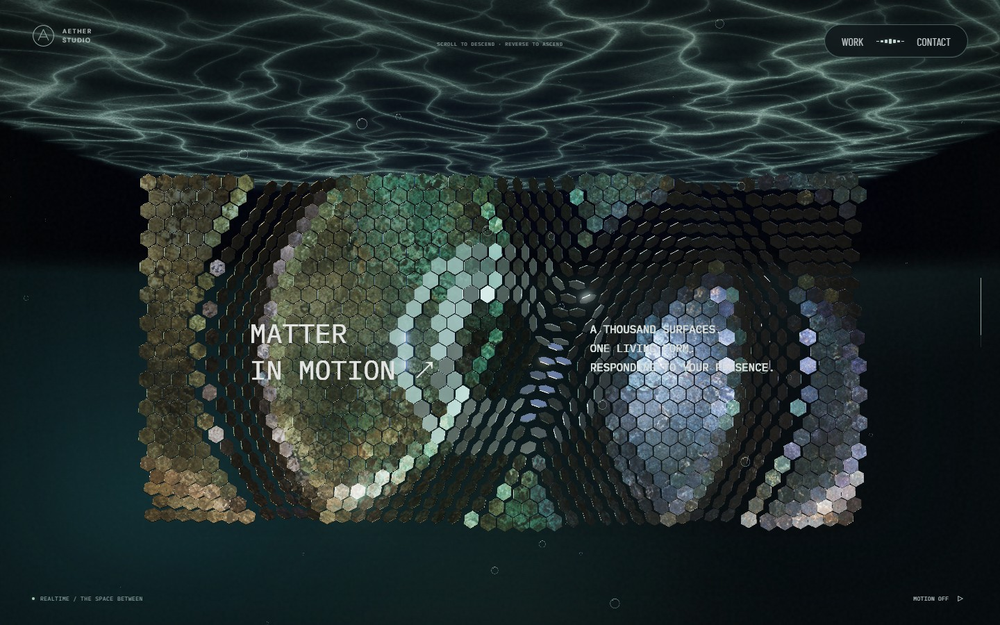

# 포레스트 영상 배치와 장면 후속 수정

후속 변경: 곡면 영상이 화면을 넓게 채우던 크기는 [포레스트 영상 크기 교정](forest-film-framing.md)에서 줄였다. 아래 캡처와 수치는 당시 검증 기록이다.

기준은 `ad4a1f6` 배포본과 사용자가 제공한 Active Theory 캡처다. 본 컬럼 앞·뒷면, 꽃 입자의 빈 구간, 스케일 패널 크기와 장면 스크롤 거리를 구분해 비교했다. [Active Theory](https://activetheory.net/)의 포레스트 회전과 기체 효과는 공개 실행 화면과 셰이더 구조도 참고했다. 해당 사이트의 모델·영상·코드는 이 저장소에 추가하지 않았다.

| 항목 | 원인과 변경 | 주요 파일 | 검증 |
| --- | --- | --- | --- |
| 1. 포레스트 영상 | 카메라 위치·회전을 복사하던 평면을 월드 좌표의 곡면으로 변경. 포레스트 드래그는 앞쪽 오브젝트를 회전 | `SceneLightShafts.ts`, `Journey.ts`, `Scene.tsx` | 상·하단 드래그, 곡면 변환 고정 및 실제 시차 검사 |
| 2. 글자 물살 | 8비트 높이 기울기와 정지 뒤 재계산을 제거. 실수 텍스처와 단조 감쇠 사용, 접촉 중심 유지 | `PointerFlow.ts`, `SceneSurfaceFlow.ts`, `SceneInteraction.ts` | GPU 145프레임에서 방향 반전·변형 재증가 0, 중심 변형 0 |
| 3. 체인 감김 | 본 컬럼 회전을 상쇄하던 위상 방향 교정. 컬럼과 같은 방향으로 상대 감김을 추가 | `SceneChain.ts` | 독립 위상 이동, 링크 간격·접선, 상단 화면 높이와 역스크롤 복원 |
| 4. 기체 파동 | 원형 투명도 지우기 대신 유체 가장자리 압력으로 안개 경계를 밀어내고 접힌 가는 결을 합성 | `SceneHaze.ts`, `PointerFlow.ts` | 실제 포인터 이동과 1초 내 소산, UI 진입·터치·프레임 지연·화면 이탈 검사 |
| 5. 본 컬럼 | 둥근 튜브 돌기를 폭·두께가 따로 변하는 뼈판으로 교체. 몸통·후방 연결부·가시돌기 비율과 세그먼트 비틀림 조정 | `SceneSpine.ts` | 앞·뒷면, 회전 중 외곽선, 실제 재질 셰이더 렌더 |
| 6. 꽃 입자 | 분리된 seed 구간을 반지름에 그대로 사용해 생기던 빈 고리를 제거. 꽃 전용 입자 밀도 보강 | `Atmosphere.ts` | 같은 장면 위치의 밀도·접힌 꽃잎 비교, 모바일 렌더 |
| 7. 리액터 O | 장치가 보인 뒤까지 이어지던 수렴을 앞당기고 O의 단면 폭·복원력을 조정 | `Atmosphere.ts`, `ReactorFlow.ts` | 포인터 전·중·후 O 내부 공간, GPU 위치 이력과 경계 검사 |
| 8. 스케일 장면 길이 | 패널 행 수를 PC 25·모바일 20으로 복구. 장면 구간의 실제 스크롤 거리를 이전의 60%로 단축 | `SceneWorlds.ts`, `ScrollTimeline.ts`, `App.tsx` | 다른 장면 거리 유지, 진행률 양방향 변환, 실제 화면의 패널 크기 |
| 9. 초기 포레스트 | 잎 약 32%·줄기 약 54%는 완성 위치에서 시작. 나머지 입자만 스크롤로 합류 | `ForestAssembly.ts` | 첫 화면·중간·완성 상태, 상·하단 역스크롤, 초기 줄기·잎 분포 검사 |

## 확인 범위

| 대상 | 변경 전 | 변경 후 | 판단 포인트 |
| --- | --- | --- | --- |
| 초기 포레스트 |  |  | 첫 화면부터 가지·잎 형태 유지 |
| 본 컬럼·꽃 |  |  | 둥근 돌기 감소, 빈 반지름 구간과 입자 밀도 |
| 본 컬럼 후반 |  |  | 인접 세그먼트 정렬, 체인의 다른 상대 위치 |
| 스케일 패널 |  |  | 같은 장면 진행률에서 패널 높이 비교 |

실제 실행 화면은 Chromium의 1440×900, 모바일 에뮬레이션 390×844에서 확인한다. 장면 비교는 페이지의 단순 스크롤 비율 대신 같은 장면 진행률을 사용한다. 스케일 장면의 스크롤 거리를 줄였으므로 같은 페이지 비율은 더 이상 같은 장면 위치를 뜻하지 않는다.

2026-09-25 최종 로컬 GPU 검사에서 정·역스크롤 14개 지점의 위치·회전 복원 오차는 0이었다. 8개 장면에서 각 100프레임을 관찰한 중앙값은 약 16.7ms, p95는 16.8ms 이하였고 자동 품질 값은 1.00을 유지했다. 이 수치는 해당 Windows Chromium 실행의 관찰값이며 모든 기기의 성능 보장은 아니다.

전체 로컬 Playwright는 128개 통과·1개 제외·1개 실패였다. 실패한 항목은 이전 본 컬럼의 큰 비틀림을 요구하던 검사로, 새 세그먼트 정렬 범위를 검사하도록 교정한 뒤 재검사했다. 최종 브랜치의 전체 통과 여부는 [PR #51의 CI](https://github.com/okorion/aether-studio/pull/51/checks)에서 확인한다.

포레스트 드래그는 회전 방식 자체가 바뀌었다. 카메라 방위는 유지되고 포레스트·링·리본 트레일·벨 크리처가 회전한다. 상하 카메라 각도와 스크롤 이동에는 영상의 실제 원근이 적용된다. 영상은 360도 파노라마가 아니다.

본 컬럼은 캡처를 참고한 절차적 형상이다. 레퍼런스 원본 모델과 동일한 정점·텍스처 또는 모든 프레임의 픽셀 일치를 주장하지 않는다. 모바일 검증은 에뮬레이션이며 실제 Safari/iOS의 장시간 실행은 별도 확인 대상이다.
